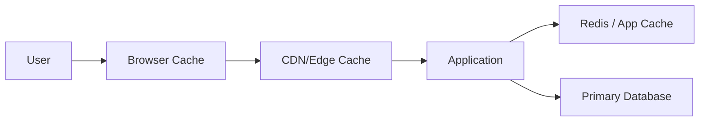
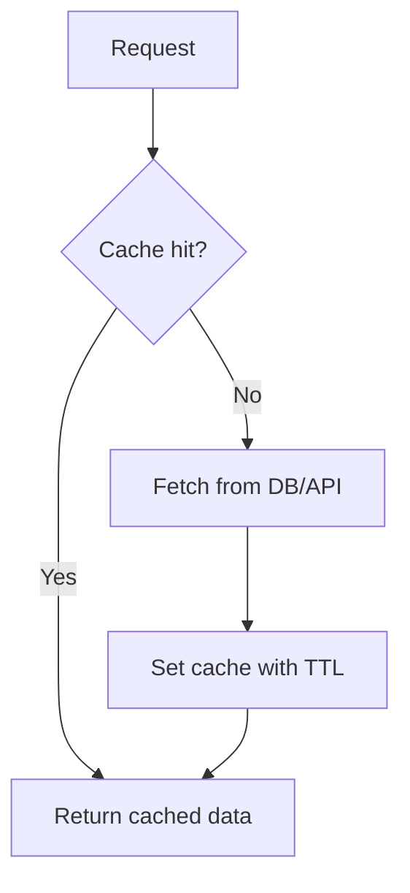
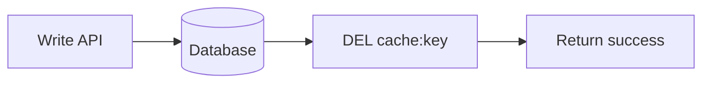
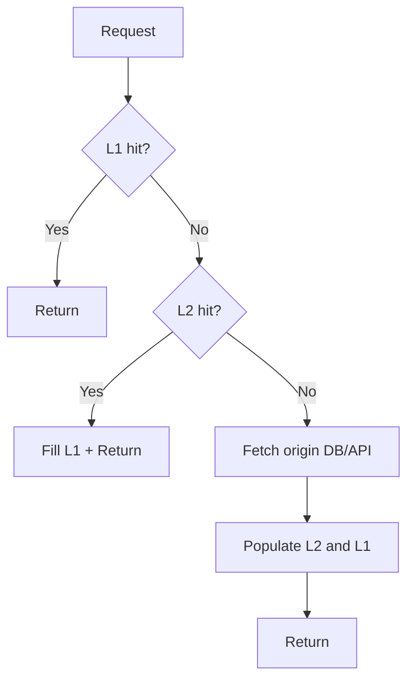

# Caching Fundamentals and Advanced Workflows

## What is caching?
Caching stores frequently accessed data in a faster layer (memory/edge/local) to reduce latency, backend load, and cost.

## Why caching matters
- Faster response times (often milliseconds)
- Lower database and API pressure
- Better resilience during traffic spikes
- Better cloud cost efficiency

## Core cache layers
1. **Client/Browser cache** — static assets, HTTP cache headers
2. **CDN/Edge cache** — geographically distributed content caching
3. **Application cache** — Redis/in-memory cache close to app
4. **Database cache/buffer** — query/page cache inside DB engine



## Cache read/write strategies

### 1) Cache-Aside (Lazy)
- App checks cache first
- On miss, app fetches DB and populates cache
- Best for read-heavy workloads

### 2) Read-Through
- Cache layer fetches backend automatically on miss
- Cleaner app code, more cache dependency

### 3) Write-Through
- Writes go to cache and backend together
- Better consistency, higher write latency

### 4) Write-Behind (Write-Back)
- Write to cache first, async flush to backend
- Very fast writes, but durability risk if flush fails

### 5) Refresh-Ahead
- Proactively refresh keys before TTL expiry
- Useful for hot keys with predictable access



## TTL and expiration design
- Use TTL to prevent stale data accumulation
- Use shorter TTL for volatile data and longer TTL for stable reference data
- Add jitter to avoid synchronized expirations

Example:
- Base TTL = 300s
- Jitter = random 0–60s
- Final TTL = 300 + jitter

This reduces cache stampede at expiry boundaries.

## Consistency models with cache
- **Strong-ish read-after-write:** invalidate/update cache on write path
- **Eventual consistency:** tolerate short staleness windows via TTL
- **Versioned keys:** `product:42:v17` to avoid race conditions during updates

## Common failure patterns and fixes

### 1) Cache stampede
Many requests miss the same key simultaneously.

Mitigations:
- Request coalescing / single-flight lock
- Early refresh and jitter
- Soft TTL + background refresh

### 2) Cache avalanche
Many keys expire at once.

Mitigations:
- Randomized TTL
- Staggered warm-up
- Rate limiting + graceful fallback

### 3) Cache penetration
Requests for non-existent keys hammer DB.

Mitigations:
- Negative caching (cache null/not-found briefly)
- Bloom filters for known key existence

### 4) Hot key bottleneck
One key receives disproportionate traffic.

Mitigations:
- Local in-process cache for hot keys
- Key sharding/replication strategy
- Precompute and refresh ahead

## Invalidation workflows

### Event-driven invalidation
```mermaid
flowchart LR
    WR[DB write/update] --> EVT[Domain Event]
    EVT --> INV[Invalidate cache key(s)]
    INV --> NEXT[Next read repopulates cache]
```

### Direct write-path invalidation


## Multi-level caching pattern
Use L1 + L2:
- **L1**: in-process memory cache (ultra-fast, per instance)
- **L2**: shared Redis cache (cross-instance consistency)



## Capacity and sizing concepts
- Estimate working set (hot data) vs full dataset
- Track hit ratio by endpoint and key namespace
- Monitor memory fragmentation and eviction rate
- Choose eviction policy based on access pattern (LRU/LFU/TTL-aware)

## Operational checklist
- Define per-domain TTL standards
- Add jitter to all volatile keys
- Instrument hit rate, miss rate, p95 latency, evictions
- Set fallback behavior when cache is unavailable
- Run load tests with cache cold and warm scenarios
- Document key naming and invalidation ownership

## What good looks like
- Stable hit rate for hot paths
- Low backend read amplification during peaks
- Predictable stale-data window
- No large synchronized expiry incidents
- Clear incident playbook for cache outages

## Public references
- Microsoft Learn: Caching guidance on Azure architecture
- Redis docs: Caching patterns and anti-patterns
- Azure Architecture Center: Performance and scalability patterns
