# Redis: How It Works — Advanced Deep Dive

## What is Redis?
Redis (**Re**mote **Di**ctionary **S**erver) is an open-source, in-memory data structure store used as a database, cache, message broker, and streaming engine. It stores data in RAM for sub-millisecond latency and supports rich data structures far beyond simple key-value pairs.

Azure Cache for Redis is the fully managed Redis offering on Azure (Standard, Premium, Enterprise, and Enterprise Flash tiers).

---

## Why Redis is fast — the internals

### Single-threaded event loop
Redis processes commands using a **single-threaded event loop** backed by I/O multiplexing (`epoll`/`kqueue`). This eliminates mutex/lock overhead and makes operations truly atomic without synchronization cost.

```
Client A ──┐
Client B ──┤──► Event Loop ──► Command Queue ──► Execution ──► Response
Client C ──┘
```

Since Redis 6.x, **I/O threads** handle reading/writing sockets in parallel while command execution stays single-threaded.

### Memory layout
- All data lives in process memory using **jemalloc** as the allocator
- Keys stored in a global **hash table** (dict) with open addressing
- Each value stored as a **robj (Redis Object)** with type + encoding metadata

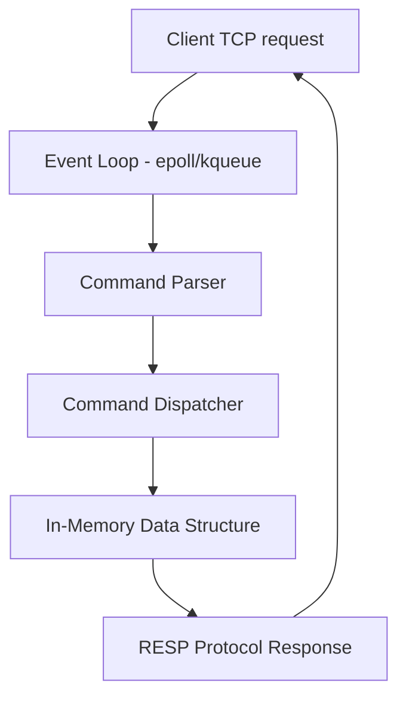

---

## Data Structures — types, encodings, and use cases

### 1. Strings
- Max 512 MB per value
- Internal encodings: `int` (whole numbers), `embstr` (≤44 bytes), `raw` (>44 bytes)

```bash
SET key "value" EX 300 NX        # set only if not exists, 300s TTL
INCR counter                      # atomic increment
GETDEL key                        # get and delete atomically (Redis 6.2+)
SETRANGE key offset value         # partial string update
```

### 2. Lists (Linked lists / Listpack)
- Ordered sequences. Used for queues, timelines, activity feeds
- Encoding: `listpack` (small lists), `quicklist` (linked list of listpacks) for large

```bash
LPUSH queue task1 task2           # push to head
RPOPLPUSH queue processing        # reliable queue pattern
LRANGE feed 0 49                  # paginate feed (index 0-49)
LPOS mylist "value" RANK 2        # find 2nd occurrence
```

### 3. Hashes
- Field-value maps inside one key. Used for objects/sessions
- Encoding: `listpack` (small), `hashtable` (large)

```bash
HSET user:1 name "Alice" age 30 role "admin"
HMGET user:1 name role
HINCRBY user:1 loginCount 1
HGETALL user:1
```

### 4. Sets
- Unordered unique members. Used for tags, unique visitors, relationships
- Encoding: `listpack` (small), `hashtable` (large)

```bash
SADD tags:post:42 "redis" "caching" "db"
SINTERSTORE common:1:2 friends:1 friends:2   # mutual friends
SRANDMEMBER lottery 5                        # random sampling
SMISMEMBER myset "a" "b" "c"                 # batch membership check
```

### 5. Sorted Sets (ZSets)
- Members with float scores, ordered by score. Used for leaderboards, rate limiting, priority queues, time-series indexes
- Encoding: `listpack` (small), `skiplist + hashtable` (large)
- Skiplist gives O(log N) range queries

```bash
ZADD leaderboard 9850 "alice" 9700 "bob"
ZRANGEBYSCORE leaderboard 9000 +inf WITHSCORES LIMIT 0 10
ZRANK leaderboard "alice"
ZPOPMAX leaderboard 3            # pop top 3 players
ZRANGEBYLEX alphabet "[a" "[f"   # lexicographic range
```

### 6. Streams (Redis 5.0+)
- Append-only log structure. Used for event sourcing, message queues with consumer groups, audit logs
- Encoding: `stream` (Radix tree of listpacks)

```bash
XADD events * action "login" userId "42"     # auto-generate ID
XREAD COUNT 10 STREAMS events 0-0            # read from stream
XGROUP CREATE events grp1 $                  # create consumer group
XREADGROUP GROUP grp1 worker1 COUNT 5 STREAMS events >   # read undelivered
XACK events grp1 1700000000000-0             # acknowledge processed
XPENDING events grp1 - + 10                 # check pending messages
```

### 7. HyperLogLog
- Probabilistic cardinality counting with ~0.81% error, uses only 12 KB regardless of set size

```bash
PFADD uv:2024-06-07 "user1" "user2" "user3"
PFCOUNT uv:2024-06-07
PFMERGE uv:week uv:2024-06-05 uv:2024-06-06 uv:2024-06-07
```

### 8. Bitmaps
- Bit-level operations on strings. Used for activity tracking, feature flags

```bash
SETBIT active:2024-06-07 userId 1    # mark user as active
BITCOUNT active:2024-06-07           # count active users
BITOP AND active:both active:day1 active:day2   # intersection
```

### 9. Geospatial Indexes (Redis 3.2+)
- Geohash-encoded sorted sets

```bash
GEOADD locations 13.361 38.115 "Palermo" 15.087 37.502 "Catania"
GEODIST locations "Palermo" "Catania" km
GEOSEARCH locations FROMLONLAT 15.0 37.0 BYRADIUS 200 km ASC
```

---

## Internal Architecture Deep Dive

### Memory Encoding upgrades
Redis uses compact encodings for small structures and upgrades automatically when thresholds are crossed:

| Type        | Small encoding | Large encoding    | Threshold config               |
|-------------|----------------|-------------------|-------------------------------|
| Hash        | listpack       | hashtable         | `hash-max-listpack-entries 128` |
| List        | listpack       | quicklist         | `list-max-listpack-size 128`    |
| Set         | listpack       | hashtable         | `set-max-intset-entries 512`    |
| Sorted Set  | listpack       | skiplist+hashtable| `zset-max-listpack-entries 128` |

### Key expiry mechanism
Redis uses two expiry strategies in parallel:
1. **Lazy expiry** — key is deleted when accessed and found expired
2. **Active expiry** — background job samples 20 random keys with TTL every 100ms and deletes expired ones, continues if >25% were expired

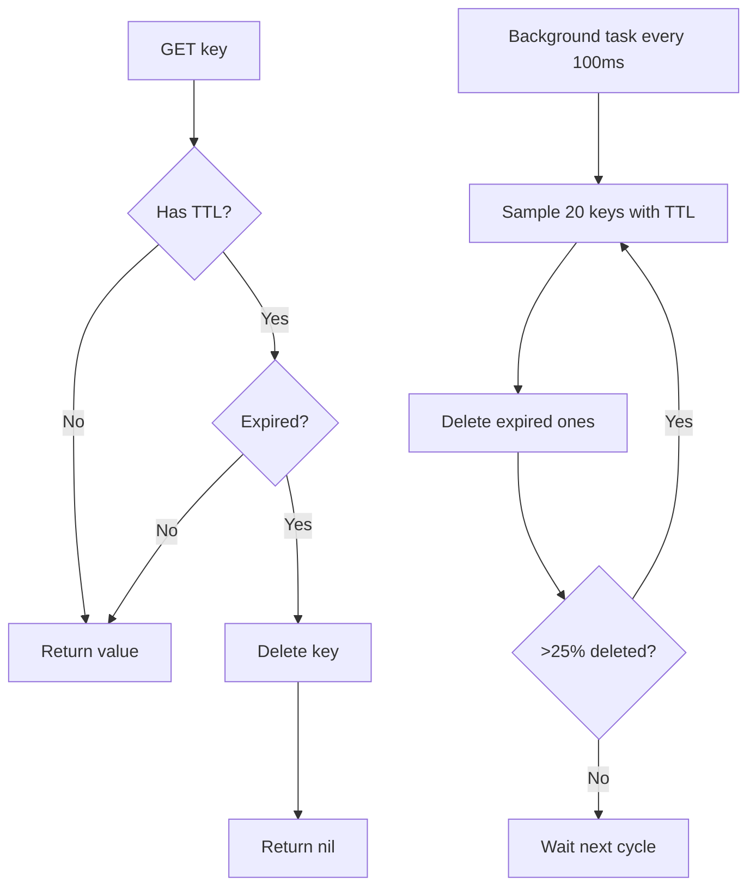

---

## Persistence

### RDB (Redis Database Backup)
- Point-in-time snapshot of dataset to disk using `fork()`
- Child process writes snapshot; parent continues serving requests
- **Pro:** compact file, fast restart
- **Con:** data loss between snapshots

```bash
SAVE          # blocking snapshot (avoid in production)
BGSAVE        # async snapshot (recommended)
```

Config:
```
save 3600 1      # snapshot if at least 1 key changed in 3600s
save 300 100
save 60 10000
rdbcompression yes
rdbfilename dump.rdb
```

### AOF (Append-Only File)
- Logs every write command; replayed on restart
- **fsync policies:**
  - `always` — fsync after every write (safest, slowest)
  - `everysec` — fsync every second (default, max 1s data loss)
  - `no` — OS decides (fastest, risky)

```
appendonly yes
appendfsync everysec
auto-aof-rewrite-percentage 100    # rewrite when AOF is 100% larger
auto-aof-rewrite-min-size 64mb
```

### AOF Rewrite
AOF grows over time; Redis rewrites it by generating minimal commands from current state:
```bash
BGREWRITEAOF
```

### Hybrid persistence (Redis 4.0+)
AOF file starts with RDB snapshot + AOF tail for fast restart + durability:
```
aof-use-rdb-preamble yes
```

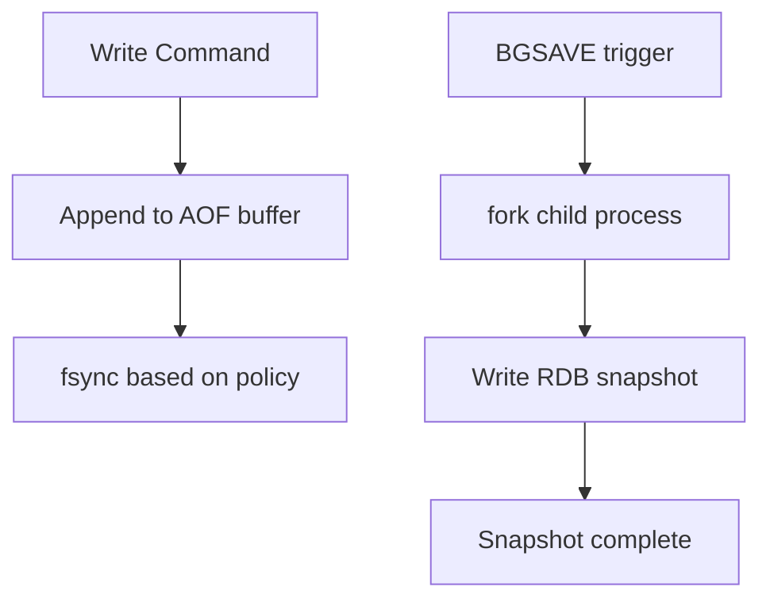

---

## Replication

### Master-Replica model
- Replicas connect to master and receive a stream of write commands
- Initial sync uses RDB snapshot; incremental via replication buffer (repl-backlog)
- Replicas are **read-only** by default

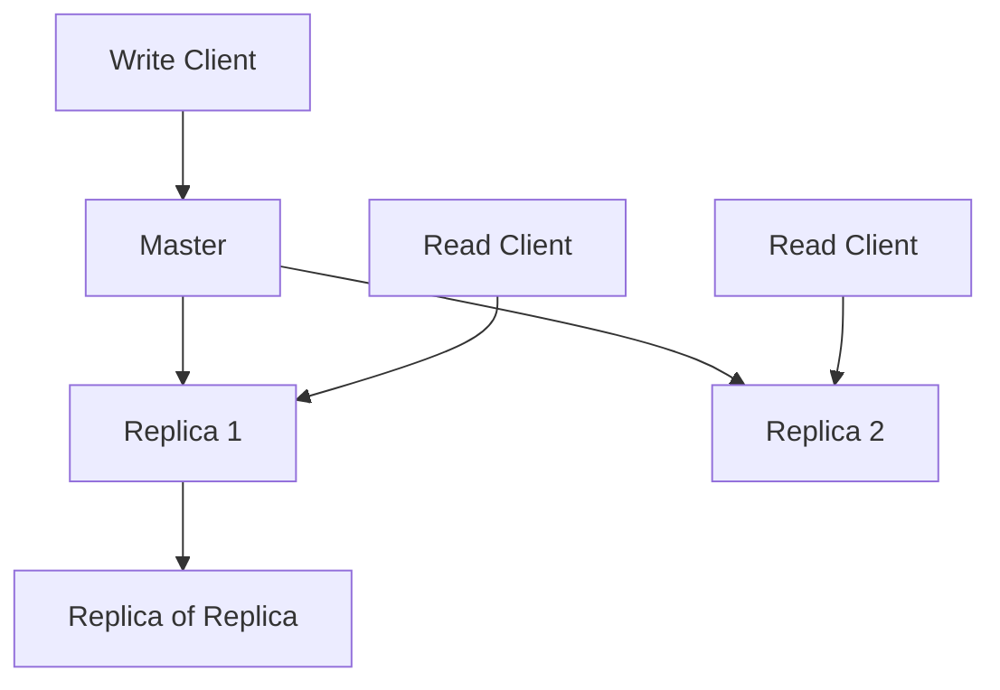

### Full vs Partial resync
```
FULL RESYNC:   Replica first connects or backlog is overflowed → master forks, sends RDB
PARTIAL RESYNC: Replica reconnects within replication offset window → only missing commands sent
```

Relevant config:
```
repl-backlog-size 1mb           # buffer for partial resync
repl-diskless-sync yes          # stream RDB over socket (skip disk write)
min-replicas-to-write 1         # master refuses writes without N replicas
min-replicas-max-lag 10         # replica lag threshold in seconds
```

---

## High Availability: Redis Sentinel

Sentinel provides automatic failover for a master-replica setup:
- Monitors master and replicas
- Elects new master when existing master fails (requires quorum)
- Updates all clients via Sentinel-aware client libraries

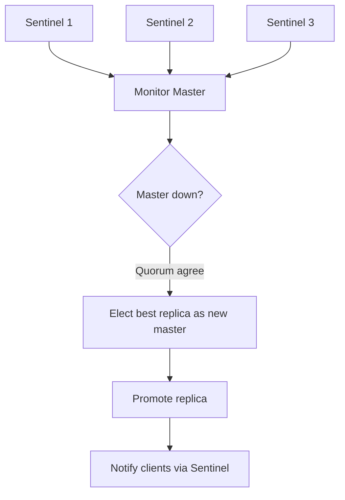

Config:
```
sentinel monitor mymaster 127.0.0.1 6379 2     # quorum = 2
sentinel down-after-milliseconds mymaster 5000
sentinel failover-timeout mymaster 60000
sentinel parallel-syncs mymaster 1
```

---

## Horizontal Scaling: Redis Cluster

Redis Cluster shards data across 16,384 hash slots distributed across multiple master nodes.

### Hash slot assignment
```
Key ──► CRC16(key) % 16384 ──► Slot ──► Node
```

Hash tags allow co-location:
```
{user:1}:orders    → same slot as {user:1}:profile
```

### Cluster topology
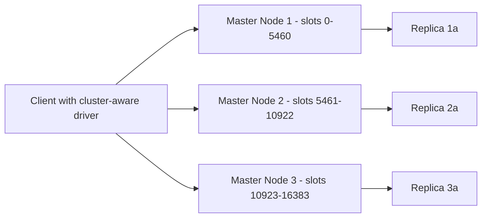

### Cluster failure handling
- Master failure → replica is promoted (if available)
- If master and all its replicas are down → cluster enters fail state (configurable with `cluster-allow-reads-when-down`)

```bash
redis-cli --cluster create 127.0.0.1:7000 127.0.0.1:7001 127.0.0.1:7002 \
  127.0.0.1:7003 127.0.0.1:7004 127.0.0.1:7005 --cluster-replicas 1

redis-cli --cluster check 127.0.0.1:7000
redis-cli --cluster rebalance 127.0.0.1:7000
redis-cli --cluster reshard 127.0.0.1:7000
```

---

## Transactions and Atomicity

### MULTI/EXEC
Commands are queued, then executed atomically (no interleaving). **Not a rollback transaction** — errors during execution are skipped, not rolled back.

```bash
MULTI
INCR inventory:item:42
DECR user:1:balance
EXEC
```

### Optimistic locking with WATCH
```bash
WATCH inventory:item:42
MULTI
DECR inventory:item:42
EXEC        # returns nil (aborted) if watched key changed between WATCH and EXEC
```

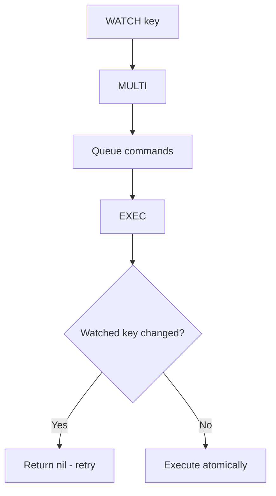

### Lua Scripts
Lua scripts execute atomically in the Redis process — the only true transactional mechanism with logic:

```bash
EVAL "
  local val = redis.call('GET', KEYS[1])
  if val == ARGV[1] then
    redis.call('SET', KEYS[1], ARGV[2])
    return 1
  end
  return 0
" 1 mykey expected_val new_val
```

Register and call by SHA (efficient for repeated scripts):
```bash
SCRIPT LOAD "return redis.call('GET', KEYS[1])"
EVALSHA <sha1> 1 mykey
```

---

## Pipelining

Send multiple commands without waiting for each response — reduces round-trip latency significantly:

```python
pipe = r.pipeline()
pipe.set("key1", "val1")
pipe.incr("counter")
pipe.expire("key1", 300)
pipe.execute()   # single round trip
```

Pipelining is **not atomic** (unlike MULTI/EXEC). Use together for batched + atomic operations.

---

## Pub/Sub

Fire-and-forget messaging with channels and patterns:

```bash
SUBSCRIBE news:tech news:finance       # subscribe
PSUBSCRIBE news:*                      # pattern subscribe
PUBLISH news:tech "Redis 8.0 released" # publish

# inspect
PUBSUB CHANNELS news:*
PUBSUB NUMSUB news:tech
```

**Limitation:** Messages are not persisted. If a subscriber is offline, messages are lost. Use Streams for durable messaging.

---

## Distributed Lock (Redlock algorithm)

Single-node lock:
```bash
SET lock:resource_id unique_token NX PX 30000   # set if not exists, 30s TTL
# ... critical section ...
# release: use Lua to check token before deleting
EVAL "if redis.call('get',KEYS[1]) == ARGV[1] then return redis.call('del',KEYS[1]) else return 0 end" 1 lock:resource_id unique_token
```

**Redlock** (multi-node): acquire lock on majority of N independent Redis instances; fault-tolerant against single node failure.

---

## Eviction Policies

When `maxmemory` is reached, Redis applies the configured eviction policy:

| Policy             | Description                                              |
|--------------------|----------------------------------------------------------|
| `noeviction`       | Return error on new writes (default)                     |
| `allkeys-lru`      | Evict least-recently-used across all keys                |
| `volatile-lru`     | LRU only among keys with TTL                             |
| `allkeys-lfu`      | Evict least-frequently-used across all keys (Redis 4.0+) |
| `volatile-lfu`     | LFU only among keys with TTL                             |
| `allkeys-random`   | Random eviction across all keys                          |
| `volatile-random`  | Random eviction among keys with TTL                      |
| `volatile-ttl`     | Evict keys with shortest remaining TTL                   |

```
maxmemory 2gb
maxmemory-policy allkeys-lfu
```

LFU tuning:
```
lfu-log-factor 10       # higher = less frequency counter decay
lfu-decay-time 1        # minutes before counter decays
```

---

## Common Design Patterns

### Cache-Aside (Lazy loading)
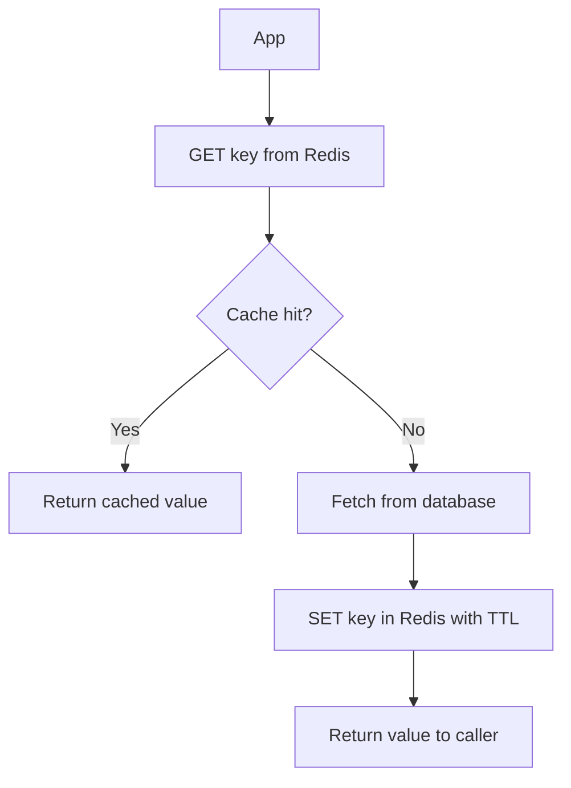

### Write-Through
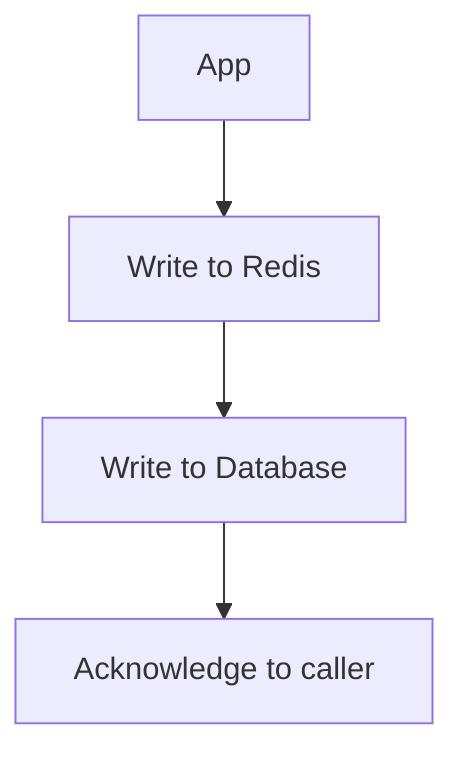
- Keeps cache and DB in sync
- Adds write latency; mitigated with pipelining

### Write-Behind (Write-Back)
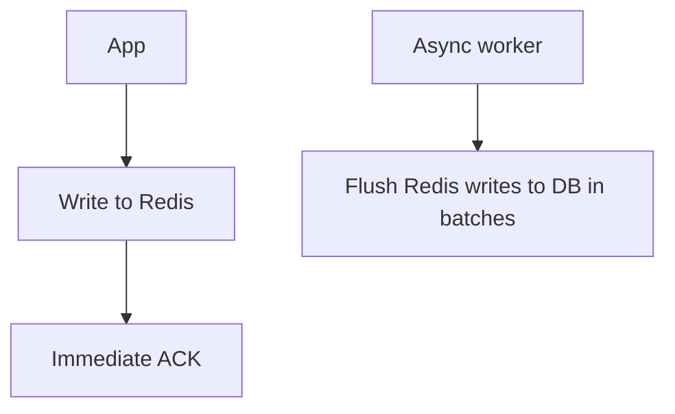
- Lowest write latency; risk of data loss on Redis failure before flush

### Read-Through
- Cache library handles DB fallback transparently (logic sits in cache layer, not app)

### Session Store
```bash
HSET session:abc123 userId 42 role admin lastSeen 1717776000
EXPIRE session:abc123 3600
```

### Rate Limiting with Sorted Sets (Sliding window)
```lua
local now = tonumber(ARGV[1])
local window = tonumber(ARGV[2])
local limit = tonumber(ARGV[3])
redis.call('ZREMRANGEBYSCORE', KEYS[1], '-inf', now - window)
local count = redis.call('ZCARD', KEYS[1])
if count < limit then
  redis.call('ZADD', KEYS[1], now, now)
  redis.call('EXPIRE', KEYS[1], window)
  return 1
end
return 0
```

### Leaderboard with Sorted Sets
```bash
ZADD leaderboard 1500 "alice" 2300 "bob" 1800 "carol"
ZREVRANGE leaderboard 0 9 WITHSCORES       # top 10
ZREVRANK leaderboard "alice"               # alice's rank
ZINCRBY leaderboard 50 "alice"             # add score
```

### Job Queue (Reliable Queue with List)
```bash
LPUSH jobs '{"type":"email","to":"user@example.com"}'  # enqueue
BRPOPLPUSH jobs processing 0                            # blocking pop + backup
# after processing
LREM processing 1 <job_json>                           # ack/remove from backup
```

### Bloom Filter (RedisBloom module / Redis Stack)
```bash
BF.ADD  visited_urls "https://example.com"
BF.EXISTS visited_urls "https://example.com"   # false positive possible, never false negative
```

---

## End-to-End Workflow: Request path with Redis cache

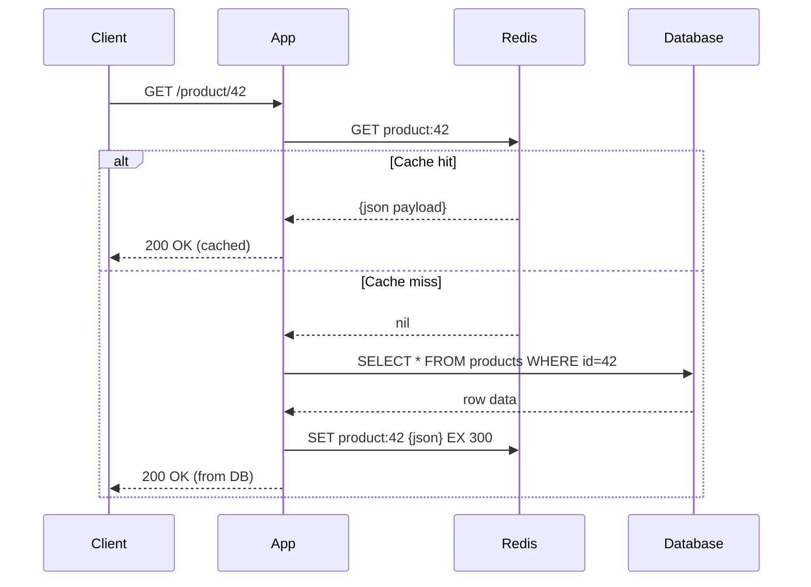

---

## Azure Cache for Redis — Tiers and Features

| Tier             | Use case                                   | Cluster | Persistence | Geo-replication | Notes                        |
|------------------|--------------------------------------------|---------|-------------|-----------------|------------------------------|
| Basic            | Dev/test                                   | No      | No          | No              | No SLA                       |
| Standard         | Production with HA (Sentinel)              | No      | No          | No              | 99.9% SLA                    |
| Premium          | High-throughput prod, compliance           | Yes     | RDB+AOF     | Passive         | VNet injection, 99.9% SLA    |
| Enterprise       | Active geo-replication, RediSearch, Bloom  | Yes     | RDB+AOF     | Active          | Redis Enterprise engine      |
| Enterprise Flash | Large datasets, cost-optimized             | Yes     | RDB+AOF     | Active          | NVMe SSD + RAM tiering       |

### Azure-specific controls
```bash
# Create Premium cache with geo-replication
az redis create --name myredis --resource-group <rg> \
  --sku Premium --vm-size P2 --location eastus \
  --enable-non-ssl-port false

# Link passive geo-replication
az redis export --name myredis -g <rg> --container <sas-url> --file-format RDB

# Firewall rule
az redis firewall-rules create -g <rg> -n myredis \
  --rule-name allow-app --start-ip <ip> --end-ip <ip>

# Scale
az redis update --name myredis -g <rg> --sku Premium --vm-size P3
```

---

## Performance Tuning

### Key design
- Keep key names short and consistent: `user:{id}:session` not `this_is_my_user_session_for_id_{id}`
- Use hash tags for cluster slot co-location when multi-key ops needed
- Avoid large keys (>1 MB) and fat keys (hash with >10k fields)

### Identifying slow commands
```bash
SLOWLOG GET 10                # recent slow commands
SLOWLOG LEN
CONFIG SET slowlog-log-slower-than 10000   # threshold in microseconds
LATENCY LATEST
LATENCY HISTORY event
```

### Scan instead of KEYS
```bash
# KEYS * blocks the event loop — never use in production
SCAN 0 MATCH "user:*" COUNT 100    # non-blocking cursor-based scan
HSCAN, SSCAN, ZSCAN               # same for hash/set/zset fields
```

### Memory analysis
```bash
MEMORY USAGE key              # memory consumed by a key
MEMORY DOCTOR                 # memory health report
OBJECT ENCODING key           # check current encoding
OBJECT FREQ key               # LFU frequency counter
DEBUG OBJECT key              # internal object details
INFO memory                   # full memory stats
```

### Monitor in real time
```bash
MONITOR                       # stream all commands (debug only, high overhead)
INFO all                      # full server stats
INFO keyspace                 # DB key counts + expiry stats
INFO stats                    # hits, misses, evictions, connections
INFO replication              # master/replica state
```

---

## Security

### Authentication
```
requirepass <strong-password>     # Redis 5 and earlier
aclfile /etc/redis/users.acl      # ACL-based auth (Redis 6+)
```

### ACL (Redis 6+)
```bash
ACL SETUSER appuser on ><password> ~cache:* &* +get +set +del +expire
ACL WHOAMI
ACL LIST
ACL LOG                          # failed auth attempts
```

ACL format: `on/off >password ~key-pattern &channel-pattern +command`

### TLS
```
tls-port 6380
tls-cert-file /etc/ssl/redis.crt
tls-key-file /etc/ssl/redis.key
tls-ca-cert-file /etc/ssl/ca.crt
tls-auth-clients yes
```

### Network hardening
```
bind 127.0.0.1 ::1         # bind only to needed interfaces
protected-mode yes          # refuse connections from non-loopback if no auth set
rename-command FLUSHALL ""  # disable dangerous commands
rename-command DEBUG ""
rename-command CONFIG ""
```

---

## Observability — Key Metrics

| Metric                     | What it means                                    | Alert threshold        |
|----------------------------|--------------------------------------------------|------------------------|
| `keyspace_hits`            | Cache hit count                                  | Track hit rate ≥90%    |
| `keyspace_misses`          | Cache miss count                                 | Rising misses = problem|
| `used_memory`              | Memory used by data                              | <80% of maxmemory      |
| `mem_fragmentation_ratio`  | Memory fragmentation (1.0–1.5 normal)            | >1.5 = fragmented      |
| `connected_clients`        | Active connections                               | Near maxclients limit  |
| `blocked_clients`          | Clients waiting on BRPOP/BLPOP                   | Monitor for spikes     |
| `evicted_keys`             | Keys evicted due to maxmemory                    | >0 = review policy     |
| `rejected_connections`     | Connections refused (maxclients hit)             | >0 = critical          |
| `master_repl_offset`       | Replication offset                               | Compare across nodes   |
| `rdb_last_bgsave_status`   | Last RDB save result                             | Alert on `err`         |

---

## Quick Validation Checklist

- `maxmemory` and eviction policy explicitly configured
- Persistence strategy matches recovery objective (RDB, AOF, or hybrid)
- Replication configured with `min-replicas-to-write` guard
- Sentinel or Cluster deployed for HA (not standalone in production)
- ACL users configured — no default user with open access
- TLS enabled for data in transit
- `KEYS *` and `DEBUG` commands renamed or disabled
- `SCAN` used instead of `KEYS` in application code
- Slow log and latency monitoring enabled
- Connection pooling used in all application clients

---

## Public References
- Redis documentation: redis.io/docs
- Redis command reference: redis.io/commands
- Microsoft Learn: Azure Cache for Redis overview
- Microsoft Learn: Azure Cache for Redis best practices
- Redis University: RU101, RU202 courses
