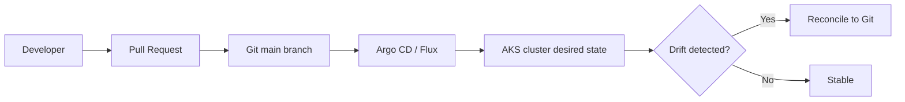
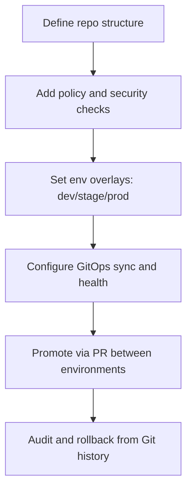

# AKS GitOps (Argo CD / Flux)

## Why this matters
GitOps makes Kubernetes changes auditable, repeatable, and safer by making Git the source of truth.

## Core model
- Dev changes manifests/charts in Git
- Pull request + policy checks run
- GitOps controller syncs approved state to AKS
- Drift is detected and corrected



## Workflow


## Portal checks
1. AKS cluster health and workload status
2. Verify namespaces/apps deployed by GitOps controller
3. Confirm no manual drift in production workloads

## Azure CLI checks
```bash
# Check gitops/argocd pods
kubectl get pods -A | grep -E 'argocd|flux'

# Check app resources are managed declaratively
kubectl get deploy -A -o wide

# See recent events for sync issues
kubectl get events -A --sort-by=.lastTimestamp
```

## What good looks like
- No direct kubectl changes in prod
- Every change traceable to PR and commit
- Fast rollback by reverting Git commit
