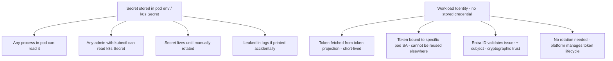
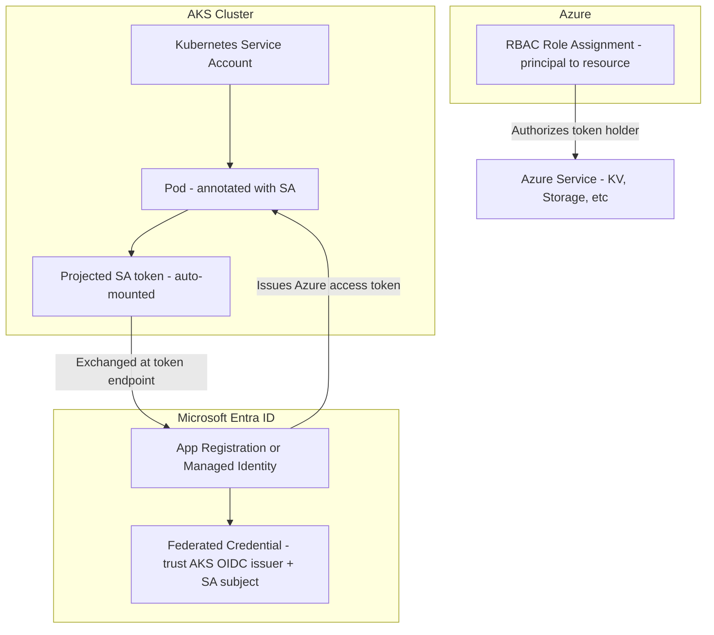
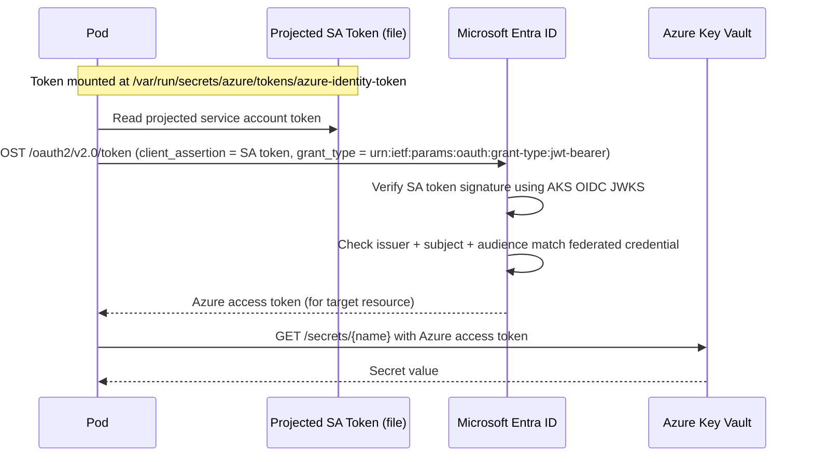
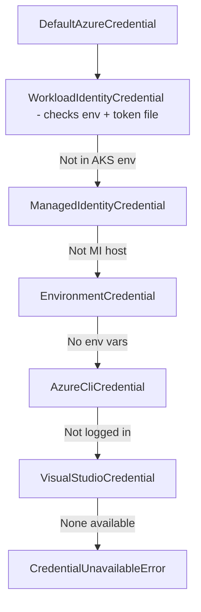

# AKS Workload Identity and Pod Identity

## Overview

Kubernetes workloads (pods) frequently need to authenticate to Azure services — Key Vault, Storage, Service Bus, databases, and more. The challenge is doing this **without embedding credentials** inside the container image, environment variables, or Kubernetes secrets.

There are two generations of solutions for this on AKS:

| Approach | Status | Mechanism |
|---|---|---|
| **AAD Pod Identity (v1)** | Deprecated — do not use for new workloads | Used a DaemonSet to intercept IMDS calls per pod |
| **AKS Workload Identity (v2)** | Current recommended approach | OIDC federation between AKS and Microsoft Entra ID |

This document covers **Workload Identity** (the current approach) in full, with a brief explanation of why Pod Identity was replaced.

---

## Why Credentials in Pods Are Dangerous



---

## How AKS Workload Identity Works

The core mechanism is **OIDC federation**:

1. AKS acts as an **OIDC issuer** — it signs service account tokens for pods
2. An Entra ID app registration or managed identity is configured to **trust tokens from the AKS OIDC issuer**
3. A pod with the right Kubernetes service account gets a **projected service account token** mounted automatically
4. The workload exchanges that token at Entra ID's token endpoint for an **Azure access token**
5. The Azure access token is used to call Azure services

No Azure credential is ever stored in the cluster.

---

## Component Map



---

## OIDC Issuer and Federated Credential Trust

When you enable the OIDC issuer on AKS, the cluster exposes a public OIDC discovery document:

```
https://<oidc-issuer-url>/.well-known/openid-configuration
```

This document contains the cluster's JWKS endpoint. Entra ID uses this to **verify the signature** on projected service account tokens.

The federated credential on the Entra ID side specifies:

| Field | Value | Meaning |
|---|---|---|
| `issuer` | AKS OIDC issuer URL | Only tokens from this cluster are trusted |
| `subject` | `system:serviceaccount:<namespace>:<sa-name>` | Only this specific service account in this namespace |
| `audiences` | `api://AzureADTokenExchange` | Only tokens intended for token exchange |

This three-way match (`issuer` + `subject` + `audience`) is what makes the trust narrow and safe.

---

## Token Exchange Flow (Detailed)



This exchange is handled automatically by the **Azure Identity SDK** (`DefaultAzureCredential` or `WorkloadIdentityCredential`). Application code does not implement the exchange manually.

---

## Pod Identity v1 vs Workload Identity v2

| Dimension | AAD Pod Identity (deprecated) | AKS Workload Identity (current) |
|---|---|---|
| Mechanism | IMDS interception via DaemonSet NMI | OIDC token projection + federation |
| Cluster components required | NMI DaemonSet + MIC Deployment | OIDC issuer + Workload Identity webhook |
| Identity type used | Managed Identity (user-assigned) | Managed Identity or App Registration |
| Token binding | Per-pod via AzureIdentity / AzureIdentityBinding CRDs | Per-pod via SA annotation + federated credential |
| SDK changes in app code | Required: Azure Identity library | Required: Azure Identity library (same) |
| Maintenance status | Deprecated — no new features | Actively maintained — recommended |
| Security model | IMDS interception (iptables rules) | Cryptographic token signing and validation |

---

## Setup: Step by Step

### Prerequisites

- AKS cluster
- Azure CLI with `aks-preview` extension (for older CLI versions)
- `kubectl` connected to the cluster

---

### Step 1 — Enable OIDC issuer and Workload Identity on AKS

```bash
RG=<your-resource-group>
CLUSTER=<your-aks-cluster-name>

# Enable OIDC issuer and Workload Identity webhook on existing cluster
az aks update \
  --resource-group $RG \
  --name $CLUSTER \
  --enable-oidc-issuer \
  --enable-workload-identity
```

**Verify:**
```bash
az aks show \
  --resource-group $RG \
  --name $CLUSTER \
  --query "oidcIssuerProfile.issuerUrl" -o tsv
```
Output should be a URL like `https://eastus.oic.prod-aks.azure.com/<tenant-id>/<cluster-id>/`.

---

### Step 2 — Create a user-assigned managed identity

```bash
IDENTITY_NAME=<identity-name>

az identity create \
  --resource-group $RG \
  --name $IDENTITY_NAME

MI_CLIENT_ID=$(az identity show \
  --resource-group $RG \
  --name $IDENTITY_NAME \
  --query clientId -o tsv)

MI_PRINCIPAL_ID=$(az identity show \
  --resource-group $RG \
  --name $IDENTITY_NAME \
  --query principalId -o tsv)

echo "Client ID: $MI_CLIENT_ID"
echo "Principal ID: $MI_PRINCIPAL_ID"
```

---

### Step 3 — Assign Azure RBAC role to the managed identity

```bash
# Example: allow the identity to read secrets from a Key Vault
KV_ID=$(az keyvault show --name <vault-name> --query id -o tsv)

az role assignment create \
  --assignee $MI_PRINCIPAL_ID \
  --role "Key Vault Secrets User" \
  --scope $KV_ID
```

---

### Step 4 — Create a Kubernetes Service Account with annotation

```bash
NAMESPACE=<your-namespace>
SA_NAME=<your-service-account-name>

kubectl create serviceaccount $SA_NAME --namespace $NAMESPACE

kubectl annotate serviceaccount $SA_NAME \
  --namespace $NAMESPACE \
  azure.workload.identity/client-id=$MI_CLIENT_ID
```

**Verify:**
```bash
kubectl get serviceaccount $SA_NAME -n $NAMESPACE -o yaml
```
Confirm the annotation `azure.workload.identity/client-id` is present.

---

### Step 5 — Create the federated credential

```bash
OIDC_ISSUER=$(az aks show \
  --resource-group $RG \
  --name $CLUSTER \
  --query "oidcIssuerProfile.issuerUrl" -o tsv)

MI_OBJECT_ID=$(az identity show \
  --resource-group $RG \
  --name $IDENTITY_NAME \
  --query id -o tsv)

az identity federated-credential create \
  --name "aks-${NAMESPACE}-${SA_NAME}" \
  --identity-name $IDENTITY_NAME \
  --resource-group $RG \
  --issuer $OIDC_ISSUER \
  --subject "system:serviceaccount:${NAMESPACE}:${SA_NAME}" \
  --audiences "api://AzureADTokenExchange"
```

**Verify:**
```bash
az identity federated-credential list \
  --identity-name $IDENTITY_NAME \
  --resource-group $RG \
  -o table
```

The `issuer`, `subject`, and `audiences` fields should match exactly.

---

### Step 6 — Deploy a pod using the service account

```yaml
# pod.yaml
apiVersion: v1
kind: Pod
metadata:
  name: workload-identity-test
  namespace: <your-namespace>
  labels:
    azure.workload.identity/use: "true"
spec:
  serviceAccountName: <your-service-account-name>
  containers:
    - name: test
      image: mcr.microsoft.com/azure-cli
      command: ["sleep", "3600"]
      env:
        - name: AZURE_CLIENT_ID
          value: "<MI_CLIENT_ID>"
        - name: AZURE_TENANT_ID
          value: "<TENANT_ID>"
        - name: AZURE_AUTHORITY_HOST
          value: "https://login.microsoftonline.com/"
```

```bash
kubectl apply -f pod.yaml
```

**Verify:** Pod is running and the webhook has injected the projected token volume:
```bash
kubectl describe pod workload-identity-test -n $NAMESPACE
```
Look for a mounted volume: `azure-identity-token` at `/var/run/secrets/azure/tokens/`.

---

### Step 7 — Test: fetch a Key Vault secret from inside the pod

```bash
kubectl exec -it workload-identity-test -n $NAMESPACE -- bash

# Inside the pod — read the projected token
cat /var/run/secrets/azure/tokens/azure-identity-token

# Use Azure CLI (which uses DefaultAzureCredential internally)
az login --federated-token "$(cat /var/run/secrets/azure/tokens/azure-identity-token)" \
  --service-principal \
  --username $AZURE_CLIENT_ID \
  --tenant $AZURE_TENANT_ID

az keyvault secret show \
  --vault-name <vault-name> \
  --name test-secret \
  --query value -o tsv
```

**Verify:** Secret value returned — no credentials were stored in the pod, image, or Kubernetes secret.

---

### Step 8 — Test: negative — pod without workload identity label

```yaml
# pod-no-wi.yaml — same as above but NO label azure.workload.identity/use: "true"
apiVersion: v1
kind: Pod
metadata:
  name: no-wi-test
  namespace: <your-namespace>
spec:
  serviceAccountName: <your-service-account-name>
  containers:
    - name: test
      image: mcr.microsoft.com/azure-cli
      command: ["sleep", "3600"]
```

```bash
kubectl apply -f pod-no-wi.yaml
kubectl exec -it no-wi-test -n $NAMESPACE -- bash

# Try to get a token — no projected token file will exist
ls /var/run/secrets/azure/tokens/
```

**Verify:** Directory does not exist — webhook did not inject the token volume because the label was missing.

---

### Step 9 — Test: negative — mismatched service account in federated credential

```bash
# Create a second SA in a different namespace
kubectl create serviceaccount other-sa --namespace default

# Try to use the original federated credential (bound to different namespace/SA)
# — token exchange will fail at Entra ID even if pod gets a projected token
```

**Verify:** Token exchange attempt fails with `AADSTS70021` (no matching federated identity found) — issuer/subject mismatch.

---

## Application Code Pattern

Application code uses the **Azure Identity SDK** — no manual token exchange needed.

### Python example

```python
from azure.identity import WorkloadIdentityCredential
from azure.keyvault.secrets import SecretClient

# Reads AZURE_CLIENT_ID, AZURE_TENANT_ID, and token file path from environment
# These are injected automatically by the webhook
credential = WorkloadIdentityCredential()

client = SecretClient(
    vault_url="https://<vault-name>.vault.azure.net/",
    credential=credential
)

secret = client.get_secret("test-secret")
print(secret.value)
```

No credentials in code. The SDK handles token exchange transparently.

### DefaultAzureCredential fallback chain



In a correctly configured AKS pod, `WorkloadIdentityCredential` succeeds at the first step.

---

## Troubleshooting

| Symptom | Likely cause | What to check |
|---|---|---|
| Token file not mounted | Label `azure.workload.identity/use: "true"` missing from pod | Add label to pod spec |
| `AADSTS70021` error | Federated credential subject does not match pod's SA + namespace | Verify `subject` = `system:serviceaccount:<ns>:<sa>` |
| `AADSTS700016` error | Federated credential issuer does not match cluster OIDC issuer | Re-fetch OIDC issuer URL and update federated credential |
| Token exchange succeeds but API call fails | RBAC role not assigned or wrong scope | Check role assignment for the MI principal ID |
| Works in one namespace, fails in another | Each NS/SA combo needs its own federated credential | Create federated credential per namespace + SA pair |
| Token valid but Key Vault returns 403 | Vault firewall blocks AKS node subnet | Add AKS node VNET subnet to Key Vault network rules |

---

## Key Limits and Operational Notes

| Limit / behavior | Value |
|---|---|
| Max federated credentials per managed identity | 20 |
| Projected service account token lifetime | 1 hour (auto-rotated by kubelet) |
| Token exchange: Entra ID token lifetime | Up to 1 hour for access token |
| OIDC issuer URL: changes if cluster is recreated | Federated credentials must be recreated after cluster replacement |
| Multi-cluster | Each cluster has its own OIDC issuer; separate federated credentials needed per cluster |

---

## Production Design Checklist

- One user-assigned MI per workload / application (not shared across unrelated apps)
- One Kubernetes service account per workload component that needs Azure access
- Federated credentials scoped to exact `namespace:service-account` pairs
- RBAC roles assigned at the narrowest scope possible (secret-level or vault-level, not subscription)
- Pod label `azure.workload.identity/use: "true"` present on all pods needing Azure access
- No `AZURE_CLIENT_SECRET` or similar env vars — absence confirms credential-free setup
- Diagnostic logging enabled on Azure services being accessed
- Periodically audit federated credentials and MI role assignments for orphans

---

## Summary

AKS Workload Identity replaces pod-level credential storage and the deprecated AAD Pod Identity DaemonSet approach with a cryptographic OIDC federation model. The cluster becomes a trusted token issuer, and Azure validates tokens using the cluster's public keys without any shared secret ever being stored.

The setup involves four connected pieces:
1. **AKS** — OIDC issuer enabled, Workload Identity webhook running
2. **Kubernetes** — service account annotated with managed identity client ID, pod labeled
3. **Entra ID** — federated credential on the managed identity trusting the cluster + SA subject
4. **Azure RBAC** — managed identity assigned the correct role on the target resource

With all four in place and the Azure Identity SDK in application code, pods access Azure services with no secrets — anywhere.
