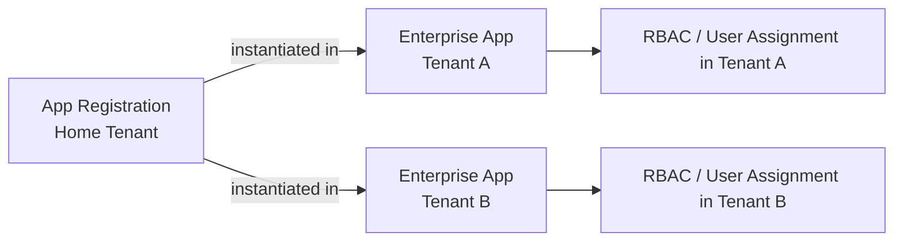
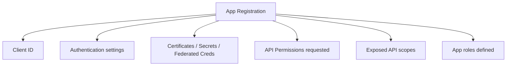
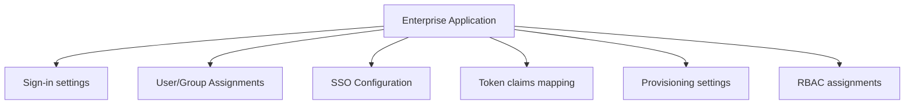
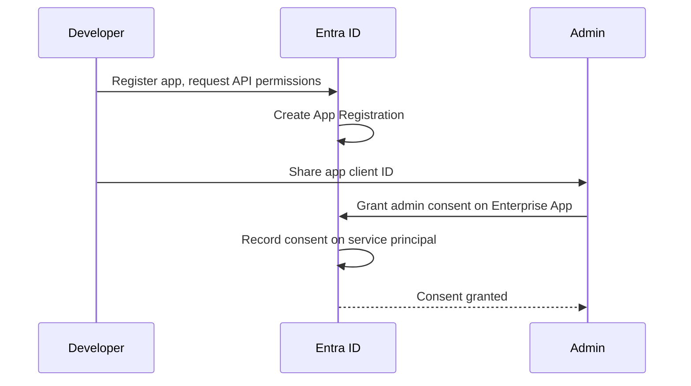
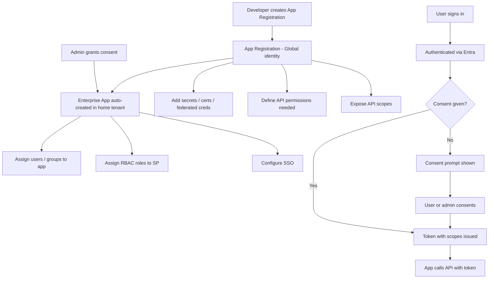
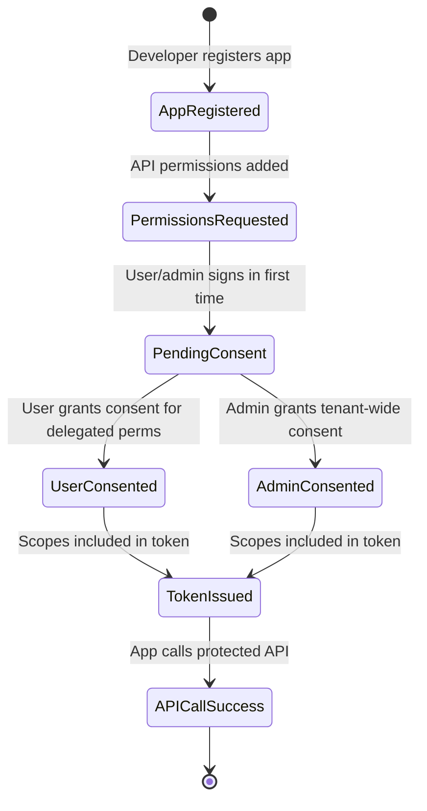
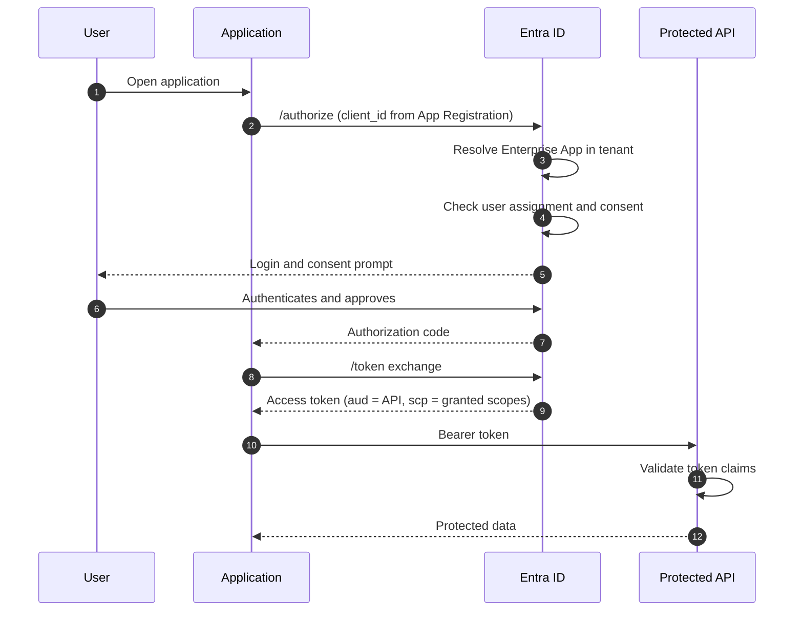

# App Registration vs Enterprise Application

## Overview
When you register an application in Microsoft Entra ID, two objects are created:
1. **App Registration** — the global definition of the application
2. **Enterprise Application (Service Principal)** — the local instance in the tenant

These are different objects with different purposes.

---

## Side-by-Side Comparison

| Aspect | App Registration | Enterprise Application |
| --- | --- | --- |
| Also known as | Application object | Service principal |
| Scope | Global (home tenant) | Per tenant |
| Created by | Developer/admin manually | Auto-created when app is registered or consented |
| Holds | Auth config, redirect URIs, certs, secrets, API permissions | Sign-in settings, user/group assignments, SAML config, RBAC |
| Object ID | Application object ID | Service principal object ID |
| Used to assign RBAC | No | Yes |

---

## How They Relate



---

## App Registration in Detail

An App Registration defines:
- `Application (client) ID` — unique across all tenants
- Authentication settings (redirect URIs, tokens, platform)
- Certificates and client secrets
- API permissions the app requests
- Expose API — scopes the app exposes to other apps
- App roles — roles the app defines



---

## Enterprise Application in Detail

An Enterprise Application (service principal) holds:
- Sign-in and user assignment settings
- User and group assignments for app access
- Single Sign-On (SAML / OIDC) configuration
- Provisioning settings
- Token claims configuration



---

## When Each is Used

| Task | Where to go |
| --- | --- |
| Add redirect URI | App Registration |
| Add client secret | App Registration |
| Add federated credential | App Registration |
| Request API permission | App Registration |
| Expose an API scope | App Registration |
| Assign users to app | Enterprise Application |
| Configure SSO | Enterprise Application |
| Assign RBAC role to app | Enterprise Application (service principal object ID) |
| Set token lifetime policy | Enterprise Application |

---

## Admin Consent Flow

When an app requests API permissions that need admin consent, the admin grants consent on the Enterprise Application (service principal) in their tenant — not on the App Registration itself.



---

## Common Confusion

| Confusion | Clarification |
| --- | --- |
| "I can't find my app RBAC assignment" | RBAC is on Enterprise App (service principal), not App Registration |
| "Deleted app registration, app still shows" | Enterprise App (service principal) may still exist |
| "Which object ID to use for role assignment?" | Always use the service principal (Enterprise App) object ID |
| "Where to configure user assignment required?" | Enterprise Application settings, not App Registration |

---

## Full Object Creation and Runtime Workflow



---

## Consent State Machine



---

## Runtime Token Request Path



---

## Step-by-Step: Test This in Azure

### Prerequisites
- Azure CLI authenticated
- Permissions to create app registrations (`Application.ReadWrite.All` or Application Administrator role)

### Step 1 — Create an App Registration
```bash
# Register a new app
az ad app create \
  --display-name "test-app-learning" \
  --sign-in-audience "AzureADMyOrg"
```
**Output:** Note the `appId` (client ID) and `id` (object ID).

### Step 2 — Inspect the App Registration
```bash
APP_ID=<appId from step 1>

az ad app show --id $APP_ID --query "{Name:displayName, AppID:appId, ObjectID:id, SignInAudience:signInAudience}" -o json
```
**Verify:** `signInAudience` is `AzureADMyOrg` and the object ID differs from the app ID.

### Step 3 — View the corresponding Enterprise Application (Service Principal)
```bash
# Enterprise apps are service principals — look up by appId
az ad sp show --id $APP_ID --query "{Name:displayName, AppID:appId, ObjectID:id}" -o json
```
**Verify:** Same `appId`, but different `id` (object ID) — this is the enterprise app instance in your tenant.

### Step 4 — Add a client secret to the App Registration
```bash
SECRET=$(az ad app credential reset \
  --id $APP_ID \
  --append \
  --query password -o tsv)

echo "Secret stored (shown once only)"
```
**Verify:** Secret returned in output. This is the credential used for client_credentials flow.

### Step 5 — Request a token using client credentials flow
```bash
TENANT_ID=$(az account show --query tenantId -o tsv)

curl -s -X POST \
  "https://login.microsoftonline.com/$TENANT_ID/oauth2/v2.0/token" \
  -H "Content-Type: application/x-www-form-urlencoded" \
  -d "client_id=$APP_ID" \
  -d "client_secret=$SECRET" \
  -d "scope=https://graph.microsoft.com/.default" \
  -d "grant_type=client_credentials"
```
**Verify:** Response contains `access_token`. Decode it at jwt.ms and confirm `appid` matches your `APP_ID`, `tid` matches your tenant.

### Step 6 — Add an API permission and grant admin consent
```bash
# Add Microsoft Graph User.Read.All permission (application type)
az ad app permission add \
  --id $APP_ID \
  --api 00000003-0000-0000-c000-000000000000 \
  --api-permissions e1fe6dd8-ba31-4d61-89e7-88639da4683d=Role

# Grant admin consent (requires Global Admin or Privileged Role Admin)
az ad app permission admin-consent --id $APP_ID
```
**Verify:** Permission appears in the enterprise app's "Permissions" blade in Azure Portal.

### Step 7 — View consent state in Azure Portal
1. Go to **Azure Portal → Microsoft Entra ID → Enterprise Applications**
2. Search for `test-app-learning`
3. Navigate to **Permissions** tab
4. Confirm `User.Read.All` appears under **Application permissions** with admin consent granted.

### Step 8 — Verify token has the expected claim
```bash
# Get a new token after consent
TOKEN=$(curl -s -X POST \
  "https://login.microsoftonline.com/$TENANT_ID/oauth2/v2.0/token" \
  -H "Content-Type: application/x-www-form-urlencoded" \
  -d "client_id=$APP_ID&client_secret=$SECRET&scope=https://graph.microsoft.com/.default&grant_type=client_credentials" \
  | python3 -c "import sys,json; print(json.load(sys.stdin)['access_token'])")

echo $TOKEN
```
Decode at jwt.ms — look for `roles: ["User.Read.All"]` in token claims.

### Step 9 — Clean up
```bash
az ad app delete --id $APP_ID
```
**Verify:** App registration and its enterprise app (SP) are both removed.

### What to Confirm End-to-End
| Check | Expected |
|---|---|
| App Registration has unique `appId` | Yes |
| Enterprise App has same `appId`, different object ID | Yes |
| Client credentials token issued | Yes |
| Token `appid` claim matches APP_ID | Yes |
| Admin consent enables permission in token | Yes |
| Deleting app registration removes SP too | Yes |

---

## Summary
App Registration is the identity blueprint — created once by the developer. Enterprise Application is the per-tenant instance — where runtime settings, user assignments, consent, and RBAC live. Both are needed; they serve different purposes.
