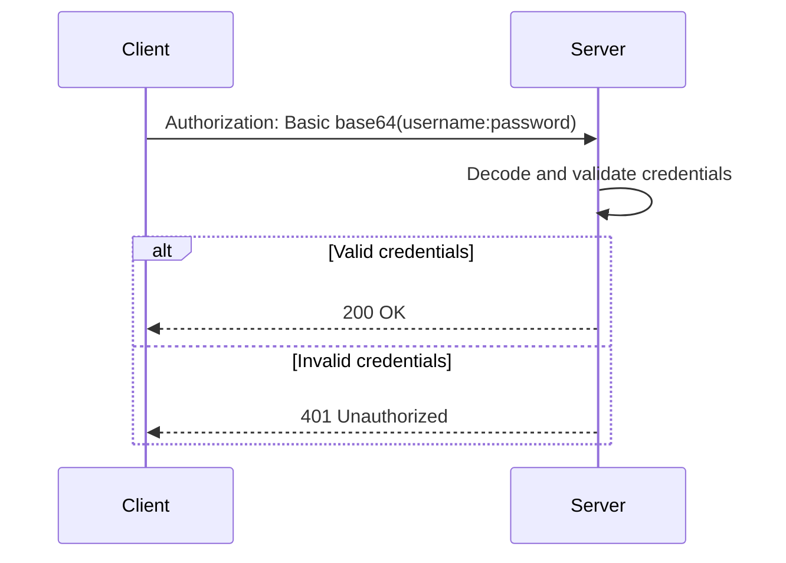
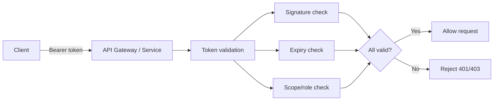
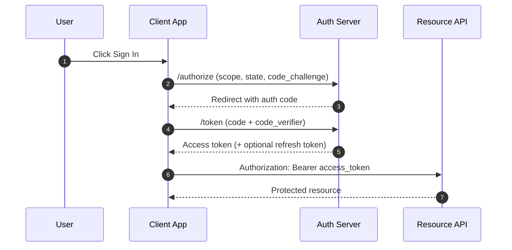
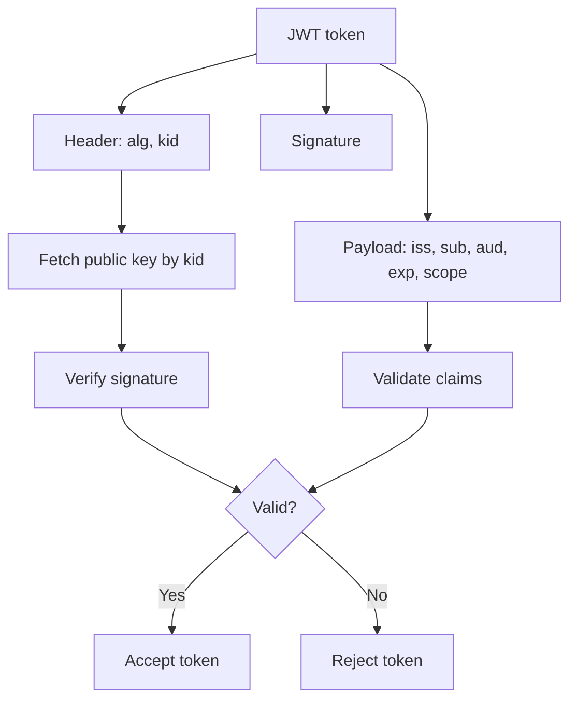
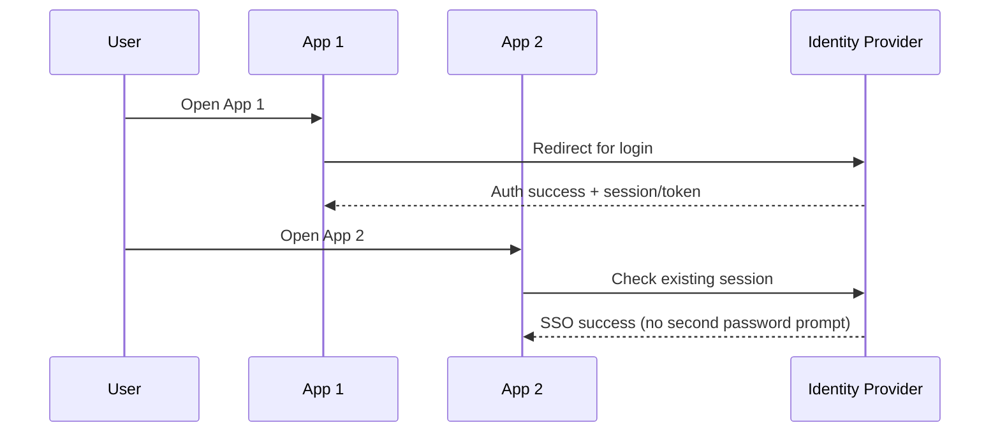
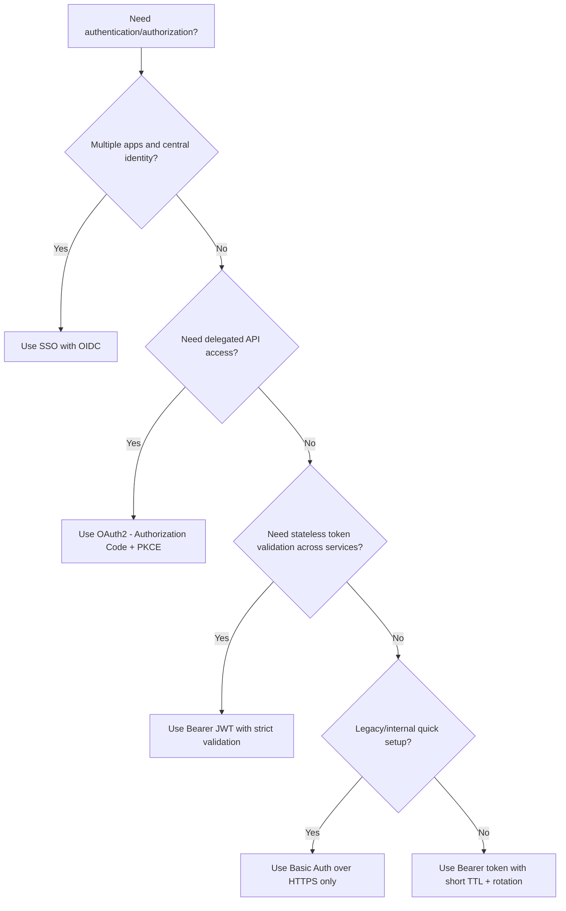
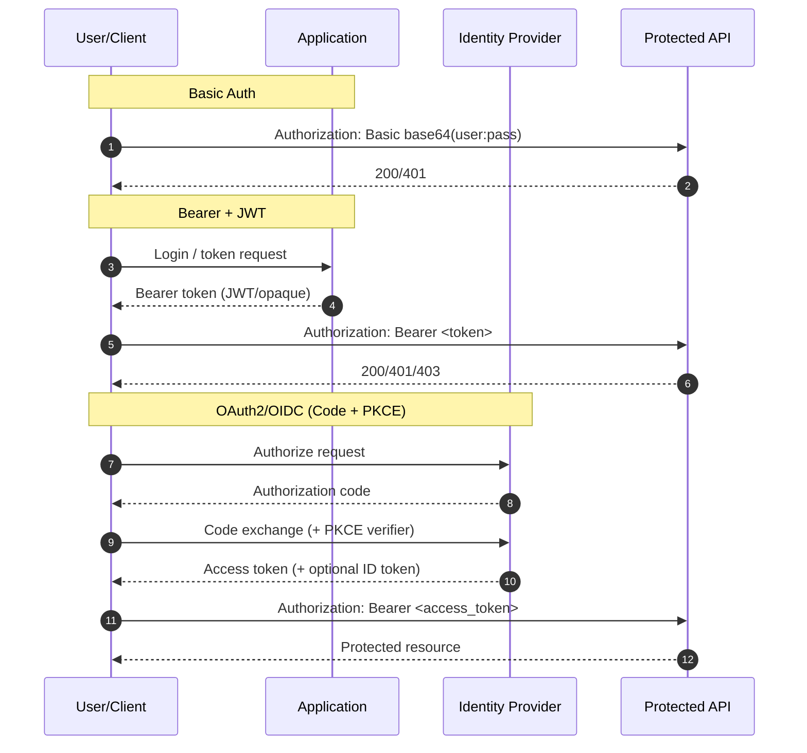

# Authentication Explained

This note explains when to use:
- Basic Authentication
- Bearer Tokens
- OAuth 2.0
- JWT
- SSO

---

## Quick Summary

| Method | Best For | Avoid When |
| --- | --- | --- |
| Basic Auth | Small systems, short-term testing, legacy integrations over HTTPS | Public internet apps, modern mobile/SPA auth |
| Bearer Token | API-to-API calls and session-based token auth | If token lifetime/revocation is not controlled |
| OAuth 2.0 | Delegated access to APIs (user grants app permissions) | If you only need simple username/password auth |
| JWT | Stateless identity/access assertions across services | If immediate revocation and strict session invalidation are required |
| SSO | Login across many apps with one identity provider | Very small systems with one app and no federation need |

---

## 1) Basic Authentication

Basic Auth sends `username:password` (base64-encoded) in the `Authorization` header.

- Header format: `Authorization: Basic <base64(username:password)>`
- Must always be used over HTTPS
- Very simple, but weak compared to token-based modern methods

### Use Basic Auth when
- You are in a trusted/internal environment
- You need quick setup with legacy systems
- You can enforce HTTPS and strong credential rotation

### Risks
- Credentials are sent with each request
- Password leakage has high blast radius
- No granular scope model by default

---

## 2) Bearer Tokens

Bearer means: **whoever holds the token can use it**.

- Header format: `Authorization: Bearer <token>`
- Token can be opaque or JWT
- Commonly used for API authorization

### Use Bearer tokens when
- Building modern APIs
- You need stateless auth on each request
- You can manage token expiration and refresh securely

### Risks
- Token theft = unauthorized access until token expires/revoked
- Must protect storage, transport, and logs

---

## 3) OAuth 2.0

OAuth 2.0 is an **authorization framework**, not a direct authentication protocol.

It answers:
- "What can this client access on behalf of user/app?"

Typical modern grant:
- Authorization Code + PKCE

### Use OAuth 2.0 when
- A client needs delegated access to protected APIs
- Third-party app integrations are required
- Scope/consent model is needed

### Benefits
- Fine-grained scopes
- Consent and delegated permissions
- Industry-standard for API authorization

---

## 4) JWT (JSON Web Token)

JWT is a token format (`header.payload.signature`).

Common claims:
- `iss`, `sub`, `aud`, `exp`, `iat`, `nbf`, plus app claims (roles/scopes)

### Use JWT when
- You need stateless token validation in distributed systems
- Multiple services must validate tokens without central lookup per request

### Avoid JWT when
- You require instant revocation without additional control layers
- Token size and claim exposure are concerns

### JWT good practices
- Keep token lifetime short
- Validate signature + `iss` + `aud` + `exp`
- Avoid sensitive data in token payload

---

## 5) SSO (Single Sign-On)

SSO lets users authenticate once and access multiple apps.

Usually implemented with:
- OIDC (authentication)
- OAuth 2.0 (authorization)
- SAML in older federation ecosystems

### Use SSO when
- Multiple apps share one identity system
- You need centralized MFA, conditional access, and identity lifecycle

### Benefits
- Better user experience
- Centralized access control
- Easier onboarding/offboarding

---

## Choosing the Right Option

---

## Request Flow Comparison

---

## Security Checklist

- Always enforce HTTPS/TLS
- Do not log credentials or full tokens
- Use short token lifetimes
- Rotate secrets/keys
- Validate JWT claims (`iss`, `aud`, `exp`, `nbf`) and signature
- Implement least privilege scopes/roles
- Use MFA and conditional access for sensitive apps
- Add replay protections (`state`, `nonce`, PKCE where applicable)

---

## Common Mistakes

- Treating OAuth2 as authentication by itself
- Using long-lived bearer tokens without rotation
- Skipping audience/issuer checks in JWT validation
- Storing tokens in insecure browser storage
- Using Basic Auth for public production APIs
- Not planning token revocation/session invalidation

---

## Practical Recommendation

- **Web/mobile + APIs:** OIDC + OAuth2 (Authorization Code + PKCE), Bearer access tokens, centralized SSO.
- **Microservices:** short-lived JWT access tokens with strong validation and key rotation.
- **Legacy/small tools:** Basic Auth only as temporary or constrained solution, always over HTTPS.
