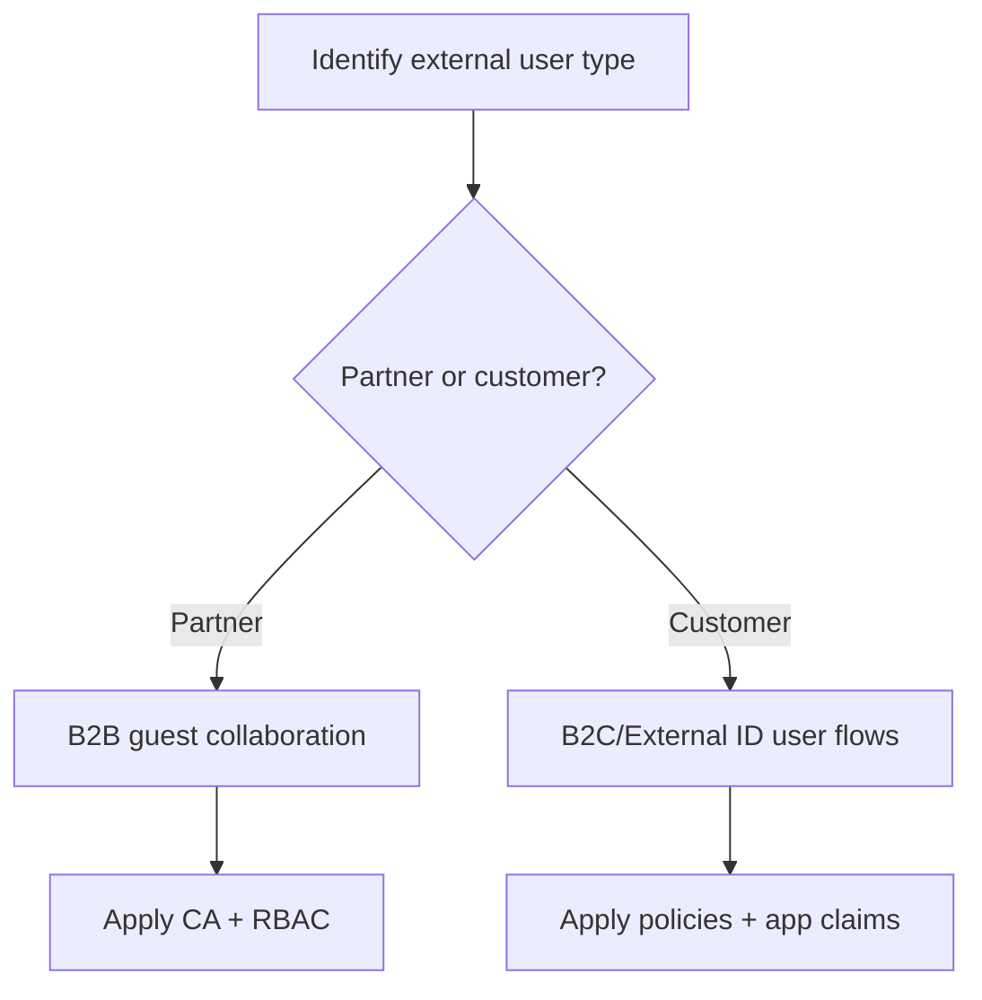

# B2B vs B2C — External Identities in Microsoft Entra ID

## What is it?
B2B and B2C are two external identity models: B2B for partner collaboration and B2C/External ID for customer-facing applications.

## What is it used for?
It is used to choose the right identity plane for guest users, vendors, and end-customer sign-up/sign-in journeys.

## Why is it important?
The wrong choice creates onboarding friction, governance gaps, and poor customer authentication experiences.

## Workflow


## Overview

Microsoft Entra ID offers two distinct models for handling identities that are **external to your organization** — i.e., not employees in your own tenant:

- **Entra ID B2B (Business-to-Business):** For collaborating with **partner organizations, vendors, or contractors**. External users are invited as guests into your tenant. They sign in with their own organizational or personal identity.

- **Entra External ID / B2C (Business-to-Consumer):** For building **customer-facing applications**. End users (customers) self-register and sign in using email/password, social identity providers (Google, Facebook), or local accounts. You fully control the sign-in experience.

---

## Side-by-Side Comparison

| Dimension | B2B (Guest Access) | B2C / External ID (Customer Identity) |
|---|---|---|
| Target users | Partners, vendors, contractors | End customers, consumers |
| User directory | Guests live in **your** Entra tenant | Users live in a **dedicated external tenant** |
| Identity source | Partner's own IdP, Microsoft account, Google | Email/password, social IdPs, custom IdPs |
| Sign-in UX | Partner's own login page (redirect to their IdP) | Fully customizable branded sign-in page |
| Account creation | Invite-based or self-service invitation | Self-registration by the customer |
| Admin vs user model | Admin invites guest → guest accesses resources | User registers → app controls what they can do |
| MFA enforcement | Via Conditional Access in your tenant | Configurable per user flow / policy |
| Access control | RBAC roles, group membership, Conditional Access | App-defined roles and claims |
| Licensing | Entra ID P1/P2 per guest (MAU-based above free tier) | Pricing based on Monthly Active Users (MAU) |
| Customization | Limited (uses partner's login UX) | Full: custom domain, branding, user flows |
| Use case example | Partner accesses internal SharePoint | Customer logs into your e-commerce portal |

---

## Architecture Overview

```
flowchart TD
    subgraph B2B
        YT[Your Tenant]
        PT[Partner Tenant / Personal Account]
        PT -->|Guest invite accepted| YT
        YT -->|Guest assigned to groups / apps| APP_B2B[Internal App]
    end

    subgraph B2C
        EXT[External Tenant - dedicated]
        CUST[Customer - self-registered]
        SOCIAL[Social IdP: Google / Facebook]
        CUST -->|Register / sign in| EXT
        SOCIAL -->|Federated login| EXT
        EXT -->|Issues tokens| APP_B2C[Customer-Facing App]
    end
```

---

## B2B — Guest Access Flow

```
sequenceDiagram
    participant Admin as Your Admin
    participant Guest as External User
    participant YourTenant as Your Entra Tenant
    participant PartnerIdP as Partner's IdP

    Admin->>YourTenant: Invite guest (email address)
    YourTenant-->>Guest: Invitation email with redemption link
    Guest->>YourTenant: Click redemption link
    YourTenant->>PartnerIdP: Redirect to partner's IdP for authentication
    PartnerIdP-->>Guest: Authenticate with partner credentials
    PartnerIdP-->>YourTenant: Authenticated — return to your tenant
    YourTenant-->>Guest: Guest object created in your tenant
    Guest->>YourTenant: Access assigned apps/resources
    YourTenant-->>Guest: Token issued with guest claims
```

Key points:
- The guest **authenticates at their own IdP** — you never see their password.
- A **guest object** (shadow account) is created in your tenant for RBAC purposes.
- Guest's home tenant controls their authentication; your tenant controls their authorization.

---

## B2C — Customer Sign-In Flow

```
sequenceDiagram
    participant Customer
    participant App as Your Customer App
    participant ExtTenant as External / B2C Tenant
    participant SocialIdP as Social IdP (optional)

    Customer->>App: Click "Sign In" or "Sign Up"
    App->>ExtTenant: Redirect to /authorize (OIDC)
    ExtTenant-->>Customer: Show branded sign-in / sign-up page
    Customer->>ExtTenant: Enter email+password or choose social login
    alt Social login chosen
        ExtTenant->>SocialIdP: Federate to social IdP
        SocialIdP-->>ExtTenant: Authenticated
    end
    ExtTenant-->>App: Authorization code
    App->>ExtTenant: Exchange code for tokens
    ExtTenant-->>App: ID token + access token
    App-->>Customer: Signed in
```

Key points:
- The external tenant is **dedicated** — completely separate from your employee tenant.
- You define **user flows** (sign-up, sign-in, password reset, profile edit) as self-service policies.
- Tokens issued are standard OIDC JWTs with claims you configure.

---

## Guest Access — Redemption States

```
stateDiagram-v2
    [*] --> Invited : Admin sends invitation
    Invited --> PendingRedemption : Email delivered
    PendingRedemption --> Redeemed : Guest clicks link and authenticates
    PendingRedemption --> Expired : Invitation not used within 30 days
    Redeemed --> Active : Guest object exists in tenant
    Active --> Blocked : Admin disables guest
    Blocked --> Active : Admin re-enables
    Active --> Removed : Admin removes guest object
    Expired --> [*]
    Removed --> [*]
```

---

## B2C User Account States

```
stateDiagram-v2
    [*] --> Registered : Customer self-registers
    Registered --> Active : Email verified
    Active --> PasswordReset : Password reset initiated
    PasswordReset --> Active : New password set
    Active --> Disabled : Admin disables account
    Disabled --> Active : Admin re-enables
    Active --> Deleted : Account deleted (GDPR / user request)
    Deleted --> [*]
```

---

## Identity Source Options

### B2B — Who can be a guest?
| Identity type | Example | How they authenticate |
|---|---|---|
| Entra ID user from another tenant | Partner employee | At partner's Entra ID |
| Microsoft account | Personal outlook.com / hotmail.com | At login.microsoftonline.com |
| Google account | gmail.com address | At accounts.google.com |
| Email one-time passcode | Any email, no IdP | OTP sent to email |
| Direct federation | Partner with SAML/OIDC IdP | At partner's own IdP |

### B2C — Supported identity providers
| Provider | Type |
|---|---|
| Email + password (local account) | Built-in |
| Google | Social IdP |
| Facebook | Social IdP |
| Apple | Social IdP |
| Any OIDC-compatible IdP | Custom |
| Any SAML-compatible IdP | Custom |

---

## Access Control Differences

### B2B access control model
```
flowchart TD
    G[Guest User] -->|Member of| GRP[Group in Your Tenant]
    GRP -->|Assigned to| APP[Enterprise App]
    APP -->|RBAC role| RES[Azure Resource or SharePoint Site]
    G -->|Also subject to| CA[Conditional Access Policies]
    CA -->|Enforces MFA, compliant device, location| G
```

### B2C access control model
```
flowchart TD
    C[Customer] -->|Authenticated via| EXT[External Tenant]
    EXT -->|Issues token with| CLM[App-defined Claims: roles, custom attributes]
    CLM -->|App reads claims and enforces| AUTHZ[Application-level Authorization]
    AUTHZ -->|No Azure RBAC involved| APP[Customer App]
```

Key difference: B2B uses **Azure RBAC and Conditional Access**. B2C uses **application-defined authorization** based on token claims.

---

## When to Use Which

| Scenario | Use B2B | Use B2C |
|---|---|---|
| Partner employee needs access to your internal tools | ✅ | |
| Vendor needs read access to a SharePoint site | ✅ | |
| Contractor needs access to Azure DevOps | ✅ | |
| Customer registers on your public website | | ✅ |
| Mobile app with millions of consumer sign-ins | | ✅ |
| Social login (Google/Facebook) for customers | | ✅ |
| Custom branded login page for end users | | ✅ |
| Internal employee accessing another org's resource | ✅ | |

---

## Step-by-Step: Test This in Azure

### Prerequisites
- Azure CLI authenticated
- For B2B: your own Entra tenant + a second email address (personal or from another tenant) to invite as guest
- For B2C: a separate external / B2C tenant (free tier available)

---

### Part A — B2B Guest Access

#### Step 1 — Invite a guest user
```bash
TENANT_ID=$(az account show --query tenantId -o tsv)

# Invite a guest by email
az ad invitation create \
  --invited-user-email-address "guest@example.com" \
  --invite-redirect-url "https://myapps.microsoft.com" \
  --send-invitation-message true
```
**Verify:** Guest receives an email with a redemption link.

Alternatively, via Portal: **Entra ID → Users → Invite external user**

#### Step 2 — View the guest object after redemption
```bash
# Guest object appears as userType=Guest
az ad user list \
  --filter "userType eq 'Guest'" \
  --query "[].{Name:displayName, UPN:userPrincipalName, Type:userType}" \
  -o table
```
**Verify:** Guest UPN has the format `guest_example.com#EXT#@<yourtenant>.onmicrosoft.com`.

#### Step 3 — Assign guest to an application
```bash
# Get the guest's object ID
GUEST_OBJ_ID=$(az ad user list --filter "userType eq 'Guest'" --query "[0].id" -o tsv)

# Assign a Reader role at resource group scope
RG_NAME=<your-resource-group>
SUBSCRIPTION_ID=$(az account show --query id -o tsv)

az role assignment create \
  --assignee $GUEST_OBJ_ID \
  --role "Reader" \
  --scope "/subscriptions/$SUBSCRIPTION_ID/resourceGroups/$RG_NAME"
```
**Verify:** Guest can now read resources in that resource group using their own credentials.

#### Step 4 — Review guest access in Portal
1. **Entra ID → Users → [guest user] → Assigned roles**
2. **Entra ID → Users → [guest user] → Authentication methods** — note: their auth is managed by their home tenant

#### Step 5 — Negative test: block guest from another resource
```bash
# Guest does NOT have a role at subscription level
az role assignment list \
  --assignee $GUEST_OBJ_ID \
  --scope "/subscriptions/$SUBSCRIPTION_ID" \
  --query "[].roleDefinitionName" -o table
```
**Verify:** No subscription-level role — guest is isolated to the RG scope only.

#### Step 6 — Remove guest
```bash
az ad user delete --id $GUEST_OBJ_ID
```

---

### Part B — B2C / External Tenant (Portal walkthrough)

#### Step 7 — Create an external tenant (Portal)
1. **Azure Portal → Create a resource → Microsoft Entra External ID** (or search "External Identities")
2. Select **Create a tenant → External tenant**
3. Choose a subdomain (e.g. `mytestb2c.onmicrosoft.com`) and region
4. **Verify:** New tenant created — separate from your employee tenant

#### Step 8 — Create a user flow
1. Switch to the new external tenant
2. **External Identities → User flows → New user flow**
3. Choose **Sign up and sign in**
4. Select identity providers: **Email + password** (and optionally Google)
5. Choose claims to collect: `Display Name`, `Email Address`
6. **Verify:** User flow created with a unique name (e.g. `B2C_1_susi`)

#### Step 9 — Run the user flow to test sign-up
1. In the user flow, click **Run user flow**
2. Select your app registration and reply URL
3. Click **Run user flow** — a branded sign-in page opens
4. Click **Sign up now** → enter email → verify OTP → set password
5. **Verify:** Account created; token returned with configured claims

#### Step 10 — Inspect the issued token
After sign-up, the redirect URL contains an authorization code. Exchange it and decode the resulting ID token at jwt.ms.

**Verify in token:**
| Claim | Expected value |
|---|---|
| `iss` | Your B2C/external tenant issuer URL |
| `sub` | Customer's unique ID (opaque) |
| `email` | Entered during sign-up |
| `tfp` or `acr` | Name of the user flow (`B2C_1_susi`) |

#### Step 11 — Compare directories
```bash
# In your main tenant: guests appear as userType=Guest
az ad user list --filter "userType eq 'Guest'" --query "[].userPrincipalName" -o tsv

# In B2C tenant: customers are local accounts — managed separately via B2C Graph API
```

### What to Confirm End-to-End
| Check | Expected |
|---|---|
| Guest UPN has `#EXT#` format | Yes |
| Guest authenticates at their own IdP | Yes |
| Guest RBAC is controlled by your tenant | Yes |
| B2C user lives in separate external tenant | Yes |
| B2C token contains `tfp`/`acr` user flow claim | Yes |
| B2C supports self-registration (no admin invite) | Yes |
| B2C custom branding visible on sign-in page | Yes |

---

## Summary

| | B2B | B2C / External ID |
|---|---|---|
| Who | Partners and vendors | Customers and consumers |
| Where | Guest object in your tenant | Dedicated external tenant |
| Auth | At their own IdP | At your branded sign-in page |
| Access control | Azure RBAC + Conditional Access | App-defined claims |
| Scale | Typically hundreds to thousands | Millions of MAUs |

Use **B2B** when you need secure, RBAC-controlled access for known external collaborators. Use **B2C/External ID** when you are building a customer-facing product where users self-register and you own the full sign-in experience.
