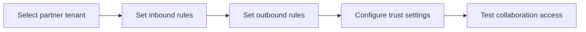

# Cross-Tenant Access Policies

## What is it?
Cross-Tenant Access Policies are Entra controls that define trust and access behavior between your tenant and partner tenants.

## What is it used for?
They are used to allow or block inbound/outbound B2B access and decide how MFA/device trust is handled across organizations.

## Why is it important?
They reduce collaboration risk by preventing over-trust while preserving secure partner access.

## Workflow


## Overview

When organizations collaborate — sharing apps, resources, or data — identities from one Entra ID tenant need to be trusted by another. **Cross-Tenant Access Policies** (XTAP) give administrators fine-grained control over **which external tenants are trusted**, **which users from those tenants can access resources**, and **under what authentication conditions**.

Without explicit policy, Entra ID applies default behavior. With cross-tenant access policies, organizations can:
- Allow or block B2B collaboration with specific tenants
- Enforce MFA or compliant device requirements for inbound guests
- Trust (or not trust) MFA claims that the partner's tenant already performed
- Control which of your own users can be invited out to partner tenants (outbound)

---

## Key Concepts

| Concept | Meaning |
|---|---|
| **Inbound settings** | Controls what external users (guests from other tenants) can do in **your** tenant |
| **Outbound settings** | Controls what **your users** can do when accessing other tenants |
| **Default policy** | Applied to all tenants not covered by an organization-specific policy |
| **Organization-specific policy** | Applied to a named partner tenant — overrides the default |
| **B2B collaboration** | Guest invite-based access (OIDC/SAML federation) |
| **B2B direct connect** | Shared channel access (e.g. Teams shared channels) — no guest object created |
| **Trust settings** | Whether your tenant trusts MFA, compliant device, or hybrid-joined claims from the partner's tenant |

---

## Policy Structure

```
flowchart TD
    DP[Default Policy]
    DP -->|Applies to| ALL[All external tenants not named explicitly]

    OP[Organization-specific Policy]
    OP -->|Applies to| NAMED[One specific named partner tenant]
    OP -->|Overrides| DP

    subgraph Inbound
        IN_COLLAB[B2B Collaboration: Allow / Block]
        IN_DIRECT[B2B Direct Connect: Allow / Block]
        IN_TRUST[Trust: MFA / Compliant Device / Hybrid Join from partner]
    end

    subgraph Outbound
        OUT_COLLAB[Your users invited to partner: Allow / Block]
        OUT_DIRECT[Your users in partner shared channels: Allow / Block]
    end

    OP --> Inbound
    OP --> Outbound
```

---

## Trust Settings — What They Mean

When a guest signs in from their home tenant, they may have already completed MFA there. Your tenant can choose to **trust** those claims instead of forcing MFA again.

```
flowchart TD
    GUEST[External User] -->|Signs in with their IdP| HOME[Home Tenant]
    HOME -->|MFA completed| HOME
    HOME -->|Issues token with MFA claim| YOUR[Your Tenant]

    YOUR --> T1{Trust MFA from home tenant?}
    T1 -->|Yes - trust configured| SKIP[Skip re-prompt for MFA]
    T1 -->|No - not trusted| FORCE[Force MFA again in your tenant]

    YOUR --> T2{Trust compliant device?}
    T2 -->|Yes| SKIP_DEV[Accept device compliance claim]
    T2 -->|No| BLOCK_DEV[Require compliance check locally]
```

| Trust setting | What it does |
|---|---|
| Trust MFA from partner | Accepts the partner's MFA as satisfying your Conditional Access MFA requirement |
| Trust compliant device | Accepts Intune compliance state from partner tenant |
| Trust hybrid Azure AD joined device | Accepts hybrid join from partner's on-premises AD |

**Important:** Trust is not blind. You are trusting the **partner's Conditional Access and security posture** to have enforced these controls. Only enable trust for partners whose security standards you have verified.

---

## Inbound vs Outbound Flow

```
sequenceDiagram
    participant PartnerUser as Partner User (Tenant B)
    participant PartnerIdP as Partner Tenant B IdP
    participant YourTenant as Your Tenant A
    participant YourApp as Your App / Resource

    Note over YourTenant: Inbound policy for Tenant B
    PartnerUser->>YourTenant: Attempt to access your app (guest invite)
    YourTenant->>YourTenant: Check inbound policy for Tenant B
    alt B2B Collaboration allowed
        YourTenant->>PartnerIdP: Redirect for authentication
        PartnerIdP-->>PartnerUser: Authenticate
        PartnerIdP-->>YourTenant: Token with MFA + device claims
        YourTenant->>YourTenant: Check trust settings
        alt MFA trusted from Tenant B
            YourTenant-->>PartnerUser: Access granted (no re-prompt)
        else MFA not trusted
            YourTenant-->>PartnerUser: Require MFA in your tenant
        end
        YourTenant-->>YourApp: Guest token issued
    else B2B Collaboration blocked
        YourTenant-->>PartnerUser: Access denied
    end
```

---

## Default Policy Behavior

If no organization-specific policy exists for a partner tenant, the **default policy** applies:

| Setting | Default behavior |
|---|---|
| Inbound B2B collaboration | **Allowed** for all external tenants |
| Inbound B2B direct connect | **Blocked** |
| Outbound B2B collaboration | **Allowed** for all external tenants |
| Outbound B2B direct connect | **Blocked** |
| Trust MFA from external tenants | **Not trusted** (MFA re-prompted in your tenant) |
| Trust compliant device | **Not trusted** |

---

## Common Policy Configurations

### Config 1: Block all external collaboration (strict isolation)
- Default policy: Block inbound B2B collaboration
- Add organization-specific policies only for approved partners

### Config 2: Trust MFA from a specific partner
- Add organization-specific policy for partner tenant
- Inbound trust: Enable "Trust MFA performed by partner's tenant"
- Result: Guests from that partner don't get double-prompted for MFA

### Config 3: Allow a partner but require compliant device
- Inbound B2B collaboration: Allowed
- Trust compliant device: Disabled (don't trust partner's device compliance)
- Combine with Conditional Access: Require device compliance on guest access
- Result: Partner users must use a device enrolled in your or their MDM

### Config 4: Restrict which of your users can be invited out
- Outbound settings: Block B2B collaboration
- Result: Your users cannot accept guest invitations from other organizations

---

## Policy Evaluation Order

```
flowchart TD
    REQ[Access Request from External User]
    REQ --> CHK1{Organization-specific policy exists for their tenant?}
    CHK1 -->|Yes| USE_ORG[Apply organization-specific policy]
    CHK1 -->|No| USE_DEF[Apply default policy]
    USE_ORG --> EVAL[Evaluate: Inbound Allow/Block + Trust settings]
    USE_DEF --> EVAL
    EVAL --> CA[Apply Conditional Access policies]
    CA --> GRANT[Grant or Deny access]
```

---

## Cross-Tenant Access vs Other Controls

| Control | What it governs |
|---|---|
| Cross-Tenant Access Policy | Whether external tenant users can enter/leave at all, and what claims to trust |
| Conditional Access | Authentication requirements applied after identity is established |
| RBAC | What the identity can do once inside |
| External Collaboration Settings | Older guest settings (being superseded by XTAP for most scenarios) |

These controls layer on top of each other. XTAP is the **first gate** — if it blocks, nothing else matters.

---

## Step-by-Step: Test This in Azure

### Prerequisites
- Azure CLI authenticated as Global Administrator or Security Administrator
- Your tenant ID

### Step 1 — View current default cross-tenant access policy
```bash
TENANT_ID=$(az account show --query tenantId -o tsv)

# View default inbound/outbound settings via Microsoft Graph
az rest \
  --method GET \
  --url "https://graph.microsoft.com/v1.0/policies/crossTenantAccessPolicy/default" \
  --headers "Content-Type=application/json"
```
**Verify:** Response shows `b2bCollaborationInbound`, `b2bCollaborationOutbound`, `b2bDirectConnectInbound`, `b2bDirectConnectOutbound` sections with `allowedUsers` and `allowedGroups` or `@odata.type` indicating allow/block state.

### Step 2 — List all organization-specific policies
```bash
az rest \
  --method GET \
  --url "https://graph.microsoft.com/v1.0/policies/crossTenantAccessPolicy/partners" \
  --headers "Content-Type=application/json"
```
**Verify:** Returns a list of named partner tenants with their individual policies (may be empty if none configured).

### Step 3 — Create an organization-specific policy for a partner tenant
```bash
PARTNER_TENANT_ID=<partner-tenant-id>

az rest \
  --method POST \
  --url "https://graph.microsoft.com/v1.0/policies/crossTenantAccessPolicy/partners" \
  --headers "Content-Type=application/json" \
  --body '{
    "tenantId": "'"$PARTNER_TENANT_ID"'",
    "b2bCollaborationInbound": {
      "usersAndGroups": {
        "accessType": "allowed",
        "targets": [{"target": "AllUsers", "targetType": "user"}]
      },
      "applications": {
        "accessType": "allowed",
        "targets": [{"target": "AllApplications", "targetType": "application"}]
      }
    }
  }'
```
**Verify:** Policy created with `tenantId` set to the partner. Inbound B2B collaboration explicitly allowed.

### Step 4 — Configure MFA trust for the partner
```bash
az rest \
  --method PATCH \
  --url "https://graph.microsoft.com/v1.0/policies/crossTenantAccessPolicy/partners/$PARTNER_TENANT_ID" \
  --headers "Content-Type=application/json" \
  --body '{
    "inboundTrust": {
      "isMfaAccepted": true,
      "isCompliantDeviceAccepted": false,
      "isHybridAzureADJoinedDeviceAccepted": false
    }
  }'
```
**Verify:** `isMfaAccepted: true` — partner's MFA will satisfy your Conditional Access MFA requirement.

### Step 5 — Test: invite a guest from the partner tenant
```bash
az ad invitation create \
  --invited-user-email-address "user@<partner-domain>.com" \
  --invite-redirect-url "https://myapps.microsoft.com" \
  --send-invitation-message true
```
Have the partner user redeem the invitation. They should authenticate at their own IdP.

**Verify:** If the partner completed MFA at their tenant, your Conditional Access policy (requiring MFA) should be satisfied without re-prompting.

### Step 6 — Test: block access from a tenant (negative test)
```bash
# Add a partner policy that blocks inbound collaboration
BLOCKED_TENANT_ID=<tenant-to-block>

az rest \
  --method POST \
  --url "https://graph.microsoft.com/v1.0/policies/crossTenantAccessPolicy/partners" \
  --headers "Content-Type=application/json" \
  --body '{
    "tenantId": "'"$BLOCKED_TENANT_ID"'",
    "b2bCollaborationInbound": {
      "usersAndGroups": {
        "accessType": "blocked",
        "targets": [{"target": "AllUsers", "targetType": "user"}]
      }
    }
  }'
```
**Verify:** Users from the blocked tenant cannot redeem invitations — they receive an access denied error.

### Step 7 — View sign-in logs to confirm trust behavior
1. **Azure Portal → Microsoft Entra ID → Sign-in logs**
2. Filter by **User type = Guest**
3. Find the sign-in event for the partner user
4. Open the event → **Authentication Details** tab

**Verify:** Look for MFA claim source — it should show `MFA satisfied by claim in the token` (trust honored) vs `MFA completed in this tenant` (re-prompted).

### Step 8 — Restrict outbound access (prevent your users being guests elsewhere)
```bash
# Update default policy to block outbound B2B collaboration
az rest \
  --method PATCH \
  --url "https://graph.microsoft.com/v1.0/policies/crossTenantAccessPolicy/default" \
  --headers "Content-Type=application/json" \
  --body '{
    "b2bCollaborationOutbound": {
      "usersAndGroups": {
        "accessType": "blocked",
        "targets": [{"target": "AllUsers", "targetType": "user"}]
      }
    }
  }'
```
**Verify:** Your users can no longer accept guest invitations from external organizations.

> **Caution:** Blocking outbound collaboration affects all tenants not covered by an organization-specific override. Test in a non-production tenant first.

### Step 9 — Clean up test policies
```bash
# Delete the organization-specific policy for the partner
az rest \
  --method DELETE \
  --url "https://graph.microsoft.com/v1.0/policies/crossTenantAccessPolicy/partners/$PARTNER_TENANT_ID"

# Reset default outbound policy back to allow
az rest \
  --method PATCH \
  --url "https://graph.microsoft.com/v1.0/policies/crossTenantAccessPolicy/default" \
  --headers "Content-Type=application/json" \
  --body '{
    "b2bCollaborationOutbound": {
      "usersAndGroups": {
        "accessType": "allowed",
        "targets": [{"target": "AllUsers", "targetType": "user"}]
      }
    }
  }'
```

### What to Confirm End-to-End
| Check | Expected |
|---|---|
| Default policy retrieved via Graph API | Yes — shows inbound/outbound settings |
| Organization-specific policy created for partner | Yes |
| MFA trust configured → no re-prompt for partner guests | Yes (visible in sign-in logs) |
| Blocked tenant policy → guests denied | Yes — access denied on redemption |
| Outbound block → own users can't be guests elsewhere | Yes |
| Deleting org policy reverts to default | Yes |

---

## Security Best Practices

- **Start restrictive:** Set default policy to block, then explicitly allow approved partners
- **Verify partner security posture** before enabling MFA trust — you are trusting their enforcement
- **Use organization-specific policies** rather than broadly trusting all tenants
- **Scope trust narrowly:** Trust MFA only from partners with verified Conditional Access policies
- **Monitor regularly:** Review sign-in logs for guest activity and unexpected access patterns
- **Rotate review cadence:** Periodically re-evaluate partner trust policies — business relationships change
- **Combine with Conditional Access:** XTAP controls entry; Conditional Access controls access conditions

---

## Summary

Cross-Tenant Access Policies provide the **first layer of control** over what external identities can enter your tenant and what authentication claims from partner tenants are trusted.

- The **default policy** applies to all tenants not explicitly named
- **Organization-specific policies** override defaults for named partners
- **Inbound settings** control what external users can access in your tenant
- **Outbound settings** control where your users can be invited
- **Trust settings** determine whether MFA and device compliance claims from the partner's tenant satisfy your Conditional Access requirements

Layering XTAP with Conditional Access and RBAC creates a complete, auditable cross-organizational access model with no implicit trust.
