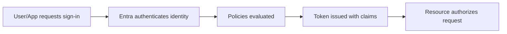
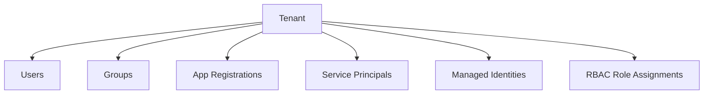
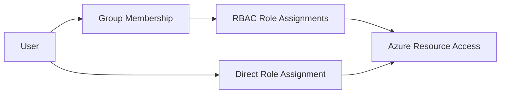
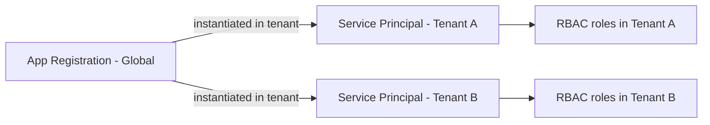
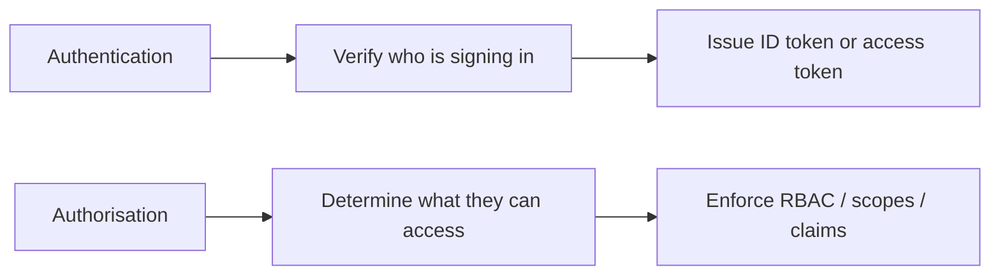
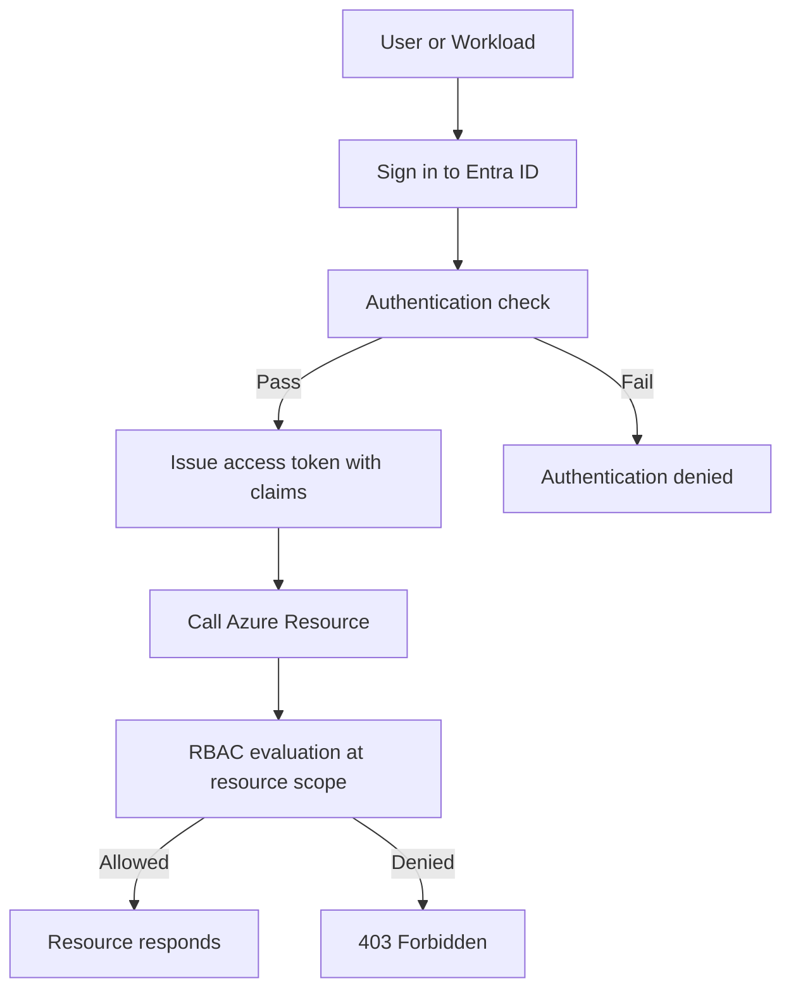
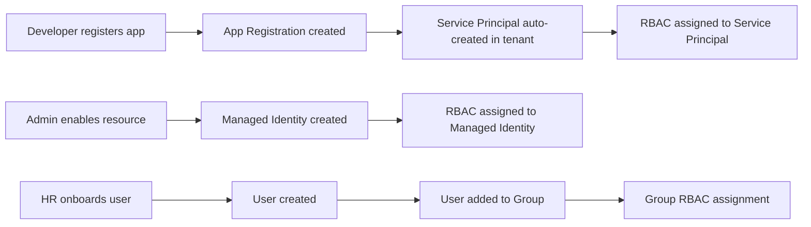
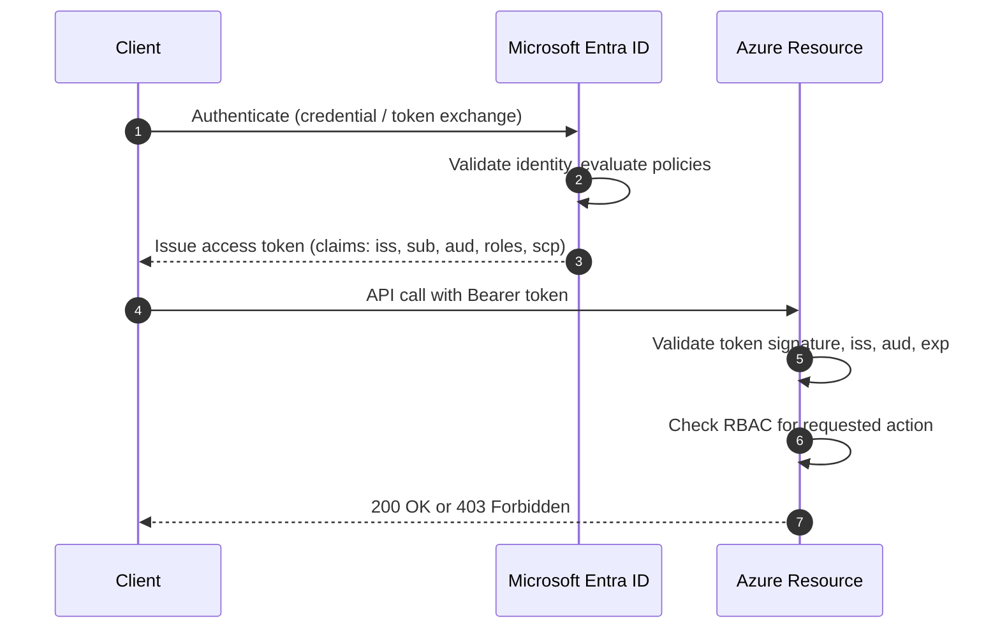

# Microsoft Entra ID Basics

## What is it?
Microsoft Entra ID is Azure's identity and access service for users, applications, and workloads.

## What is it used for?
It is used for sign-in, SSO, conditional access, application identity, and authorization integration with Azure resources.

## Why is it important?
It is the identity control plane for zero-trust security and secure access decisions across cloud workloads.

## Workflow


## What is Microsoft Entra ID?
Microsoft Entra ID (formerly Azure Active Directory) is a cloud-based identity and access management service. It manages who users are, what they can access, and how they authenticate.

---

## Core Building Blocks

| Concept | What it is |
| --- | --- |
| Tenant | Dedicated instance of Entra ID for an organisation |
| User | Identity representing a person |
| Group | Collection of users/service principals for access assignment |
| App Registration | Identity config for an application |
| Service Principal | Instance of an app registration in a tenant |
| Managed Identity | Azure-assigned identity for a resource (no secret) |

---

## Tenant



A tenant is isolated. Resources in one tenant do not automatically trust another tenant unless cross-tenant access is configured.

---

## Users

- Represent people or external guests
- Have properties: `objectId`, `userPrincipalName`, `displayName`
- Can be cloud-only or synced from on-premises AD



---

## Groups

- Assign access to many users at once
- Security groups used for RBAC
- Microsoft 365 groups used for collaboration

| Group Type | Used For |
| --- | --- |
| Security group | RBAC and app assignment |
| Microsoft 365 group | Teams, SharePoint, collaboration |
| Dynamic group | Membership auto-populated by rules |

---

## App Registration

An app registration is the global identity definition for an application in Entra ID.

- Defines authentication settings
- Holds redirect URIs, certificates, federated credentials
- Has an `Application (client) ID`
- One registration per app, usable across tenants

---

## Service Principal

A service principal is the local instantiation of an app registration inside a specific tenant.

- Created automatically when an app is registered or consented to
- Has its own `Object ID` in the tenant
- RBAC assignments are made on the service principal



---

## Key Identifiers

| Identifier | What it refers to |
| --- | --- |
| `tenantId` | The Entra ID tenant |
| `objectId` | Unique ID of any object (user/group/SP/MI) within tenant |
| `appId` (clientId) | Unique ID of the app registration across tenants |

---

## Authentication vs Authorisation in Entra ID



---

## Full Identity Resolution Workflow

When a user or workload signs in and calls an Azure resource, this is the full resolution chain:



---

## Object Creation Lifecycle



---

## Token Issuance Flow



---

## Step-by-Step: Test This in Azure

### Prerequisites
- Azure subscription with at least one Entra ID tenant
- Azure CLI installed and authenticated (`az login`)

### Step 1 — Inspect your tenant
```bash
# View your current tenant details
az account show

# List all tenants you have access to
az account tenant list
```
**Verify:** You see a `tenantId` (GUID) and `homeTenantId` in the output.

### Step 2 — List users in the tenant
```bash
# List first 5 users
az ad user list --query "[0:5].{Name:displayName, UPN:userPrincipalName, ID:id}" -o table
```
**Verify:** Users appear with display names and UPNs.

### Step 3 — List groups
```bash
az ad group list --query "[0:5].{Name:displayName, ID:id}" -o table
```
**Verify:** Groups are returned with their object IDs.

### Step 4 — View an app registration
```bash
# List app registrations in your tenant
az ad app list --query "[0:5].{Name:displayName, AppID:appId, ObjectID:id}" -o table
```
**Verify:** Each app has a unique `appId` (client ID) and `id` (object ID).

### Step 5 — View a service principal
```bash
# Find the service principal for one of the apps above
az ad sp list --query "[0:5].{Name:displayName, AppID:appId, ObjectID:id}" -o table
```
**Verify:** Service principals match the apps listed above — same `appId`, different `id`.

### Step 6 — Check group membership
```bash
# Get object ID of a group first
GROUP_ID=$(az ad group list --query "[0].id" -o tsv)

# List members of that group
az ad group member list --group $GROUP_ID --query "[].{Name:displayName, Type:userType}" -o table
```
**Verify:** Members shown are users or service principals depending on what was added.

### Step 7 — Trace a token for your own account
```bash
# Get a token for Microsoft Graph
az account get-access-token --resource https://graph.microsoft.com
```
Copy the `accessToken` value and decode it at jwt.ms (paste in browser — no account needed).

**Verify in token:** `iss`, `oid`, `tid`, `upn` or `unique_name`, `scp` fields are present.

### What to Confirm End-to-End
| Check | Expected |
|---|---|
| Tenant ID visible | Yes — GUID in `az account show` |
| Users exist | Yes — returned with UPN |
| Groups exist | At least built-in groups |
| App registration has unique `appId` | Yes |
| Matching SP for app exists | Same `appId`, different object ID |
| Token has `tid` and `oid` claims | Yes |

---

## Summary
Microsoft Entra ID is the identity backbone of Azure. Understanding tenants, users, groups, app registrations, and service principals is the foundation for every identity and access pattern built on top.
