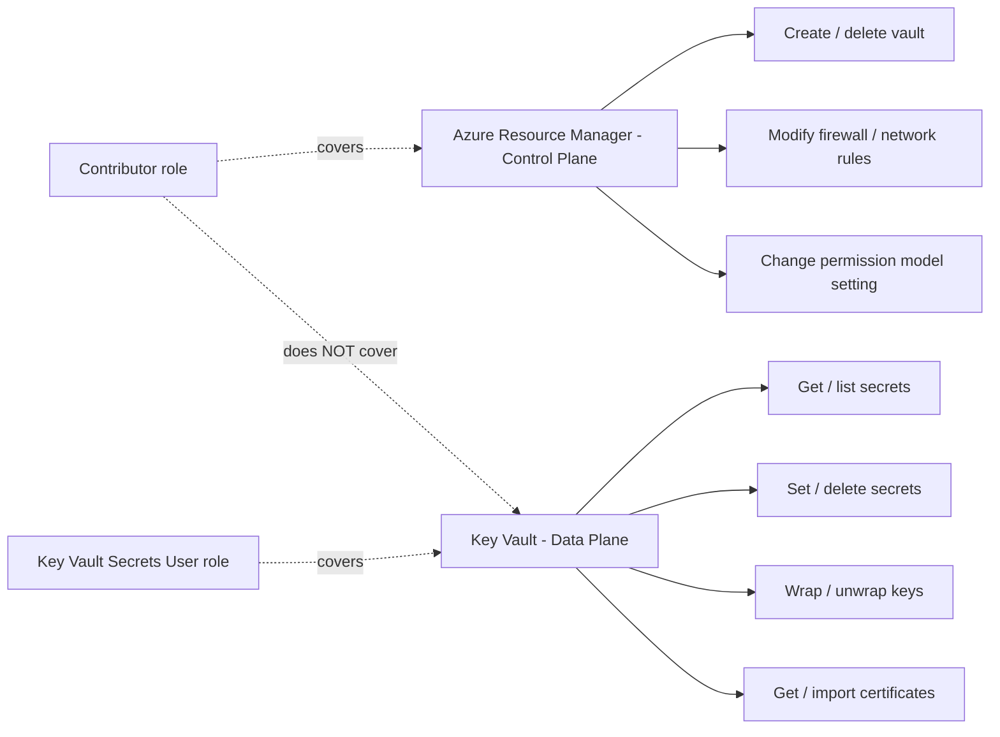
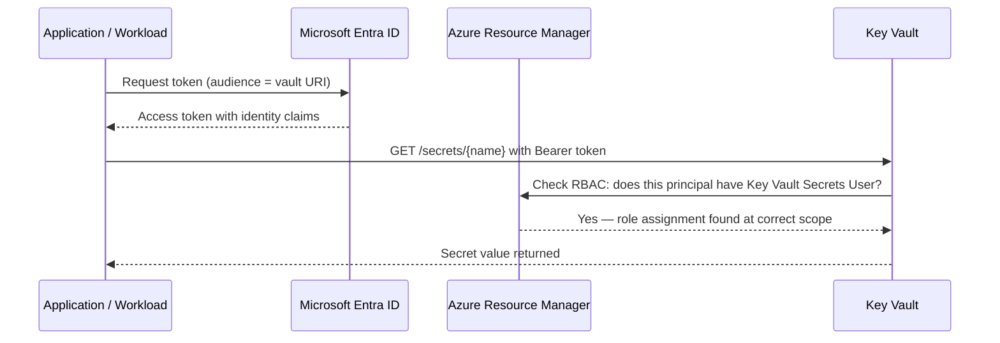
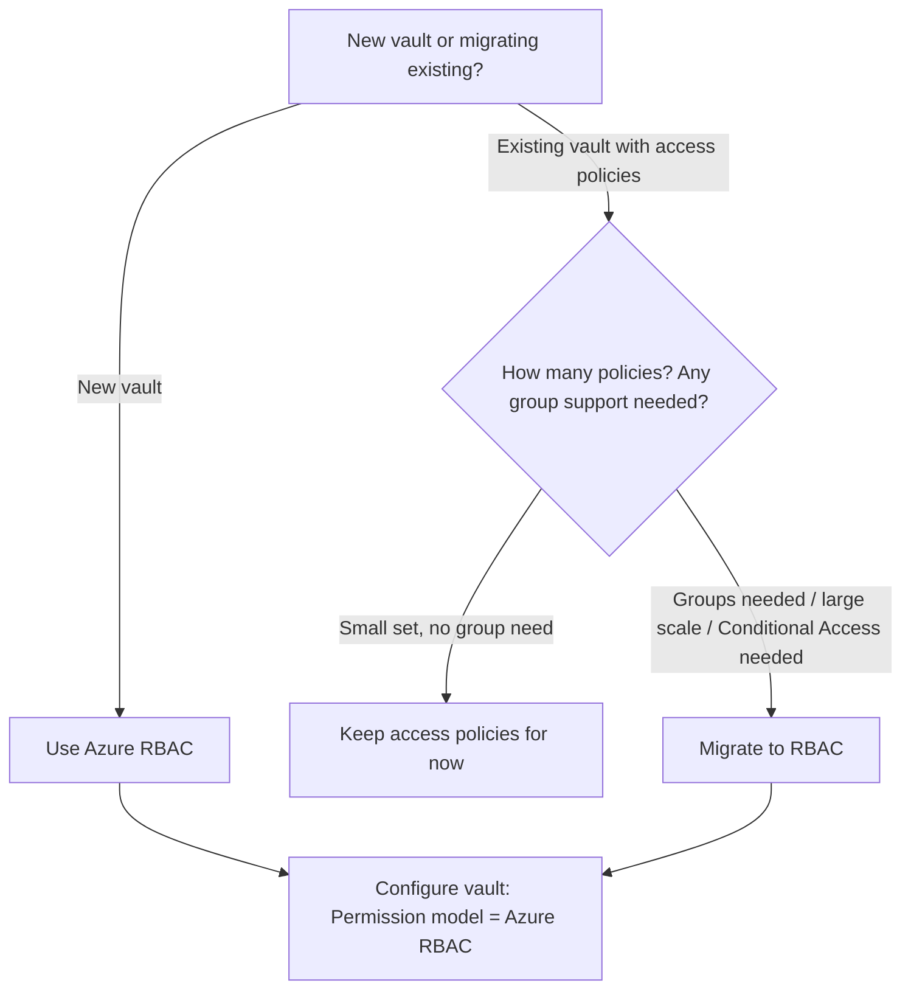
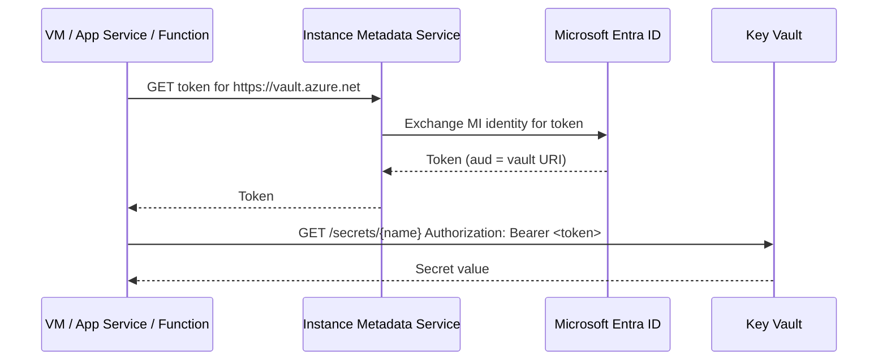
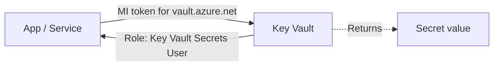
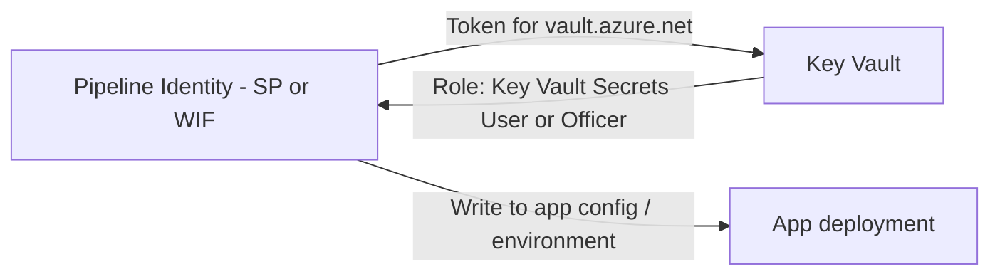
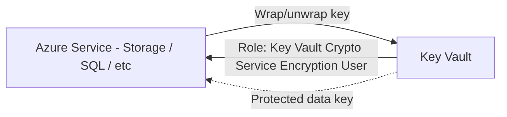
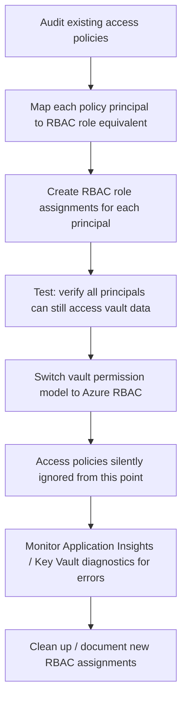
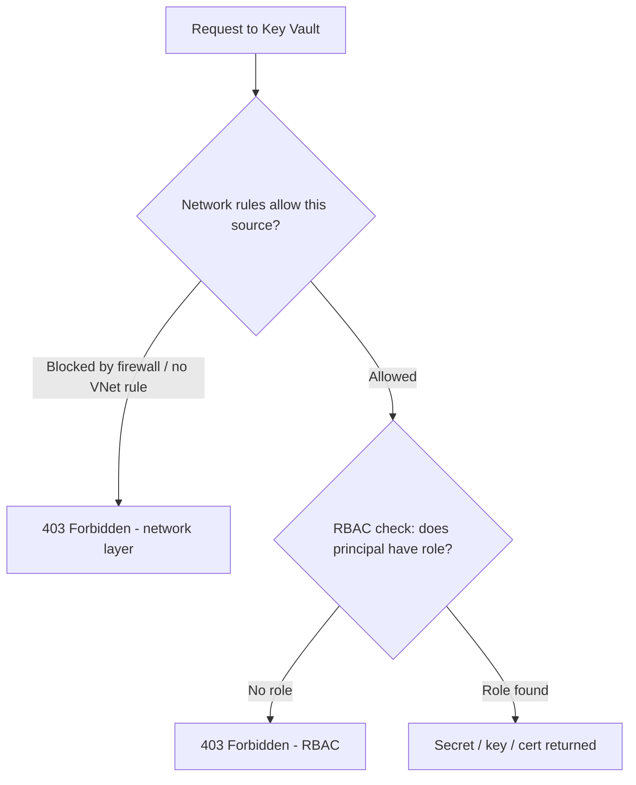

# Key Vault Access Patterns

## What is it?
Key Vault access patterns define how identities are authorized to manage vault resources and read/write secrets, keys, and certificates.

## What is it used for?
They are used to implement secure secret retrieval and key operations using Azure RBAC or legacy access policies.

## Why is it important?
Correct patterns prevent privilege confusion between control-plane and data-plane permissions and reduce secret exposure risk.

## Workflow


## Overview

Azure Key Vault stores and controls access to secrets, keys, and certificates. Controlling **who can access what inside a vault** is separate from controlling **who can manage the vault itself** — this distinction is the most common source of confusion when working with Key Vault.

There are two authorization models:
- **Vault Access Policies** — the original model; a per-vault list of principals and their allowed secret/key/certificate operations
- **Azure RBAC** — the modern model; uses standard ARM role assignments with full scope hierarchy, group support, and Conditional Access integration

Microsoft recommends **RBAC** for all new deployments.

---

## Two Authorization Planes

| Plane | What it controls | Model used |
|---|---|---|
| **Control plane** | Managing the vault itself (create, delete, modify settings, configure networking) | Azure RBAC always |
| **Data plane** | Reading/writing secrets, keys, and certificates stored inside the vault | Access policies OR Azure RBAC (vault setting chooses one) |

A principal with `Contributor` on the vault resource can **manage the vault** but cannot read a secret unless they also have a data-plane permission. This surprises many teams the first time.



---

## Model 1 — Vault Access Policies (Legacy)

Access policies are set **per vault**. Each policy entry defines:
- A principal (user, group, SP, or managed identity object ID)
- Allowed operations on **secrets**, **keys**, and **certificates** independently

### Access policy structure

```
flowchart TD
    VAULT[Key Vault]
    VAULT --> AP1[Policy: App Identity A
    Secrets: Get, List
    Keys: none
    Certs: none]
    VAULT --> AP2[Policy: Admin User
    Secrets: Get, List, Set, Delete
    Keys: Get, Create, Delete
    Certs: Get, Import]
    VAULT --> AP3[Policy: Backup SP
    Secrets: Backup, Restore
    Keys: Backup, Restore
    Certs: Backup, Restore]
```

### Access policy limitations (why teams move to RBAC)

| Limitation | Impact |
|---|---|
| Per-vault only — no scope hierarchy | Cannot inherit from subscription/RG; must configure each vault separately |
| Does not support groups in all scenarios | May require direct principal assignments instead of group membership |
| No Conditional Access integration | Cannot enforce MFA or device compliance for vault data access |
| 1024 access policy entries per vault | Hard limit in large environments |
| No audit trail of who changed policy assignments | Harder to track via standard Azure Activity Log |
| Not compatible with ARM templates in the same way as RBAC | Infrastructure-as-code tooling behaves differently |

---

## Model 2 — Azure RBAC (Recommended)

When the vault's permission model is set to **Azure role-based access control**, data-plane access is governed by standard role assignments — same as any other Azure resource.

### Key Vault built-in data-plane roles

| Role | What it allows |
|---|---|
| `Key Vault Administrator` | Full data-plane access — secrets, keys, certs (all operations) |
| `Key Vault Secrets Officer` | Manage secrets (CRUD) — no keys or certs |
| `Key Vault Secrets User` | Get and list secrets (read-only) — typical app role |
| `Key Vault Crypto Officer` | Manage cryptographic keys |
| `Key Vault Crypto User` | Use keys for encrypt/decrypt/sign/verify |
| `Key Vault Crypto Service Encryption User` | Wrap/unwrap keys for service encryption (used by Azure services) |
| `Key Vault Certificate Officer` | Manage certificates |
| `Key Vault Reader` | Read vault metadata only — no secret values |

### RBAC access flow



---

## Choosing Between the Two Models



> **Important:** Switching a vault's permission model from access policies to RBAC is a **breaking change** — all existing access policies stop working immediately. Plan the migration with zero-downtime in mind.

---

## Managed Identity Integration

The most secure pattern for application access to Key Vault is **managed identity** — no credentials stored anywhere.

### System-assigned MI accessing Key Vault (RBAC model)



### Setup: MI + Key Vault RBAC in practice

```bash
# 1. Create or identify your resource's managed identity
# Example: App Service
RESOURCE_GROUP=<your-rg>
APP_NAME=<your-app-service-name>

az webapp identity assign \
  --resource-group $RESOURCE_GROUP \
  --name $APP_NAME

MI_PRINCIPAL_ID=$(az webapp identity show \
  --resource-group $RESOURCE_GROUP \
  --name $APP_NAME \
  --query principalId -o tsv)

# 2. Get the Key Vault resource ID
KV_NAME=<your-keyvault-name>
KV_ID=$(az keyvault show --name $KV_NAME --query id -o tsv)

# 3. Assign Key Vault Secrets User to the MI
az role assignment create \
  --assignee $MI_PRINCIPAL_ID \
  --role "Key Vault Secrets User" \
  --scope $KV_ID
```

**Verify:** The app can now call the vault data plane using its managed identity token — no secrets in config.

---

## Access Patterns by Scenario

### Pattern 1: Application reads secrets at runtime (most common)



- Use **system-assigned MI** if only one resource needs this access
- Assign `Key Vault Secrets User` at the vault scope
- Read secrets by name in code; do not cache long-term

### Pattern 2: CI/CD pipeline injects secrets during deployment



- Pipeline identity needs `Key Vault Secrets User` (read) or `Key Vault Secrets Officer` (write)
- Prefer **Workload Identity Federation** for pipeline identity — no stored secret
- Minimize the scope: assign only to the specific vault used by the pipeline

### Pattern 3: Encryption key management (customer-managed keys)



- The Azure service's managed identity needs `Key Vault Crypto Service Encryption User`
- Assign at the **specific key** scope if possible, not the full vault
- Key rotation should be handled via Key Vault key versioning

### Pattern 4: Ops team manages secrets (manual lifecycle)

- Ops engineer: `Key Vault Secrets Officer` (CRUD on secrets)
- Auditor / security reviewer: `Key Vault Reader` (metadata only — no secret values)
- Use **PIM** to give `Key Vault Secrets Officer` as an eligible role, not a permanent one

---

## RBAC Scope Granularity for Key Vault

RBAC assignments can be scoped more granularly than the vault level:

| Scope | Example | Use when |
|---|---|---|
| Subscription | `/subscriptions/<id>` | Rarely — too broad for data access |
| Resource group | `/subscriptions/<id>/resourceGroups/<rg>` | When RG contains only vaults for one team |
| Vault | `/subscriptions/<id>/resourceGroups/<rg>/providers/Microsoft.KeyVault/vaults/<name>` | Standard — most common |
| Secret | `.../secrets/<secret-name>` | High-sensitivity: isolate access to one specific secret |
| Key | `.../keys/<key-name>` | When different teams manage different keys |

Assigning at **secret or key scope** is more complex to manage but gives tightest blast radius.

---

## Migration: Access Policies → RBAC



### Policy-to-RBAC mapping reference

| Access policy permissions | RBAC role equivalent |
|---|---|
| Secret: Get, List | `Key Vault Secrets User` |
| Secret: Get, List, Set, Delete, Recover, Backup, Restore | `Key Vault Secrets Officer` |
| Key: Get, List, Verify, Sign, Encrypt, Decrypt, WrapKey, UnwrapKey | `Key Vault Crypto User` |
| Key: full management | `Key Vault Crypto Officer` |
| Certificate: Get, List | `Key Vault Certificates User` (Reader) |
| Certificate: full management | `Key Vault Certificate Officer` |
| All operations on everything | `Key Vault Administrator` |

---

## Networking and RBAC Working Together

RBAC controls **authentication and authorization**, but Key Vault also has a **network layer** that can block requests regardless of RBAC:



Both must pass. A principal with a perfect RBAC assignment is still blocked if the vault firewall denies their network source.

---

## Audit and Monitoring

Key Vault emits diagnostic logs. Enable and send to Log Analytics:

```bash
KV_ID=$(az keyvault show --name $KV_NAME --query id -o tsv)
WORKSPACE_ID=<log-analytics-workspace-id>

az monitor diagnostic-settings create \
  --name "kv-audit" \
  --resource $KV_ID \
  --workspace $WORKSPACE_ID \
  --logs '[{"category": "AuditEvent", "enabled": true}]' \
  --metrics '[{"category": "AllMetrics", "enabled": true}]'
```

Useful KQL query in Log Analytics:
```kql
AzureDiagnostics
| where ResourceType == "VAULTS"
| where OperationName in ("SecretGet", "SecretSet", "SecretDelete")
| project TimeGenerated, CallerIPAddress, identity_claim_oid_g, OperationName, ResultType
| order by TimeGenerated desc
```

**Verify:** Every secret read/write appears with caller identity and IP.

---

## Step-by-Step: Test This in Azure

### Prerequisites
- Azure CLI authenticated
- A resource group and Key Vault (or create one below)
- An App Service, VM, or other MI-capable resource

### Step 1 — Create a Key Vault in RBAC mode

```bash
RG=<your-resource-group>
KV_NAME=<unique-vault-name>
LOCATION=eastus

az keyvault create \
  --name $KV_NAME \
  --resource-group $RG \
  --location $LOCATION \
  --enable-rbac-authorization true
```

**Verify:** `enableRbacAuthorization: true` in output.

### Step 2 — Assign yourself Key Vault Administrator to manage it

```bash
MY_OBJECT_ID=$(az ad signed-in-user show --query id -o tsv)
KV_ID=$(az keyvault show --name $KV_NAME --query id -o tsv)

az role assignment create \
  --assignee $MY_OBJECT_ID \
  --role "Key Vault Administrator" \
  --scope $KV_ID
```

### Step 3 — Create a test secret

```bash
az keyvault secret set \
  --vault-name $KV_NAME \
  --name "test-secret" \
  --value "hello-from-vault"
```

**Verify:** Secret created. Note: you can do this because you have `Key Vault Administrator`.

### Step 4 — Create a service principal and assign read-only access

```bash
az ad sp create-for-rbac --name "test-kv-reader" --skip-assignment
SP_APP_ID=<appId from output>
SP_OBJ_ID=$(az ad sp show --id $SP_APP_ID --query id -o tsv)

# Assign only Secrets User — not full administrator
az role assignment create \
  --assignee $SP_OBJ_ID \
  --role "Key Vault Secrets User" \
  --scope $KV_ID
```

### Step 5 — Test: read secret as the SP

```bash
SP_SECRET=<password from sp create output>
TENANT_ID=$(az account show --query tenantId -o tsv)

# Get token for Key Vault audience
TOKEN=$(curl -s -X POST \
  "https://login.microsoftonline.com/$TENANT_ID/oauth2/v2.0/token" \
  -d "client_id=$SP_APP_ID&client_secret=$SP_SECRET&grant_type=client_credentials&scope=https://vault.azure.net/.default" \
  | python3 -c "import sys,json; print(json.load(sys.stdin)['access_token'])")

# Read the secret directly from Key Vault REST API
curl -s \
  -H "Authorization: Bearer $TOKEN" \
  "https://$KV_NAME.vault.azure.net/secrets/test-secret?api-version=7.4"
```

**Verify:** Secret value `hello-from-vault` returned.

### Step 6 — Negative test: try to create a secret as Secrets User

```bash
curl -s -X PUT \
  -H "Authorization: Bearer $TOKEN" \
  -H "Content-Type: application/json" \
  -d '{"value": "should-fail"}' \
  "https://$KV_NAME.vault.azure.net/secrets/new-secret?api-version=7.4"
```

**Verify:** Returns `403 Forbidden` — `Key Vault Secrets User` cannot write secrets.

### Step 7 — Negative test: try to read secret with ARM Contributor token

```bash
# Get token for ARM audience (wrong audience for Key Vault data plane)
ARM_TOKEN=$(curl -s -X POST \
  "https://login.microsoftonline.com/$TENANT_ID/oauth2/v2.0/token" \
  -d "client_id=$SP_APP_ID&client_secret=$SP_SECRET&grant_type=client_credentials&scope=https://management.azure.com/.default" \
  | python3 -c "import sys,json; print(json.load(sys.stdin)['access_token'])")

curl -s \
  -H "Authorization: Bearer $ARM_TOKEN" \
  "https://$KV_NAME.vault.azure.net/secrets/test-secret?api-version=7.4"
```

**Verify:** Returns `401 Unauthorized` — wrong token audience.

### Step 8 — Assign managed identity and test credential-free access

```bash
# If using App Service:
APP_SERVICE=<your-app-service-name>
az webapp identity assign --resource-group $RG --name $APP_SERVICE

MI_PRINCIPAL=$(az webapp identity show --resource-group $RG --name $APP_SERVICE \
  --query principalId -o tsv)

az role assignment create \
  --assignee $MI_PRINCIPAL \
  --role "Key Vault Secrets User" \
  --scope $KV_ID
```

From inside the App Service (via Kudu console or deployment):
```bash
TOKEN=$(curl -s "http://169.254.169.254/metadata/identity/oauth2/token?api-version=2018-02-01&resource=https://vault.azure.net" \
  -H "Metadata: true" \
  | python3 -c "import sys,json; print(json.load(sys.stdin)['access_token'])")

curl -s \
  -H "Authorization: Bearer $TOKEN" \
  "https://$KV_NAME.vault.azure.net/secrets/test-secret?api-version=7.4"
```

**Verify:** Secret returned with no credentials stored anywhere.

### Step 9 — Clean up

```bash
az role assignment delete --assignee $SP_OBJ_ID --role "Key Vault Secrets User" --scope $KV_ID
az ad sp delete --id $SP_APP_ID
az keyvault delete --name $KV_NAME --resource-group $RG
az keyvault purge --name $KV_NAME  # only if soft-delete is enabled
```

### What to Confirm End-to-End

| Check | Expected |
|---|---|
| Vault created with RBAC mode enabled | Yes — `enableRbacAuthorization: true` |
| Secrets User can read but not write | Yes |
| ARM token rejected at vault data plane | Yes — wrong audience |
| Managed identity accesses vault with no stored credentials | Yes |
| Diagnostic log shows each secret read with caller identity | Yes |

---

## Common Mistakes

| Mistake | Consequence | Correct approach |
|---|---|---|
| Using `Contributor` on vault to grant data access | Contributor covers control plane only; data access still blocked | Add data-plane role (`Key Vault Secrets User`) |
| Mixing access policies and RBAC | Unpredictable behavior; one model is ignored | Choose one model per vault; migrate fully |
| Caching secret values indefinitely in app | Stale secrets after rotation; security window stays open | Re-fetch at startup or use Key Vault references in App Service / AKS |
| Assigning `Key Vault Administrator` to app workloads | Blast radius includes delete/purge of all secrets | Assign only the narrowest data role needed |
| Not enabling soft-delete and purge protection | Secrets deleted accidentally with no recovery | Enable both on every production vault |
| Skipping network firewall config | Vault reachable from any public IP | Enable firewall; allow only VNet/private endpoints |

---

## Summary

Key Vault access has two planes — control (who manages the vault) and data (who reads secrets/keys/certs). Azure RBAC is the correct model for all new vaults and most migrations.

The most secure runtime pattern is **managed identity + Key Vault Secrets User + RBAC mode vault**, with diagnostic logging enabled and network rules restricting access. Access policies are a legacy model that should be migrated as part of any modernization effort.
