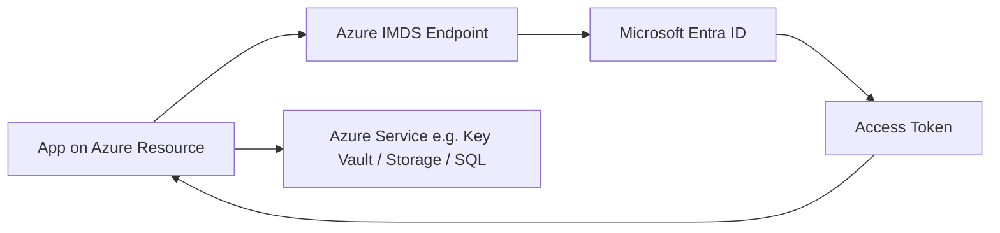
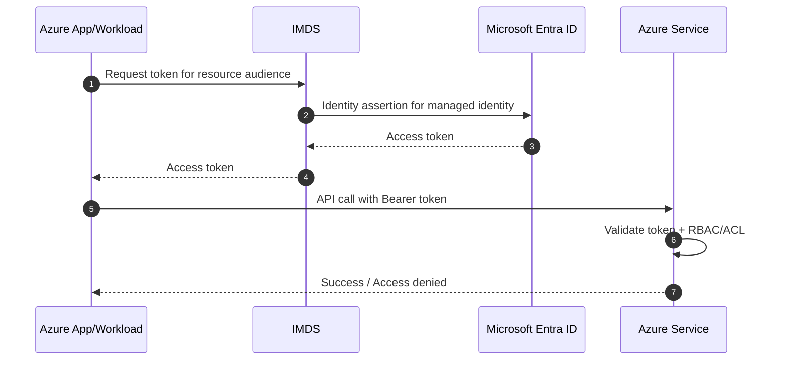
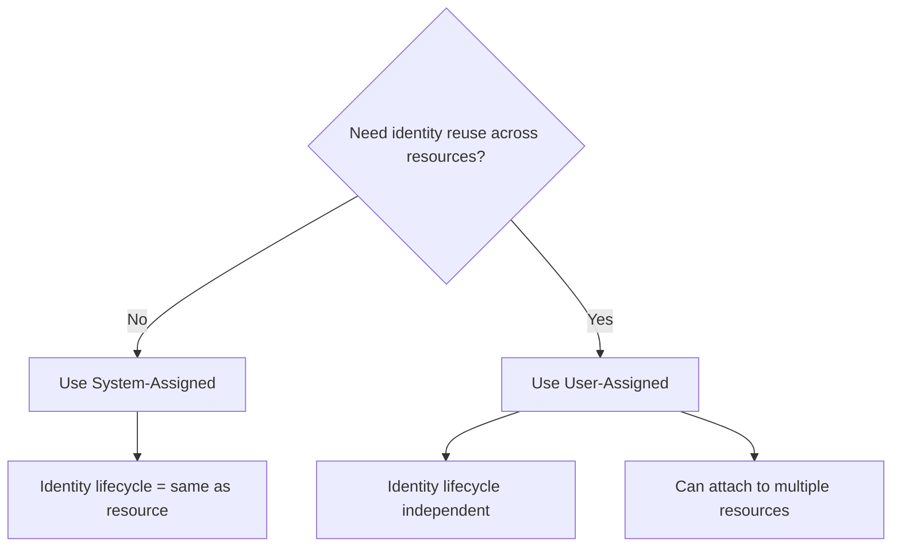
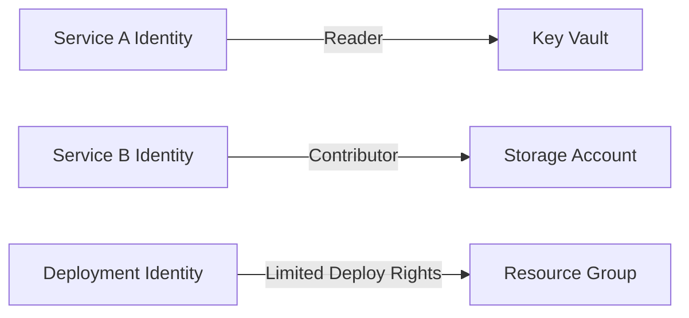

# Managed Identity (MSI) on Azure — Beginner to Advanced

## What is MSI?
Managed Identity (formerly called MSI) is an Azure feature that gives Azure resources an automatically managed identity in Microsoft Entra ID.

With this identity, your app or service can authenticate to Azure services **without storing secrets** in code, config, or pipelines.

---

## Why use Managed Identity?
- No client secret/password in source code
- No secret rotation burden
- Tight integration with Azure RBAC
- Better auditability for resource access

---

## Identity Types

| Type | Scope | Typical Use |
| --- | --- | --- |
| System-assigned managed identity | Tied to one Azure resource lifecycle | Best default for single app/resource |
| User-assigned managed identity | Independent Azure resource, reusable | Shared identity across multiple resources |

---

## Beginner Mental Model
1. Azure resource gets an identity.
2. That identity gets permissions (RBAC).
3. App requests token from Azure Instance Metadata Service (IMDS).
4. App calls target Azure service with token.

No static secret is needed.

---

## Architecture Overview



---

## Token Retrieval and Access Flow



---

## System-Assigned vs User-Assigned Flow



---

## Setup Steps (Conceptual)

## 1) Enable managed identity
- Enable identity on the Azure resource (VM, App Service, Function, Container App, etc.).
- Choose system-assigned or attach user-assigned identity.

## 2) Grant permissions
- Assign RBAC role to the managed identity at minimal required scope.
- Prefer resource-level or resource-group-level scope over subscription-wide permissions.

## 3) Request token in app runtime
- Request access token for target service audience.
- Use token in SDK/API call.

## 4) Call target Azure service
- Example targets: Key Vault, Storage, SQL, Service Bus, ARM APIs.

---

## What to Validate

- Managed identity is enabled on workload
- Correct identity type is attached
- RBAC role exists at expected scope
- Token audience matches target service
- API call succeeds for allowed operation
- Unauthorized operation fails as expected

---

## Step-by-Step: Test This in Azure

### Prerequisites
- Azure CLI authenticated
- A resource group (e.g. `rg-msi-test`)
- Permissions to create VMs or App Service plans

### Step 1 — Create a VM with system-assigned managed identity
```bash
az group create --name rg-msi-test --location eastus

az vm create \
  --resource-group rg-msi-test \
  --name msi-test-vm \
  --image Ubuntu2204 \
  --assign-identity \
  --admin-username azureuser \
  --generate-ssh-keys \
  --size Standard_B1s
```
**Verify:** Output includes `"identity": {"type": "SystemAssigned", "principalId": "<guid>"}` — the GUID is the MI object ID.

### Step 2 — Assign a Reader role to the managed identity
```bash
MI_PRINCIPAL_ID=$(az vm show \
  --resource-group rg-msi-test \
  --name msi-test-vm \
  --query identity.principalId -o tsv)

SUBSCRIPTION_ID=$(az account show --query id -o tsv)

az role assignment create \
  --assignee $MI_PRINCIPAL_ID \
  --role "Reader" \
  --scope "/subscriptions/$SUBSCRIPTION_ID"
```
**Verify:** Assignment created with `principalType: ServicePrincipal`.

### Step 3 — SSH into the VM and fetch an identity token
```bash
# Get VM's public IP
VM_IP=$(az vm show -d -g rg-msi-test -n msi-test-vm --query publicIps -o tsv)
ssh azureuser@$VM_IP

# Inside the VM — call IMDS (Instance Metadata Service) endpoint
curl -s -H "Metadata: true" \
  "http://169.254.169.254/metadata/identity/oauth2/token?api-version=2018-02-01&resource=https://management.azure.com/"
```
**Verify:** Response contains `access_token` and `expires_on`. No credentials used.

### Step 4 — Use the token to call Azure Resource Manager
```bash
# Still inside the VM
SUBSCRIPTION_ID=<your-subscription-id>

TOKEN=$(curl -s -H "Metadata: true" \
  "http://169.254.169.254/metadata/identity/oauth2/token?api-version=2018-02-01&resource=https://management.azure.com/" \
  | python3 -c "import sys,json; print(json.load(sys.stdin)['access_token'])")

curl -s \
  -H "Authorization: Bearer $TOKEN" \
  "https://management.azure.com/subscriptions/$SUBSCRIPTION_ID/resourcegroups?api-version=2021-04-01" \
  | python3 -m json.tool | head -30
```
**Verify:** Resource groups returned in JSON — no password or secret used anywhere.

### Step 5 — Negative test: wrong audience
```bash
# Request token for wrong audience (Key Vault instead of ARM)
curl -s -H "Metadata: true" \
  "http://169.254.169.254/metadata/identity/oauth2/token?api-version=2018-02-01&resource=https://vault.azure.net"

# Try using it to call ARM — should fail
TOKEN_KV=<access_token from above>
curl -s \
  -H "Authorization: Bearer $TOKEN_KV" \
  "https://management.azure.com/subscriptions/$SUBSCRIPTION_ID/resourcegroups?api-version=2021-04-01"
```
**Verify:** ARM returns `401 Unauthorized` — audience mismatch.

### Step 6 — Negative test: insufficient permissions
```bash
# Remove Reader role from the MI
az role assignment delete \
  --assignee $MI_PRINCIPAL_ID \
  --role "Reader" \
  --scope "/subscriptions/$SUBSCRIPTION_ID"

# Wait ~30 seconds for propagation, then retry inside VM
curl -s \
  -H "Authorization: Bearer $TOKEN" \
  "https://management.azure.com/subscriptions/$SUBSCRIPTION_ID/resourcegroups?api-version=2021-04-01"
```
**Verify:** Returns `403 Forbidden` — token still valid but no authorization.

### Step 7 — Test user-assigned managed identity (bonus)
```bash
# Create user-assigned identity
az identity create --name msi-user-assigned --resource-group rg-msi-test
UAMI_ID=$(az identity show -g rg-msi-test -n msi-user-assigned --query id -o tsv)
UAMI_PRINCIPAL=$(az identity show -g rg-msi-test -n msi-user-assigned --query principalId -o tsv)

# Assign it to the VM alongside the system-assigned one
az vm identity assign \
  --resource-group rg-msi-test \
  --name msi-test-vm \
  --identities $UAMI_ID

# Grant Reader role
az role assignment create \
  --assignee $UAMI_PRINCIPAL \
  --role "Reader" \
  --scope "/subscriptions/$SUBSCRIPTION_ID"
```
**Verify:** VM now has both system-assigned and user-assigned identities.

### Step 8 — Clean up
```bash
az group delete --name rg-msi-test --yes --no-wait
```

### What to Confirm End-to-End
| Check | Expected |
|---|---|
| IMDS endpoint returns token | Yes |
| Token has no credentials in request | Yes |
| ARM call with valid token succeeds | Yes |
| Wrong audience → 401 | Yes |
| Removed role → 403 | Yes |
| User-assigned MI can coexist with system-assigned | Yes |

---

## How to Test (Beginner Friendly)

## Test A: Authentication works
- Run workload with managed identity enabled.
- Request token for target service.
- Expected: token is issued.

## Test B: Authorization works
- Perform allowed read operation.
- Expected: success.

## Test C: Missing permissions
- Remove/limit role and run same operation.
- Expected: auth token may still be issued, but service call fails with authorization error.

## Test D: Wrong audience
- Request token for wrong resource audience and call service.
- Expected: token rejected by target service.

## Test E: Least privilege check
- Ensure write/delete operation fails when identity has read-only role.
- Expected: denied.

---

## Common Errors and Fixes

| Symptom | Likely Cause | Fix |
| --- | --- | --- |
| Token request fails | Identity not enabled/attached | Enable or reattach managed identity |
| Token obtained but API call denied | RBAC missing/incorrect scope | Grant required role at correct scope |
| Intermittent authorization issues | Role propagation delay | Wait and retry after propagation |
| Access denied for specific operation | Role too narrow | Add minimum extra role needed |
| Wrong service token usage | Audience mismatch | Request token for correct audience |

---

## Security Best Practices

- Use managed identity instead of embedded credentials
- Apply least privilege RBAC
- Separate identities by environment (dev/test/prod)
- Monitor sign-ins and resource access logs
- Prefer system-assigned identity unless reuse is needed
- Avoid over-broad role assignments (like wide subscription permissions)

---

## Advanced Design Patterns

## Pattern 1: Per-service identity isolation
Give each app/service its own identity to reduce blast radius.

## Pattern 2: User-assigned identity for shared platform component
Use one user-assigned identity only when multiple workloads genuinely need same access profile.

## Pattern 3: Read vs Write identity split
Use separate identities for read-only operations and deployment/write operations.



---

## MSI vs Secret-Based Credentials

| Approach | Credential Storage | Rotation Effort | Risk if Leaked |
| --- | --- | --- | --- |
| Client secret/certificate in app | Required | Medium/High | High |
| Managed Identity | Not required in app code | Low | Lower |

---

## Summary
Managed Identity (MSI) is the recommended Azure-native way to authenticate workloads to Azure services without storing secrets. Start with system-assigned identity, grant minimal RBAC permissions, validate token audience and authorization behavior, and scale to advanced identity patterns only when needed.
