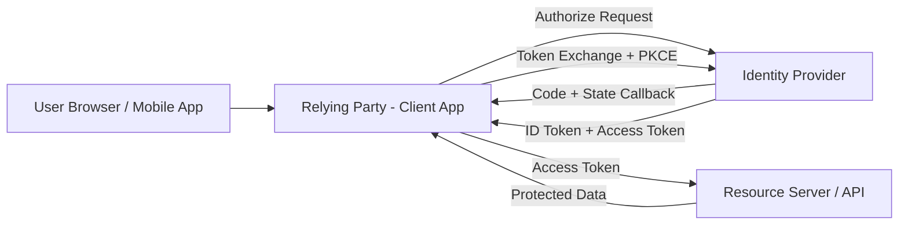
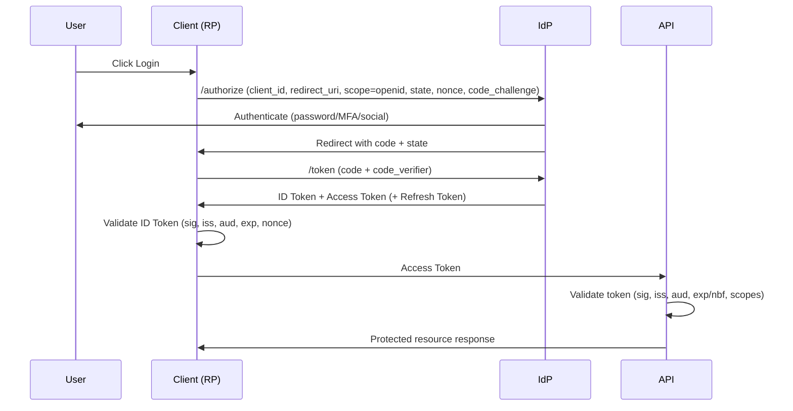
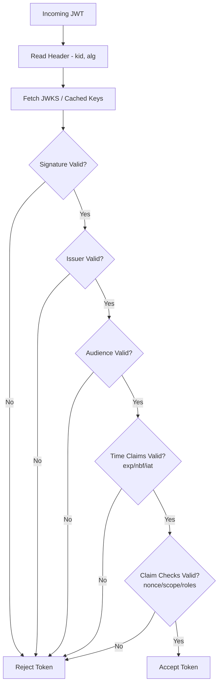
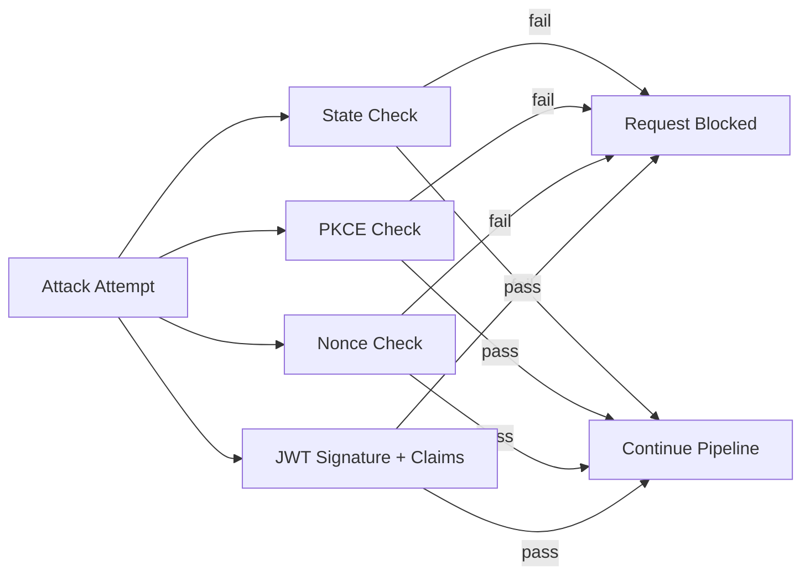

# OIDC Simplified

## Overview
OpenID Connect (OIDC) is an identity layer built on top of OAuth 2.0.

- OAuth 2.0 answers: **What can this app access?**
- OIDC answers: **Who is the user?**

OIDC is used for SSO, web/mobile login, and API identity propagation.

---

## OIDC vs OAuth 2.0

| Topic | OAuth 2.0 | OIDC |
| --- | --- | --- |
| Primary purpose | Authorization | Authentication + Authorization |
| Main token | Access Token | ID Token (+ Access Token) |
| User identity claims | Not standardized | Standard claims (`sub`, `email`, `name`, etc.) |
| Typical scope | API access scopes | `openid` plus identity scopes (`profile`, `email`) |

---

## Recommended Flow
Use **Authorization Code Flow with PKCE**.

- Recommended for web, SPA, and mobile apps
- Avoids exposing tokens in browser URL
- Protects authorization code exchange from interception/replay

Deprecated in modern setups:
- Implicit Flow
- Hybrid Flow

---

## Core Participants

| Participant | Role |
| --- | --- |
| User | Signs in and grants consent |
| Client (Relying Party / RP) | Initiates login and validates tokens |
| Identity Provider (IdP / Authorization Server) | Authenticates user, issues tokens |
| Resource Server (API) | Validates access token and enforces scopes/claims |

## OIDC Architecture View

---

## End-to-End Flow (Step-by-Step)

---

## Token Types

### ID Token
Represents authentication result and user identity.

Common claims:
- `iss` (issuer)
- `sub` (subject/user id)
- `aud` (intended client)
- `exp`, `iat`, optional `nbf`
- `nonce`
- profile/email claims depending on scopes

### Access Token
Used to call APIs. API validates signature and authorization claims/scopes.

### Refresh Token (optional)
Used to get new access tokens without re-authentication.

---

## Security Controls (Defense in Depth)

### 1) `state`
- Binds auth response to the originating browser session
- Mitigates CSRF and redirect replay/mix-up attacks

### 2) PKCE (`code_challenge` / `code_verifier`)
- Prevents stolen authorization code from being exchanged by attacker
- IdP verifies that `SHA256(code_verifier)` matches stored challenge

### 3) `nonce`
- Binds ID token to the active authentication request/session
- Mitigates ID token replay/injection

### 4) Strict `redirect_uri` validation
- Prevents open redirect/code leakage to attacker endpoints

### 5) Signature + claim validation
- Validate token signature using JWKS
- Validate `iss`, `aud`, `exp` (and `nbf` if present)

### 6) API-side authorization checks
- Validate scopes/roles/claims before serving resource

---

## JWKS in OIDC
JWKS is a set of public keys exposed by the IdP.

- Client/API fetches key set
- Selects correct key by `kid`
- Verifies JWT signature
- Rejects token if signature/key/claims are invalid

---

## What Must Be Validated

### In Client (for ID Token)
- Signature valid
- `iss` is trusted
- `aud` matches this client
- `exp` still valid
- `nonce` matches stored session nonce
- `state` check already passed during callback

### In API (for Access Token)
- Signature valid
- `iss` trusted
- `aud` matches API identifier
- `exp` and optional `nbf` valid
- Required scopes/roles present

## Token Validation Pipeline

---

## Threat-to-Control Mapping

| Threat | Primary Control | Where Enforced |
| --- | --- | --- |
| CSRF / callback replay | `state` | Client callback handler |
| Authorization code interception | PKCE (`code_verifier`) | Token endpoint at IdP |
| ID token replay/injection | `nonce` | Client ID token validation |
| Forged token | Signature verification via JWKS | Client/API |
| Token confusion (wrong target) | `aud` validation | Client/API |
| Token from untrusted IdP | `iss` validation | Client/API |
| Privilege abuse | Scope/role checks | API authorization layer |

---

## Azure AD / Entra ID Notes

For Azure-hosted applications, keep the following configuration aligned:

- Register the app and set exact redirect URIs (no wildcard for production).
- Use Authorization Code + PKCE for web/mobile public clients.
- Configure API app registration with exposed scopes.
- Validate `iss` against your tenant endpoint and `aud` against your app/API id.
- Prefer groups/roles/scopes in tokens for API authorization decisions.
- Rotate secrets/certificates and monitor sign-in/token logs.

---

---

## How to Test OIDC (Practical Checklist)

## 1. Positive Path (happy flow)
1. Start login from app.
2. Confirm auth request includes: `state`, `nonce`, `code_challenge`, `scope=openid`.
3. Complete login.
4. Confirm callback contains `code` and same `state`.
5. Exchange code with `code_verifier` at token endpoint.
6. Validate ID token and call API with access token.
7. Expected: login success, API access allowed.

## 2. Negative Security Tests

### A) State mismatch test
- Change callback `state` value before processing.
- Expected: client rejects response.

### B) PKCE mismatch test
- Send wrong `code_verifier` during token exchange.
- Expected: token endpoint rejects request.

### C) Nonce mismatch test
- Tamper stored nonce or use token from old session.
- Expected: ID token validation fails.

### D) Issuer mismatch test
- Validate token against wrong issuer.
- Expected: token rejected.

### E) Audience mismatch test
- Use token issued for a different client/API.
- Expected: token rejected.

### F) Expired token test
- Replay expired token.
- Expected: rejected on validation.

### G) Scope enforcement test
- Call protected API operation without required scope.
- Expected: `403 Forbidden` (or policy equivalent).

## 3. API Authorization Tests
- Token with correct scope: allowed.
- Token missing scope: denied.
- Token with wrong audience: denied.
- Tampered token payload: denied (signature fails).

## 4. Operational Verification
- Enable auth logs in client and API.
- Verify failed checks are logged with reason (`state`, `nonce`, `aud`, etc.).
- Ensure no tokens are logged in plaintext.

## 5. Session & Logout Tests
- Verify session timeout behavior in client.
- Test logout from app and ensure local session is cleared.
- Test sign-out at IdP and ensure silent re-login does not happen unexpectedly.
- If refresh token is used, verify token revocation/logout invalidates refresh path.

## 6. Key Rotation / JWKS Resilience Tests
- Rotate signing key at IdP (or simulate new `kid`).
- Ensure API/client can fetch updated JWKS and continue validation.
- Verify stale key cache causes temporary failure and recovers after refresh.

---

## Minimal Test Matrix

| Test Case | Expected Result |
| --- | --- |
| Valid login with PKCE | Success |
| `state` mismatch | Reject callback |
| Wrong `code_verifier` | Token exchange fails |
| `nonce` mismatch | ID token rejected |
| Expired token | Rejected |
| Wrong `aud` | Rejected |
| Missing scope on API call | Access denied |

---

## Common Mistakes to Avoid
- Skipping `state` validation
- Not using PKCE for public clients
- Accepting ID token without checking `aud` and `nonce`
- Using access token as proof of user identity
- Not validating access token in API
- Logging raw tokens in application logs
- Allowing broad redirect URIs in production
- Not handling signing key rotation (`kid` changes)
- Treating scopes as optional in API enforcement

---

## Summary
OIDC adds a secure identity layer to OAuth 2.0. A robust implementation requires:
- Authorization Code + PKCE
- strong `state`, `nonce`, and signature validation
- strict issuer/audience/time checks
- API-side scope and claim enforcement

When these are implemented together, OIDC provides secure, interoperable authentication for modern applications.
