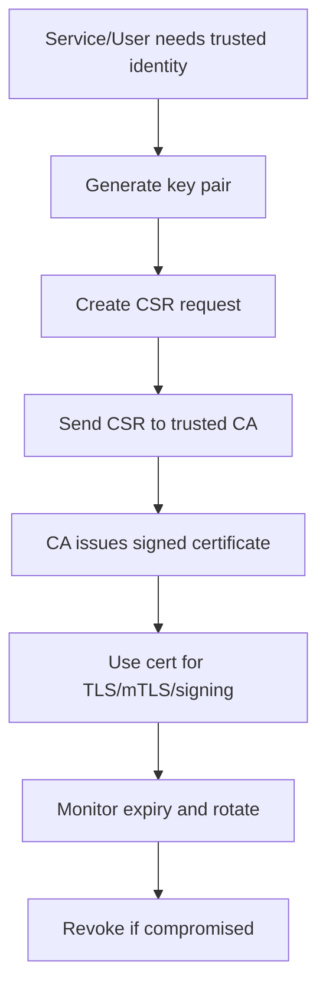
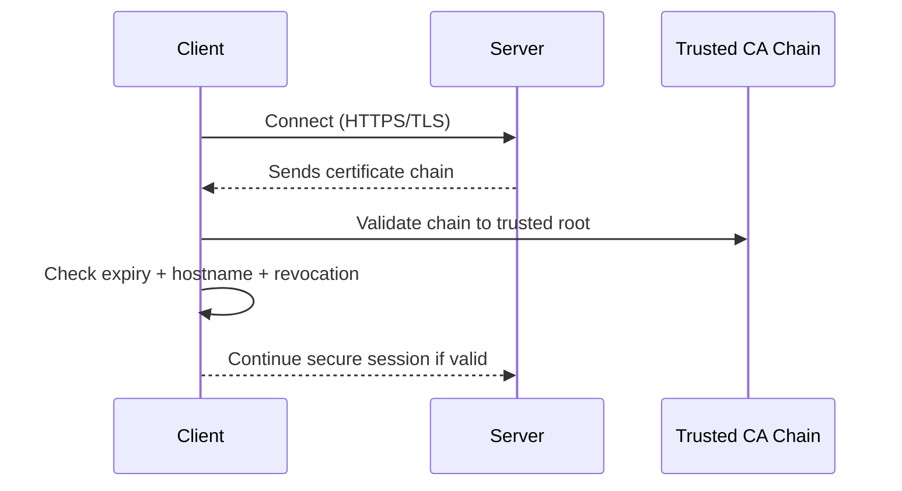
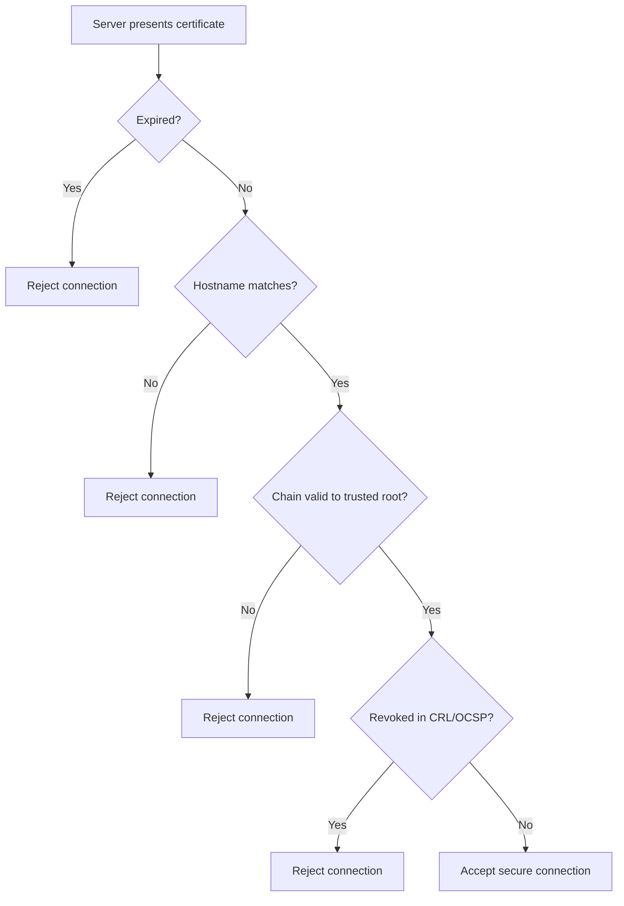
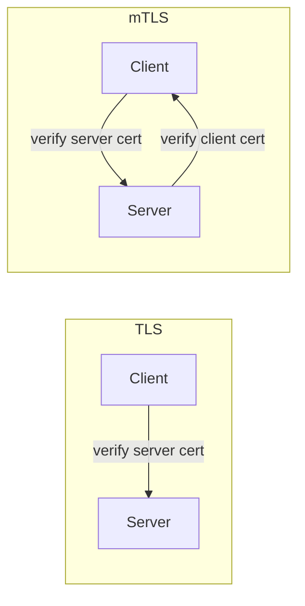
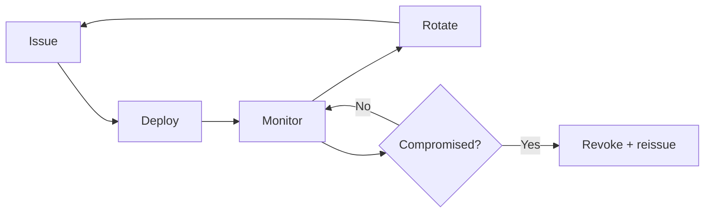
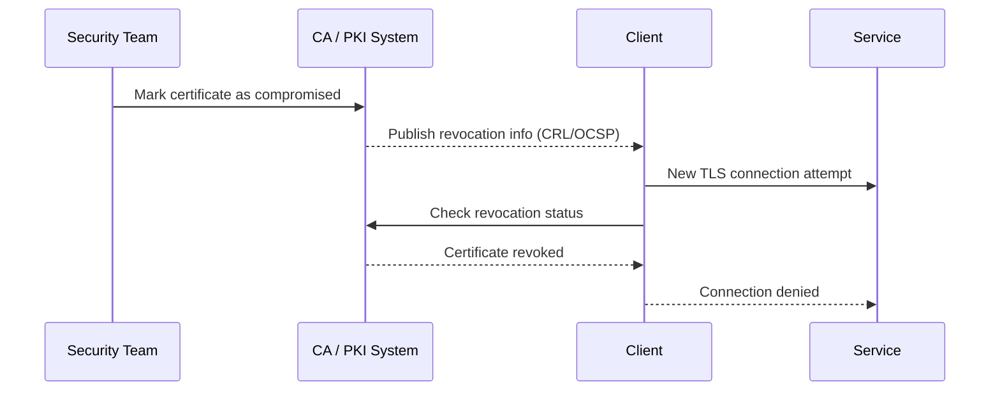

# PKI Basics (Public Key Infrastructure) — Simple Guide

## What is it?
PKI is a trust system that uses:
- a **public key** (shareable)
- a **private key** (secret)
- a **certificate** (digital identity card)
- a **Certificate Authority (CA)** (trusted issuer)

In simple words:
- Certificate = “Who I am” proof
- Private key = “I can prove it is really me” secret
- CA = “Trusted office that signs identity cards”

---

## What is it used for?
PKI is used for:
- HTTPS/TLS website encryption
- service-to-service trust (mTLS)
- signing code/documents
- client certificate authentication
- rotating and revoking trust safely

In Azure and cloud systems, PKI helps secure traffic and identity between apps, users, and services.

---

## Why is it important?
Without PKI:
- attackers can impersonate services
- traffic can be intercepted (man-in-the-middle)
- you cannot prove who signed/issued identities

With PKI:
- encrypted communication is trusted
- identity is verifiable
- expired/compromised certs can be revoked and replaced

---

## Workflow



---

## Core PKI components (easy meaning)

| Component | Simple meaning |
|---|---|
| Public key | Lock that anyone can use to encrypt for you |
| Private key | Secret key only you hold to decrypt/sign |
| Certificate | Identity card linking public key to subject |
| CA | Trusted authority that signs certificates |
| Root CA | Top trust anchor |
| Intermediate CA | Delegated signer from root |
| CRL / OCSP | “Is this certificate still valid?” check |

---

## Trust chain (who trusts whom)

```mermaid
flowchart TD
  ROOT[Root CA\n(ultimate trust anchor)] --> INT[Intermediate CA\n(signs end-entity certs)]
  INT --> SRV[Server Certificate\nfor api.contoso.com]
  SRV --> CLIENT[Client validates full chain]

  CLIENT --> CHECK1{Root trusted locally?}
  CHECK1 -->|No| FAIL1[Trust fails]
  CHECK1 -->|Yes| CHECK2{Chain signature valid?}
  CHECK2 -->|No| FAIL2[Trust fails]
  CHECK2 -->|Yes| OK[Trust succeeds]
```

Simple rule: if any link in the chain is invalid, trust is rejected.

---

## How certificate trust works



If validation fails, connection is rejected.

---

## TLS certificate validation decision flow



---

## TLS vs mTLS (simple)

### TLS (one-way trust)
- Client verifies server certificate
- Common for browser to website

### mTLS (two-way trust)
- Client verifies server certificate
- Server also verifies client certificate
- Common for internal service-to-service security



---

    ## TLS (in more detail, simple words)

    TLS protects data in transit and confirms server identity.

    ### TLS handshake (simplified)
    1. Client starts secure connection request
    2. Server sends certificate chain
    3. Client validates cert (hostname, expiry, chain, revocation)
    4. Both agree encryption parameters and session keys
    5. Encrypted application traffic starts

    ```mermaid
    sequenceDiagram
      participant C as Client
      participant S as Server

      C->>S: ClientHello (supported ciphers, TLS version)
      S-->>C: ServerHello + Certificate
      C->>C: Validate server cert
      C->>S: Key exchange finished
      S-->>C: Handshake complete
      C->>S: Encrypted data
    ```

    ### Where TLS is used
    - Browser to website/API
    - App to public HTTPS endpoints
    - Ingress TLS termination at edge

    ### TLS benefits
    - Confidentiality (encryption)
    - Integrity (tamper detection)
    - Server authentication

    ### TLS limitation
    TLS alone does not prove client identity strongly (unless additional auth is used).

    ---

    ## mTLS (in more detail, simple words)

    mTLS adds client certificate authentication to TLS. So both sides prove identity.

    ### mTLS handshake (simplified)
    1. Client and server exchange hello messages
    2. Server sends certificate (client verifies)
    3. Server requests client certificate
    4. Client sends certificate (server verifies)
    5. Secure channel continues only if both validations pass

    ```mermaid
    sequenceDiagram
      participant C as Client Service
      participant S as Server Service

      C->>S: ClientHello
      S-->>C: ServerHello + Server Certificate
      C->>C: Verify server certificate
      S-->>C: Request client certificate
      C->>S: Client Certificate + proof
      S->>S: Verify client certificate
      S-->>C: Handshake complete (if valid)
      C->>S: Encrypted and mutually trusted traffic
    ```

    ### Where mTLS is used
    - Service-to-service traffic inside zero-trust architectures
    - Service mesh environments (Istio/Linkerd)
    - High-security B2B API integration

    ### mTLS benefits
    - Strong service identity on both ends
    - Better lateral movement protection
    - Fine-grained policy by certificate identity

    ### mTLS trade-off
    Certificate issuance/rotation and trust distribution are operationally heavier than plain TLS.

    ---

    ## TLS vs mTLS quick decision guide

    | Scenario | Better fit |
    |---|---|
    | Public website or public API | TLS |
    | Internal service-to-service with zero-trust | mTLS |
    | Need to authenticate calling service by certificate | mTLS |
    | Simple encryption with token-based app auth | TLS |

    ```mermaid
    flowchart TD
      START[Need encrypted connection] --> Q1{Need client identity at transport layer?}
      Q1 -->|No| TLS[Use TLS]
      Q1 -->|Yes| MTLS[Use mTLS]
      MTLS --> OPS{Can you manage cert lifecycle?}
      OPS -->|No| PLAN[Implement cert automation first]
      OPS -->|Yes| GO[Roll out mTLS]
    ```

    ---

    ## Azure practical mapping: TLS and mTLS

    ### TLS common placements in Azure
    - Front Door / Application Gateway for edge TLS termination
    - App Service custom domains with HTTPS
    - AKS ingress with TLS certs

    ### mTLS common placements in Azure
    - API Management inbound mTLS for client cert auth
    - App Gateway/App Service client-certificate validation patterns
    - AKS service mesh/internal API trust

    ### What to check in production
    - cert expiry alerting exists
    - strong TLS versions/cipher policy configured
    - client cert requirement enabled where mTLS is expected
    - certificate rotation runbook tested

    ---

## End-to-end Azure PKI view (simple architecture)

```mermaid
flowchart LR
  USER[User/Client] --> EDGE[Application Gateway / Front Door\nTLS termination]
  EDGE --> APP[App Service / AKS Ingress]
  APP --> SVC[Internal services]\n
  KV[Azure Key Vault\nCertificates + Key material] --> EDGE
  KV --> APP
  KV --> SVC
```

This shows where certificates are usually stored and consumed in Azure.

---

## Certificate lifecycle (important)

1. Issue certificate
2. Deploy certificate
3. Monitor expiry
4. Rotate before expiry
5. Revoke if key is compromised
6. Audit trust chain changes



---

## Revocation flow (when certificate is compromised)



---

## PKI in Azure (practical view)

Typical services and roles:
- **Azure Key Vault**: store certificates and keys securely
- **Application Gateway / Front Door**: TLS termination using certificates
- **AKS + ingress/service mesh**: internal mTLS patterns
- **App Service / API platforms**: TLS endpoints and optional client cert auth

---

## Azure Portal checks

1. Go to **Key Vault** -> **Certificates**
2. Check certificate:
   - expiry date
   - issuer
   - version history
3. Verify where cert is used (App Gateway, App Service, ingress)
4. Confirm rotation policy or reminder alerts exist

---

## Azure CLI checks (placeholders only)

```bash
# List certs in a vault
az keyvault certificate list --vault-name <vault-name> -o table

# Get certificate policy/details
az keyvault certificate show --vault-name <vault-name> --name <cert-name> -o jsonc

# List versions
az keyvault certificate list-versions --vault-name <vault-name> --name <cert-name> -o table
```

---

## Common mistakes

- Storing private keys in plain files or repos
- Using very long certificate validity with no rotation plan
- Ignoring revocation checks
- Reusing one certificate for too many unrelated systems
- No expiry alerting

---

## Quick memory trick

Think PKI as passport system:
- CA = passport office
- certificate = passport
- private key = your signature secret
- revocation list = canceled passport database

If passport or signature is invalid, trust is denied.

---

## Summary

| Question | Short answer |
|---|---|
| What is PKI? | Digital trust model using keys + certificates + CA |
| Why needed? | Secure identity and encrypted trusted communication |
| Where used? | HTTPS, mTLS, code signing, cloud identity trust |
| Most important practice? | Protect private keys and rotate certificates early |
