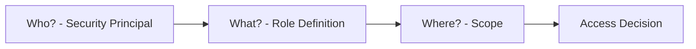
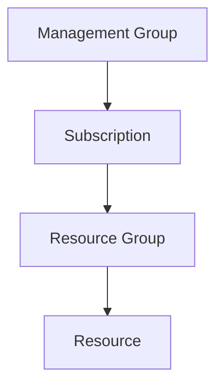
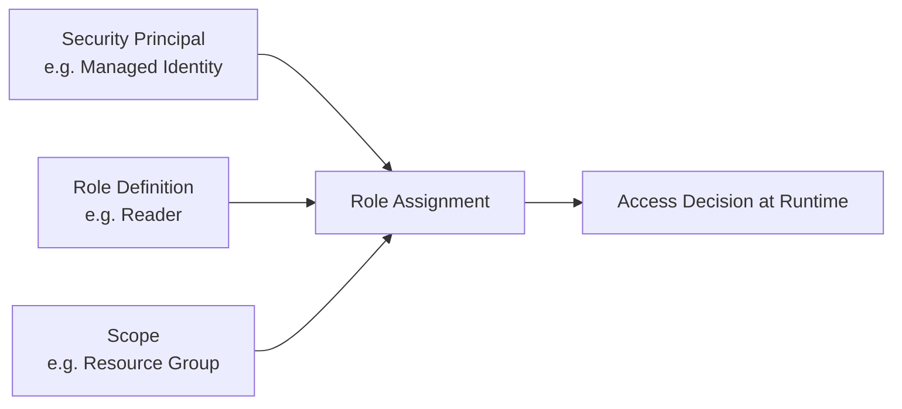
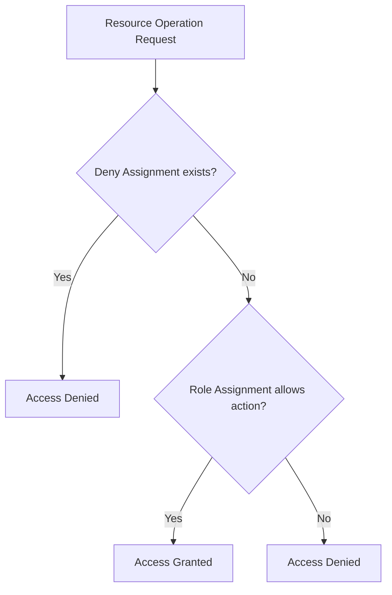
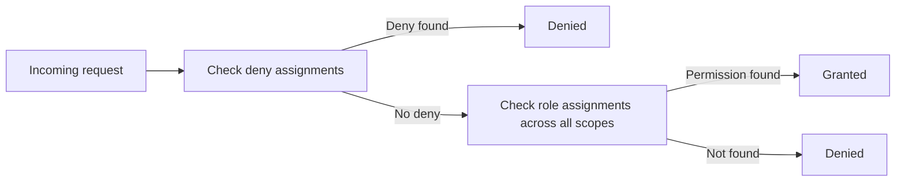
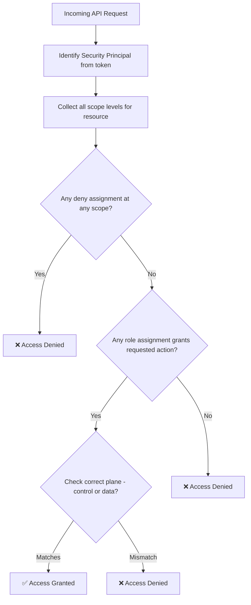
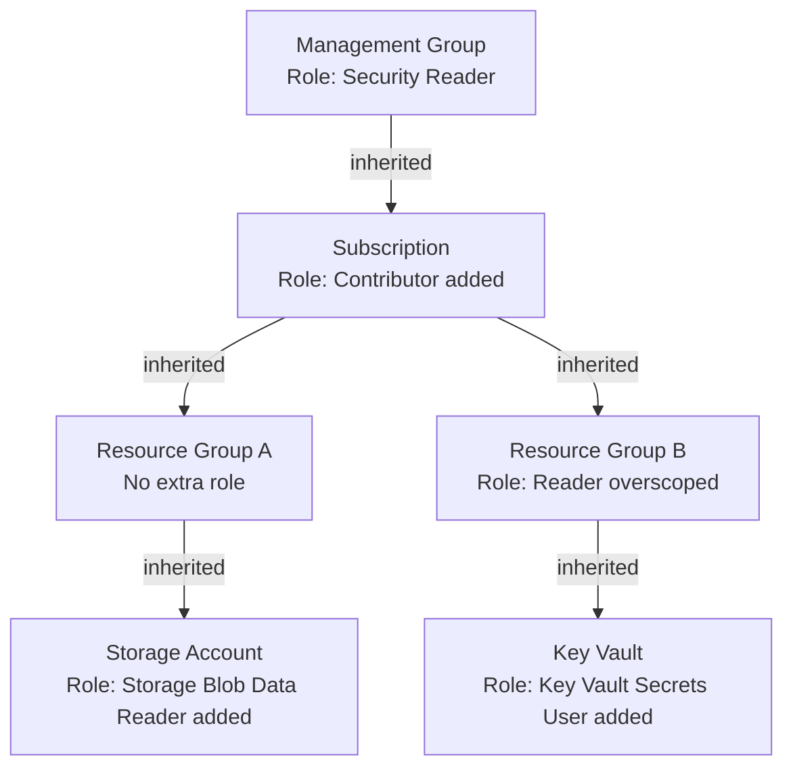
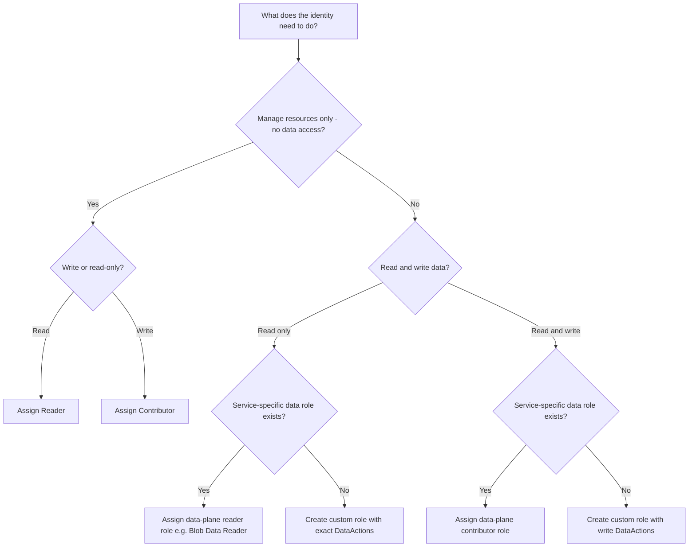
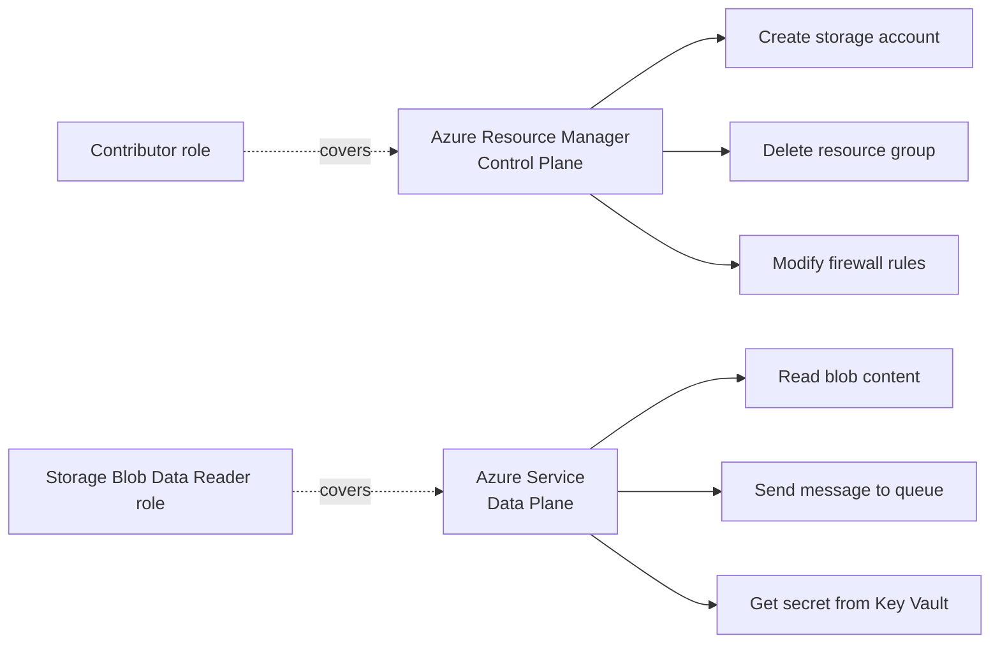

# Azure RBAC Deep Dive

## What is Azure RBAC?
Azure Role-Based Access Control (RBAC) is the authorization system that controls who can do what on which Azure resources.

Every operation on an Azure resource is governed by RBAC.

---

## The Three Questions RBAC Answers



---

## Core Concepts

| Concept | Meaning |
| --- | --- |
| Security Principal | Who: user, group, service principal, managed identity |
| Role Definition | What: set of allowed and denied actions |
| Scope | Where: management group, subscription, resource group, resource |
| Role Assignment | Binding of principal + role + scope |

---

## Scope Hierarchy



Permissions assigned at a higher scope are inherited by lower scopes. A role assigned at subscription level applies to all resource groups and resources within it.

---

## Role Assignment Structure



---

## Common Built-In Roles

| Role | Can Read | Can Write | Can Delete | Can Manage Access |
| --- | --- | --- | --- | --- |
| Owner | ✅ | ✅ | ✅ | ✅ |
| Contributor | ✅ | ✅ | ✅ | ❌ |
| Reader | ✅ | ❌ | ❌ | ❌ |
| User Access Administrator | ✅ | ❌ | ❌ | ✅ |

Beyond these, Azure has 100+ service-specific built-in roles (e.g. Storage Blob Data Reader, Key Vault Secrets User).

---

## Custom Roles

When built-in roles are too broad or too narrow, custom roles let you define exact permissions.

A custom role specifies:
- `Actions` — allowed control-plane operations
- `NotActions` — excluded from allowed
- `DataActions` — allowed data-plane operations
- `NotDataActions` — excluded data-plane
- `AssignableScopes` — where the role can be used

---

## Allow vs Deny

- RBAC is additive by default (sum of allowed actions across all assignments)
- **Deny assignments** explicitly block actions, even if a role allows them
- Deny assignments take precedence over role assignments



---

## Control Plane vs Data Plane

| Plane | What it controls | Example |
| --- | --- | --- |
| Control plane | Azure Resource Manager operations (manage resources) | Create/delete storage account |
| Data plane | Operations on data inside the resource | Read/write blobs in storage |

Some roles cover control plane only, some data plane only, and some both. Always check which plane a role operates on.

---

## Role Assignment Evaluation Order



---

## Least Privilege Principle

- Only assign the role that is actually needed
- Assign at the narrowest scope possible
- Prefer data-plane roles over broad control-plane roles for app access
- Review and clean up stale role assignments regularly

---

## Practical Checklist

- Role is assigned to the correct security principal
- Scope is at minimum required level
- Role covers required data-plane and/or control-plane actions
- No over-broad built-in role used when a narrower one exists
- Stale assignments are removed on identity lifecycle changes

---

## Full RBAC Runtime Evaluation Workflow



---

## Scope Inheritance in Practice



---

## Role Selection Decision Tree



---

## Control Plane vs Data Plane Visual



---

## Step-by-Step: Test This in Azure

### Prerequisites
- Azure CLI authenticated
- At least one resource group available

### Step 1 — List built-in role definitions
```bash
# View all built-in roles
az role definition list --query "[?roleType=='BuiltInRole'].{Name:roleName, Description:description}" -o table | head -30

# Inspect a specific role in detail
az role definition list --name "Reader" --query "[0].permissions" -o json
```
**Verify:** Reader role shows `actions: ["*/read"]` and no `notActions` that restrict it further.

### Step 2 — List role assignments at subscription scope
```bash
SUBSCRIPTION_ID=$(az account show --query id -o tsv)

az role assignment list \
  --scope "/subscriptions/$SUBSCRIPTION_ID" \
  --query "[].{Principal:principalName, Role:roleDefinitionName, Scope:scope}" \
  -o table
```
**Verify:** You see your own account listed with `Owner` or `Contributor`.

### Step 3 — List role assignments at resource group scope
```bash
RG_NAME=<your-resource-group>

az role assignment list \
  --resource-group $RG_NAME \
  --query "[].{Principal:principalName, Role:roleDefinitionName, Scope:scope}" \
  -o table
```
**Verify:** Assignments scoped to the RG appear, and inherited ones from subscription are not shown here (they still apply).

### Step 4 — Check effective access for a principal
```bash
# Check what actions a user or SP can perform
SP_OBJECT_ID=<object ID of any principal>

az role assignment list \
  --assignee $SP_OBJECT_ID \
  --all \
  --query "[].{Role:roleDefinitionName, Scope:scope}" \
  -o table
```
**Verify:** All roles across all scopes for that principal are listed.

### Step 5 — Create a custom role definition
```bash
SUBSCRIPTION_ID=$(az account show --query id -o tsv)

cat > /tmp/custom-role.json << EOF
{
  "Name": "Custom Storage Reader",
  "Description": "Can list and read blobs only",
  "Actions": [
    "Microsoft.Storage/storageAccounts/read",
    "Microsoft.Storage/storageAccounts/listKeys/action"
  ],
  "NotActions": [],
  "DataActions": [
    "Microsoft.Storage/storageAccounts/blobServices/containers/blobs/read"
  ],
  "NotDataActions": [],
  "AssignableScopes": [
    "/subscriptions/$SUBSCRIPTION_ID"
  ]
}
EOF

az role definition create --role-definition @/tmp/custom-role.json
```
**Verify:** Custom role created with `roleType: CustomRole`.

### Step 6 — Assign and verify the custom role
```bash
SP_APP_ID=<appId of any SP>

az role assignment create \
  --assignee $SP_APP_ID \
  --role "Custom Storage Reader" \
  --scope "/subscriptions/$SUBSCRIPTION_ID"

# Verify assignment exists
az role assignment list \
  --assignee $SP_APP_ID \
  --query "[].roleDefinitionName" \
  -o table
```
**Verify:** Assignment shows `Custom Storage Reader`.

### Step 7 — Verify scope inheritance (negative test)
```bash
# Grant a role only at resource group level
az role assignment create \
  --assignee $SP_APP_ID \
  --role "Reader" \
  --scope "/subscriptions/$SUBSCRIPTION_ID/resourceGroups/$RG_NAME"

# Try to list resources in a DIFFERENT resource group — should fail
az login --service-principal --username $SP_APP_ID --password <secret> --tenant <tenant>
az resource list --resource-group <other-rg>
```
**Verify:** Access denied for the other resource group — scope isolation confirmed.

### Step 8 — Clean up
```bash
az login  # back to your account
az role assignment delete --assignee $SP_APP_ID --role "Custom Storage Reader" --scope "/subscriptions/$SUBSCRIPTION_ID"
az role definition delete --name "Custom Storage Reader"
```

### What to Confirm End-to-End
| Check | Expected |
|---|---|
| Reader role shows `*/read` actions | Yes |
| Assignment at subscription scope visible | Yes |
| Custom role creation succeeds | Yes |
| Scope isolation: RG role doesn't grant other RG access | Yes |
| Role deletion removes access immediately | Yes |

---

## Summary
Azure RBAC is the foundation of all resource authorization. Understand principals, role definitions, and scope hierarchy first, then apply least privilege, check both planes, and use deny assignments when needed for strict access control.
