# Azure RBAC Deep Dive

## What is Azure RBAC?
Azure Role-Based Access Control (RBAC) is the authorization system that controls who can do what on which Azure resources.

Every operation on an Azure resource is governed by RBAC.

---

## The Three Questions RBAC Answers

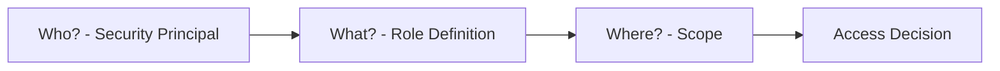

---

## Core Concepts

| Concept | Meaning |
| --- | --- |
| Security Principal | Who: user, group, service principal, managed identity |
| Role Definition | What: set of allowed and denied actions |
| Scope | Where: management group, subscription, resource group, resource |
| Role Assignment | Binding of principal + role + scope |

---

## Scope Hierarchy

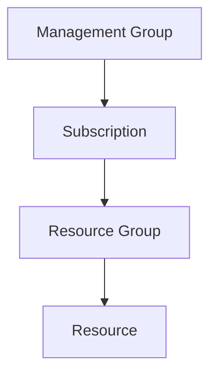

Permissions assigned at a higher scope are inherited by lower scopes. A role assigned at subscription level applies to all resource groups and resources within it.

---

## Role Assignment Structure

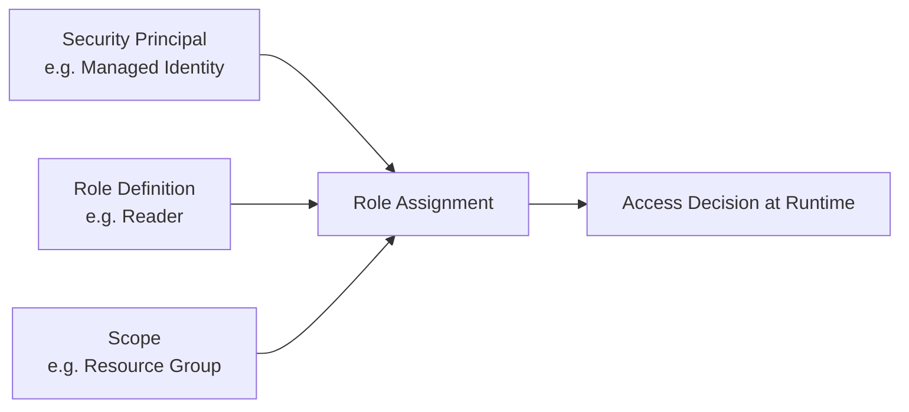

---

## Common Built-In Roles

| Role | Can Read | Can Write | Can Delete | Can Manage Access |
| --- | --- | --- | --- | --- |
| Owner | ✅ | ✅ | ✅ | ✅ |
| Contributor | ✅ | ✅ | ✅ | ❌ |
| Reader | ✅ | ❌ | ❌ | ❌ |
| User Access Administrator | ✅ | ❌ | ❌ | ✅ |

Beyond these, Azure has 100+ service-specific built-in roles (e.g. Storage Blob Data Reader, Key Vault Secrets User).

---

## Custom Roles

When built-in roles are too broad or too narrow, custom roles let you define exact permissions.

A custom role specifies:
- `Actions` — allowed control-plane operations
- `NotActions` — excluded from allowed
- `DataActions` — allowed data-plane operations
- `NotDataActions` — excluded data-plane
- `AssignableScopes` — where the role can be used

---

## Allow vs Deny

- RBAC is additive by default (sum of allowed actions across all assignments)
- **Deny assignments** explicitly block actions, even if a role allows them
- Deny assignments take precedence over role assignments

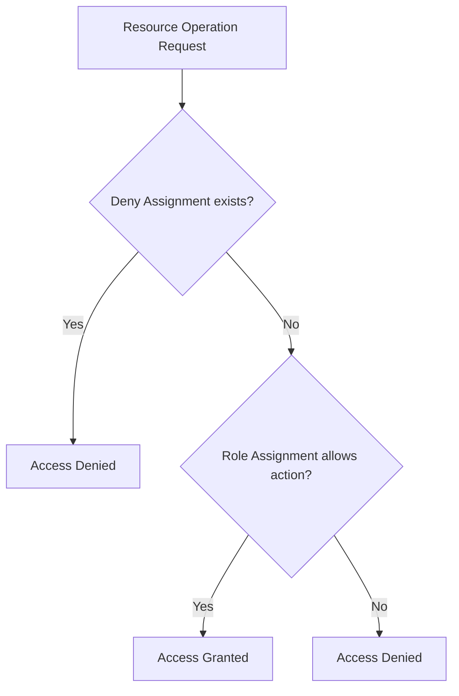

---

## Control Plane vs Data Plane

| Plane | What it controls | Example |
| --- | --- | --- |
| Control plane | Azure Resource Manager operations (manage resources) | Create/delete storage account |
| Data plane | Operations on data inside the resource | Read/write blobs in storage |

Some roles cover control plane only, some data plane only, and some both. Always check which plane a role operates on.

---

## Role Assignment Evaluation Order

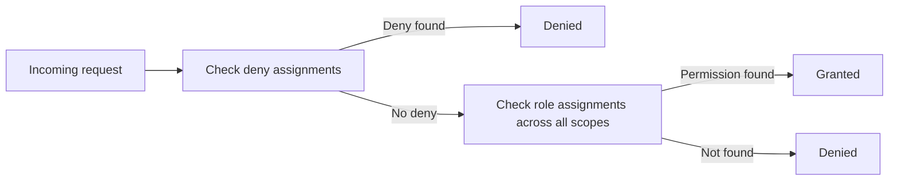

---

## Least Privilege Principle

- Only assign the role that is actually needed
- Assign at the narrowest scope possible
- Prefer data-plane roles over broad control-plane roles for app access
- Review and clean up stale role assignments regularly

---

## What Experienced Azure Engineers Watch For

- **Effective permissions are cumulative** across direct assignments, group-based assignments, inherited assignments, and service-specific authorization layers
- **Control-plane success does not imply data-plane success** — a principal can manage a storage account and still be unable to read blob contents
- **Propagation delay is real** — new assignments can take time to become effective across ARM, portal, CLI, and data services
- **Token freshness matters** — a user or workload may need a fresh token before new permissions show up in practice
- **Group nesting and indirection increase troubleshooting complexity** — always trace the exact principal path that granted access
- **RBAC is only one layer** — network rules, resource locks, Conditional Access, PIM activation, Key Vault permission mode, and service ACLs can still block access

---

## Effective Permissions in the Real World

At runtime, Azure evaluates the principal's **effective permissions**, which can come from multiple places:

| Source of permission | Example | Why it matters |
| --- | --- | --- |
| Direct assignment | User assigned `Reader` on a resource group | Simplest case to verify |
| Group-based assignment | User is in a group assigned `Contributor` | Often forgotten during troubleshooting |
| Inherited assignment | Role assigned at subscription, used at resource scope | Explains permissions that seem to appear indirectly |
| PIM-activated role | User activated `Owner` temporarily | Access may disappear when activation expires |
| Service-local model | SQL, Kubernetes, Key Vault, Storage data RBAC | ARM permissions alone may not be enough |
| Deny assignment | Policy or system-protected resource denies action | Overrides otherwise valid allow permissions |

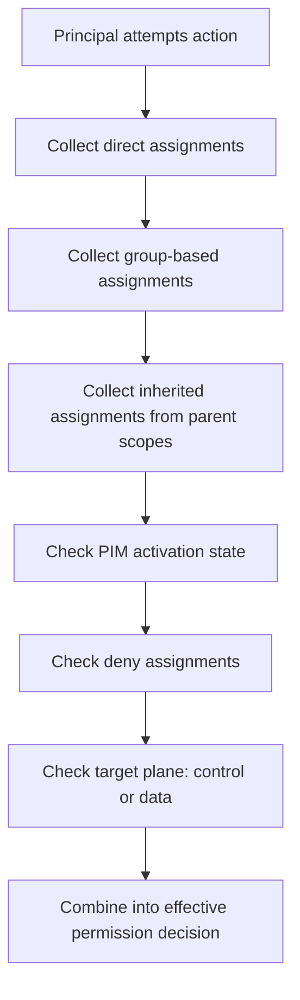

---

## Scope Design Strategy

| Scope | Good use case | Common mistake |
| --- | --- | --- |
| Management Group | Platform governance, security audit roles, policy admins | Giving app identities broad access here |
| Subscription | Central platform teams managing most resources | Assigning app workloads here out of convenience |
| Resource Group | App team boundary, environment boundary | Mixing unrelated apps in one RG and over-sharing access |
| Resource | Break-glass exceptions, highly sensitive resources | Overusing resource-level assignments and creating sprawl |

**Pro rule of thumb:**
- Human admin roles often live at **management group** or **subscription** scope
- Application runtime roles should usually live at **resource group** or **resource** scope
- High-churn workloads should avoid many one-off resource-level assignments unless automation manages them

---

## Built-In Role Selection Patterns

| Scenario | Better role choice | Avoid if possible |
| --- | --- | --- |
| App reads blobs only | `Storage Blob Data Reader` | `Contributor` on storage account |
| App reads secrets only | `Key Vault Secrets User` | `Key Vault Administrator` |
| CI/CD deploys infrastructure | `Contributor` at target RG + `User Access Administrator` only if truly needed | `Owner` by default |
| Security audit team reviews config | `Reader` or `Security Reader` | `Contributor` |
| Ops team manages VMs but not IAM | `Virtual Machine Contributor` | `Owner` |
| Backup operators need recovery actions | Service-specific backup role | Broad subscription contributor |

This is the difference between **functional access** and **minimal blast radius**.

---

## Custom Role Design Guidance

When creating custom roles, experienced teams avoid starting from zero. Instead they:

1. Start from the closest built-in role
2. Observe the exact failing operation in Activity Log or client error output
3. Add the smallest set of missing `Actions` or `DataActions`
4. Test at the narrowest scope first
5. Keep `AssignableScopes` tight to avoid accidental reuse everywhere

### Custom role anti-patterns
- Adding wildcard `*` actions just to make it work
- Combining unrelated service permissions into one giant custom role
- Using one custom role across prod and dev with no scope discipline
- Forgetting data-plane permissions and then compensating with overly broad control-plane roles

---

## Conditions and Fine-Grained Assignment Controls

Azure RBAC supports **role assignment conditions** for some services, letting you restrict what a role can do beyond the role definition itself. A common example is limiting blob access to a specific container path pattern.

| Capability | Why it matters |
| --- | --- |
| Assignment conditions | Restrict a granted role to specific resources or request attributes |
| Delegated administration patterns | Limit who can assign roles and under what constraints |
| Conditional data access | Reduce over-broad permissions without creating many custom roles |

Use conditions when a built-in role is close, but still slightly too broad. This often avoids maintaining a complex custom role.

---

## PIM and Just-in-Time Access

In mature Azure environments, permanent standing access is minimized using **Microsoft Entra Privileged Identity Management (PIM)**.

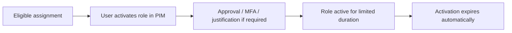

| Access model | Risk profile | Recommended for |
| --- | --- | --- |
| Permanent `Owner` | Highest risk | Emergency break-glass only |
| Permanent `Contributor` | High risk | Small controlled environments only |
| PIM eligible `Contributor` / `Owner` | Lower risk | Human administrators in production |
| Non-human workload identities | Use least privilege RBAC, not PIM | Apps, automation, managed identities |

---

## Troubleshooting Like a Pro

When access fails, check in this order:

1. **Who is the principal really?**
  - User? group member? service principal? managed identity? wrong tenant?
2. **What exact operation failed?**
  - ARM action? data-plane action? portal view? SDK call?
3. **What scope was targeted?**
  - Resource, resource group, subscription, or management group?
4. **Does the token reflect fresh claims?**
  - Re-authenticate or refresh token after assignment changes
5. **Is there a deny assignment, policy effect, lock, firewall, or service ACL?**
6. **Is the resource using RBAC or an older access model?**
  - Example: Key Vault access policies vs RBAC mode

| Symptom | Likely cause | What to check |
| --- | --- | --- |
| Portal shows resource but data read fails | Control-plane role only | Add service data-plane role |
| CLI says unauthorized right after assignment | Propagation delay or stale token | Wait, re-login, retry |
| Works for one user in group but not another | Group membership or token freshness | Confirm group membership and reissue token |
| Access denied only in one region/service endpoint | Service-local auth layer or firewall | Check service networking and auth mode |
| Role assignment exists but user still blocked | Deny assignment / policy / lock | Inspect inherited denies and policy effects |

---

## Service-Specific RBAC Nuances

| Service | Nuance experienced teams watch for |
| --- | --- |
| Storage | `Reader` can view account config but cannot read blob data; needs blob data role |
| Key Vault | Data access depends on vault permission model; RBAC and access policies differ |
| AKS | Azure RBAC for ARM is separate from Kubernetes RBAC inside cluster |
| SQL / PostgreSQL | Azure RBAC may manage the server, but database login/roles still govern actual data access |
| Service Bus / Event Hubs | Management roles do not always grant send/receive data operations |
| Managed Identity | Identity may authenticate successfully but still fail authorization without exact target role |

---

## Production RBAC Design Checklist

- Separate **human admin access** from **application runtime access**
- Prefer **group-based assignments** for humans and **direct assignments** for workloads
- Keep prod, non-prod, and shared platform scopes clearly separated
- Use **PIM** for privileged human roles in production
- Prefer **service-specific built-in roles** before creating custom ones
- Document every custom role with owning team and intended use case
- Periodically review orphaned assignments for deleted apps, service principals, or guests
- Test both **positive** and **negative** access paths before rollout

---

## Practical Checklist

- Role is assigned to the correct security principal
- Scope is at minimum required level
- Role covers required data-plane and/or control-plane actions
- No over-broad built-in role used when a narrower one exists
- Stale assignments are removed on identity lifecycle changes

---

## Full RBAC Runtime Evaluation Workflow

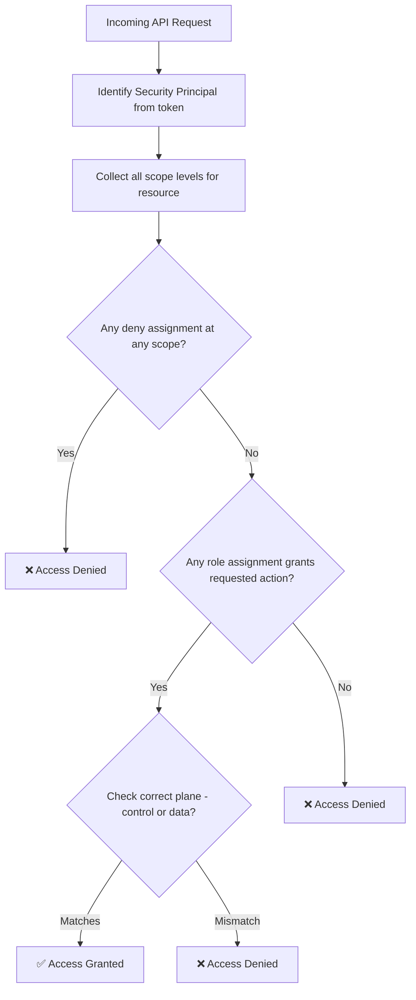

---

## Scope Inheritance in Practice

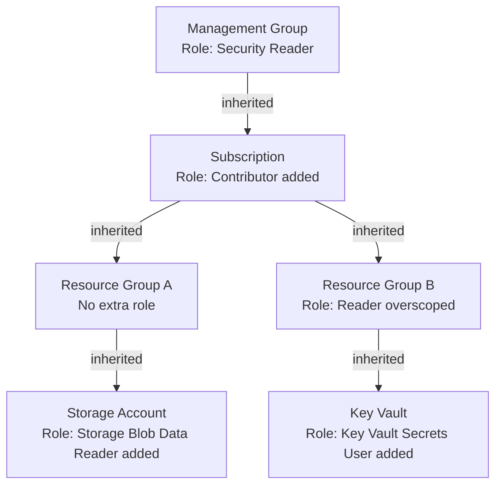

---

## Role Selection Decision Tree

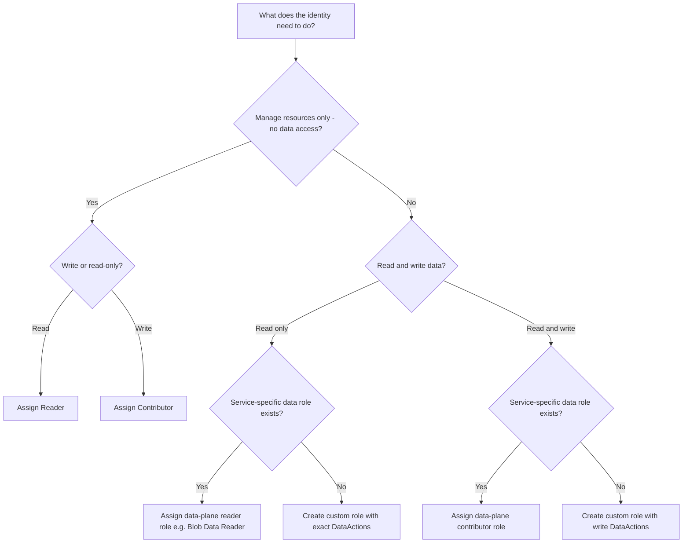

---

## Control Plane vs Data Plane Visual

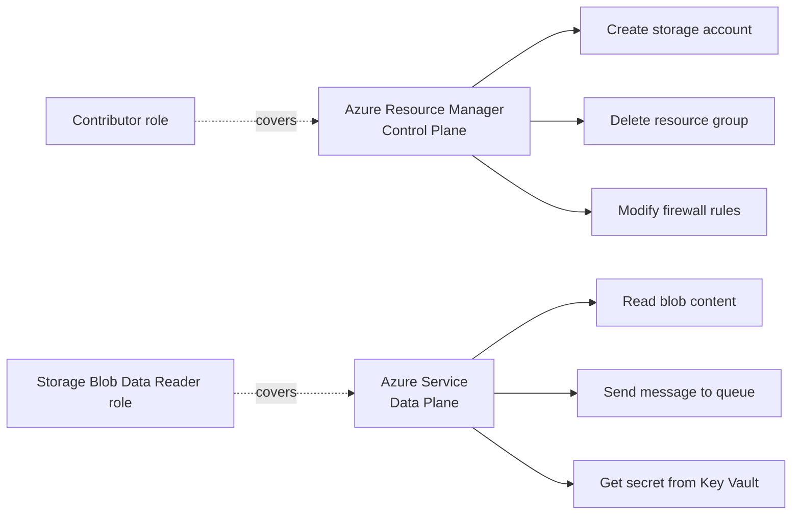

---

## Step-by-Step: Test This in Azure

### Prerequisites
- Azure CLI authenticated
- At least one resource group available

### Step 1 — List built-in role definitions
```bash
# View all built-in roles
az role definition list --query "[?roleType=='BuiltInRole'].{Name:roleName, Description:description}" -o table | head -30

# Inspect a specific role in detail
az role definition list --name "Reader" --query "[0].permissions" -o json
```
**Verify:** Reader role shows `actions: ["*/read"]` and no `notActions` that restrict it further.

### Step 2 — List role assignments at subscription scope
```bash
SUBSCRIPTION_ID=$(az account show --query id -o tsv)

az role assignment list \
  --scope "/subscriptions/$SUBSCRIPTION_ID" \
  --query "[].{Principal:principalName, Role:roleDefinitionName, Scope:scope}" \
  -o table
```
**Verify:** You see your own account listed with `Owner` or `Contributor`.

### Step 3 — List role assignments at resource group scope
```bash
RG_NAME=<your-resource-group>

az role assignment list \
  --resource-group $RG_NAME \
  --query "[].{Principal:principalName, Role:roleDefinitionName, Scope:scope}" \
  -o table
```
**Verify:** Assignments scoped to the RG appear, and inherited ones from subscription are not shown here (they still apply).

### Step 4 — Check effective access for a principal
```bash
# Check what actions a user or SP can perform
SP_OBJECT_ID=<object ID of any principal>

az role assignment list \
  --assignee $SP_OBJECT_ID \
  --all \
  --query "[].{Role:roleDefinitionName, Scope:scope}" \
  -o table
```
**Verify:** All roles across all scopes for that principal are listed.

### Step 5 — Create a custom role definition
```bash
SUBSCRIPTION_ID=$(az account show --query id -o tsv)

cat > /tmp/custom-role.json << EOF
{
  "Name": "Custom Storage Reader",
  "Description": "Can list and read blobs only",
  "Actions": [
    "Microsoft.Storage/storageAccounts/read",
    "Microsoft.Storage/storageAccounts/listKeys/action"
  ],
  "NotActions": [],
  "DataActions": [
    "Microsoft.Storage/storageAccounts/blobServices/containers/blobs/read"
  ],
  "NotDataActions": [],
  "AssignableScopes": [
    "/subscriptions/$SUBSCRIPTION_ID"
  ]
}
EOF

az role definition create --role-definition @/tmp/custom-role.json
```
**Verify:** Custom role created with `roleType: CustomRole`.

### Step 6 — Assign and verify the custom role
```bash
SP_APP_ID=<appId of any SP>

az role assignment create \
  --assignee $SP_APP_ID \
  --role "Custom Storage Reader" \
  --scope "/subscriptions/$SUBSCRIPTION_ID"

# Verify assignment exists
az role assignment list \
  --assignee $SP_APP_ID \
  --query "[].roleDefinitionName" \
  -o table
```
**Verify:** Assignment shows `Custom Storage Reader`.

### Step 7 — Verify scope inheritance (negative test)
```bash
# Grant a role only at resource group level
az role assignment create \
  --assignee $SP_APP_ID \
  --role "Reader" \
  --scope "/subscriptions/$SUBSCRIPTION_ID/resourceGroups/$RG_NAME"

# Try to list resources in a DIFFERENT resource group — should fail
az login --service-principal --username $SP_APP_ID --password <secret> --tenant <tenant>
az resource list --resource-group <other-rg>
```
**Verify:** Access denied for the other resource group — scope isolation confirmed.

### Step 8 — Clean up
```bash
az login  # back to your account
az role assignment delete --assignee $SP_APP_ID --role "Custom Storage Reader" --scope "/subscriptions/$SUBSCRIPTION_ID"
az role definition delete --name "Custom Storage Reader"
```

### What to Confirm End-to-End
| Check | Expected |
|---|---|
| Reader role shows `*/read` actions | Yes |
| Assignment at subscription scope visible | Yes |
| Custom role creation succeeds | Yes |
| Scope isolation: RG role doesn't grant other RG access | Yes |
| Role deletion removes access after propagation / token refresh | Yes |

---

## Summary
Azure RBAC is the foundation of all resource authorization, but production-grade access design goes beyond simple role assignment. The real work is understanding effective permissions, choosing the right scope, separating control plane from data plane, accounting for propagation and token behavior, and combining RBAC with PIM, policy, and service-specific authorization models.

The most reliable RBAC designs are narrow in scope, explicit in intent, operationally reviewed, and tested with both success and failure paths before they ever reach production.
