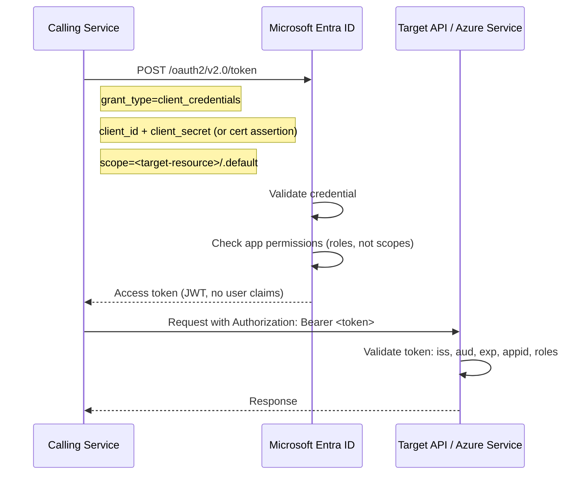
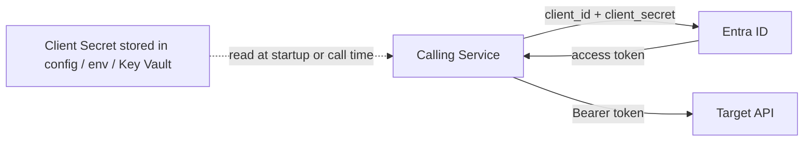
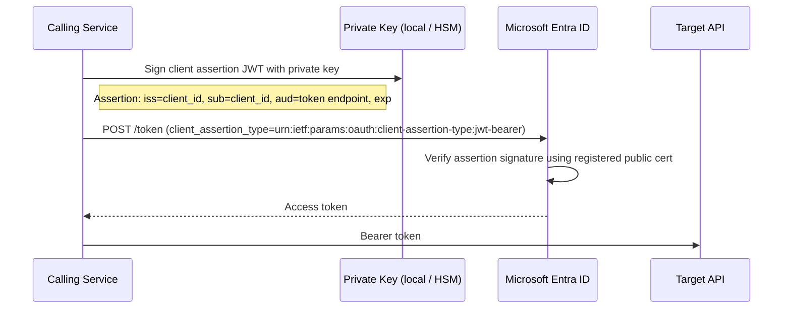
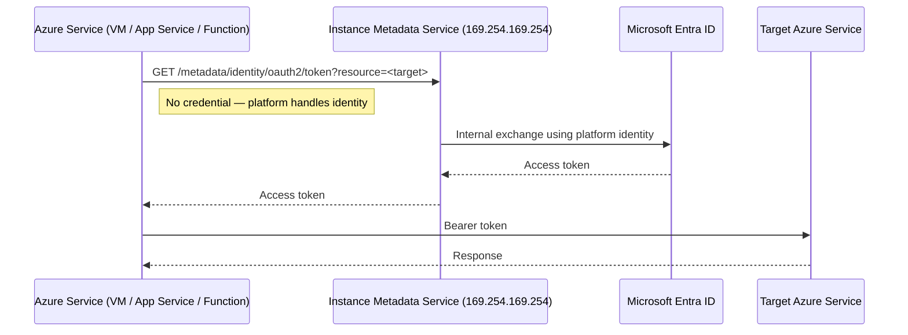
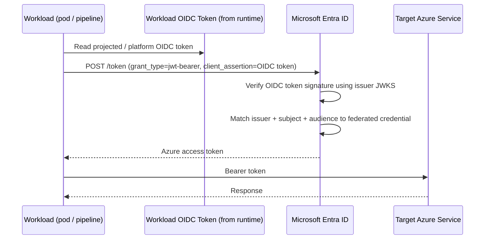
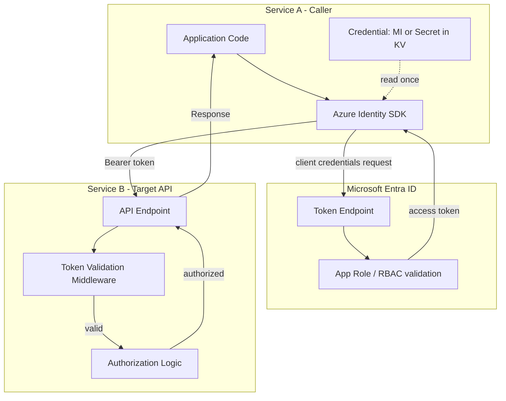
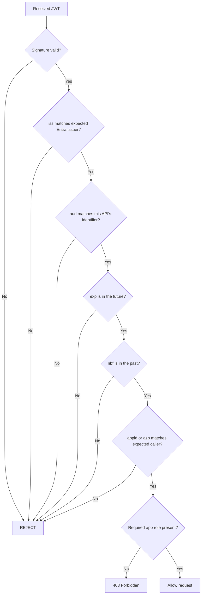
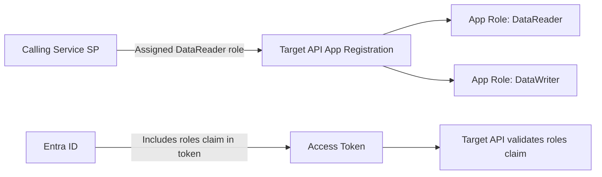
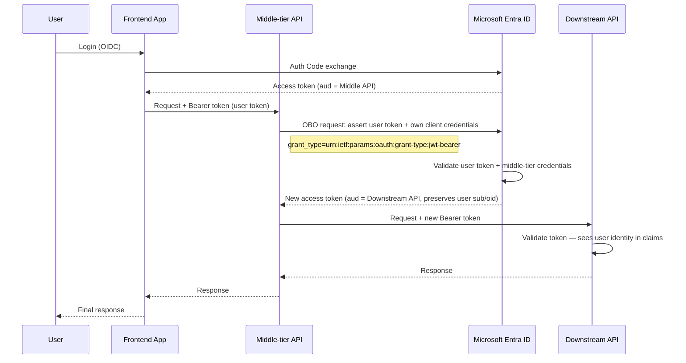
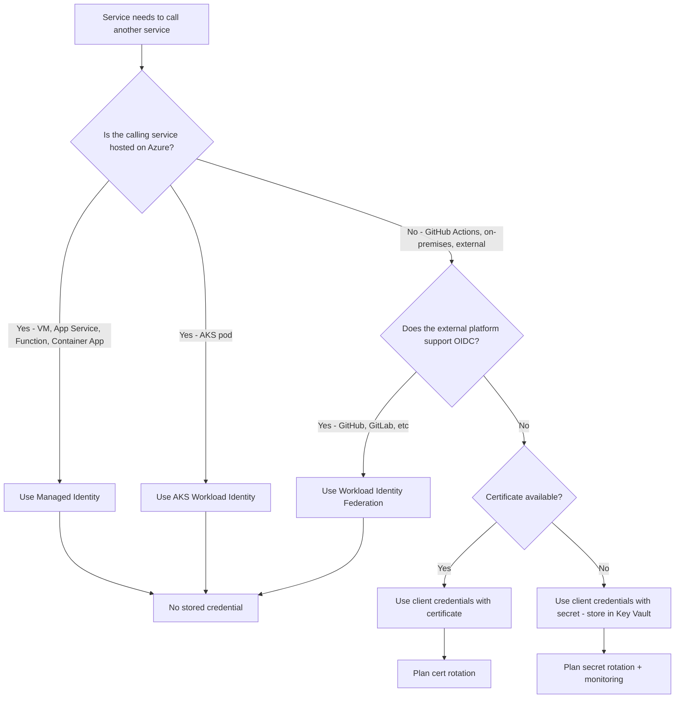

# Service-to-Service (S2S) Authentication

## Overview

Service-to-Service (S2S) authentication is the pattern where **one backend service authenticates to another backend service** with no human user in the loop. There is no interactive login, no browser redirect, and no user consent — the calling service proves its own identity using a credential or token, and the receiving service validates that proof before allowing access.

S2S is the authentication model for:
- Microservices calling downstream APIs
- Scheduled jobs or workers accessing databases or queues
- CI/CD pipelines deploying to Azure
- Azure Functions calling Key Vault or Storage
- Any backend workload authenticating to another workload

---

## Why S2S Is Different from User Authentication

| Dimension | User authentication | S2S authentication |
|---|---|---|
| Who initiates | A human being | A running process / service |
| Interaction | Browser redirect, login form, MFA | Fully automated — no UI |
| Identity type | User account | Service principal, managed identity, or workload identity |
| Credential management | User manages password | Platform or team manages secret / cert / federated token |
| Token type requested | ID token + access token | Access token only (no ID token — no user claims) |
| OAuth 2.0 grant | Authorization Code + PKCE | Client Credentials |
| Session / refresh | User session or refresh token | Tokens re-acquired on expiry — no persistent session |

---

## S2S Authentication Models in Azure

There are three ways a service proves its identity in an Azure/Entra context:

| Model | Credential used | Best for |
|---|---|---|
| **Client credentials (secret)** | Client ID + client secret stored in config | Simple setups, short-lived use, legacy systems |
| **Client credentials (certificate)** | Client ID + private key (cert assertion) | Higher assurance than secret — key never leaves app |
| **Managed Identity / Workload Identity** | No stored credential — platform issues token | Azure-hosted workloads and AKS pods |

The security posture improves left to right. **Managed Identity** is always preferred for Azure-hosted services.

---

## Core Protocol: OAuth 2.0 Client Credentials Grant

All S2S authentication in Entra ID uses the **client credentials grant** (RFC 6749 §4.4). The calling service authenticates as *itself* — not on behalf of any user.



Key differences from user auth:
- No `sub` / user identity claims in the token
- Permissions come from **application roles** (`.default` scope picks them all up)
- No refresh token — caller re-acquires when expired

---

## Model 1 — Client Credentials with Secret



**Token request:**
```
POST https://login.microsoftonline.com/<tenant-id>/oauth2/v2.0/token
Content-Type: application/x-www-form-urlencoded

grant_type=client_credentials
&client_id=<app-id>
&client_secret=<secret>
&scope=<target-resource-uri>/.default
```

**Risks:**
- Secret must be stored somewhere — Key Vault is the right place, not env vars or config files
- Secret has an expiry date — requires rotation process
- If leaked, any caller can impersonate the service until rotated

---

## Model 2 — Client Credentials with Certificate

Instead of a secret, the calling service uses a **private key** to sign a JWT assertion. Entra ID verifies the signature using the registered public certificate.



**Why this is stronger than a secret:**
- Private key never leaves the calling service — Entra ID only sees the signed assertion
- Certificate has a thumbprint registered in app registration — easier to audit
- Key rotation can happen without downtime (register new cert, remove old one)

---

## Model 3 — Managed Identity (Azure-hosted services)

No credential stored anywhere. The Azure platform itself issues tokens for the workload.



---

## Model 4 — Workload Identity Federation (AKS / CI/CD)

For workloads running outside Azure (GitHub Actions, AKS pods, etc.) — no stored credential, uses OIDC token exchange.



---

## End-to-End S2S Architecture: Microservices



---

## Token Validation: What the Target API Must Check

When Service B receives a token from Service A, it must validate:



| Claim | What to check |
|---|---|
| `iss` | Matches `https://login.microsoftonline.com/<tenant-id>/v2.0` |
| `aud` | Matches your API's Application ID URI |
| `exp` | Token has not expired |
| `nbf` | Token is not being used before its valid-from time |
| `appid` / `azp` | Client app ID of the known calling service |
| `roles` | Contains the expected application role if role enforcement is used |

---

## Application Roles for S2S Authorization

In user auth, delegated scopes (`scp` claim) control what a user consented to. In S2S, there are no users — instead, **application roles** (`roles` claim) define what a calling service is permitted to do.



Setup in app registration:
1. Target API defines app roles in its manifest (`appRoles` array)
2. Calling service's SP/MI is assigned those roles via enterprise app permissions + admin consent
3. Token issued to the calling service includes `"roles": ["DataReader"]`
4. Target API checks `roles` claim — not `scp`

---

## S2S with On-Behalf-Of (OBO) Flow

Sometimes a middle-tier service receives a user token and needs to call a downstream API **on behalf of that user**, propagating the user identity forward.



OBO is used when:
- Audit requirements need the original user identity visible to downstream services
- The downstream service enforces per-user data isolation
- Multi-tier apps with distinct service boundaries and separate app registrations

---

## Choosing the Right S2S Pattern



---

## Comparing All S2S Patterns

| Pattern | Credential stored | Rotation needed | Best environment | Security level |
|---|---|---|---|---|
| Client secret | Yes — in Key Vault or config | Yes — manual or automated | Dev/test, legacy | Baseline |
| Client certificate | Private key only — never sent | Yes — cert expiry | Any | Better |
| Managed Identity | None | Never | Azure-hosted services | Best for Azure |
| Workload Identity Federation | None | Never | AKS, GitHub Actions, non-Azure OIDC | Best for external |
| On-behalf-of (OBO) | Uses downstream MI or secret | Depends on downstream | Multi-tier user flows | User identity preserved |

---

## Step-by-Step: Test S2S in Azure

### Prerequisites
- Azure CLI authenticated
- Two app registrations: one as caller (Service A), one as target API (Service B)

### Step 1 — Create Service B (target API) and define an app role

```bash
TENANT_ID=$(az account show --query tenantId -o tsv)

# Create target API app registration
az ad app create \
  --display-name "s2s-target-api" \
  --identifier-uris "api://s2s-target-api-test"

TARGET_APP_ID=$(az ad app list --display-name "s2s-target-api" --query "[0].appId" -o tsv)
TARGET_OBJ_ID=$(az ad app list --display-name "s2s-target-api" --query "[0].id" -o tsv)

echo "Target App ID: $TARGET_APP_ID"
```

Add an app role to Service B:
```bash
az ad app update --id $TARGET_OBJ_ID --set appRoles='[{
  "allowedMemberTypes": ["Application"],
  "description": "Read data from the API",
  "displayName": "DataReader",
  "isEnabled": true,
  "value": "DataReader",
  "id": "00000000-0000-0000-0000-000000000001"
}]'
```

Create service principal for Service B:
```bash
az ad sp create --id $TARGET_APP_ID
```

### Step 2 — Create Service A (calling service) and assign the app role

```bash
az ad app create --display-name "s2s-caller-service"
CALLER_APP_ID=$(az ad app list --display-name "s2s-caller-service" --query "[0].appId" -o tsv)
CALLER_OBJ_ID=$(az ad app list --display-name "s2s-caller-service" --query "[0].id" -o tsv)

az ad sp create --id $CALLER_APP_ID
CALLER_SP_OBJ_ID=$(az ad sp show --id $CALLER_APP_ID --query id -o tsv)

# Add permission to target API
TARGET_SP_OBJ_ID=$(az ad sp show --id $TARGET_APP_ID --query id -o tsv)

az ad app permission add \
  --id $CALLER_OBJ_ID \
  --api $TARGET_APP_ID \
  --api-permissions "00000000-0000-0000-0000-000000000001=Role"

# Grant admin consent
az ad app permission admin-consent --id $CALLER_OBJ_ID
```

### Step 3 — Create a client secret for Service A

```bash
SECRET=$(az ad app credential reset \
  --id $CALLER_APP_ID \
  --query password -o tsv)

echo "Secret stored — use only for testing"
```

### Step 4 — Acquire an S2S token using client credentials

```bash
TOKEN=$(curl -s -X POST \
  "https://login.microsoftonline.com/$TENANT_ID/oauth2/v2.0/token" \
  -H "Content-Type: application/x-www-form-urlencoded" \
  -d "client_id=$CALLER_APP_ID" \
  -d "client_secret=$SECRET" \
  -d "scope=api://s2s-target-api-test/.default" \
  -d "grant_type=client_credentials" \
  | python3 -c "import sys,json; print(json.load(sys.stdin)['access_token'])")

echo $TOKEN
```

### Step 5 — Decode and inspect the token

Decode at jwt.ms or via Python:
```python
import base64, json

token = "<paste token>"
payload = json.loads(base64.urlsafe_b64decode(token.split(".")[1] + "=="))
print(json.dumps(payload, indent=2))
```

**Verify in token:**
| Claim | Expected value |
|---|---|
| `iss` | `https://login.microsoftonline.com/<tenant>/v2.0` |
| `aud` | `api://s2s-target-api-test` |
| `appid` | Caller's `CALLER_APP_ID` |
| `roles` | `["DataReader"]` |
| No `scp` | Correct — client credentials tokens have no delegated scope |
| No `sub` with user info | Correct — no user in this flow |

### Step 6 — Negative test: no admin consent → no roles claim

```bash
# Create another caller without granting admin consent
az ad app create --display-name "s2s-no-consent"
NO_CONSENT_ID=$(az ad app list --display-name "s2s-no-consent" --query "[0].appId" -o tsv)
az ad sp create --id $NO_CONSENT_ID

NC_SECRET=$(az ad app credential reset --id $NO_CONSENT_ID --query password -o tsv)

# Try to get token — may succeed but token will have empty roles
NC_TOKEN=$(curl -s -X POST \
  "https://login.microsoftonline.com/$TENANT_ID/oauth2/v2.0/token" \
  -d "client_id=$NO_CONSENT_ID&client_secret=$NC_SECRET&scope=api://s2s-target-api-test/.default&grant_type=client_credentials" \
  | python3 -c "import sys,json; d=json.load(sys.stdin); print(d.get('access_token', d.get('error_description')))")
```

Decode the token — **`roles` claim will be absent** because no app role was assigned + consented. A properly implemented target API should return `403` when `roles` claim is missing.

### Step 7 — Clean up

```bash
az ad app delete --id $CALLER_OBJ_ID
az ad app delete --id $TARGET_OBJ_ID
az ad app delete --id $(az ad app list --display-name "s2s-no-consent" --query "[0].id" -o tsv)
```

### What to Confirm End-to-End

| Check | Expected |
|---|---|
| Client credentials token issued | Yes |
| Token contains `roles` not `scp` | Yes — S2S uses app roles |
| Token has no user identity claims | Yes — no `upn`, no delegated identity |
| Token `aud` matches target API URI | Yes |
| Missing app role → token has no roles claim | Yes |
| Target API enforcing roles returns 403 without role | Yes |

---

## Security Best Practices

- **Prefer Managed Identity** for any Azure-hosted workload — eliminates credential storage entirely
- **Prefer Workload Identity Federation** for external workloads over client secrets
- **If using secrets:** store only in Key Vault, never in source code, env files, or container images
- **Set short token cache TTL** in the calling service — do not cache access tokens past their `exp`
- **Validate `appid` / `azp` claim** in target API to restrict which callers are accepted
- **Use app roles** (not broad wildcard permissions) to define exactly what each calling service may do
- **Enable audit logging** on both caller and target services for traceability
- **Rotate secrets on a schedule** and automate alerts for approaching expiry
- **Scope tokens to the target resource** — do not use the same token for multiple services

---

## Summary

S2S authentication is the backbone of secure microservice and workload communication. It always involves a service proving its own identity — not a user's — to a token endpoint, receiving an access token, and presenting that token to the target service.

The right model depends on where the calling service runs:

- **Azure-hosted** → Managed Identity (no credential)
- **AKS pod** → Workload Identity (no credential)
- **External / CI/CD with OIDC** → Workload Identity Federation (no credential)
- **Certificate available** → Client credentials with cert assertion
- **Secret only** → Client credentials with secret, stored in Key Vault

In all cases, the target service must validate the token fully — signature, issuer, audience, expiry, and roles — before trusting the caller.
