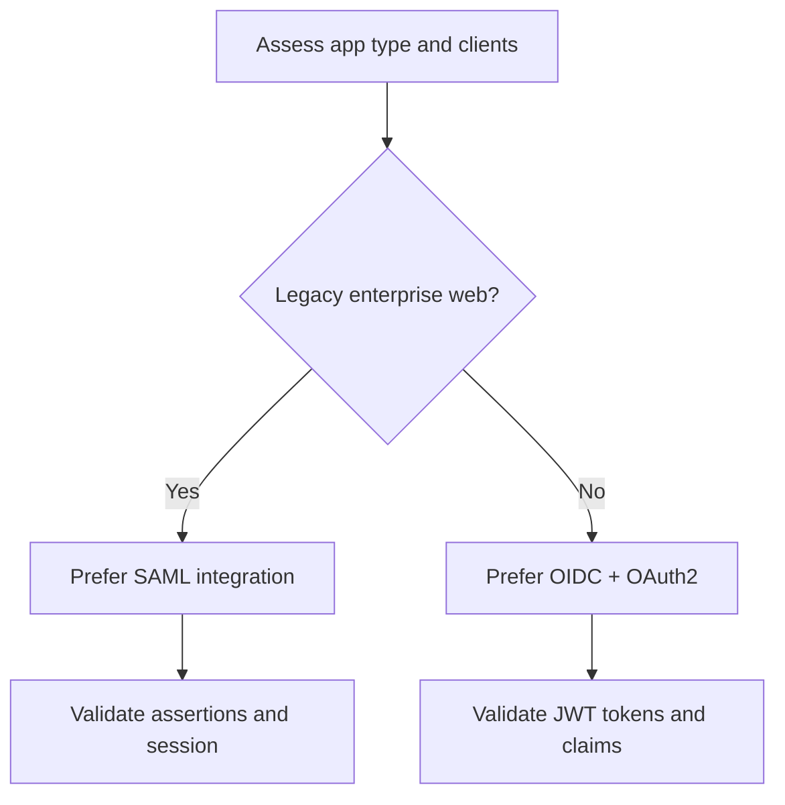

# SAML vs OIDC

## What is it?
SAML and OIDC are federation protocols for SSO, with SAML optimized for older enterprise web stacks and OIDC for modern apps/APIs.

## What is it used for?
It is used to choose the right protocol for integrating applications with identity providers.

## Why is it important?
Protocol choice affects implementation complexity, mobile/API compatibility, and long-term maintainability.

## Workflow


## Overview

Both SAML and OIDC are federation protocols that enable Single Sign-On (SSO) — letting a user authenticate once at an Identity Provider (IdP) and access multiple applications without re-entering credentials. They differ significantly in design philosophy, token format, transport mechanism, and modern applicability.

- **SAML** (Security Assertion Markup Language) — XML-based, designed in the early 2000s for enterprise web SSO. Widely deployed in on-premises and legacy enterprise apps.
- **OIDC** (OpenID Connect) — JSON/JWT-based, built on OAuth 2.0, designed for modern web, mobile, and API scenarios. The current industry standard for new applications.

---

## Protocol Comparison

| Dimension | SAML 2.0 | OIDC |
|---|---|---|
| Token format | XML assertion (signed/optionally encrypted) | JSON Web Token (JWT) |
| Transport | HTTP POST / Redirect bindings | HTTPS redirect + back-channel token exchange |
| Primary use | Enterprise web SSO, legacy apps | Modern web, mobile, SPA, APIs, microservices |
| User identity proof | `<saml:Assertion>` with `<AttributeStatement>` | ID Token (JWT) with standard claims |
| Authorization | Not designed for it | Built on OAuth 2.0 — covers both AuthN and AuthZ |
| Discovery | Federation metadata XML (`FederationMetadata.xml`) | OIDC Discovery document (`.well-known/openid-configuration`) |
| Key rotation | Manual metadata refresh | Automatic via JWKS endpoint |
| Mobile / API support | Poor — redirect-heavy, XML not suited | Excellent — JSON, short-lived tokens, PKCE |
| Logout | Single logout (SLO) — complex, often broken | Logout via token revocation + front/back-channel logout |
| Claim format | `<Attribute Name="..."><AttributeValue>` | Standard JWT claims: `sub`, `email`, `roles`, `scp` |
| Complexity | High — XML, XSD, canonicalization | Lower — JSON, standard HTTP |

---

## How Each Flow Works

### SAML SP-Initiated SSO Flow

```
flowchart TD
    U[User] -->|Access app URL| SP[Service Provider / App]
    SP -->|1. AuthnRequest via HTTP Redirect| IDP[Identity Provider]
    IDP -->|2. Authenticate user| IDP
    IDP -->|3. SAMLResponse via HTTP POST to ACS URL| SP
    SP -->|4. Validate XML signature + assertions| SP
    SP -->|5. Extract NameID + attributes| SP
    SP -->|6. Grant access| U
```

### OIDC Authorization Code + PKCE Flow

```
flowchart TD
    U[User] -->|Access app URL| APP[Client Application]
    APP -->|1. Redirect: /authorize + PKCE challenge| IDP[Identity Provider]
    IDP -->|2. Authenticate user + consent| IDP
    IDP -->|3. Authorization code via redirect| APP
    APP -->|4. POST /token + code_verifier| IDP
    IDP -->|5. ID Token + Access Token| APP
    APP -->|6. Validate JWT claims| APP
    APP -->|7. Grant access| U
```

---

## Trust Model Comparison

```
flowchart LR
    subgraph SAML
        S_IDP[Identity Provider] -->|Signs XML Assertion| S_SP[Service Provider]
        S_SP -->|Validates signature via cert from metadata| S_IDP
    end

    subgraph OIDC
        O_IDP[Identity Provider] -->|Signs JWT with private key| O_APP[Client App]
        O_APP -->|Validates via JWKS public keys| O_IDP
    end
```

Key difference: SAML trusts are established by **exchanging metadata XML and certificates** manually. OIDC trusts are established by **dynamic JWKS discovery** — key rotation is automatic.

---

## Token Structure Comparison

### SAML Assertion (simplified)
```xml
<saml:Assertion>
  <saml:Issuer>https://idp.example.com</saml:Issuer>
  <saml:Subject>
    <saml:NameID Format="emailAddress">user@example.com</saml:NameID>
  </saml:Subject>
  <saml:Conditions NotBefore="..." NotOnOrAfter="...">
    <saml:AudienceRestriction>
      <saml:Audience>https://app.example.com</saml:Audience>
    </saml:AudienceRestriction>
  </saml:Conditions>
  <saml:AttributeStatement>
    <saml:Attribute Name="department">
      <saml:AttributeValue>Engineering</saml:AttributeValue>
    </saml:Attribute>
  </saml:AttributeStatement>
</saml:Assertion>
```

### OIDC ID Token (JWT payload)
```json
{
  "iss": "https://login.microsoftonline.com/<tenantId>/v2.0",
  "sub": "<unique-user-id>",
  "aud": "<client-app-id>",
  "exp": 1748000000,
  "iat": 1747996400,
  "email": "user@example.com",
  "name": "Test User",
  "roles": ["Engineering"]
}
```

---

## When to Use Which

| Scenario | Recommended Protocol |
|---|---|
| New web/mobile app | OIDC |
| Existing enterprise app with SAML already configured | Keep SAML (unless migrating) |
| API access / machine-to-machine | OIDC + OAuth 2.0 (SAML cannot do this) |
| Legacy on-premises SSO (e.g. ADFS) | SAML (or migrate to OIDC) |
| SPA or mobile app with PKCE | OIDC only |
| Partner federation with old enterprise IdP | SAML (many older IdPs don't support OIDC) |
| Greenfield cloud-native application | OIDC |

---

## Migration Path: SAML → OIDC

```
flowchart TD
    A[Existing SAML App] --> B{Does IdP support OIDC?}
    B -->|Yes| C[Register app as OIDC Relying Party]
    B -->|No| D[Keep SAML or upgrade IdP]
    C --> E[Map SAML attributes to JWT claims]
    E --> F[Update app to validate JWT instead of XML]
    F --> G[Replace SAML library with OIDC library]
    G --> H[Test: ID token claims, logout, token refresh]
    H --> I[Switch traffic to OIDC endpoint]
    I --> J[Deprecate SAML metadata + certs]
```

### Migration Steps in Detail

**Step 1 — Audit current SAML setup**
- Identify: `Issuer`, `ACS URL`, `NameID format`, attribute mappings
- Note which attributes the app depends on (`department`, `groups`, `email`, etc.)

**Step 2 — Map attributes to OIDC claims**
| SAML Attribute | OIDC Equivalent Claim |
|---|---|
| `NameID` (email format) | `email` or `upn` |
| `NameID` (persistent) | `sub` or `oid` |
| `groups` attribute | `groups` claim (if configured) |
| Custom attributes | Custom optional claims in token configuration |

**Step 3 — Register app for OIDC**
- Create or update app registration with OIDC redirect URI
- Configure required scopes: `openid profile email`
- Add any optional claims matching previous SAML attributes

**Step 4 — Update application code**
- Replace SAML assertion parsing with JWT validation
- Update session creation to use `sub` or `oid` as user identifier
- Add PKCE to authorization flow
- Update logout to use OIDC end_session_endpoint

**Step 5 — Run parallel validation**
- Run SAML and OIDC side by side in staging
- Verify user identity (`sub` / `oid`) maps correctly
- Verify all required claims are present in JWT
- Test logout and token expiry behavior

**Step 6 — Cut over**
- Switch production traffic to OIDC flow
- Monitor for auth errors for 1–2 weeks
- Decommission SAML configuration after stability confirmed

---

## SAML vs OIDC in Microsoft Entra ID

Microsoft Entra ID supports both protocols. For an enterprise app:

| Task | SAML setup | OIDC setup |
|---|---|---|
| Configure SSO | Enterprise App → Single sign-on → SAML | App Registration → Authentication → Redirect URIs |
| Identity token | SAML Response (XML) sent to ACS URL | ID Token (JWT) returned to redirect URI |
| Attribute claims | Attributes & Claims blade in Enterprise App | Token configuration blade in App Registration |
| Signing certificate | Download from SAML signing section | Automatic via JWKS endpoint |
| Logout | Logout URL in SAML settings | `end_session_endpoint` from discovery document |

---

## Diagram: Decision Tree — SAML or OIDC?

```
flowchart TD
    A[New integration?] -->|No - existing SAML| B[Keep SAML unless there is a migration reason]
    A -->|Yes - new app| C{App type?}
    C -->|Web browser app| D[OIDC - Authorization Code + PKCE]
    C -->|Mobile / SPA| E[OIDC - Authorization Code + PKCE]
    C -->|Service / Daemon / API| F[OIDC - Client Credentials]
    C -->|Legacy enterprise with old IdP| G{IdP supports OIDC?}
    G -->|Yes| D
    G -->|No| H[SAML - until IdP upgraded]
```

---

## Step-by-Step: Test This in Azure

### Prerequisites
- Azure CLI authenticated
- An enterprise application in Entra ID (SAML) and an app registration (OIDC) to compare

### Part A — Inspect a SAML App

#### Step 1 — Create an enterprise app with SAML SSO (Portal)
1. Go to **Azure Portal → Microsoft Entra ID → Enterprise Applications → New Application**
2. Choose a gallery app that supports SAML (e.g. search "AWS" or any SAML-capable app), or choose **Create your own application → integrate any other application (non-gallery)**
3. Under **Single sign-on**, select **SAML**
4. Note the fields: **Identifier (Entity ID)**, **Reply URL (ACS URL)**, **Sign-on URL**

#### Step 2 — Download SAML metadata
```bash
# List enterprise apps
az ad sp list --query "[?tags[?contains(@,'WindowsAzureActiveDirectoryIntegratedApp')]].{Name:displayName, AppID:appId}" -o table | head -10
```
In Portal → Enterprise App → Single sign-on → **Download Federation Metadata XML**

**Verify:** XML file contains `<EntityDescriptor>`, `<IDPSSODescriptor>`, `<X509Certificate>` — all public, no secrets.

#### Step 3 — View the SAML signing certificate
In Portal → Enterprise App → Single sign-on → **SAML Signing Certificate** section

**Verify:** Certificate has expiry date. Note: SAML requires manual rotation; OIDC does not.

---

### Part B — Configure and Test an OIDC App

#### Step 4 — Create an OIDC app registration
```bash
TENANT_ID=$(az account show --query tenantId -o tsv)

az ad app create \
  --display-name "test-oidc-vs-saml" \
  --sign-in-audience "AzureADMyOrg" \
  --web-redirect-uris "http://localhost:8080/callback"

APP_ID=$(az ad app list --display-name "test-oidc-vs-saml" --query "[0].appId" -o tsv)
```

#### Step 5 — Fetch the OIDC discovery document
```bash
curl -s "https://login.microsoftonline.com/$TENANT_ID/v2.0/.well-known/openid-configuration" \
  | python3 -m json.tool
```
**Verify:** Response includes `issuer`, `authorization_endpoint`, `token_endpoint`, `jwks_uri`, `end_session_endpoint` — all auto-discoverable. Compare with SAML where you had to manually download XML.

#### Step 6 — Get a token via client credentials (OIDC)
```bash
SECRET=$(az ad app credential reset --id $APP_ID --query password -o tsv)

curl -s -X POST \
  "https://login.microsoftonline.com/$TENANT_ID/oauth2/v2.0/token" \
  -H "Content-Type: application/x-www-form-urlencoded" \
  -d "client_id=$APP_ID&client_secret=$SECRET&scope=https://graph.microsoft.com/.default&grant_type=client_credentials"
```
**Verify:** Compact JWT returned — compare to SAML's verbose XML.

#### Step 7 — Compare claim structures
Decode the JWT at jwt.ms.

**SAML equivalent mapping:**
| JWT Claim | SAML Equivalent |
|---|---|
| `iss` | `Issuer` in `<saml:Assertion>` |
| `sub` | `<saml:NameID>` |
| `aud` | `<saml:Audience>` |
| `exp` | `NotOnOrAfter` in `<saml:Conditions>` |
| `email` | `<saml:Attribute Name="email">` |

#### Step 8 — Verify JWKS auto-rotation (OIDC advantage)
```bash
# Fetch public signing keys — no manual cert management needed
curl -s "https://login.microsoftonline.com/$TENANT_ID/discovery/v2.0/keys" \
  | python3 -m json.tool
```
**Verify:** Multiple keys returned with `kid` values. App automatically picks correct key per token `kid` header.

#### Step 9 — Clean up
```bash
APP_OBJ_ID=$(az ad app list --display-name "test-oidc-vs-saml" --query "[0].id" -o tsv)
az ad app delete --id $APP_OBJ_ID
```

### What to Confirm End-to-End
| Check | Expected |
|---|---|
| SAML metadata is XML with certificate | Yes |
| SAML cert requires manual rotation | Yes |
| OIDC discovery is automatic JSON | Yes |
| OIDC token is compact JWT | Yes |
| JWKS keys auto-discoverable | Yes |
| JWT claims map 1:1 to SAML attributes | Yes (via optional claims config) |

---

## Summary

SAML and OIDC both solve SSO but are built for different eras:

- **SAML** is the right choice for existing enterprise integrations, legacy on-premises apps, and partners whose IdP only supports SAML.
- **OIDC** is the right choice for all new applications — it is simpler, supports APIs and mobile, and provides automatic key management.

When migrating from SAML to OIDC, the key work is mapping SAML attributes to JWT claims and replacing XML parsing with JWT validation. Microsoft Entra ID supports both protocols and allows running them in parallel during migration.
