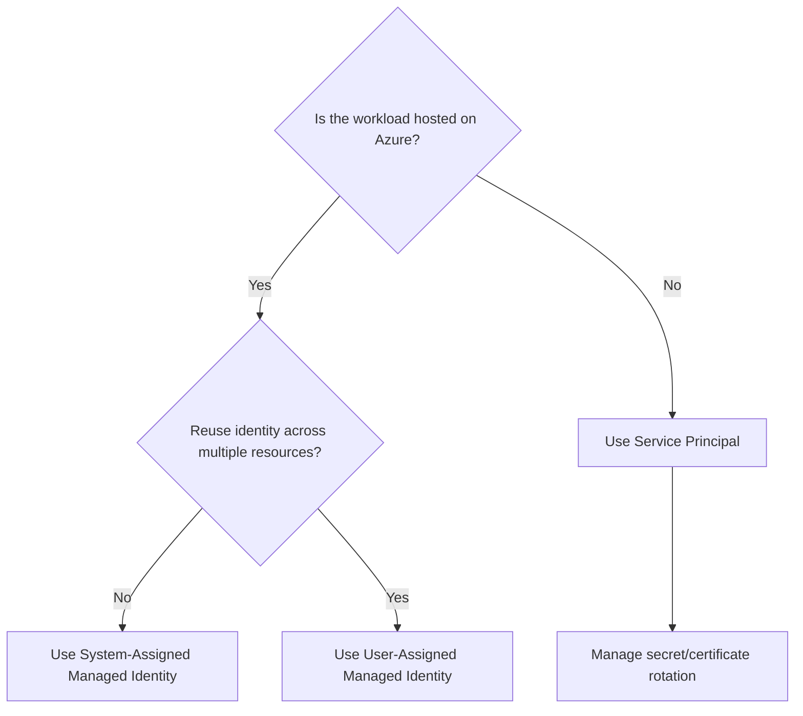
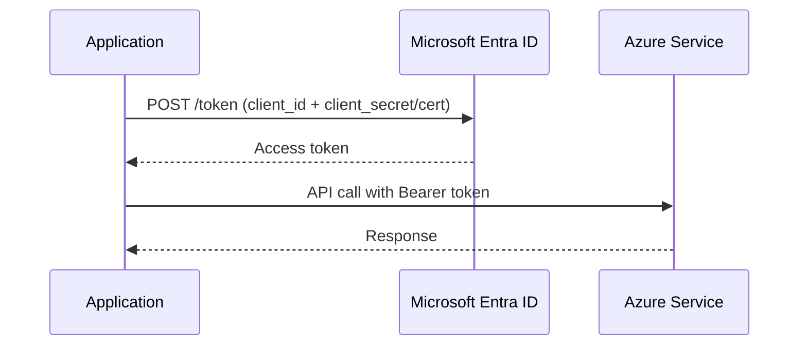
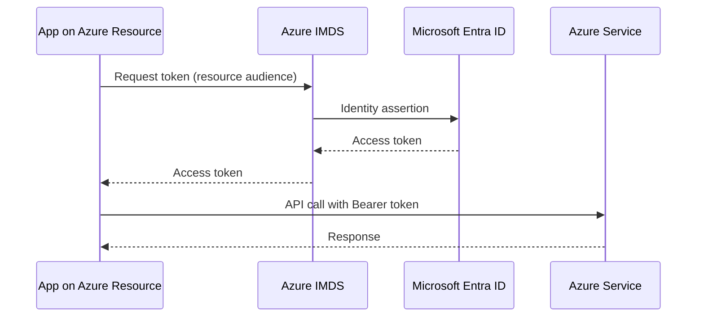
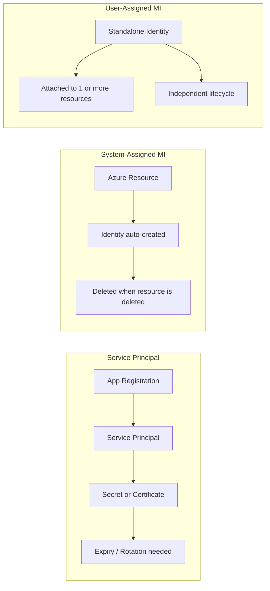
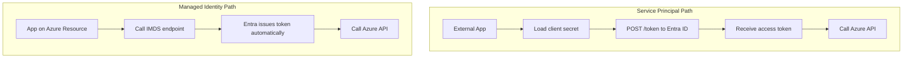
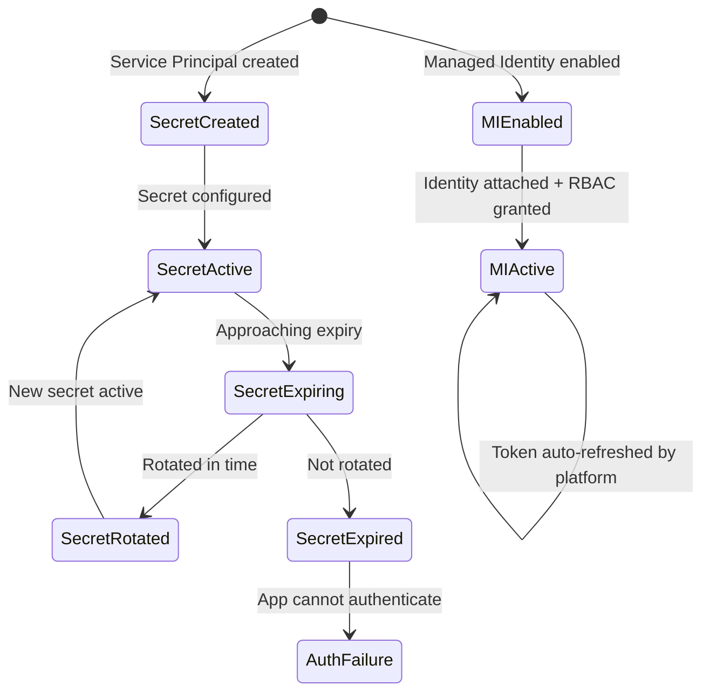

# Service Principal vs Managed Identity

## Overview

Both are non-human identities used by applications and workloads to access Azure resources. The key difference is how credentials are managed.

---

## Quick Comparison

| Aspect | Service Principal | Managed Identity |
| --- | --- | --- |
| Credential management | You manage secret/certificate | Azure manages automatically |
| Works outside Azure | Yes | No (Azure-hosted resources only) |
| Rotation burden | Manual | None |
| Lifecycle | Independent | System-assigned: tied to resource |
| Common use | External apps, cross-tenant | Azure-hosted workloads |
| Secret leakage risk | Higher (secret exists) | Lower (no secret) |

---

## When to Use Which



---

## Service Principal

A service principal is an identity created from an app registration. It uses a client secret or certificate to authenticate.

### Service Principal flow



### Service Principal best practices
- Use certificates over secrets where possible
- Rotate secrets on a schedule
- Keep client secrets out of source code
- Assign least privilege RBAC

---

## Managed Identity

A managed identity is an identity directly attached to an Azure resource. There is no secret to store or rotate.

### Managed Identity flow



---

## Lifecycle Comparison



---

## Common Mistakes

| Mistake | Risk | Better approach |
| --- | --- | --- |
| Storing service principal secret in code | Secret leakage | Use Key Vault reference or managed identity |
| Using one service principal for all environments | Blast radius | Separate SP per environment |
| Granting subscription-wide Owner role to SP | Over-privilege | Assign least required role at minimum scope |
| Forgetting to rotate expired secrets | Auth failure | Automate rotation or use managed identity |

---

## End-to-End Access Workflow Comparison



---

## Credential Risk State



---

## Step-by-Step: Test This in Azure

### Prerequisites
- Azure subscription, Azure CLI authenticated
- A resource group to work in (e.g. `rg-identity-test`)

### Part A — Service Principal (SP)

#### Step 1 — Create a service principal
```bash
az ad sp create-for-rbac --name "test-sp-learning" --skip-assignment
```
**Output includes:** `appId` (client ID), `password` (client secret — save it now, shown once), `tenant`.

#### Step 2 — Assign Reader role to SP
```bash
SUBSCRIPTION_ID=$(az account show --query id -o tsv)
SP_APP_ID=<appId from step 1>

az role assignment create \
  --assignee $SP_APP_ID \
  --role "Reader" \
  --scope "/subscriptions/$SUBSCRIPTION_ID"
```
**Verify:** Role assignment created with `principalType: ServicePrincipal`.

#### Step 3 — Authenticate as SP and test access
```bash
# Login as the SP
az login --service-principal \
  --username $SP_APP_ID \
  --password <password from step 1> \
  --tenant <tenant from step 1>

# Test: list resource groups (Reader can do this)
az group list --query "[].name" -o table

# Test: try to create something (should fail — Reader only)
az group create --name "test-new-rg" --location eastus
```
**Verify:** List succeeds; create fails with `AuthorizationFailed`.

#### Step 4 — Clean up SP (after testing)
```bash
# Log back in as yourself first
az login

az ad sp delete --id $SP_APP_ID
```

---

### Part B — Managed Identity (MI)

#### Step 5 — Create an Azure VM or App Service with system-assigned MI
```bash
# Example: create a VM with system-assigned identity (use smallest SKU for testing)
az vm create \
  --resource-group rg-identity-test \
  --name test-mi-vm \
  --image Ubuntu2204 \
  --assign-identity \
  --admin-username azureuser \
  --generate-ssh-keys
```
**Verify:** Output includes `"identity": {"type": "SystemAssigned", "principalId": "..."}` — that GUID is the MI's object ID.

#### Step 6 — Assign a role to the MI
```bash
MI_PRINCIPAL_ID=$(az vm show \
  --resource-group rg-identity-test \
  --name test-mi-vm \
  --query identity.principalId -o tsv)

SUBSCRIPTION_ID=$(az account show --query id -o tsv)

az role assignment create \
  --assignee $MI_PRINCIPAL_ID \
  --role "Reader" \
  --scope "/subscriptions/$SUBSCRIPTION_ID"
```
**Verify:** Role assigned to `principalType: ServicePrincipal` (MI appears as SP internally).

#### Step 7 — SSH into VM and fetch MI token
```bash
# SSH into the VM
ssh azureuser@<vm-public-ip>

# Inside the VM — call IMDS to get a token for ARM
curl -s -H "Metadata: true" \
  "http://169.254.169.254/metadata/identity/oauth2/token?api-version=2018-02-01&resource=https://management.azure.com/"
```
**Verify:** Response contains `access_token` field — no credentials were used to get it.

#### Step 8 — Use the token to call ARM
```bash
# Still inside the VM
TOKEN=$(curl -s -H "Metadata: true" \
  "http://169.254.169.254/metadata/identity/oauth2/token?api-version=2018-02-01&resource=https://management.azure.com/" \
  | python3 -c "import sys,json; print(json.load(sys.stdin)['access_token'])")

# Call ARM to list resource groups
curl -s -H "Authorization: Bearer $TOKEN" \
  "https://management.azure.com/subscriptions/<subscription-id>/resourcegroups?api-version=2021-04-01" \
  | python3 -m json.tool
```
**Verify:** Resource groups listed without any stored credential.

### What to Confirm End-to-End
| Check | Expected |
|---|---|
| SP has unique `appId` and `password` | Yes |
| SP can read but not write with Reader role | Yes |
| MI `principalId` exists after VM creation | Yes |
| MI token returned from IMDS with no credentials | Yes |
| ARM call with MI token succeeds | Yes |

---

## Summary
Use managed identity by default for Azure-hosted workloads — it removes the secret lifecycle entirely. Use service principals only when the workload runs outside Azure or requires cross-tenant scenarios.
