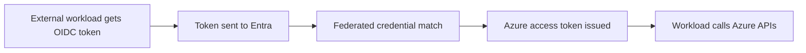
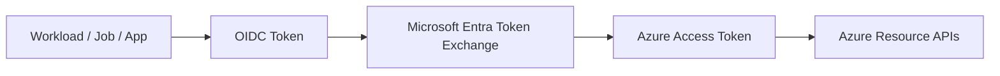
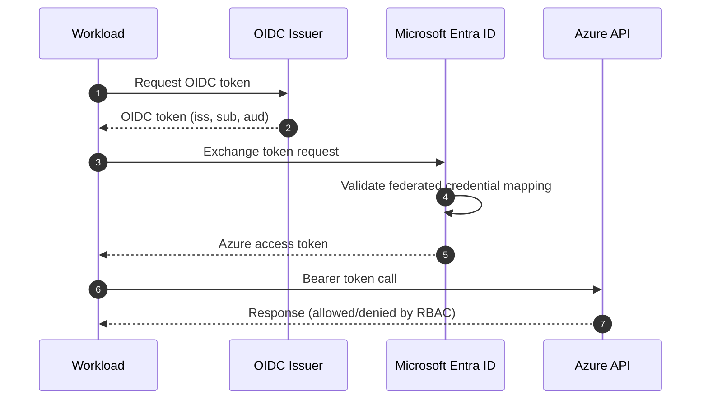
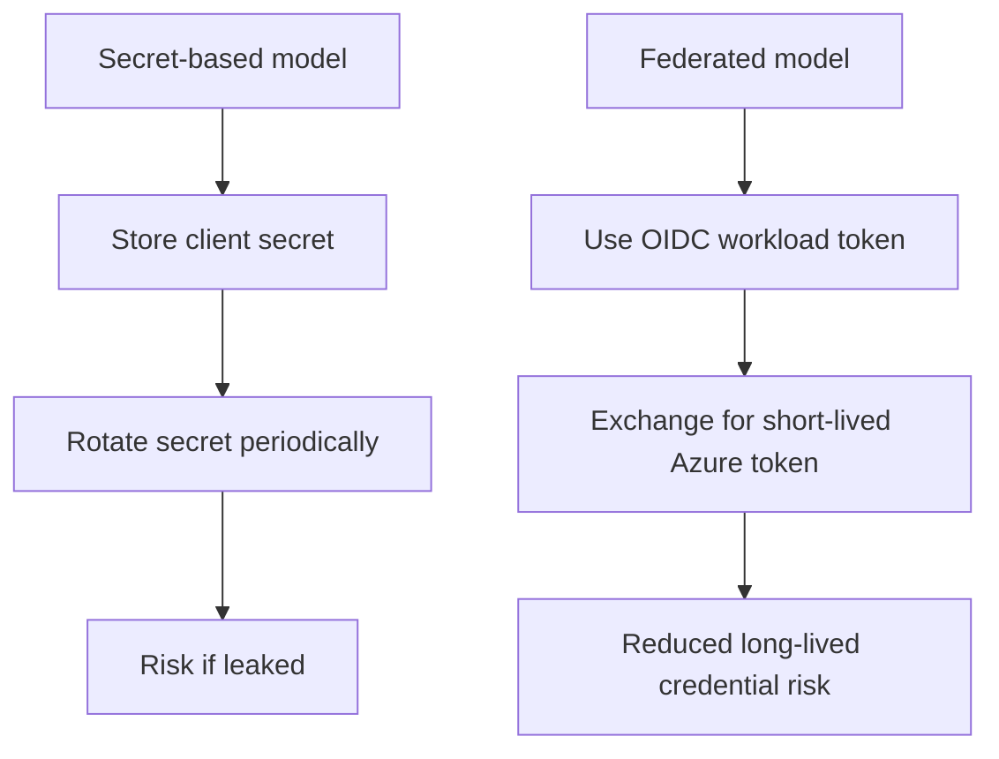

# Workload Identity Federation on Azure

## What is it?
Workload Identity Federation lets external or platform workloads exchange trusted OIDC tokens for Azure access tokens without long-lived secrets.

## What is it used for?
It is used in CI/CD and cross-platform workloads (for example GitHub Actions) to access Azure securely.

## Why is it important?
It removes static secret management while preserving strong, auditable trust boundaries.

## Workflow


## Overview
Workload Identity Federation (WIF) lets applications, automation jobs, and CI/CD workloads access Azure **without storing long-lived secrets**.

Instead of static credentials, a workload presents a short-lived OIDC token to Microsoft Entra ID, which exchanges it for an Azure access token when trust conditions match.

---

## Beginner View
Think of WIF as:
- **Who are you?** → proven by OIDC token (`iss`, `sub`, `aud`)
- **Do I trust you?** → checked by federated credential mapping
- **What can you do?** → controlled by RBAC permissions

No static passwords/secrets are required.

---

## High-Level Flow



---

## Core Components

| Component | Purpose |
| --- | --- |
| Workload Identity Provider | Issues OIDC token for workload |
| App Registration / Service Principal | Identity object trusted by Entra ID |
| Federated Credential | Trust policy (`issuer`, `subject`, `audience`) |
| RBAC Role Assignment | Authorizes resource actions |

---

## Trust and Token Exchange



---

## From Beginner to Advanced

## Level 1 — Beginner
- Understand difference: secret-based auth vs token-based federation
- Learn `issuer`, `subject`, `audience`
- Validate a simple read call works

## Level 2 — Intermediate
- Create federated credential with strict mapping
- Assign least-privilege RBAC at resource group/resource scope
- Test success and expected authorization failures

## Level 3 — Advanced
- Separate identities per environment and workload boundary
- Use custom roles for least privilege
- Add monitoring, alerts, and periodic trust policy review

---

## Setup Steps

1. Create or select a Microsoft Entra app registration.
2. Configure federated credential with exact:
   - `issuer`
   - `subject`
   - `audience`
3. Grant required RBAC role at minimal scope.
4. Configure workload to request OIDC token and exchange it.
5. Call Azure APIs using returned access token.

---

## Validation Checklist

- Federated credential exists and is enabled
- `issuer` exactly matches token issuer
- `subject` exactly matches expected workload identity
- `audience` is correct for token exchange
- RBAC assigned at correct scope
- Workload can execute a safe read action
- No client secret stored in pipeline/app settings

---

## Step-by-Step: Test This in Azure

### Prerequisites
- Azure CLI authenticated
- A GitHub repository (or any OIDC-capable platform) to simulate the workload token
- Azure subscription with permission to create app registrations and role assignments

### Step 1 — Create an App Registration for the workload
```bash
az ad app create --display-name "test-wif-learning"
APP_ID=$(az ad app list --display-name "test-wif-learning" --query "[0].appId" -o tsv)
SP_OBJECT_ID=$(az ad sp create --id $APP_ID --query id -o tsv)
echo "App ID: $APP_ID"
echo "SP Object ID: $SP_OBJECT_ID"
```
**Verify:** Both IDs are printed without errors.

### Step 2 — Add a federated credential (trust GitHub Actions)
```bash
# Replace with your actual GitHub org/repo and branch
az ad app federated-credential create \
  --id $APP_ID \
  --parameters '{
    "name": "github-main-branch",
    "issuer": "https://token.actions.githubusercontent.com",
    "subject": "repo:<your-github-org>/<your-repo>:ref:refs/heads/main",
    "audiences": ["api://AzureADTokenExchange"]
  }'
```
**Verify:** Federated credential created with the exact `issuer`, `subject`, `audiences`.

### Step 3 — Assign a role to the SP
```bash
SUBSCRIPTION_ID=$(az account show --query id -o tsv)

az role assignment create \
  --assignee $SP_OBJECT_ID \
  --role "Reader" \
  --scope "/subscriptions/$SUBSCRIPTION_ID"
```
**Verify:** Role assignment created with `principalType: ServicePrincipal`.

### Step 4 — Configure GitHub Actions workflow to use the federated identity
In your GitHub repo, create `.github/workflows/test-wif.yml`:
```yaml
name: Test WIF
on: [push]
permissions:
  id-token: write
  contents: read
jobs:
  test:
    runs-on: ubuntu-latest
    steps:
      - uses: azure/login@v1
        with:
          client-id: ${{ secrets.AZURE_CLIENT_ID }}
          tenant-id: ${{ secrets.AZURE_TENANT_ID }}
          subscription-id: ${{ secrets.AZURE_SUBSCRIPTION_ID }}
      - run: az group list --query "[].name" -o table
```
Set GitHub Secrets: `AZURE_CLIENT_ID=$APP_ID`, `AZURE_TENANT_ID`, `AZURE_SUBSCRIPTION_ID`.

**Verify:** Workflow runs and lists resource groups — no client secret was used.

### Step 5 — Positive test: confirm token exchange works
In the GitHub Actions log, you should see:
- Login step succeeds
- `az group list` returns results
- No credentials stored

### Step 6 — Negative test: wrong subject
```bash
# Create a federated credential with wrong subject
az ad app federated-credential create \
  --id $APP_ID \
  --parameters '{
    "name": "wrong-subject",
    "issuer": "https://token.actions.githubusercontent.com",
    "subject": "repo:wrong-org/wrong-repo:ref:refs/heads/main",
    "audiences": ["api://AzureADTokenExchange"]
  }'
```
Trigger the workflow again after removing the correct credential — login step will fail with token exchange error.

### Step 7 — Negative test: missing RBAC
```bash
# Remove the Reader role
az role assignment delete \
  --assignee $SP_OBJECT_ID \
  --role "Reader" \
  --scope "/subscriptions/$SUBSCRIPTION_ID"
```
Trigger the workflow — login succeeds (auth works) but `az group list` returns empty or `AuthorizationFailed`.

### Step 8 — Inspect federated credentials
```bash
az ad app federated-credential list --id $APP_ID -o table
```
**Verify:** All configured trust mappings are visible with their `issuer`, `subject`, `audiences`.

### Step 9 — Clean up
```bash
az ad app delete --id $APP_ID
```

### What to Confirm End-to-End
| Check | Expected |
|---|---|
| Federated credential created | Yes |
| GitHub Actions login without secret | Yes |
| Resource access with Reader role works | Yes |
| Wrong subject → token exchange fails | Yes |
| Missing role → auth passes, action fails | Yes |
| Deleting app removes all trust config | Yes |

---

## Test Plan

## Positive tests
- Token exchange succeeds with expected identity
- Resource read action succeeds with Reader role

## Negative tests
- Wrong `issuer` → token exchange fails
- Wrong `subject` → token exchange fails
- Wrong `audience` → token exchange fails
- Missing RBAC → auth succeeds but resource action fails
- Out-of-scope action → denied by RBAC

---

## Troubleshooting

| Symptom | Likely Cause | Fix |
| --- | --- | --- |
| Token exchange error | Issuer/subject/audience mismatch | Correct federated credential values |
| Auth success, action denied | RBAC missing or too narrow | Assign required role at correct scope |
| Works in one environment only | Identity mapping scoped too tightly | Add explicit mapping for each intended workload |
| Intermittent failures | Incorrect task/runtime identity usage | Verify workload identity source and token exchange path |

---

## Security Best Practices

- Use least privilege RBAC
- Keep trust mappings narrow and explicit
- Separate identities by environment
- Audit sign-ins and token exchange activity
- Remove stale federated credentials
- Prefer short-lived tokens and avoid static secrets

---

## Secret-Based vs Federated



---

## Summary
Workload Identity Federation on Azure replaces static secrets with short-lived token trust. With strict `issuer/subject/audience` mapping plus least-privilege RBAC, it provides a safer and more maintainable authentication model for workloads.
