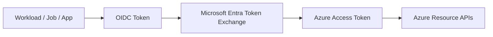
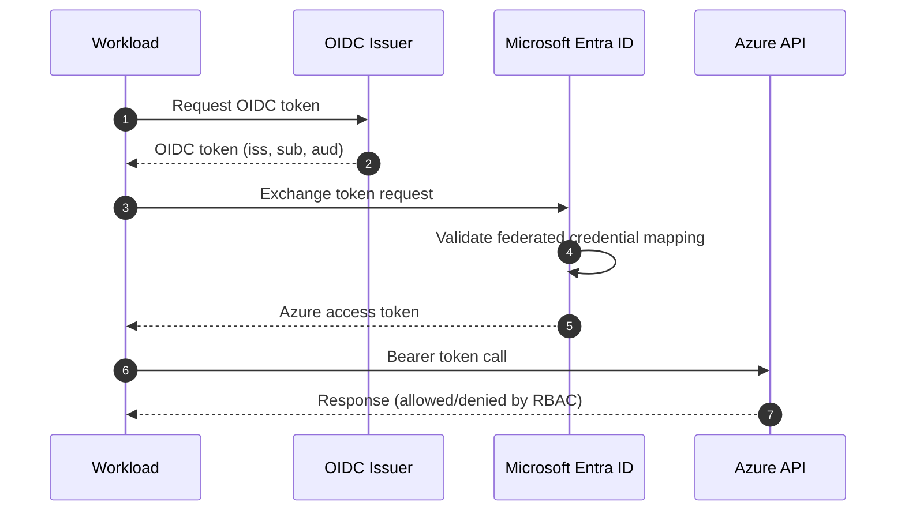
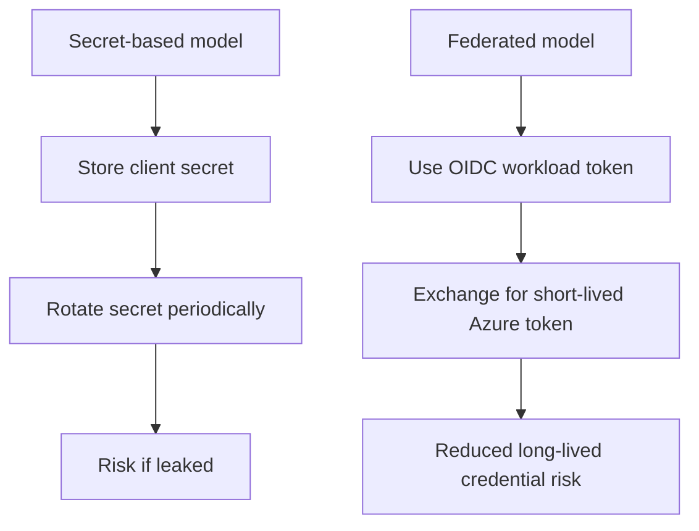

# Workload Identity Federation on Azure

## Overview
Workload Identity Federation (WIF) lets applications, automation jobs, and CI/CD workloads access Azure **without storing long-lived secrets**.

Instead of static credentials, a workload presents a short-lived OIDC token to Microsoft Entra ID, which exchanges it for an Azure access token when trust conditions match.

---

## Beginner View
Think of WIF as:
- **Who are you?** → proven by OIDC token (`iss`, `sub`, `aud`)
- **Do I trust you?** → checked by federated credential mapping
- **What can you do?** → controlled by RBAC permissions

No static passwords/secrets are required.

---

## High-Level Flow

---

## Core Components

| Component | Purpose |
| --- | --- |
| Workload Identity Provider | Issues OIDC token for workload |
| App Registration / Service Principal | Identity object trusted by Entra ID |
| Federated Credential | Trust policy (`issuer`, `subject`, `audience`) |
| RBAC Role Assignment | Authorizes resource actions |

---

## Trust and Token Exchange

---

## From Beginner to Advanced

## Level 1 — Beginner
- Understand difference: secret-based auth vs token-based federation
- Learn `issuer`, `subject`, `audience`
- Validate a simple read call works

## Level 2 — Intermediate
- Create federated credential with strict mapping
- Assign least-privilege RBAC at resource group/resource scope
- Test success and expected authorization failures

## Level 3 — Advanced
- Separate identities per environment and workload boundary
- Use custom roles for least privilege
- Add monitoring, alerts, and periodic trust policy review

---

## Setup Steps

1. Create or select a Microsoft Entra app registration.
2. Configure federated credential with exact:
   - `issuer`
   - `subject`
   - `audience`
3. Grant required RBAC role at minimal scope.
4. Configure workload to request OIDC token and exchange it.
5. Call Azure APIs using returned access token.

---

## Validation Checklist

- Federated credential exists and is enabled
- `issuer` exactly matches token issuer
- `subject` exactly matches expected workload identity
- `audience` is correct for token exchange
- RBAC assigned at correct scope
- Workload can execute a safe read action
- No client secret stored in pipeline/app settings

---

## Test Plan

## Positive tests
- Token exchange succeeds with expected identity
- Resource read action succeeds with Reader role

## Negative tests
- Wrong `issuer` → token exchange fails
- Wrong `subject` → token exchange fails
- Wrong `audience` → token exchange fails
- Missing RBAC → auth succeeds but resource action fails
- Out-of-scope action → denied by RBAC

---

## Troubleshooting

| Symptom | Likely Cause | Fix |
| --- | --- | --- |
| Token exchange error | Issuer/subject/audience mismatch | Correct federated credential values |
| Auth success, action denied | RBAC missing or too narrow | Assign required role at correct scope |
| Works in one environment only | Identity mapping scoped too tightly | Add explicit mapping for each intended workload |
| Intermittent failures | Incorrect task/runtime identity usage | Verify workload identity source and token exchange path |

---

## Security Best Practices

- Use least privilege RBAC
- Keep trust mappings narrow and explicit
- Separate identities by environment
- Audit sign-ins and token exchange activity
- Remove stale federated credentials
- Prefer short-lived tokens and avoid static secrets

---

## Secret-Based vs Federated

---

## Summary
Workload Identity Federation on Azure replaces static secrets with short-lived token trust. With strict `issuer/subject/audience` mapping plus least-privilege RBAC, it provides a safer and more maintainable authentication model for workloads.
