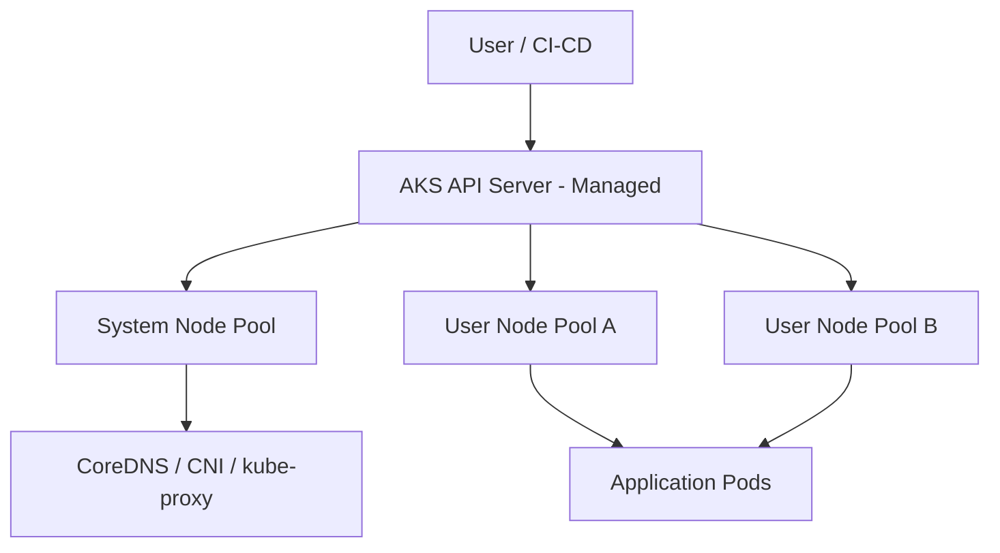
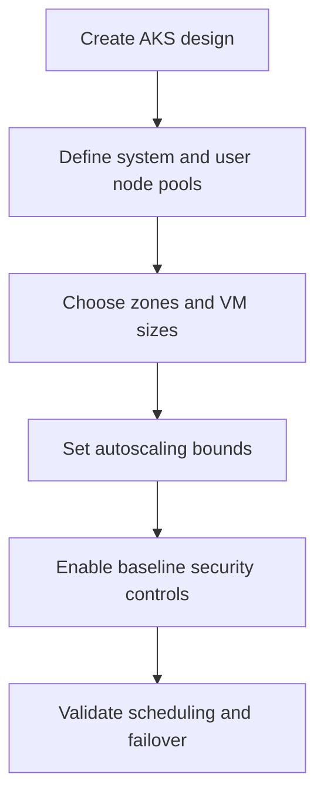

# AKS Architecture Basics

## Why this matters
Understanding AKS architecture helps you design secure, scalable clusters and avoid production surprises.

## Core components
- **Control plane (managed by Azure):** API server, scheduler, controller manager, etcd
- **Node pools (managed by you):** VMs that run your pods
- **System node pool:** runs cluster add-ons (CoreDNS, CNI, metrics)
- **User node pools:** run your applications



## Recommended workflow


## Portal checks
1. Azure Portal -> Kubernetes services -> your AKS -> **Node pools**
2. Confirm at least 1 **system** node pool and separate **user** node pool(s)
3. Check zone distribution and autoscaling settings
4. Review **Workloads** and **Insights** for pod distribution

## Azure CLI checks
```bash
# Cluster architecture summary
az aks show -g <rg> -n <aks> --query "{name:name,k8sVersion:kubernetesVersion,nodeRG:nodeResourceGroup,private:apiServerAccessProfile.enablePrivateCluster}" -o yaml

# Node pool roles and autoscaling
az aks nodepool list -g <rg> --cluster-name <aks> --query "[].{name:name,mode:mode,count:count,vmSize:vmSize,autoscale:enableAutoScaling,min:minCount,max:maxCount,zones:availabilityZones}" -o table

# Nodes by pool
kubectl get nodes -L agentpool
```

## What good looks like
- System workloads isolated from app workloads
- Autoscaling enabled for user pools
- Zone-aware deployment for higher availability
