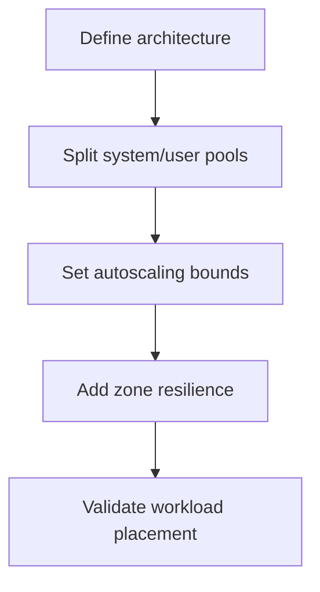
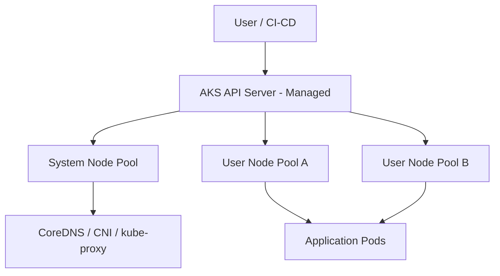
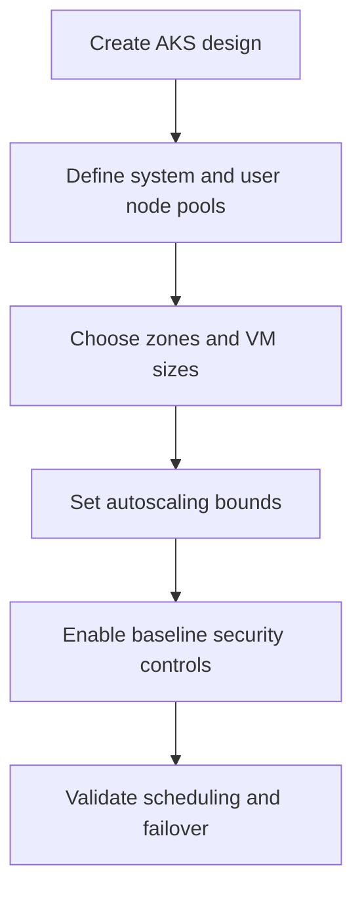

# AKS Architecture Basics

## What is it?
AKS architecture defines how the managed control plane, system node pool, and user node pools are designed and operated.

## What is it used for?
- Separating platform components from application workloads
- Designing high availability and scaling boundaries
- Planning upgrades and operational ownership

## Why is it important?
Good architecture avoids noisy-neighbor issues, improves reliability, and keeps cluster operations predictable.

## Workflow


## Why this matters
Understanding AKS architecture helps you design secure, scalable clusters and avoid production surprises.

## Core components
- **Control plane (managed by Azure):** API server, scheduler, controller manager, etcd
- **Node pools (managed by you):** VMs that run your pods
- **System node pool:** runs cluster add-ons (CoreDNS, CNI, metrics)
- **User node pools:** run your applications



## Recommended workflow


## Detailed workflow (step-by-step)

1. **Choose cluster boundaries**
    - Decide if one cluster is enough or if multiple clusters are required by environment/compliance.
2. **Create node pool strategy**
    - Keep one **system** pool for cluster add-ons.
    - Create **user** pools by workload type (general, compute-heavy, memory-heavy).
3. **Place workloads intentionally**
    - Use taints/tolerations and node selectors to isolate critical services.
4. **Set scaling posture**
    - Enable autoscaling for user pools and define min/max limits.
5. **Add resilience controls**
    - Distribute critical workloads across zones.
6. **Validate operations readiness**
    - Test drain, rollout, and failover behavior before production use.

## Common mistakes to avoid

- Running application pods on the system pool.
- Keeping all workloads in one node pool.
- No zone distribution for critical services.
- Static node counts with no autoscaling.

## Quick validation checklist

- System and user pools are separate.
- Critical workloads are pinned to intended pools.
- Spread constraints exist for high-priority services.
- Autoscaler bounds match expected traffic patterns.

## Portal checks
1. Azure Portal -> Kubernetes services -> your AKS -> **Node pools**
2. Confirm at least 1 **system** node pool and separate **user** node pool(s)
3. Check zone distribution and autoscaling settings
4. Review **Workloads** and **Insights** for pod distribution

## Azure CLI checks
```bash
# Cluster architecture summary
az aks show -g <rg> -n <aks> --query "{name:name,k8sVersion:kubernetesVersion,nodeRG:nodeResourceGroup,private:apiServerAccessProfile.enablePrivateCluster}" -o yaml

# Node pool roles and autoscaling
az aks nodepool list -g <rg> --cluster-name <aks> --query "[].{name:name,mode:mode,count:count,vmSize:vmSize,autoscale:enableAutoScaling,min:minCount,max:maxCount,zones:availabilityZones}" -o table

# Nodes by pool
kubectl get nodes -L agentpool
```

## What good looks like
- System workloads isolated from app workloads
- Autoscaling enabled for user pools
- Zone-aware deployment for higher availability
- Architecture validated in non-production before rollout

## Public references
- Microsoft Learn: AKS architecture and core concepts
- Microsoft Learn: System and user node pools in AKS
- Microsoft Learn: Availability zones guidance for AKS
