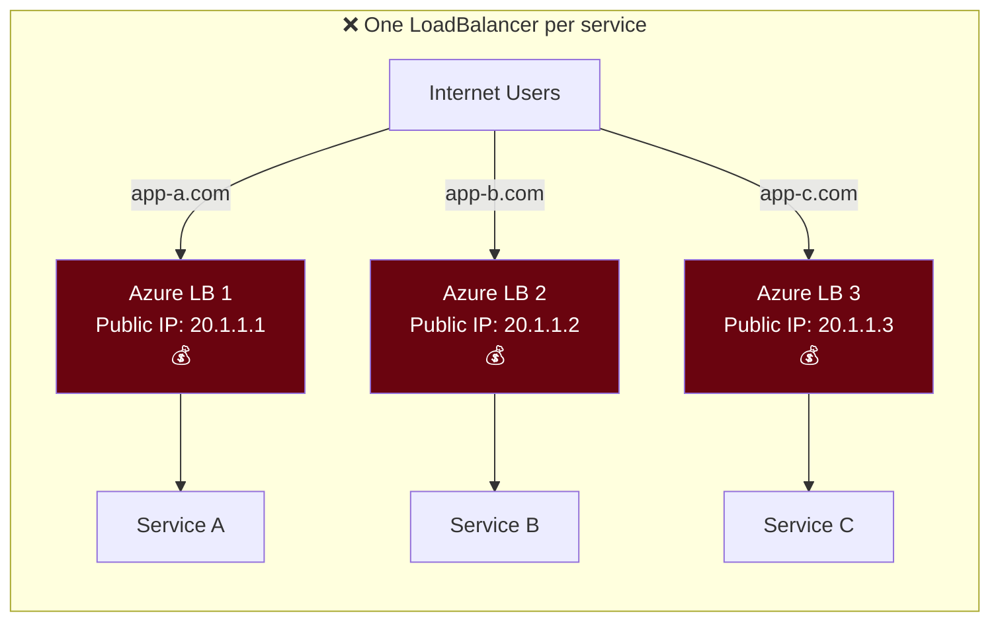
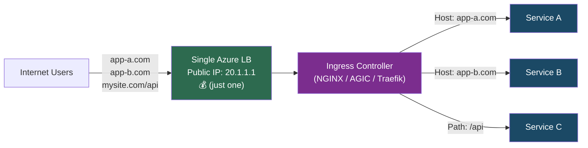
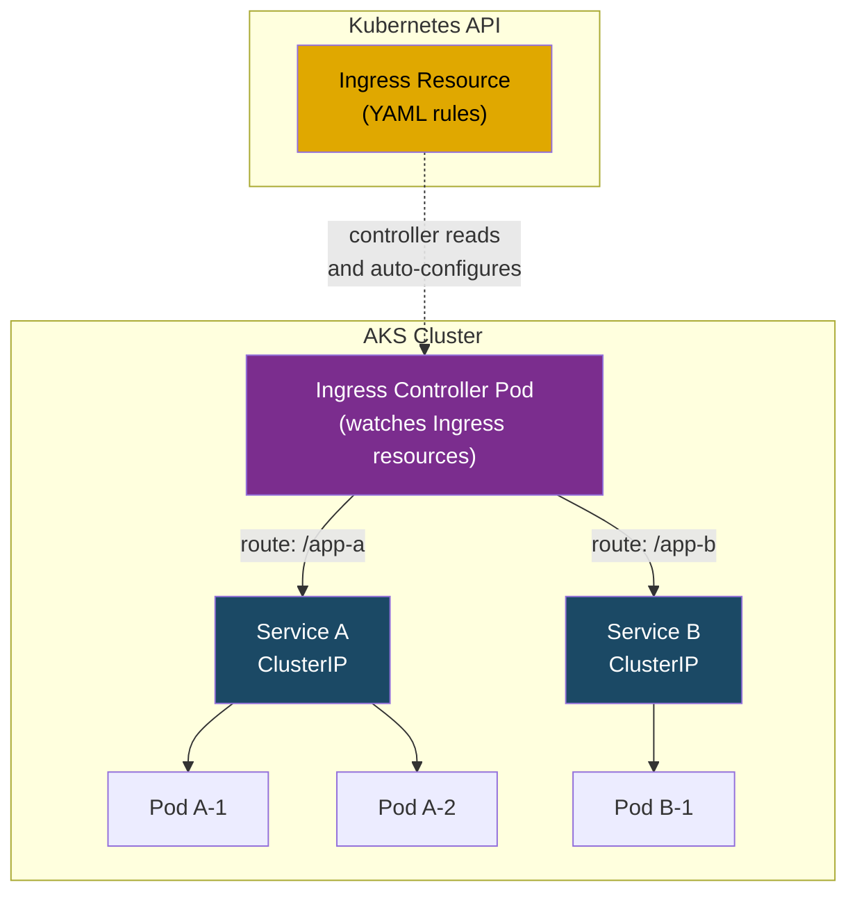
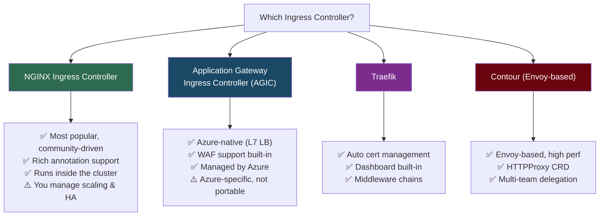
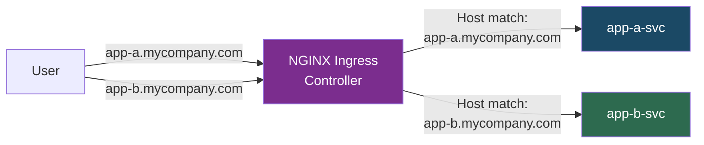
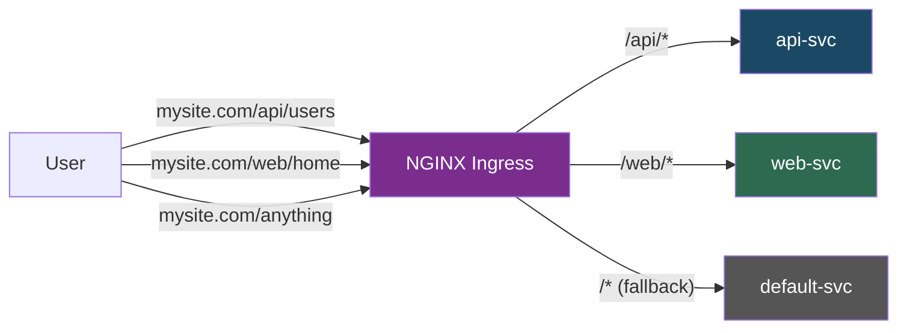
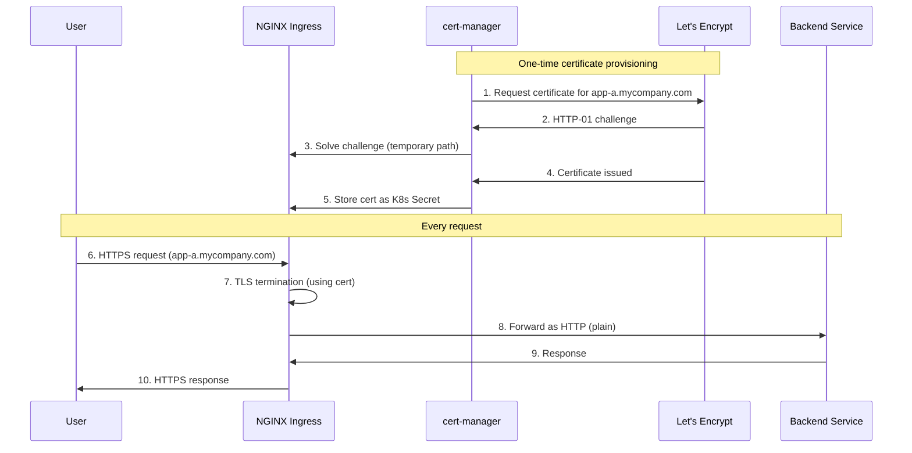
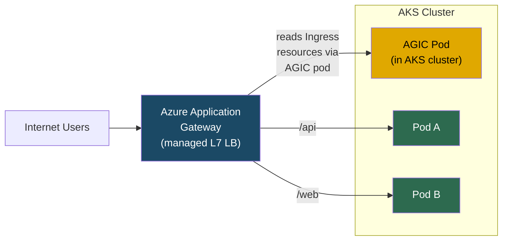
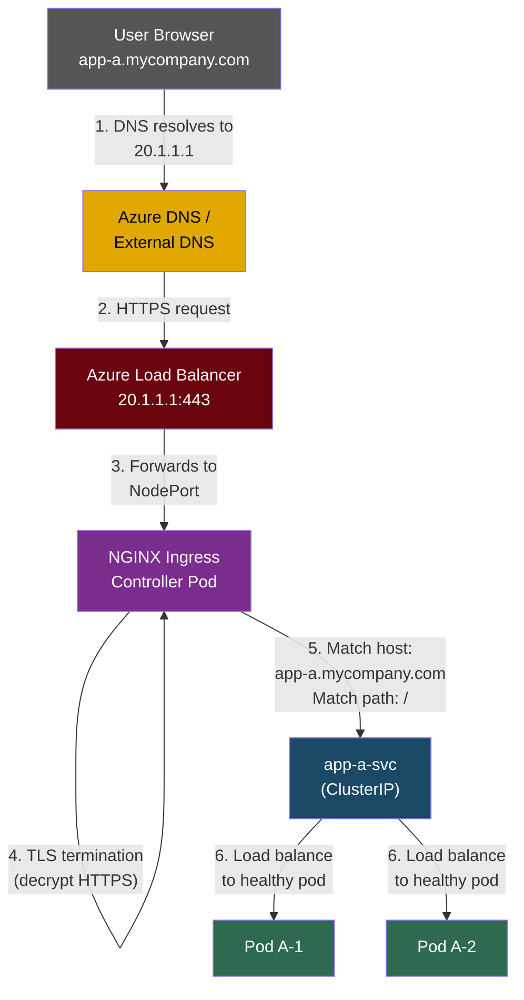

# AKS Ingress Controllers

## The Problem: How Does External Traffic Reach Your Pods?

In Kubernetes, pods are ephemeral and get new IPs constantly. Kubernetes **Services** (ClusterIP, NodePort, LoadBalancer) provide stable networking, but they have limitations when you need to expose **multiple HTTP services** to the outside world.

### Without an Ingress Controller



**Problems:**
- Each `LoadBalancer` service creates a **separate Azure Load Balancer** with its own **public IP** — expensive and wasteful
- No path-based routing (can't do `mysite.com/api` → Service A, `mysite.com/web` → Service B)
- No TLS termination at a central point
- No centralized rate limiting, auth, or header manipulation

### With an Ingress Controller



**One Load Balancer, one IP, multiple services** — the Ingress Controller handles routing based on hostname, path, headers, etc.

---

## What is an Ingress Controller?

An Ingress Controller is a **reverse proxy** running inside your AKS cluster that:

1. **Watches** Kubernetes `Ingress` resources for routing rules
2. **Configures** itself automatically based on those rules
3. **Routes** incoming HTTP/HTTPS traffic to the correct backend services



---

## Why is it Needed?

| Need | Without Ingress | With Ingress Controller |
|------|----------------|------------------------|
| **Cost** | 1 Azure LB per service ($$$) | 1 Azure LB for all services ($) |
| **Routing** | IP-based only | Host-based, path-based, header-based |
| **TLS** | Configure per service | Centralized TLS termination |
| **Rate limiting** | Custom code per service | Built-in / annotation-based |
| **Auth** | Each service handles it | Centralized (OAuth, basic auth) |
| **Observability** | Scattered metrics | Centralized access logs & metrics |
| **Canary / A-B testing** | Not possible | Traffic splitting by weight |

---

## Ingress Controller Options on AKS



| Controller | Type | Managed by | Best For |
|-----------|------|-----------|----------|
| **NGINX Ingress** | In-cluster reverse proxy | You (Helm chart) | General purpose, most flexibility |
| **AGIC** | Azure App Gateway (external) | Azure | WAF, Azure-native, enterprise |
| **Traefik** | In-cluster reverse proxy | You (Helm chart) | Auto TLS, middleware, dashboard |
| **Contour** | In-cluster (Envoy) | You (Helm chart) | High perf, multi-team delegation |

---

## How to Set Up: NGINX Ingress Controller (Most Common)

### Step 1: Install NGINX Ingress Controller via Helm

```bash
# Add the ingress-nginx repo
helm repo add ingress-nginx https://kubernetes.github.io/ingress-nginx
helm repo update

# Install into its own namespace
helm install ingress-nginx ingress-nginx/ingress-nginx \
  --create-namespace \
  --namespace ingress-nginx \
  --set controller.service.annotations."service\.beta\.kubernetes\.io/azure-load-balancer-health-probe-request-path"=/healthz
```

```bash
# Verify — wait for the EXTERNAL-IP to be assigned
kubectl get svc -n ingress-nginx
# NAME                       TYPE           CLUSTER-IP     EXTERNAL-IP    PORT(S)
# ingress-nginx-controller   LoadBalancer   10.0.45.100    20.1.1.1       80:31080/TCP,443:31443/TCP
```

### Step 2: Deploy Your Application Services

```yaml
# app-a.yaml
apiVersion: apps/v1
kind: Deployment
metadata:
  name: app-a
spec:
  replicas: 2
  selector:
    matchLabels:
      app: app-a
  template:
    metadata:
      labels:
        app: app-a
    spec:
      containers:
        - name: app-a
          image: myregistry.azurecr.io/app-a:latest
          ports:
            - containerPort: 8080
---
apiVersion: v1
kind: Service
metadata:
  name: app-a-svc
spec:
  type: ClusterIP          # No need for LoadBalancer — Ingress handles external access
  ports:
    - port: 80
      targetPort: 8080
  selector:
    app: app-a
```

### Step 3: Create Ingress Resources (Routing Rules)

#### Host-Based Routing

Route traffic based on the hostname in the request:

```yaml
# ingress-host-based.yaml
apiVersion: networking.k8s.io/v1
kind: Ingress
metadata:
  name: my-ingress
  annotations:
    nginx.ingress.kubernetes.io/rewrite-target: /
spec:
  ingressClassName: nginx
  rules:
    - host: app-a.mycompany.com
      http:
        paths:
          - path: /
            pathType: Prefix
            backend:
              service:
                name: app-a-svc
                port:
                  number: 80
    - host: app-b.mycompany.com
      http:
        paths:
          - path: /
            pathType: Prefix
            backend:
              service:
                name: app-b-svc
                port:
                  number: 80
```



#### Path-Based Routing

Route traffic based on the URL path:

```yaml
# ingress-path-based.yaml
apiVersion: networking.k8s.io/v1
kind: Ingress
metadata:
  name: my-ingress-paths
  annotations:
    nginx.ingress.kubernetes.io/rewrite-target: /$1
spec:
  ingressClassName: nginx
  rules:
    - host: mysite.com
      http:
        paths:
          - path: /api/(.*)
            pathType: ImplementationSpecific
            backend:
              service:
                name: api-svc
                port:
                  number: 80
          - path: /web/(.*)
            pathType: ImplementationSpecific
            backend:
              service:
                name: web-svc
                port:
                  number: 80
          - path: /(.*)
            pathType: ImplementationSpecific
            backend:
              service:
                name: default-svc
                port:
                  number: 80
```



---

## TLS Termination

The Ingress Controller handles HTTPS so your backend services don't need to.

### Option A: TLS with a Kubernetes Secret

```bash
# Create a TLS secret from your certificate
kubectl create secret tls my-tls-secret \
  --cert=tls.crt \
  --key=tls.key
```

```yaml
apiVersion: networking.k8s.io/v1
kind: Ingress
metadata:
  name: tls-ingress
spec:
  ingressClassName: nginx
  tls:
    - hosts:
        - app-a.mycompany.com
      secretName: my-tls-secret
  rules:
    - host: app-a.mycompany.com
      http:
        paths:
          - path: /
            pathType: Prefix
            backend:
              service:
                name: app-a-svc
                port:
                  number: 80
```

### Option B: Automatic TLS with cert-manager (Let's Encrypt)

```bash
# Install cert-manager
helm repo add jetstack https://charts.jetstack.io
helm repo update

helm install cert-manager jetstack/cert-manager \
  --namespace cert-manager \
  --create-namespace \
  --set crds.enabled=true
```

```yaml
# cluster-issuer.yaml — Let's Encrypt production issuer
apiVersion: cert-manager.io/v1
kind: ClusterIssuer
metadata:
  name: letsencrypt-prod
spec:
  acme:
    server: https://acme-v02.api.letsencrypt.org/directory
    email: your-email@mycompany.com
    privateKeySecretRef:
      name: letsencrypt-prod
    solvers:
      - http01:
          ingress:
            class: nginx
```

```yaml
# ingress with automatic TLS
apiVersion: networking.k8s.io/v1
kind: Ingress
metadata:
  name: auto-tls-ingress
  annotations:
    cert-manager.io/cluster-issuer: "letsencrypt-prod"     # ← auto-generates cert
spec:
  ingressClassName: nginx
  tls:
    - hosts:
        - app-a.mycompany.com
      secretName: app-a-tls                                 # ← cert-manager creates this
  rules:
    - host: app-a.mycompany.com
      http:
        paths:
          - path: /
            pathType: Prefix
            backend:
              service:
                name: app-a-svc
                port:
                  number: 80
```



---

## Internal Ingress (Private / No Public IP)

For services that should only be reachable within the VNet (not from the internet):

```bash
helm install ingress-nginx-internal ingress-nginx/ingress-nginx \
  --namespace ingress-internal \
  --create-namespace \
  --set controller.ingressClassResource.name=nginx-internal \
  --set controller.ingressClassResource.controllerValue=k8s.io/ingress-nginx-internal \
  --set controller.service.annotations."service\.beta\.kubernetes\.io/azure-load-balancer-internal"=true
```

```yaml
apiVersion: networking.k8s.io/v1
kind: Ingress
metadata:
  name: internal-ingress
spec:
  ingressClassName: nginx-internal      # ← uses the internal ingress class
  rules:
    - host: api.internal.mycompany.com
      http:
        paths:
          - path: /
            pathType: Prefix
            backend:
              service:
                name: internal-api-svc
                port:
                  number: 80
```

> **Use case:** Cross-cluster communication (from our [inter-service-communication doc](inter-service-communication.md)), internal APIs, admin dashboards.

---

## AGIC (Application Gateway Ingress Controller) — Azure-Native Option

Instead of running NGINX inside the cluster, AGIC uses **Azure Application Gateway** (a managed L7 load balancer) as the ingress.



**Key difference:** With NGINX, the reverse proxy runs **inside** the cluster. With AGIC, the reverse proxy is **outside** (Azure App Gateway) — the AGIC pod just syncs Ingress rules to the App Gateway config.

```bash
# Enable AGIC add-on on existing AKS cluster
az aks enable-addons \
  --resource-group myRG \
  --name myAKS \
  --addons ingress-appgw \
  --appgw-subnet-cidr "10.225.0.0/16" \
  --appgw-name myAppGateway
```

### NGINX vs AGIC

| | NGINX Ingress | AGIC (App Gateway) |
|---|---|---|
| **Runs** | Inside cluster (pods) | Outside cluster (Azure PaaS) |
| **Scaling** | You manage (HPA) | Azure auto-scales |
| **WAF** | Requires separate setup | Built-in (WAF v2) |
| **Cost** | Pod resources only | App Gateway SKU pricing |
| **Portability** | Works on any K8s | Azure-only |
| **Annotations** | NGINX-specific | App Gateway-specific |
| **SSL offloading** | Yes | Yes |
| **Best for** | Multi-cloud, flexibility | Azure-native, enterprise WAF |

---

## Common NGINX Ingress Annotations

```yaml
metadata:
  annotations:
    # Rewrite the URL path
    nginx.ingress.kubernetes.io/rewrite-target: /

    # Rate limiting (5 req/sec per IP)
    nginx.ingress.kubernetes.io/limit-rps: "5"

    # Request body size limit
    nginx.ingress.kubernetes.io/proxy-body-size: "50m"

    # Timeout settings
    nginx.ingress.kubernetes.io/proxy-connect-timeout: "10"
    nginx.ingress.kubernetes.io/proxy-read-timeout: "60"

    # Force HTTPS redirect
    nginx.ingress.kubernetes.io/ssl-redirect: "true"

    # CORS
    nginx.ingress.kubernetes.io/enable-cors: "true"
    nginx.ingress.kubernetes.io/cors-allow-origin: "https://mysite.com"

    # Basic auth
    nginx.ingress.kubernetes.io/auth-type: basic
    nginx.ingress.kubernetes.io/auth-secret: basic-auth-secret

    # Canary deployment (send 10% traffic to canary)
    nginx.ingress.kubernetes.io/canary: "true"
    nginx.ingress.kubernetes.io/canary-weight: "10"
```

---

## Complete Traffic Flow (End-to-End)



1. **User** makes a request to `app-a.mycompany.com`
2. **DNS** resolves to the Azure Load Balancer's public IP
3. **Azure LB** forwards traffic to the Ingress Controller pod (via NodePort)
4. **Ingress Controller** terminates TLS (if configured)
5. **Ingress Controller** matches the host/path rules to find the right backend service
6. **ClusterIP Service** load-balances across healthy pods

---

## Troubleshooting

| Symptom | Likely Cause | Fix |
|---------|-------------|-----|
| 404 Not Found | No matching Ingress rule for host/path | Check `kubectl get ingress` — verify host and path |
| 502 Bad Gateway | Backend service/pod is down | Check `kubectl get pods` and service endpoints |
| 503 Service Unavailable | No healthy backends | Check pod readiness probes |
| Ingress has no `ADDRESS` | LB not provisioned | Check `kubectl get svc -n ingress-nginx` for pending LB |
| TLS not working | Missing or wrong secret | Verify `kubectl get secret <tls-secret>` exists |
| Ingress rules ignored | Wrong `ingressClassName` | Ensure it matches your controller's class |

```bash
# Debug commands
kubectl get ingress                              # Check ingress rules and addresses
kubectl describe ingress <name>                  # Detailed routing info + events
kubectl logs -n ingress-nginx -l app.kubernetes.io/name=ingress-nginx  # Controller logs
kubectl get svc -n ingress-nginx                 # Check LB IP assignment
kubectl get endpoints <service-name>             # Verify service has healthy backends
```
