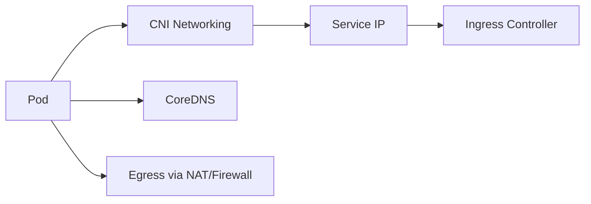
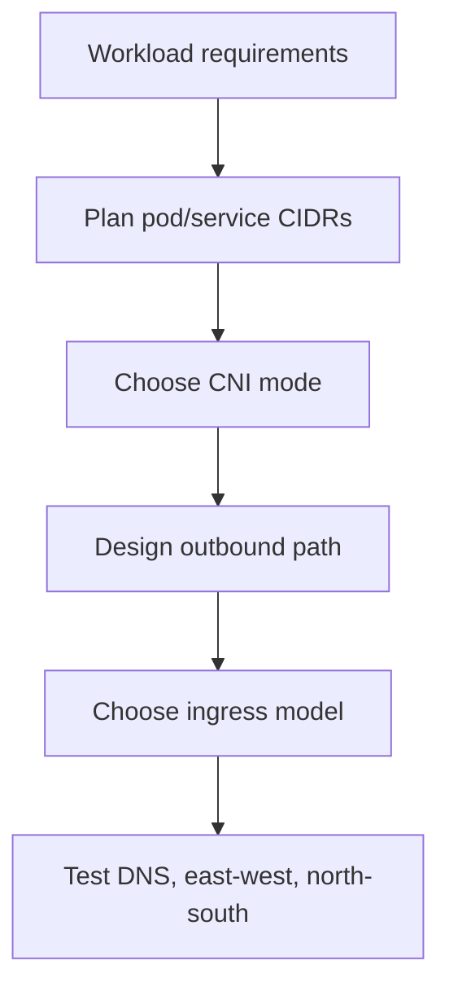

# AKS Networking Deep Dive

## Why this matters
Most AKS outages are networking issues: IP exhaustion, DNS resolution failure, NSG/UDR misconfiguration, or egress blocking.

## Key decisions
- **Network plugin:** Azure CNI Overlay vs Azure CNI
- **Egress strategy:** Load Balancer SNAT vs NAT Gateway vs Firewall
- **Ingress strategy:** NGINX / Application Gateway / Gateway API



## Design workflow


## Portal checks
1. AKS -> **Networking**: plugin mode, service CIDR, DNS service IP
2. AKS -> **Node pools**: subnet mapping
3. VNet -> **Subnets**: free IPs and route tables
4. NSG / Firewall logs for denied traffic

## Azure CLI checks
```bash
# Networking profile
az aks show -g <rg> -n <aks> --query "networkProfile" -o jsonc

# Subnet and route tables used by node pools
az aks nodepool list -g <rg> --cluster-name <aks> --query "[].{pool:name,vnetSubnetID:vnetSubnetID}" -o table

# CoreDNS health
kubectl -n kube-system get pods -l k8s-app=kube-dns

# Service and endpoint checks
kubectl get svc,endpoints -A
```

## What good looks like
- No IP exhaustion warnings
- DNS stable under scale
- Egress path deterministic and observable
