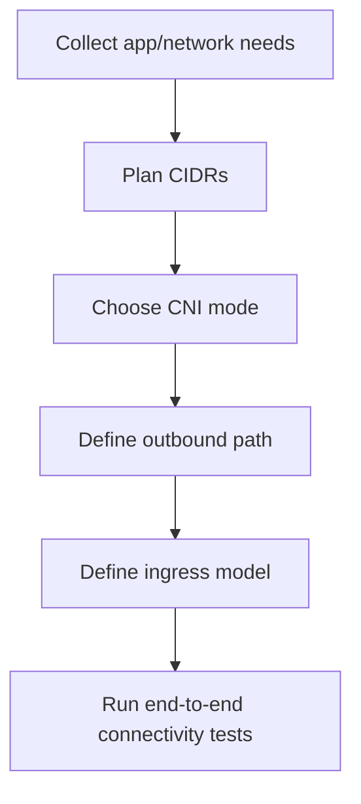
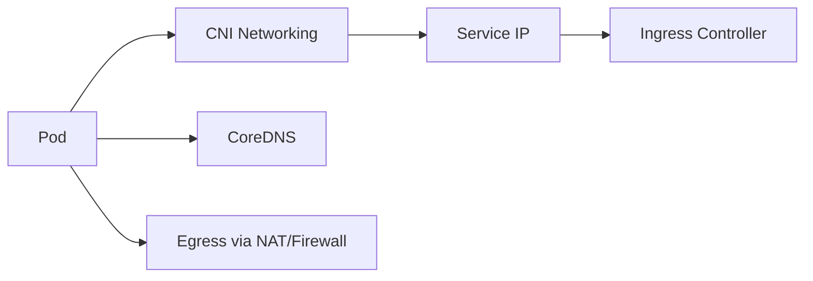
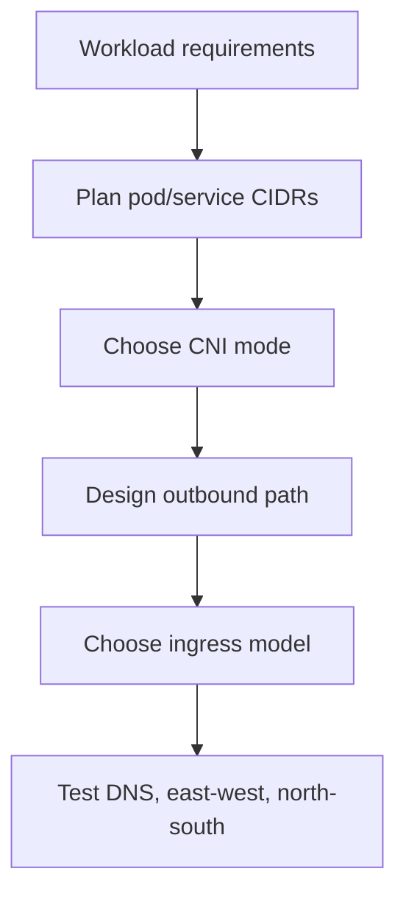

# AKS Networking Deep Dive

## What is it?
AKS networking defines how pods/services communicate internally and how traffic enters or exits the cluster.

## What is it used for?
- CNI model selection
- DNS and service discovery stability
- Ingress/egress path design and governance

## Why is it important?
Networking is a top failure domain in AKS; correct design prevents outages caused by IP exhaustion, routing errors, and blocked egress.

## Workflow


## Why this matters
Most AKS outages are networking issues: IP exhaustion, DNS resolution failure, NSG/UDR misconfiguration, or egress blocking.

## Key decisions
- **Network plugin:** Azure CNI Overlay vs Azure CNI
- **Egress strategy:** Load Balancer SNAT vs NAT Gateway vs Firewall
- **Ingress strategy:** NGINX / Application Gateway / Gateway API



## Design workflow


## Detailed workflow (step-by-step)

1. **Plan address space first**
    - Ensure pod/service CIDRs do not overlap with VNet, peered networks, or on-prem.
2. **Choose network plugin deliberately**
    - Select based on IP planning complexity, scale, and governance model.
3. **Define outbound path**
    - Decide if outbound internet should go directly, via NAT Gateway, or through Firewall.
4. **Design ingress architecture**
    - Select ingress option based on TLS, WAF, and path/host routing needs.
5. **Validate service discovery**
    - Confirm DNS resolution in each namespace and node pool.
6. **Run full path tests**
    - Validate pod-to-pod, pod-to-service, and pod-to-external flows.

## CNI choice quick guide

| Decision point | Practical guidance |
|---|---|
| Simpler IP management | Prefer Azure CNI Overlay |
| Direct VNet IP per pod | Consider Azure CNI |
| Strong egress governance | Use NAT/Firewall + explicit routes |

## Common failure patterns

- IP exhaustion due to poor CIDR/subnet sizing.
- DNS instability from CoreDNS pressure.
- Egress blocks due to NSG/UDR/firewall mismatch.
- Ingress healthy but backend endpoints missing.

## Portal checks
1. AKS -> **Networking**: plugin mode, service CIDR, DNS service IP
2. AKS -> **Node pools**: subnet mapping
3. VNet -> **Subnets**: free IPs and route tables
4. NSG / Firewall logs for denied traffic

## Azure CLI checks
```bash
# Networking profile
az aks show -g <rg> -n <aks> --query "networkProfile" -o jsonc

# Subnet and route tables used by node pools
az aks nodepool list -g <rg> --cluster-name <aks> --query "[].{pool:name,vnetSubnetID:vnetSubnetID}" -o table

# CoreDNS health
kubectl -n kube-system get pods -l k8s-app=kube-dns

# Service and endpoint checks
kubectl get svc,endpoints -A
```

## What good looks like
- No IP exhaustion warnings
- DNS stable under scale
- Egress path deterministic and observable

## Public references
- Microsoft Learn: AKS networking concepts
- Microsoft Learn: Azure CNI Overlay and Azure CNI
- Microsoft Learn: AKS outbound connectivity options
