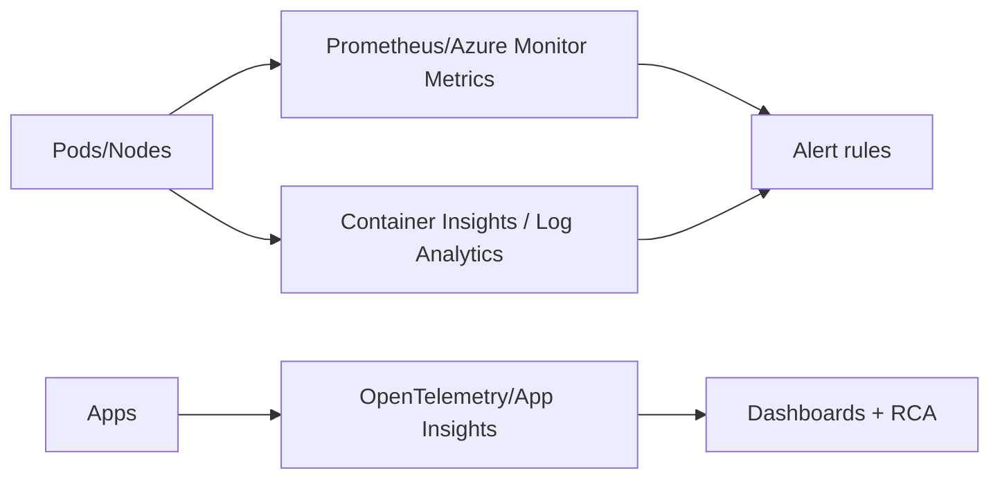
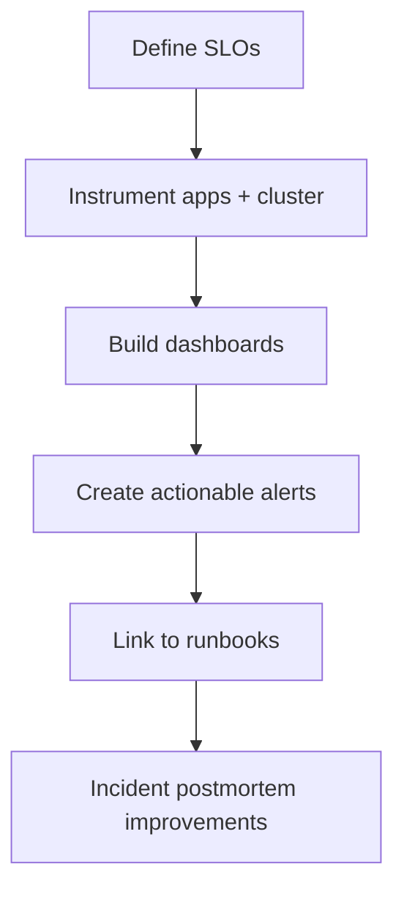

# AKS Observability

## Why this matters
Without observability, incidents take longer to detect and fix.

## Observability pillars
- Metrics (cluster and workload)
- Logs (control plane, node, container)
- Traces (service-to-service request path)
- Alerts (SLO and infrastructure)



## Workflow


## Portal checks
1. AKS -> **Insights** enabled and collecting
2. Log Analytics workspace connected
3. Alert rules for node not-ready, pod restart spike, API errors
4. Dashboards reflect critical services

## Azure CLI checks
```bash
# AKS monitoring addon profile
az aks show -g <rg> -n <aks> --query "addonProfiles" -o jsonc

# Pod restart hotspots
kubectl get pods -A --sort-by='.status.containerStatuses[0].restartCount'

# Basic cluster events
kubectl get events -A --sort-by=.lastTimestamp
```

## What good looks like
- Alerts fire early and with low noise
- Dashboards allow fast triage from cluster to pod level
