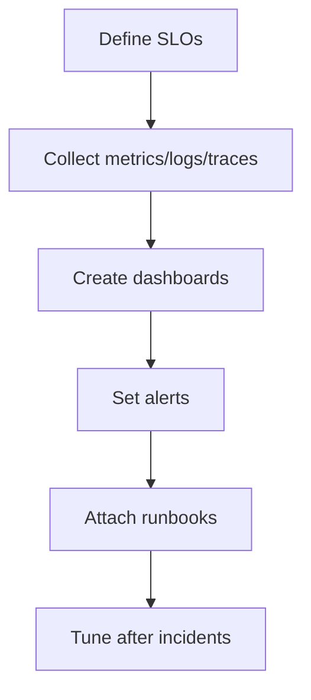
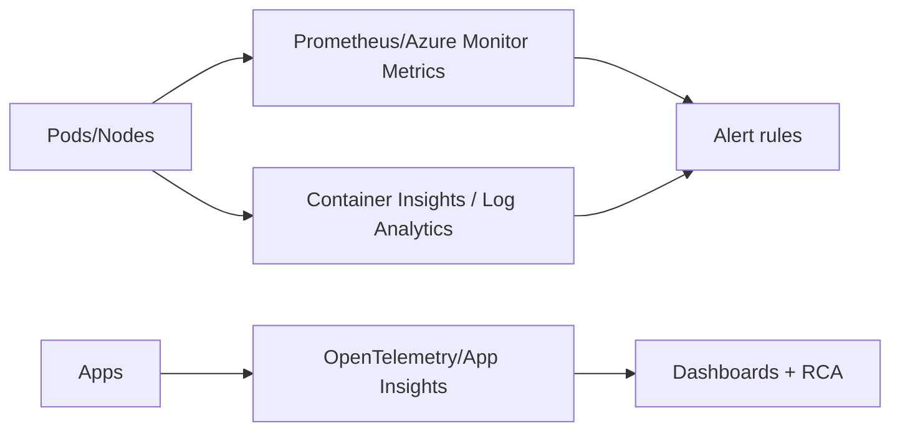
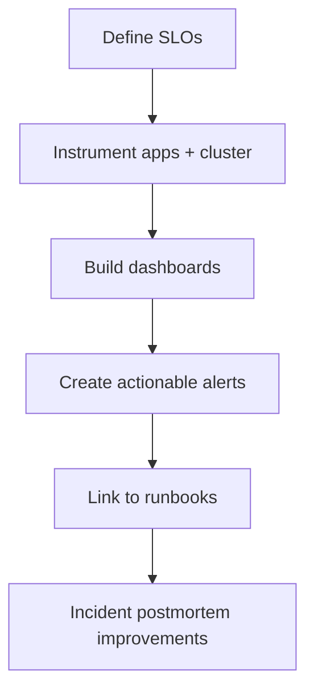

# AKS Observability

## What is it?
AKS observability is the practice of monitoring metrics, logs, traces, and events to understand cluster and workload behavior.

## What is it used for?
- Detecting incidents early
- Troubleshooting faster
- Tracking SLO/SLA health and platform trends

## Why is it important?
Without observability, incidents are detected late and recovery time increases significantly.

## Workflow


## Why this matters
Without observability, incidents take longer to detect and fix.

## Observability pillars
- Metrics (cluster and workload)
- Logs (control plane, node, container)
- Traces (service-to-service request path)
- Alerts (SLO and infrastructure)



## Workflow


## Detailed workflow (step-by-step)

1. **Define SLOs first**
    - Set clear targets for availability, latency, and error rate.
2. **Instrument platform and applications**
    - Capture node/pod metrics plus application-level telemetry.
3. **Build layered dashboards**
    - Cluster -> namespace -> workload/service drill-down.
4. **Create actionable alerts**
    - Alert on symptoms requiring action, not on every metric fluctuation.
5. **Attach runbooks to alerts**
    - Reduce response time by linking diagnostics steps.
6. **Tune continuously**
    - Remove alert noise and improve signal quality after incidents.

## Minimum alert set

- Node NotReady
- Pod restart spikes
- High 5xx or API failure rate
- SLO burn rate alerts
- Sustained pending pods

## Common mistakes

- Too many low-value alerts with no owner.
- Dashboards that lack service-level context.
- No correlation path across logs, metrics, and traces.

## Portal checks
1. AKS -> **Insights** enabled and collecting
2. Log Analytics workspace connected
3. Alert rules for node not-ready, pod restart spike, API errors
4. Dashboards reflect critical services

## Azure CLI checks
```bash
# AKS monitoring addon profile
az aks show -g <rg> -n <aks> --query "addonProfiles" -o jsonc

# Pod restart hotspots
kubectl get pods -A --sort-by='.status.containerStatuses[0].restartCount'

# Basic cluster events
kubectl get events -A --sort-by=.lastTimestamp
```

## What good looks like
- Alerts fire early and with low noise
- Dashboards allow fast triage from cluster to pod level

## Public references
- Microsoft Learn: Monitor AKS with Azure Monitor and Container Insights
- Microsoft Learn: Application Insights and OpenTelemetry
- Public SRE guidance on SLO-based alerting
