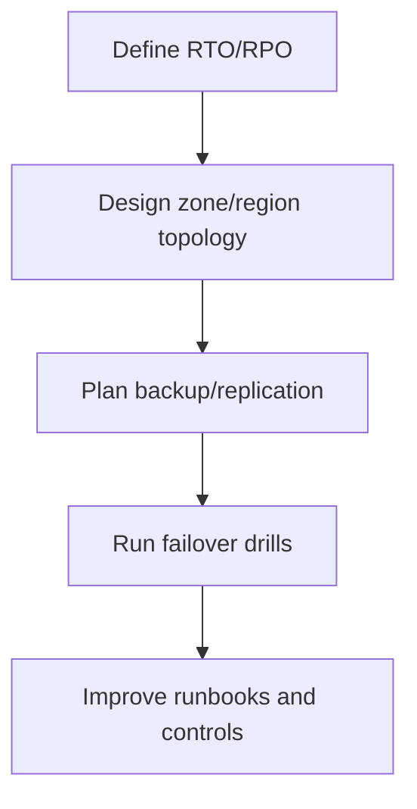
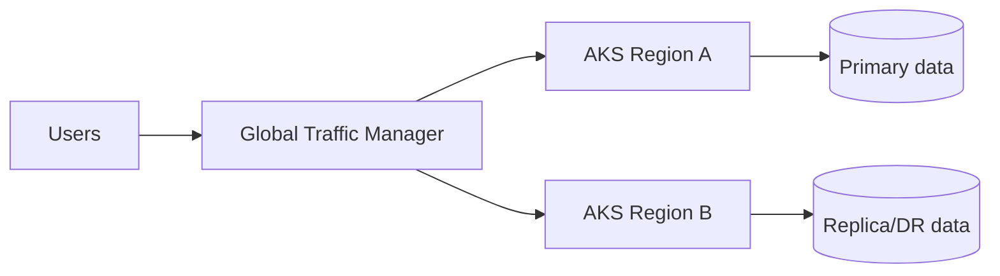
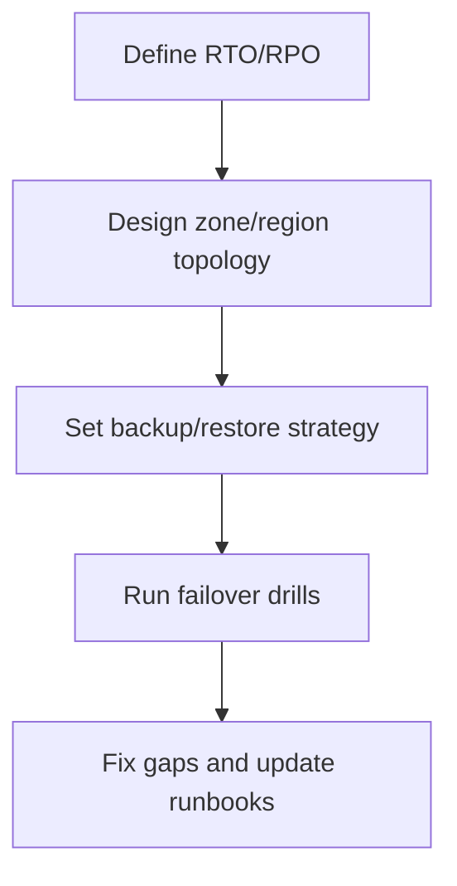

# AKS Reliability and Disaster Recovery

## What is it?
AKS reliability and DR is the design approach for keeping services available during node, zone, or region failures.

## What is it used for?
- Defining high availability controls
- Planning backup/restore and failover strategy
- Meeting target recovery metrics

## Why is it important?
It reduces outage impact and ensures workloads recover within target $RTO$ and $RPO$.

## Workflow


## Why this matters
Production workloads need resilience against zone, node, and region failures.

## Reliability layers
- Multi-zone node pools
- Pod disruption budgets and anti-affinity
- Backup/restore for cluster state and data
- Multi-region failover strategy



## DR workflow


## Detailed workflow (step-by-step)

1. **Set availability targets**
    - Define service tiers and required $RTO$/$RPO$ values.
2. **Design zonal resilience**
    - Spread node pools and replicas across availability zones.
3. **Design regional resilience**
    - Choose active-passive or active-active by workload type.
4. **Protect stateful dependencies**
    - Align backup/restore and replication for data stores.
5. **Run DR drills**
    - Execute planned failover and measure actual recovery times.
6. **Continuously improve**
    - Update runbooks and alerts using drill outcomes.

## Reliability controls checklist

- PodDisruptionBudget for critical workloads.
- Topology spread/anti-affinity for replicas.
- Multi-zone node pools for production.
- Tested global traffic failover rules.

## Common mistakes

- DR documented but never tested.
- App tier replicated but data tier not aligned.
- Failing over traffic without validating downstream dependencies.

## Portal checks
1. Node pools distributed across zones
2. Backup configuration status
3. Traffic failover profile health
4. Cross-region data replication health

## Azure CLI checks
```bash
# Node pool zone info
az aks nodepool list -g <rg> --cluster-name <aks> --query "[].{name:name,zones:availabilityZones}" -o table

# Pod spread and disruptions
kubectl get pdb -A
kubectl get pods -A -o wide
```

## What good looks like
- DR drill meets target $RTO$ and $RPO$
- Region failure leads to controlled failover

## Public references
- Microsoft Learn: AKS business continuity and disaster recovery
- Microsoft Learn: Availability zones and multi-region architecture guidance
