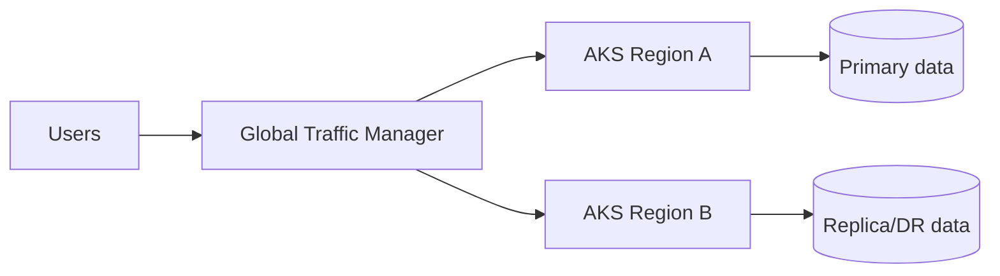
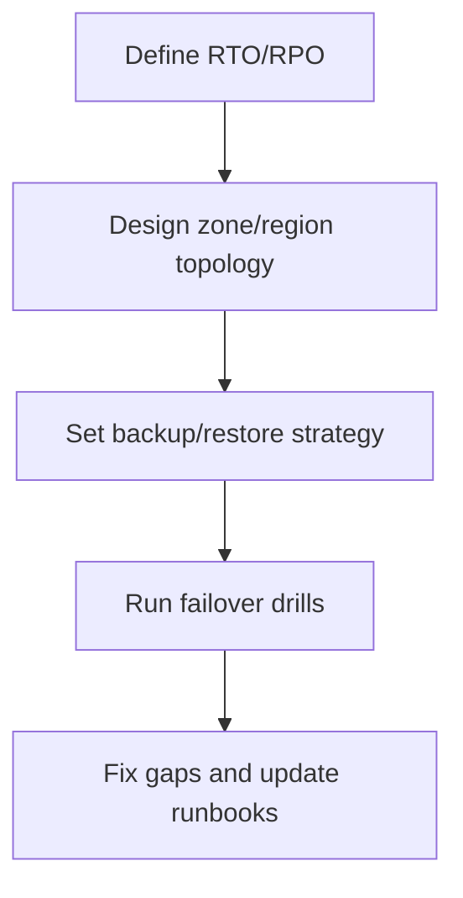

# AKS Reliability and Disaster Recovery

## Why this matters
Production workloads need resilience against zone, node, and region failures.

## Reliability layers
- Multi-zone node pools
- Pod disruption budgets and anti-affinity
- Backup/restore for cluster state and data
- Multi-region failover strategy



## DR workflow


## Portal checks
1. Node pools distributed across zones
2. Backup configuration status
3. Traffic failover profile health
4. Cross-region data replication health

## Azure CLI checks
```bash
# Node pool zone info
az aks nodepool list -g <rg> --cluster-name <aks> --query "[].{name:name,zones:availabilityZones}" -o table

# Pod spread and disruptions
kubectl get pdb -A
kubectl get pods -A -o wide
```

## What good looks like
- DR drill meets target $RTO$ and $RPO$
- Region failure leads to controlled failover
