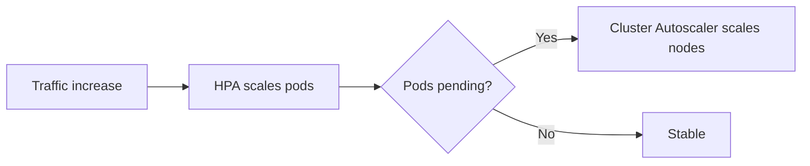
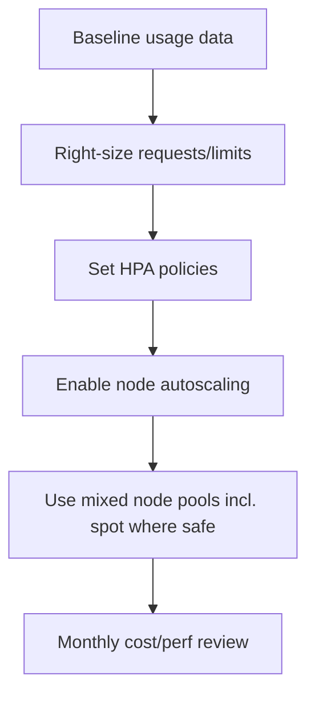

# AKS Scaling and Cost Optimization

## Why this matters
You need enough capacity for reliability, but over-provisioning increases cloud spend.

## Core controls
- **HPA:** scales pods based on CPU/memory/custom metrics
- **Cluster Autoscaler:** scales nodes when pods are unschedulable
- **Requests/Limits:** right-size workload resources
- **Spot/User pools:** lower cost for fault-tolerant workloads



## Optimization workflow


## Portal checks
1. AKS -> **Insights**: CPU/memory trends, node utilization
2. AKS -> **Node pools**: autoscaling min/max
3. Cost Management -> filter by AKS resource group
4. Check node SKU distribution (general vs spot)

## Azure CLI checks
```bash
# Node pool autoscaling
az aks nodepool list -g <rg> --cluster-name <aks> --query "[].{pool:name,autoscale:enableAutoScaling,min:minCount,max:maxCount,count:count,priority:scaleSetPriority}" -o table

# HPA status
kubectl get hpa -A

# Resource pressure
kubectl top nodes
kubectl top pods -A
```

## What good looks like
- Low pending-pod incidents
- Predictable latency under load
- Cost decreases without SLO regressions
