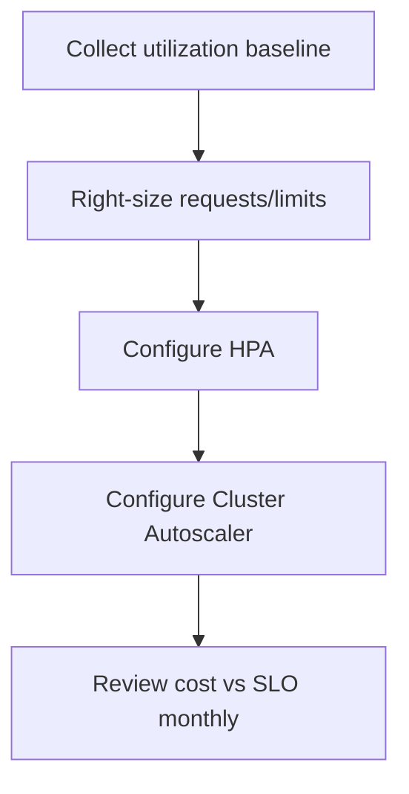
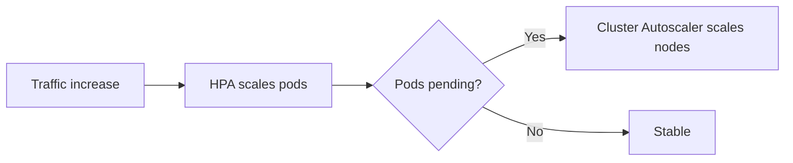
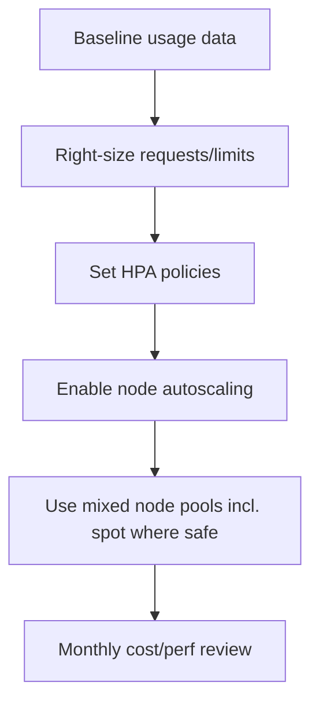

# AKS Scaling and Cost Optimization

## What is it?
AKS scaling and cost optimization is the practice of balancing performance and availability with efficient resource usage.

## What is it used for?
- Auto-scaling pods and nodes
- Right-sizing requests/limits
- Reducing infrastructure cost without breaking SLOs

## Why is it important?
It prevents over-provisioning waste and under-provisioning outages at the same time.

## Workflow


## Why this matters
You need enough capacity for reliability, but over-provisioning increases cloud spend.

## Core controls
- **HPA:** scales pods based on CPU/memory/custom metrics
- **Cluster Autoscaler:** scales nodes when pods are unschedulable
- **Requests/Limits:** right-size workload resources
- **Spot/User pools:** lower cost for fault-tolerant workloads



## Optimization workflow


## Detailed workflow (step-by-step)

1. **Collect baseline metrics**
    - Capture utilization and scaling events over peak and off-peak windows.
2. **Right-size resources**
    - Tune requests/limits to reduce waste and avoid CPU/memory throttling.
3. **Configure HPA carefully**
    - Set realistic min/max replicas and stabilization windows.
4. **Configure Cluster Autoscaler**
    - Define node pool min/max bounds and validate scale-up latency.
5. **Use workload-aware pools**
    - Run fault-tolerant workloads on spot pools where acceptable.
6. **Review monthly**
    - Compare spend and performance against SLO outcomes.

## Sizing guardrails

| Area | Recommended practice |
|---|---|
| Requests | Start from measured usage and iterate |
| Limits | Keep burst headroom while preventing noisy-neighbor issues |
| HPA metrics | Use CPU/memory and app metrics where possible |
| Spot pools | Use for stateless and interruption-tolerant workloads |

## Common mistakes

- Enabling HPA without valid resource requests.
- Large limits causing node pressure during bursts.
- No separation between critical and non-critical workloads.

## Portal checks
1. AKS -> **Insights**: CPU/memory trends, node utilization
2. AKS -> **Node pools**: autoscaling min/max
3. Cost Management -> filter by AKS resource group
4. Check node SKU distribution (general vs spot)

## Azure CLI checks
```bash
# Node pool autoscaling
az aks nodepool list -g <rg> --cluster-name <aks> --query "[].{pool:name,autoscale:enableAutoScaling,min:minCount,max:maxCount,count:count,priority:scaleSetPriority}" -o table

# HPA status
kubectl get hpa -A

# Resource pressure
kubectl top nodes
kubectl top pods -A
```

## What good looks like
- Low pending-pod incidents
- Predictable latency under load
- Cost decreases without SLO regressions

## Public references
- Microsoft Learn: Autoscaling in AKS
- Microsoft Learn: AKS cost optimization guidance
- Kubernetes docs: Resource requests and limits
