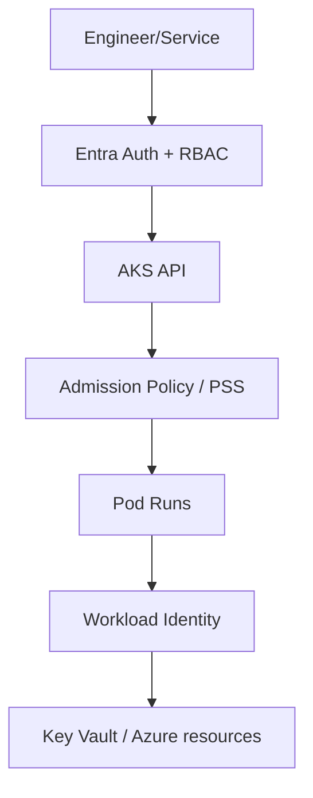
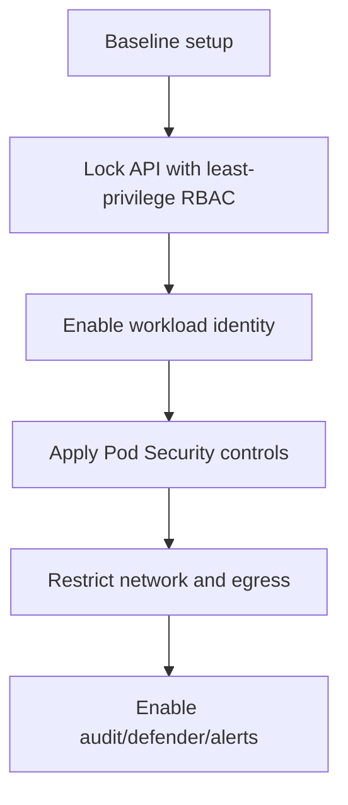

# AKS Security Hardening

## Why this matters
Security in AKS is layered: cluster access, workload identity, network boundaries, and runtime policy.

## Security layers
- Entra + Kubernetes RBAC
- Workload Identity + least-privilege RBAC on Azure resources
- Pod Security Standards / admission policies
- Secret management with Key Vault CSI + private access



## Hardening workflow


## Portal checks
1. AKS -> **Access control (IAM)** and **Azure RBAC for Kubernetes**
2. AKS -> **Security** / Defender recommendations
3. AKS -> **Workload identity** status
4. Key Vault -> **Access control (IAM)** assignments for workload identities

## Azure CLI checks
```bash
# AKS security-relevant flags
az aks show -g <rg> -n <aks> --query "{rbac:enableRBAC,oidc:oidcIssuerProfile.enabled,wi:securityProfile.workloadIdentity.enabled,privateCluster:apiServerAccessProfile.enablePrivateCluster}" -o yaml

# Kubernetes role bindings
kubectl get rolebinding,clusterrolebinding -A

# Service accounts using workload identity
kubectl get sa -A -o jsonpath='{range .items[*]}{.metadata.namespace}{"/"}{.metadata.name}{" -> "}{.metadata.annotations.azure\.workload\.identity/client-id}{"\n"}{end}'
```

## What good looks like
- No long-lived secrets in pods
- Least privilege enforced for both human and workload identities
- Policy violations blocked before deployment
