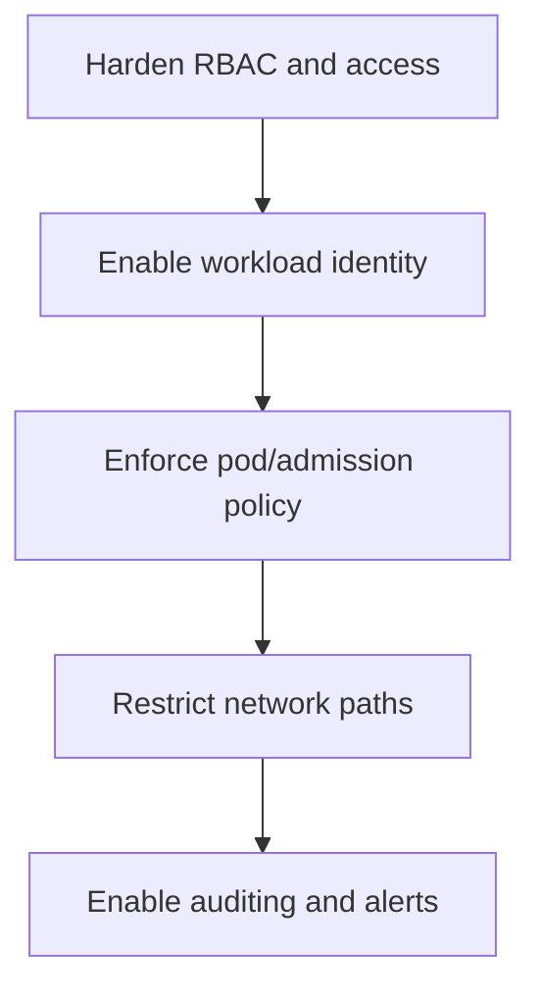
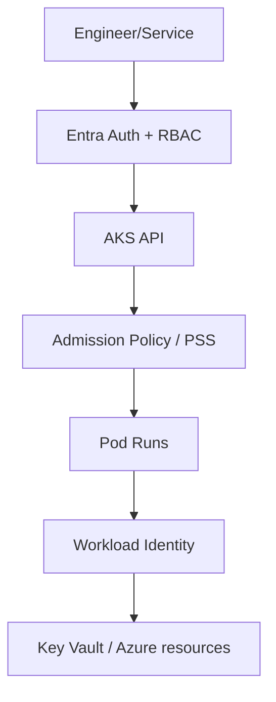
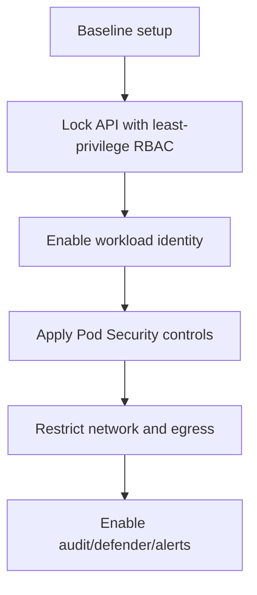

# AKS Security Hardening

## What is it?
AKS security hardening is a layered protection model across cluster access, workload identity, runtime policy, and network controls.

## What is it used for?
- Enforcing least privilege for users and workloads
- Preventing risky pod/runtime configurations
- Protecting secrets and sensitive resource access

## Why is it important?
It reduces attack surface and limits blast radius if a workload or credential is compromised.

## Workflow


## Why this matters
Security in AKS is layered: cluster access, workload identity, network boundaries, and runtime policy.

## Security layers
- Entra + Kubernetes RBAC
- Workload Identity + least-privilege RBAC on Azure resources
- Pod Security Standards / admission policies
- Secret management with Key Vault CSI + private access



## Hardening workflow


## Detailed workflow (step-by-step)

1. **Harden cluster access**
    - Review RBAC assignments and remove unnecessary admin-level permissions.
2. **Use workload identity for Azure access**
    - Avoid long-lived credentials in Kubernetes manifests.
3. **Apply admission guardrails**
    - Enforce Pod Security Standards and policy controls.
4. **Constrain network paths**
    - Add NetworkPolicy and controlled egress design.
5. **Harden runtime defaults**
    - Prefer non-root containers and minimal Linux capabilities.
6. **Continuously monitor**
    - Track policy violations and privileged workload attempts.

## Security baseline checklist

- Least-privilege role assignments for humans and workloads.
- No plaintext secrets in application manifests.
- Workload identity used for Azure service access.
- Policy validation in CI before deployment.
- Audit signals enabled for identity and cluster changes.

## Common mistakes

- Overly broad IAM scope assignments.
- Treating perimeter controls as enough without in-cluster policy.
- Applying security controls only in production.

## Portal checks
1. AKS -> **Access control (IAM)** and **Azure RBAC for Kubernetes**
2. AKS -> **Security** / Defender recommendations
3. AKS -> **Workload identity** status
4. Key Vault -> **Access control (IAM)** assignments for workload identities

## Azure CLI checks
```bash
# AKS security-relevant flags
az aks show -g <rg> -n <aks> --query "{rbac:enableRBAC,oidc:oidcIssuerProfile.enabled,wi:securityProfile.workloadIdentity.enabled,privateCluster:apiServerAccessProfile.enablePrivateCluster}" -o yaml

# Kubernetes role bindings
kubectl get rolebinding,clusterrolebinding -A

# Service accounts using workload identity
kubectl get sa -A -o jsonpath='{range .items[*]}{.metadata.namespace}{"/"}{.metadata.name}{" -> "}{.metadata.annotations.azure\.workload\.identity/client-id}{"\n"}{end}'
```

## What good looks like
- No long-lived secrets in pods
- Least privilege enforced for both human and workload identities
- Policy violations blocked before deployment

## Public references
- Microsoft Learn: AKS security baseline
- Microsoft Learn: Workload identity on AKS
- Microsoft Learn: Kubernetes and Azure RBAC on AKS
