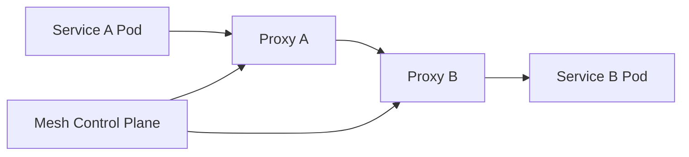
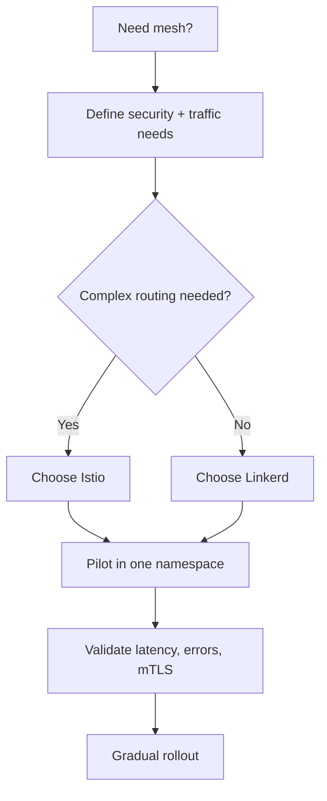

# AKS Service Mesh Options (Istio / Linkerd)

## Why this matters
As microservices grow, consistent traffic policy, mTLS, and observability become hard to maintain in app code.

## Service mesh role
- mTLS between services
- traffic policies (retries, timeouts, canary)
- service-to-service telemetry



## Istio vs Linkerd (quick)
| Dimension | Istio | Linkerd |
|---|---|---|
| Feature depth | Very broad | Simpler core mesh |
| Ops complexity | Higher | Lower |
| Best fit | Advanced policy/routing | Fast adoption |

## Workflow


## Portal checks
1. AKS add-ons/integrations status (if using managed integrations)
2. Cluster workload latency/error trends in Insights
3. Namespace-level adoption and sidecar injection coverage

## Azure CLI checks
```bash
# Check sidecars present
kubectl get pods -A -o jsonpath='{range .items[*]}{.metadata.namespace}{"/"}{.metadata.name}{" -> "}{range .spec.containers[*]}{.name}{","}{end}{"\n"}{end}'

# Istio checks (if installed)
istioctl proxy-status
kubectl get virtualservice,destinationrule,peerauthentication,authorizationpolicy -A

# Linkerd checks (if installed)
linkerd check
linkerd viz stat deploy -A
```

## What good looks like
- mTLS enforced for critical namespaces
- Canary and retry policies centrally managed
- Incident triage faster via service-level telemetry
