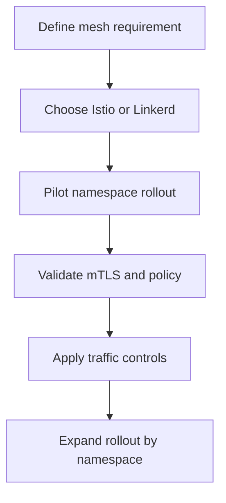
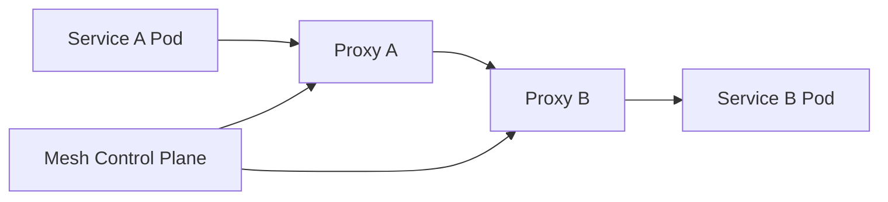
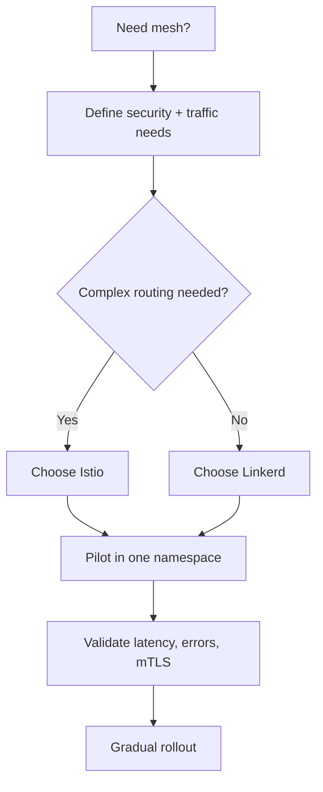

# AKS Service Mesh Options (Istio / Linkerd)

## What is it?
AKS service mesh is a dedicated traffic and security layer (usually sidecar-based) for service-to-service communication.

## What is it used for?
- mTLS between microservices
- Centralized retry/timeout/canary policies
- Improved service-to-service observability

## Why is it important?
It removes repeated networking logic from app code and standardizes security/traffic control.

## Workflow


## Why this matters
As microservices grow, consistent traffic policy, mTLS, and observability become hard to maintain in app code.

## Service mesh role
- mTLS between services
- traffic policies (retries, timeouts, canary)
- service-to-service telemetry



## Istio vs Linkerd (quick)
| Dimension | Istio | Linkerd |
|---|---|---|
| Feature depth | Very broad | Simpler core mesh |
| Ops complexity | Higher | Lower |
| Best fit | Advanced policy/routing | Fast adoption |

## Workflow


## Detailed workflow (step-by-step)

1. **Define primary objective**
    - mTLS, advanced routing, canary control, or telemetry improvement.
2. **Select mesh type**
    - Istio for advanced policies; Linkerd for operational simplicity.
3. **Pilot one namespace first**
    - Enable injection and baseline latency/error metrics.
4. **Apply security controls first**
    - Validate mTLS posture and service-to-service policy behavior.
5. **Add traffic policies**
    - Configure retries/timeouts/canary weights and monitor impact.
6. **Roll out in phases**
    - Expand namespace-by-namespace with clear success criteria.

## Mesh adoption checklist

- Baseline p95 latency and error rate captured before rollout.
- mTLS validation completed for pilot namespace.
- Rollback approach documented.
- On-call team trained on mesh troubleshooting.

## Common mistakes

- Enabling retries without timeout budgets.
- Rolling out cluster-wide before pilot validation.
- No observability baseline before policy changes.

## Portal checks
1. AKS add-ons/integrations status (if using managed integrations)
2. Cluster workload latency/error trends in Insights
3. Namespace-level adoption and sidecar injection coverage

## Azure CLI checks
```bash
# Check sidecars present
kubectl get pods -A -o jsonpath='{range .items[*]}{.metadata.namespace}{"/"}{.metadata.name}{" -> "}{range .spec.containers[*]}{.name}{","}{end}{"\n"}{end}'

# Istio checks (if installed)
istioctl proxy-status
kubectl get virtualservice,destinationrule,peerauthentication,authorizationpolicy -A

# Linkerd checks (if installed)
linkerd check
linkerd viz stat deploy -A
```

## What good looks like
- mTLS enforced for critical namespaces
- Canary and retry policies centrally managed
- Incident triage faster via service-level telemetry

## Public references
- Istio public documentation
- Linkerd public documentation
- Microsoft Learn: AKS service mesh guidance
