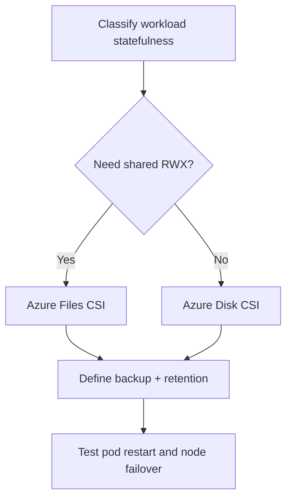

# AKS Storage Patterns

## Why this matters
Stateful workloads fail differently than stateless workloads. Correct storage pattern avoids data loss and downtime.

## Main storage options
- Azure Disk CSI (high IOPS block, usually single node attach)
- Azure Files CSI (shared file access)
- Ephemeral storage (fast, non-persistent)


## Workflow


## Portal checks
1. Disk/File resources attached and healthy
2. Storage account performance tier
3. Backup policy coverage for stateful data

## Azure CLI checks
```bash
# Storage classes
kubectl get storageclass

# PVC/PV status
kubectl get pvc,pv -A

# StatefulSet health
kubectl get sts -A
```

## What good looks like
- PVCs bind quickly and recover predictably
- Stateful app restart does not lose data
