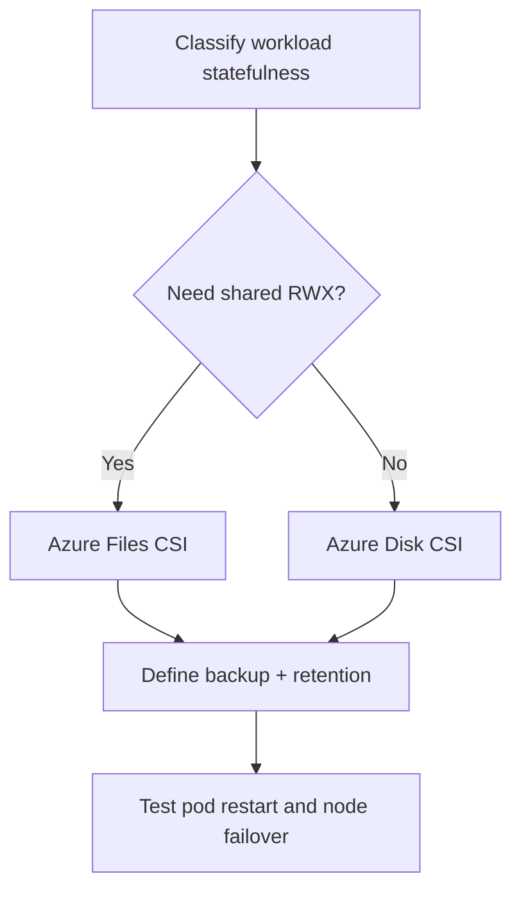

# AKS Storage Patterns

## Why this matters
Stateful workloads fail differently than stateless workloads. Correct storage pattern avoids data loss and downtime.

## Main storage options
- Azure Disk CSI (high IOPS block, usually single node attach)
- Azure Files CSI (shared file access)
- Ephemeral storage (fast, non-persistent)


## Workflow


## Detailed workflow (step-by-step)

1. **Classify workload state model**
    - Stateless, stateful single-writer, or stateful shared-writer.
2. **Choose storage class**
    - Select Disk or Files based on access mode and performance profile.
3. **Define PVC standards**
    - Standardize size, expansion, and reclaim behavior.
4. **Plan backup and restore**
    - Define schedule, retention, and periodic restore tests.
5. **Test failure behavior**
    - Validate restart, reschedule, and node drain scenarios.

## Storage pattern matrix

| Need | Preferred option |
|---|---|
| High IOPS single writer | Azure Disk CSI |
| Shared RWX access | Azure Files CSI |
| Temporary scratch/cache | Ephemeral storage |

## Common mistakes

- Using RWX storage for workloads that need strict single-writer consistency.
- Assuming backup exists without restore tests.
- Missing storage class defaults for production namespaces.

## Portal checks
1. Disk/File resources attached and healthy
2. Storage account performance tier
3. Backup policy coverage for stateful data

## Azure CLI checks
```bash
# Storage classes
kubectl get storageclass

# PVC/PV status
kubectl get pvc,pv -A

# StatefulSet health
kubectl get sts -A
```

## What good looks like
- PVCs bind quickly and recover predictably
- Stateful app restart does not lose data

## Public references
- Microsoft Learn: AKS storage and CSI drivers
- Kubernetes docs: PersistentVolume and StatefulSet best practices
