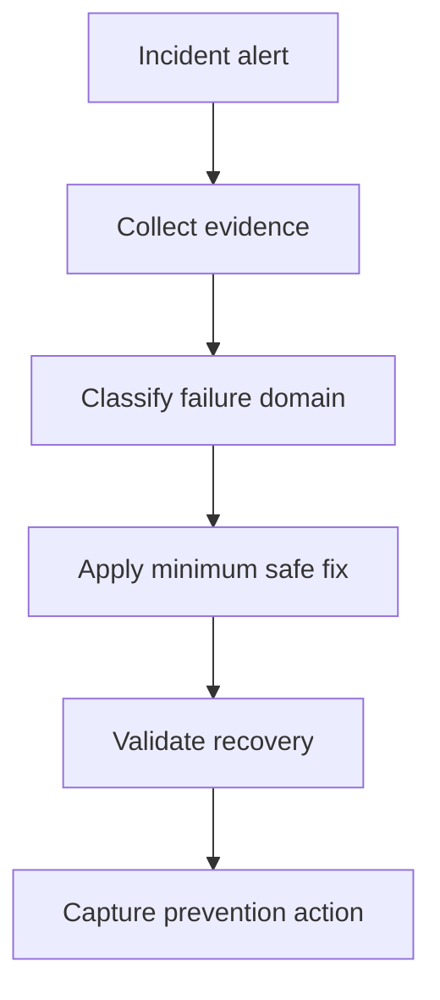
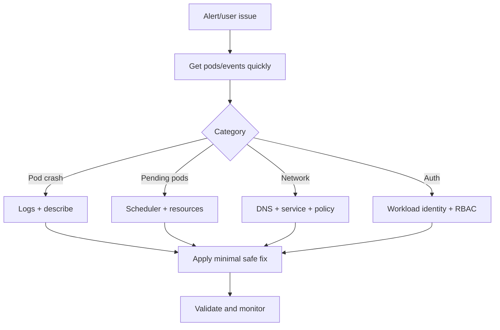

# AKS Troubleshooting Playbooks

## What is it?
AKS troubleshooting playbooks are repeatable diagnosis and remediation steps for common production failures.

## What is it used for?
- Faster incident triage
- Consistent root-cause analysis
- Safer, minimal remediation during outages

## Why is it important?
It lowers mean time to recovery and prevents random trial-and-error during incidents.

## Workflow


## Why this matters
Fast diagnosis reduces mean time to recovery (MTTR).

## Incident workflow


## 15-minute triage workflow

1. **Minute 0-3: Scope impact**
    - Identify affected namespace, workload, and user-facing path.
2. **Minute 3-7: Collect evidence**
    - Gather events, pod states, prior logs, and node health.
3. **Minute 7-12: Classify domain**
    - Runtime, scheduling, network, identity, or storage.
4. **Minute 12-15: Apply minimum safe fix**
    - Prefer targeted changes and verify before broad restarts.

## Detailed runbook map

| Symptom | First checks | Likely fix area |
|---|---|---|
| CrashLoopBackOff | `describe` + `logs --previous` | app command/config/probe |
| Pending pods | scheduler events + node capacity | resources/taints/affinity |
| ImagePullBackOff | image ref + auth | registry/image/tag |
| Timeout | service/endpoints + DNS + netpol | service wiring/network controls |
| 403 unauthorized | workload identity + RBAC | token audience/role assignment |

## Incident quality checklist

- Evidence captured before remediation.
- Root cause documented (not just symptom).
- Preventive action assigned and tracked.

## Portal checks
1. AKS Insights for node/pod anomalies
2. Activity log for recent config changes
3. Networking resources (NSG/route/firewall) for denies

## Azure CLI checks
```bash
kubectl get pods -A
kubectl get events -A --sort-by=.lastTimestamp
kubectl describe pod <pod> -n <ns>
kubectl logs <pod> -n <ns> --previous
kubectl top nodes
kubectl top pods -A
```

## Common runbooks
- CrashLoopBackOff
- ImagePullBackOff
- Pending pods (resource/taint/affinity)
- DNS resolution failure
- 403 unauthorized with workload identity

## What good looks like
- Every top incident type has a written runbook
- On-call can resolve common failures in minutes

## Public references
- Microsoft Learn: AKS troubleshooting guidance
- Kubernetes docs: Debug applications and clusters
