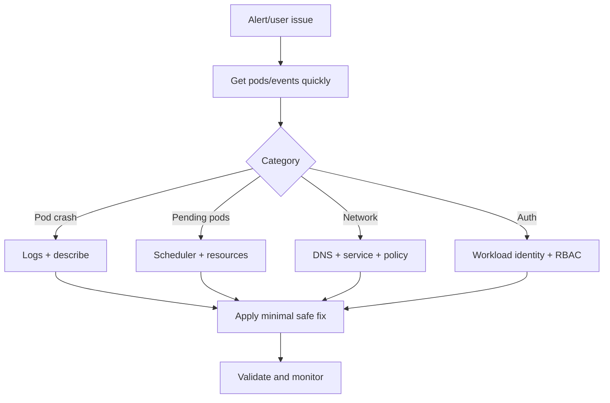

# AKS Troubleshooting Playbooks

## Why this matters
Fast diagnosis reduces mean time to recovery (MTTR).

## Incident workflow


## Portal checks
1. AKS Insights for node/pod anomalies
2. Activity log for recent config changes
3. Networking resources (NSG/route/firewall) for denies

## Azure CLI checks
```bash
kubectl get pods -A
kubectl get events -A --sort-by=.lastTimestamp
kubectl describe pod <pod> -n <ns>
kubectl logs <pod> -n <ns> --previous
kubectl top nodes
kubectl top pods -A
```

## Common runbooks
- CrashLoopBackOff
- ImagePullBackOff
- Pending pods (resource/taint/affinity)
- DNS resolution failure
- 403 unauthorized with workload identity

## What good looks like
- Every top incident type has a written runbook
- On-call can resolve common failures in minutes
