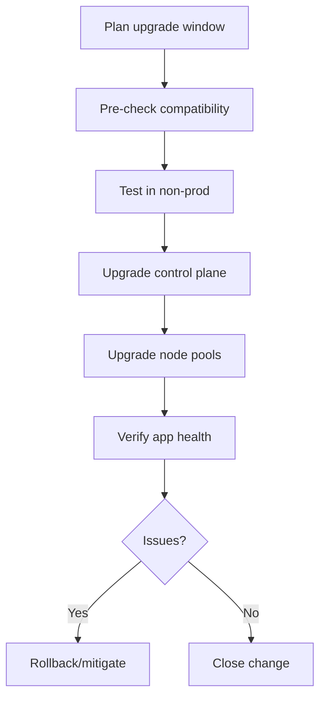

# AKS Upgrades and Release Strategy

## Why this matters
Unplanned upgrades can cause downtime. Planned upgrades reduce risk and keep support compliance.

## Upgrade dimensions
- Kubernetes version
- Node OS image
- Add-ons (CNI, ingress, CSI, monitoring)



## Portal checks
1. AKS -> **Upgrade** tab for available versions
2. Node pool upgrade status and surge settings
3. Workload health during and after upgrade

## Azure CLI checks
```bash
# Available AKS upgrades
az aks get-upgrades -g <rg> -n <aks> -o jsonc

# Upgrade control plane
az aks upgrade -g <rg> -n <aks> -k <targetVersion>

# Upgrade node pool
az aks nodepool upgrade -g <rg> --cluster-name <aks> -n <pool> -k <targetVersion>

# Watch rollouts
kubectl get nodes
kubectl get pods -A
```

## What good looks like
- No surprise version skew
- Zero/low customer impact upgrades
- Repeatable runbook for every environment
