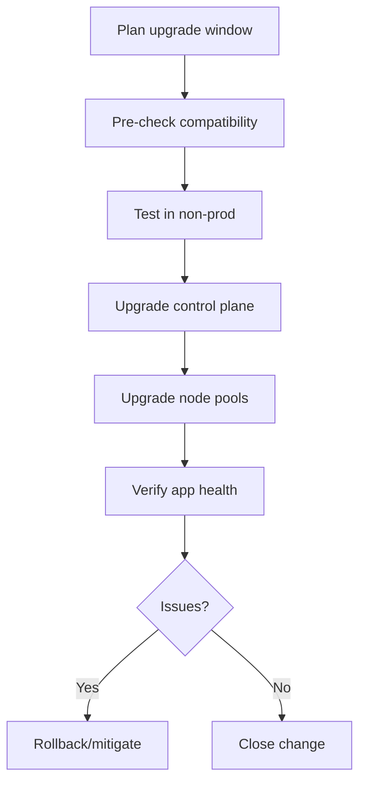

# AKS Upgrades and Release Strategy

## Why this matters
Unplanned upgrades can cause downtime. Planned upgrades reduce risk and keep support compliance.

## Upgrade dimensions
- Kubernetes version
- Node OS image
- Add-ons (CNI, ingress, CSI, monitoring)

## Version and release principles

- Keep non-production ahead of production for validation.
- Upgrade control plane first, then node pools in controlled waves.
- Validate add-on compatibility before production rollout.
- Use approved maintenance windows and communication plans.



## Portal checks
1. AKS -> **Upgrade** tab for available versions
2. Node pool upgrade status and surge settings
3. Workload health during and after upgrade

## Azure CLI checks
```bash
# Available AKS upgrades
az aks get-upgrades -g <rg> -n <aks> -o jsonc

# Node image and version view
az aks nodepool list -g <rg> --cluster-name <aks> --query "[].{pool:name,k8s:orchestratorVersion,image:nodeImageVersion}" -o table

# Upgrade control plane
az aks upgrade -g <rg> -n <aks> -k <targetVersion>

# Upgrade node pool
az aks nodepool upgrade -g <rg> --cluster-name <aks> -n <pool> -k <targetVersion>

# Watch rollouts
kubectl get nodes
kubectl get pods -A
```

## Detailed workflow (step-by-step)

1. **Pre-check supported versions**
    - Identify target version and dependency compatibility.
2. **Validate in non-production**
    - Confirm ingress, identity, storage, and policy behavior.
3. **Production wave 1**
    - Upgrade one user pool first and validate key services.
4. **Production wave 2**
    - Upgrade remaining pools after success criteria are met.
5. **Post-upgrade verification**
    - Validate SLO metrics, error rates, and rollback readiness.

## Common mistakes

- Upgrading all pools at once.
- Ignoring node image updates for long periods.
- Proceeding without a tested rollback/mitigation plan.

## What good looks like
- No surprise version skew
- Zero/low customer impact upgrades
- Repeatable runbook for every environment

## Public references
- Microsoft Learn: Upgrade an AKS cluster
- AKS supported versions and release guidance
