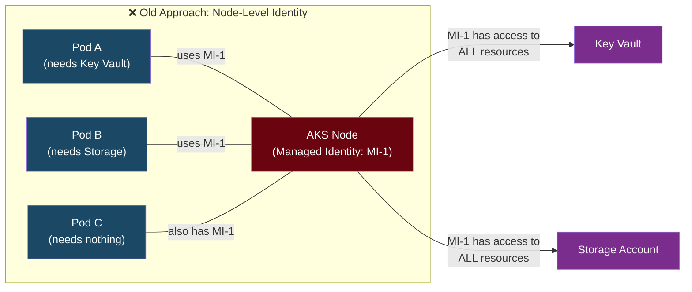
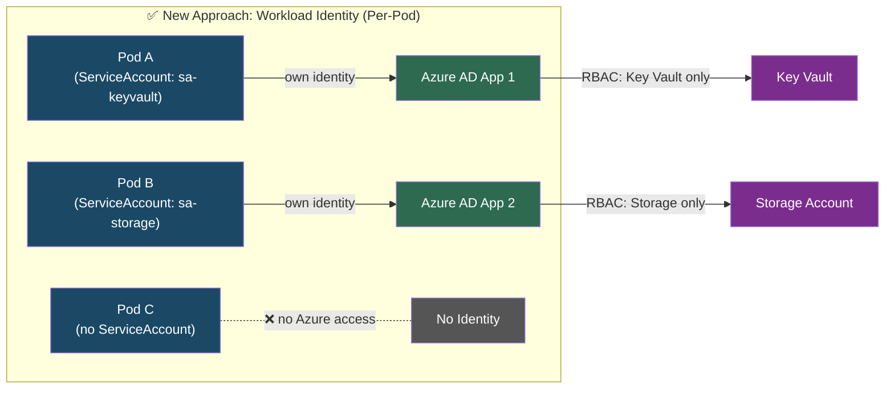
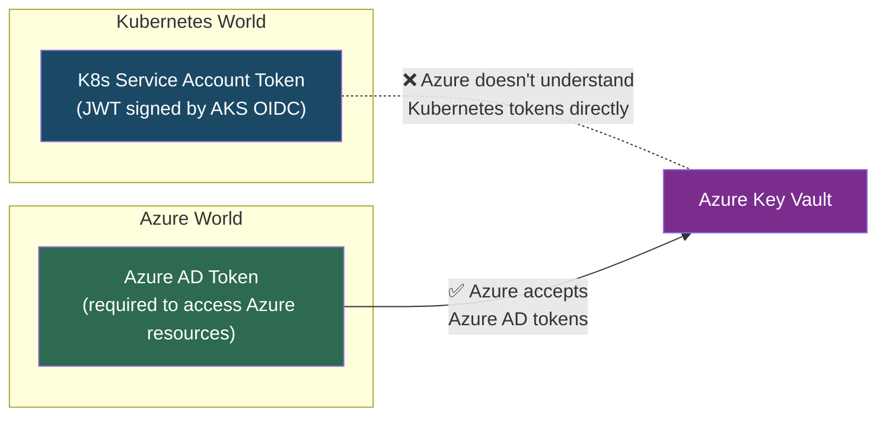
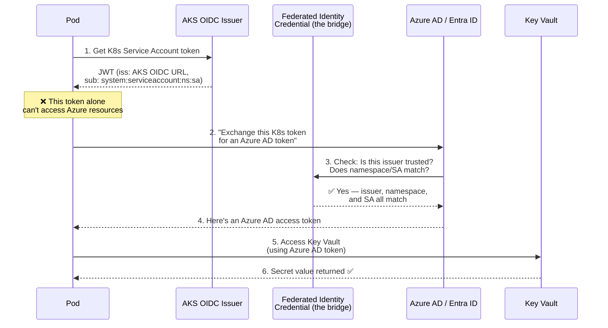
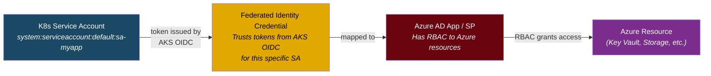
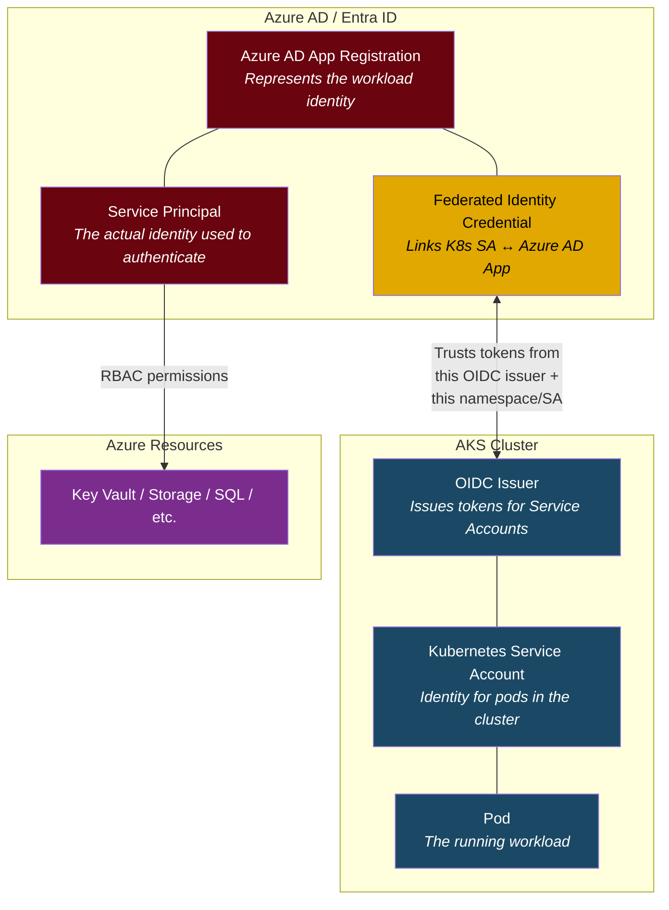
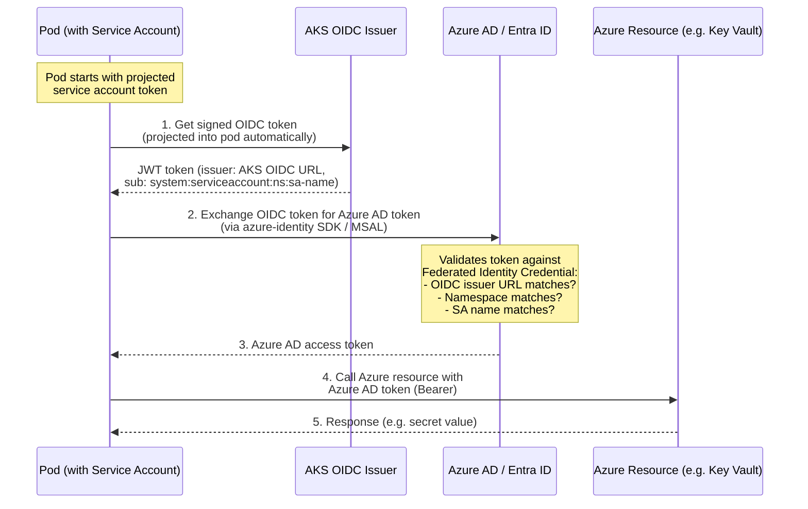
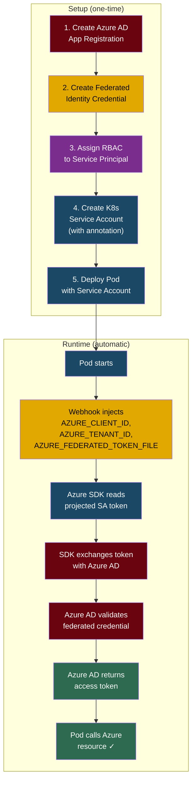

# AKS Workload Identity Integration

## Background: The Problem

When you run applications (workloads) on AKS, they often need to access Azure resources like Key Vault, Storage, SQL, etc. Traditionally, this was done using:

| Approach | Problem |
|----------|---------|
| **Kubernetes Secrets** | Credentials stored in the cluster — risky, hard to rotate, easy to leak |
| **Node-level Managed Identity** | All pods on a node share the same identity — violates least privilege |



> **Problem:** Pod C doesn't need any Azure access, but it still has the node's Managed Identity. If Pod C is compromised, the attacker gets access to Key Vault and Storage.

---

## What is AKS Workload Identity?

AKS Workload Identity is a modern solution that allows **individual pods** to securely access Azure resources using **their own Azure AD / Entra ID identities**, without managing secrets or sharing identities across pods.

It integrates **Kubernetes Service Accounts** with **Azure AD Workload Identities** via **OIDC federation**.



---

## Why is it Needed?

| Benefit | Explanation |
|---------|-------------|
| **Security** | No secrets stored in the cluster — tokens are short-lived and auto-rotated |
| **Granular Access (Least Privilege)** | Each pod gets its own identity with only the permissions it needs |
| **Separation of Duties** | Different teams/apps can have different identities and access |
| **Cloud-Native** | Aligns with OIDC federation best practices — no custom auth plumbing |
| **No credential management** | No passwords, keys, or certificates to rotate manually |

---

## Why Federated Identity? (If We Already Have a Service Account Token)

This is a common point of confusion. If the pod already gets a Kubernetes Service Account token, why do we need a Federated Identity Credential at all?

### The Core Problem



**The Kubernetes Service Account token:**
- Is only valid within the Kubernetes cluster
- Is designed to authenticate to the **Kubernetes API server**
- Azure resources (Key Vault, Storage, SQL) **do not understand it**

**Azure resources expect:**
- An **Azure AD / Entra ID token** for authentication and authorization
- RBAC roles assigned to an Azure AD identity (Service Principal or Managed Identity)

### So What Does the Federated Identity Credential Do?

It's the **bridge** — it tells Azure AD: *"If you receive a token from this specific AKS OIDC issuer, for this specific namespace and service account, trust it and exchange it for an Azure AD token."*



### The Three-Part Trust Chain



| Step | What | Who |
|------|------|-----|
| K8s SA Token | Proves "I am pod X in namespace Y" | Kubernetes (AKS OIDC) |
| Federated Credential | "I trust that AKS cluster for this SA" | Azure AD configuration |
| Azure AD Token | Proves "I am Service Principal Z" | Azure AD |
| RBAC | "SP Z can read secrets from Key Vault" | Azure resource |

### Analogy

Think of it like crossing a border:

| | Analogy | In AKS |
|---|---|---|
| **Your local ID** | Works at home, not recognized abroad | K8s Service Account token — works in K8s, not in Azure |
| **Embassy / Visa agreement** | Your country's ID is trusted by the other country | Federated Identity Credential — Azure trusts AKS OIDC |
| **Foreign visa/passport stamp** | The other country gives you an entry pass | Azure AD token — issued after validating the K8s token |
| **Access to services abroad** | Use your visa to get hotel, bank, etc. | Use Azure AD token to access Key Vault, Storage, etc. |

### Without Federated Identity — What Would You Have to Do?

| Approach | Problem |
|----------|---------|
| Store Azure credentials as K8s Secrets | Secrets in etcd, risk of leaks, manual rotation |
| Use node-level Managed Identity | All pods share same identity, over-privileged |
| Mount certificates in pods | Manual cert management, rotation burden |
| Use Azure Key Vault CSI driver **with** client secret | Still need a secret to access Key Vault (chicken-and-egg) |

Federated Identity Credential eliminates all of these by making the token exchange **automatic and secretless**.

---

## Entities Involved



| Entity | Purpose |
|--------|---------|
| **Azure AD App Registration** | Represents the workload identity in Azure AD |
| **Service Principal** | The actual identity used for authentication (auto-created with app reg) |
| **Federated Identity Credential** | Links K8s Service Account to Azure AD App — the trust bridge |
| **Kubernetes Service Account** | Identity for pods inside the cluster |
| **AKS OIDC Issuer** | Issues signed tokens for Service Accounts |
| **AKS Cluster** | Hosts the workloads |
| **Azure Resources** | Resources accessed by the workload (Key Vault, Storage, etc.) |

---

## How Does It Work? (Token Exchange Flow)



### What happens under the hood:

1. **Pod starts** → Kubernetes projects a signed JWT token into the pod (via the Service Account token volume projection)
2. **Token contents** → The JWT is signed by the AKS OIDC issuer and contains:
   - `iss`: The AKS cluster's OIDC issuer URL
   - `sub`: `system:serviceaccount:<namespace>:<service-account-name>`
3. **Token exchange** → The Azure Identity SDK (in your app) sends this token to Azure AD
4. **Azure AD validates** → Checks the Federated Identity Credential:
   - Does the `iss` (issuer) match the configured OIDC issuer URL?
   - Does the `sub` (subject) match the configured namespace + SA name?
5. **Azure AD returns** an Azure AD access token
6. **Pod uses** the Azure AD token to call Azure resources

---

## Step-by-Step Setup

### Prerequisites

```bash
# Enable OIDC issuer and Workload Identity on the AKS cluster
az aks update \
  --resource-group myRG \
  --name myAKS \
  --enable-oidc-issuer \
  --enable-workload-identity

# Get the OIDC issuer URL (you'll need this later)
OIDC_ISSUER=$(az aks show \
  --resource-group myRG \
  --name myAKS \
  --query "oidcIssuerProfile.issuerUrl" -o tsv)

echo "$OIDC_ISSUER"
# https://oidc.prod-aks.azure.com/xxxxxxxx-xxxx-xxxx-xxxx-xxxxxxxxxxxx/
```

### Step 1: Create an Azure AD App Registration

```bash
# Create the app registration
az ad app create --display-name "myapp-workload-identity"

# Get the App (client) ID
APP_CLIENT_ID=$(az ad app list \
  --display-name "myapp-workload-identity" \
  --query "[0].appId" -o tsv)

# Create a service principal for the app
az ad sp create --id "$APP_CLIENT_ID"
```

### Step 2: Create a Federated Identity Credential

This is the **trust link** between the Kubernetes Service Account and the Azure AD App.

```bash
# Get the App object ID
APP_OBJECT_ID=$(az ad app list \
  --display-name "myapp-workload-identity" \
  --query "[0].id" -o tsv)

# Create the federated credential
az ad app federated-credential create \
  --id "$APP_OBJECT_ID" \
  --parameters '{
    "name": "aks-federated-credential",
    "issuer": "'"$OIDC_ISSUER"'",
    "subject": "system:serviceaccount:default:sa-myapp",
    "audiences": ["api://AzureADTokenExchange"],
    "description": "AKS workload identity for myapp"
  }'
```

> **Critical:** The `subject` must **exactly match** `system:serviceaccount:<namespace>:<service-account-name>`. If the namespace or SA name is wrong, token exchange will fail silently.

### Step 3: Assign Azure RBAC to the Service Principal

```bash
# Example: Grant access to Key Vault secrets
az role assignment create \
  --assignee "$APP_CLIENT_ID" \
  --role "Key Vault Secrets User" \
  --scope /subscriptions/<sub>/resourceGroups/myRG/providers/Microsoft.KeyVault/vaults/myKeyVault
```

### Step 4: Create the Kubernetes Service Account

```yaml
# sa-myapp.yaml
apiVersion: v1
kind: ServiceAccount
metadata:
  name: sa-myapp
  namespace: default
  annotations:
    azure.workload.identity/client-id: "<APP_CLIENT_ID>"   # ← links to Azure AD App
  labels:
    azure.workload.identity/use: "true"                     # ← tells the mutating webhook to inject env vars
```

```bash
kubectl apply -f sa-myapp.yaml
```

### Step 5: Deploy Your Pod with the Service Account

```yaml
# deployment.yaml
apiVersion: apps/v1
kind: Deployment
metadata:
  name: myapp
  namespace: default
spec:
  replicas: 1
  selector:
    matchLabels:
      app: myapp
  template:
    metadata:
      labels:
        app: myapp
    spec:
      serviceAccountName: sa-myapp          # ← uses the annotated SA
      containers:
        - name: myapp
          image: myregistry.azurecr.io/myapp:latest
          # No secrets, no env vars for credentials needed!
          # The Azure Identity SDK will automatically:
          #   1. Read the projected SA token
          #   2. Exchange it for an Azure AD token
          #   3. Use it to access Azure resources
```

```bash
kubectl apply -f deployment.yaml
```

### Step 6: Use Azure Identity SDK in Your App

The app code doesn't need any credential configuration. The SDK automatically uses the workload identity flow.

**Python:**
```python
from azure.identity import DefaultAzureCredential
from azure.keyvault.secrets import SecretClient

credential = DefaultAzureCredential()  # auto-detects workload identity
client = SecretClient(vault_url="https://myKeyVault.vault.azure.net/", credential=credential)

secret = client.get_secret("my-secret")
print(secret.value)
```

**C# / .NET:**
```csharp
var credential = new DefaultAzureCredential();  // auto-detects workload identity
var client = new SecretClient(new Uri("https://myKeyVault.vault.azure.net/"), credential);

KeyVaultSecret secret = await client.GetSecretAsync("my-secret");
Console.WriteLine(secret.Value);
```

**Go:**
```go
cred, _ := azidentity.NewDefaultAzureCredential(nil)  // auto-detects workload identity
client, _ := azsecrets.NewClient("https://myKeyVault.vault.azure.net/", cred, nil)

resp, _ := client.GetSecret(context.TODO(), "my-secret", "", nil)
fmt.Println(*resp.Value)
```

> **How does `DefaultAzureCredential` know?** The AKS workload identity mutating webhook automatically injects these environment variables into the pod:
> - `AZURE_CLIENT_ID` — the App Client ID (from the SA annotation)
> - `AZURE_TENANT_ID` — your Azure AD tenant
> - `AZURE_FEDERATED_TOKEN_FILE` — path to the projected SA token file
>
> The SDK reads these and performs the token exchange automatically.

---

## Complete Flow (End-to-End Diagram)



---

## Troubleshooting

| Symptom | Likely Cause | Fix |
|---------|-------------|-----|
| `AADSTS70021: No matching federated identity record found` | Subject mismatch in federated credential | Verify `system:serviceaccount:<namespace>:<sa-name>` matches exactly |
| `AADSTS700016: Application not found` | Wrong client ID in SA annotation | Check `azure.workload.identity/client-id` annotation |
| Pod doesn't get `AZURE_CLIENT_ID` env var | Missing label on SA | Add `azure.workload.identity/use: "true"` label |
| `AADSTS50029: Invalid token issuer` | OIDC issuer URL mismatch | Re-check `issuer` in `az ad app federated-credential` |
| Token exchange works but resource access denied | Missing RBAC assignment | Run `az role assignment create` for the correct scope |

```bash
# Debug: Check if env vars are injected
kubectl exec -it <pod-name> -- env | grep AZURE_

# Debug: Check the projected token
kubectl exec -it <pod-name> -- cat "$AZURE_FEDERATED_TOKEN_FILE"

# Debug: Decode the token to inspect claims
kubectl exec -it <pod-name> -- cat "$AZURE_FEDERATED_TOKEN_FILE" | \
  cut -d. -f2 | base64 -d 2>/dev/null | jq .
```

---

## Workload Identity vs Pod Identity vs Node-Level MSI

| | Node-Level MSI | Pod Identity (deprecated) | **Workload Identity** |
|---|---|---|---|
| **Granularity** | Per node (all pods share) | Per pod | Per pod |
| **Secret management** | None | None | None |
| **Standards** | Azure-specific | Azure-specific | OIDC federation (open standard) |
| **Status** | Supported | ⚠️ Deprecated | ✅ Recommended |
| **IMDS dependency** | Yes | Yes (NMI intercepts IMDS) | No (uses projected tokens) |
| **Security** | Low (over-privileged) | Medium | High (least privilege) |
| **Multi-cloud** | No | No | Pattern works with GCP/AWS too |

> **Key takeaway:** Workload Identity is the **recommended and current approach**. Pod Identity (AAD Pod Identity v1) is deprecated — migrate to Workload Identity.
