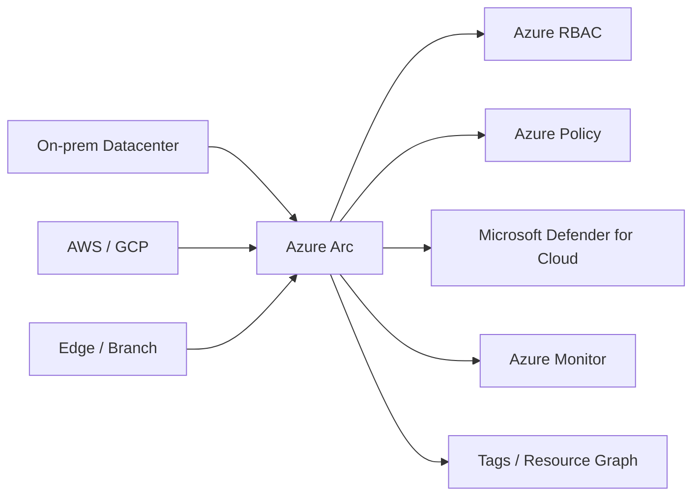
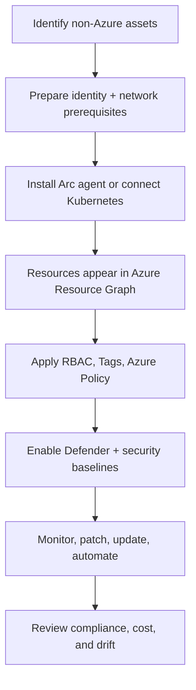
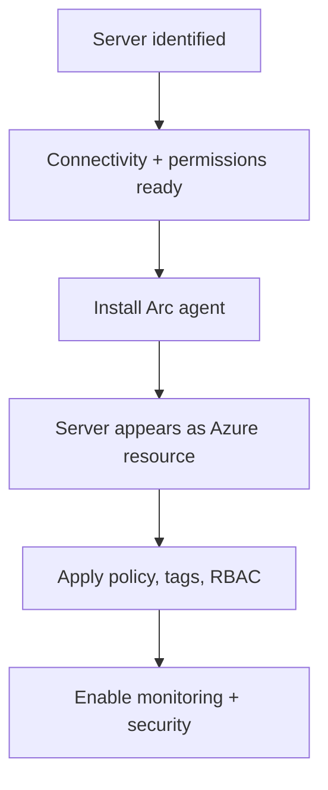
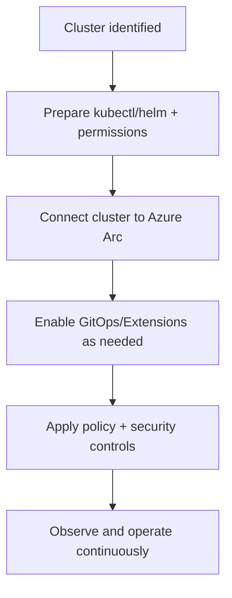

# Azure Arc: End-to-End Flow

## What is Azure Arc?
Azure Arc is a Microsoft Azure service that lets you manage resources running **outside Azure** (on-premises, other clouds, edge sites) as if they were native Azure resources.

In simple words:
- Your server can run in your datacenter, AWS, or GCP
- Azure Arc connects it to Azure control plane
- You then use Azure tools (Policy, RBAC, Defender, Monitor, Update Manager, etc.) from one place

## What is it used for?
- Centralized governance for hybrid and multicloud environments
- Consistent security posture across Azure and non-Azure resources
- Inventory and lifecycle management of distributed infrastructure
- Running Azure services on external infrastructure (for supported Arc-enabled services)

## Why is it important?
Without Arc, teams usually operate multiple disconnected tools per environment. Arc creates a **single management plane** and reduces operational drift.

## Azure Arc in one diagram


## Core Azure Arc resource types
1. **Arc-enabled Servers**
   - Non-Azure Windows/Linux machines represented in Azure
2. **Arc-enabled Kubernetes**
   - Any CNCF-conformant Kubernetes cluster connected to Azure
3. **Arc-enabled SQL Server / data services**
   - SQL and selected data capabilities with Azure governance and operations

## Azure Arc mental model
Think in 3 layers:

1. **Connected Resource Layer**
   - Server or Kubernetes cluster is onboarded to Arc
2. **Control & Governance Layer**
   - RBAC, tags, policy assignments, compliance, Defender plans
3. **Operations Layer**
   - Monitoring, updates, patching, extension lifecycle, automation

## End-to-end flow (high level)


## Step-by-step flow

### 1) Discover and classify assets
- List all servers/clusters outside Azure
- Group by environment: dev, test, prod
- Define ownership (application team vs platform team)

### 2) Prepare prerequisites
- Azure subscription and resource group strategy
- Outbound connectivity from machines/clusters to Azure endpoints
- Identity and permissions for onboarding

### 3) Onboard resources to Arc
- For servers: install Arc Connected Machine agent
- For Kubernetes: connect cluster using Arc onboarding process
- Verify resources show up in Azure Portal and Azure Resource Graph

### 4) Apply governance baseline
- Assign Azure Policy for required controls (for example: approved regions/tags/extensions)
- Apply tags: `Environment`, `Owner`, `BusinessUnit`, `Criticality`
- Configure least-privilege Azure RBAC roles

### 5) Enable security and monitoring
- Enable Microsoft Defender for Cloud recommendations
- Send logs/metrics to Log Analytics/Azure Monitor
- Build alerts for heartbeat, CPU/memory, and security findings

### 6) Operate day-2 lifecycle
- Patch/update with consistent windows
- Track compliance trends
- Handle drift via policy remediation and automation

## Server onboarding flow


## Kubernetes onboarding flow


## Typical architecture pattern
- **Management subscription** hosts governance and monitoring controls
- **Workload subscriptions** host Arc-connected resources grouped by environment
- Central policy initiative + role model applied from management group scope

## Common mistakes
- Onboarding first, governance later (should be planned together)
- Missing tag strategy, causing poor visibility/reporting
- Over-permissive RBAC at subscription scope
- No baseline alerts after connection
- Treating Arc as migration instead of management plane

## Quick validation checklist
- Resources visible in Arc inventory
- Mandatory tags applied
- Policy compliance state is tracked
- Security recommendations are reviewed
- Monitoring heartbeat and alerts are active

## Azure Portal checks
1. Azure Portal -> **Azure Arc** -> verify connected resources
2. Azure Portal -> **Policy** -> check assignments and compliance state
3. Azure Portal -> **Defender for Cloud** -> review recommendations
4. Azure Portal -> **Monitor** -> validate logs, metrics, and alerts

## Azure CLI checks
```bash
# List Arc-enabled servers in subscription
az connectedmachine list --query "[].{name:name,rg:resourceGroup,location:location,status:status}" -o table

# Show Arc-enabled Kubernetes resources
az resource list --resource-type "Microsoft.Kubernetes/connectedClusters" --query "[].{name:name,rg:resourceGroup,location:location}" -o table

# Query policy state summary (example)
az policy state summarize --management-group <mg-id>
```

## What good looks like
- Non-Azure resources are first-class citizens in Azure governance
- Unified RBAC, Policy, and security posture across environments
- Repeatable onboarding and day-2 operations playbook
- Clear ownership and alerting for production resources

## Public references
- Microsoft Learn: Azure Arc overview
- Microsoft Learn: Arc-enabled servers overview
- Microsoft Learn: Arc-enabled Kubernetes overview
- Microsoft Learn: Azure Arc governance and security guidance
