# Communication Between Two AKS Services (Cross-Cluster)

## What is it?
Cross-cluster AKS communication is the pattern used when services running in different AKS clusters need private, secure connectivity.

## What is it used for?
- Service-to-service API calls across clusters
- Multi-region or multi-environment architectures
- Shared platform services consumed by separate clusters

## Why is it important?
It enables distributed architectures while preserving security, latency control, and operational boundaries.

## Workflow
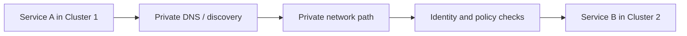

How do two services in two different AKS clusters communicate with each other?

## Overview

When you have microservices spread across multiple AKS clusters, cross-cluster communication must be explicitly configured. The approach depends on where the clusters live — same resource group, different subscriptions, or different tenants.

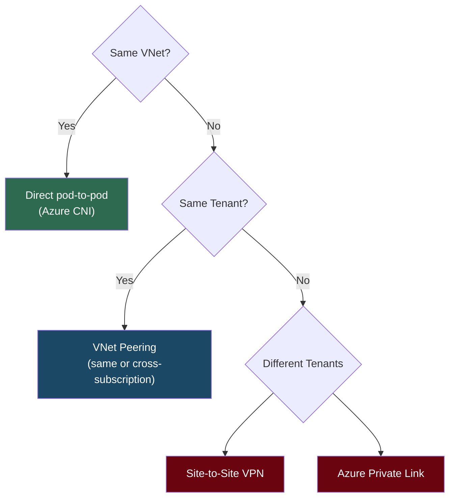

---

## Scenarios

| # | Scenario | Communication Method | Key Components |
|---|----------|---------------------|----------------|
| 1 | Same subscription, same RG | VNet Peering or same VNet | NSGs, Internal LB, Private DNS, mTLS |
| 2 | Different subscriptions (same tenant) | Cross-subscription VNet Peering | NSGs, Internal LB, RBAC, Private DNS, mTLS |
| 3 | Different tenants | VPN Gateway or Private Link | NSGs, VPN encryption, Private Endpoint, mTLS |

---

## Scenario 1: Same Subscription, Same Resource Group

**Recommended Approach: VNet Peering**

- VNet Peering allows two VNets in the same region to communicate privately.
- If both AKS clusters are in the **same VNet**, they can communicate directly.
- If in **different VNets**, peer them.

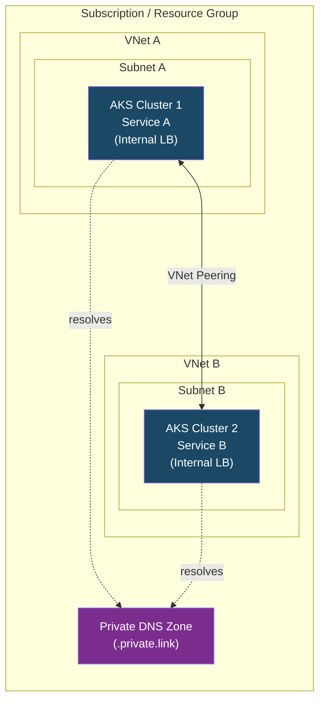

### Steps

#### 1. Ensure Both AKS Clusters Use Azure CNI

Azure CNI assigns a unique IP to each pod from the VNet subnet, making network peering straightforward. Kubenet uses a NAT layer which complicates cross-cluster routing.

```bash
# When creating the cluster
az aks create \
  --resource-group myRG \
  --name myAKS \
  --network-plugin azure \
  --vnet-subnet-id /subscriptions/<sub>/resourceGroups/<rg>/providers/Microsoft.Network/virtualNetworks/<vnet>/subnets/<subnet>
```

#### 2. Peer the VNets (if not already in the same VNet)

```bash
# Peer VNet A → VNet B
az network vnet peering create \
  --name AtoB \
  --resource-group myRG \
  --vnet-name vnetA \
  --remote-vnet /subscriptions/<sub>/resourceGroups/<rg>/providers/Microsoft.Network/virtualNetworks/vnetB \
  --allow-vnet-access

# Peer VNet B → VNet A (peering must be created from BOTH sides)
az network vnet peering create \
  --name BtoA \
  --resource-group myRG \
  --vnet-name vnetB \
  --remote-vnet /subscriptions/<sub>/resourceGroups/<rg>/providers/Microsoft.Network/virtualNetworks/vnetA \
  --allow-vnet-access
```

#### 3. Expose Services with Internal LoadBalancer

Use an Internal LoadBalancer so services are reachable over private IPs only.

```yaml
apiVersion: v1
kind: Service
metadata:
  name: my-service
  annotations:
    service.beta.kubernetes.io/azure-load-balancer-internal: "true"
spec:
  type: LoadBalancer
  loadBalancerIP: <static-private-ip>   # optional: pin to a specific IP
  ports:
    - port: 80
      targetPort: 8080
  selector:
    app: my-app
```

> **Tip:** Omit `loadBalancerIP` to let Azure assign one automatically from the subnet. Use a static IP only when other services need a stable address.

#### 4. Network Security Groups (NSGs)

Restrict traffic to only allow the required ports and source IP ranges (the other cluster's subnet CIDR).

```bash
az network nsg rule create \
  --resource-group myRG \
  --nsg-name aks-subnet-nsg \
  --name AllowFromCluster2 \
  --priority 100 \
  --direction Inbound \
  --access Allow \
  --protocol Tcp \
  --source-address-prefixes 10.1.0.0/16 \
  --destination-port-ranges 80 443
```

#### 5. DNS Resolution

Use **Azure Private DNS Zones** for service discovery so services resolve each other by name instead of hardcoded IPs.

##### Why not just use Kubernetes DNS?

Kubernetes has built-in DNS via **CoreDNS**, but it only works **within a single cluster**. It cannot resolve services in a different cluster.

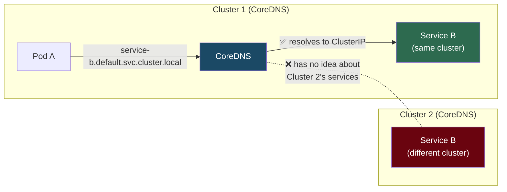

| | Same Cluster | Cross-Cluster |
|---|---|---|
| **DNS** | CoreDNS (`svc.cluster.local`) | Azure Private DNS Zone (custom domain) |
| **Discovery** | Automatic (K8s Service object) | Manual (A records pointing to Internal LB IPs) |
| **Network path** | ClusterIP / Pod IPs | VNet Peering + Internal LoadBalancer |
| **Setup required** | None (built-in) | DNS Zone + VNet Links + A records |

> **Could you skip Private DNS and just hardcode IPs?** Yes — you could put the Internal LB IP (`10.1.1.60`) directly in your app config. But that's fragile. Azure Private DNS gives you name-based discovery, easier IP rotation (change the A record, not every app), and consistency across environments.

##### How Azure Private DNS solves cross-cluster resolution

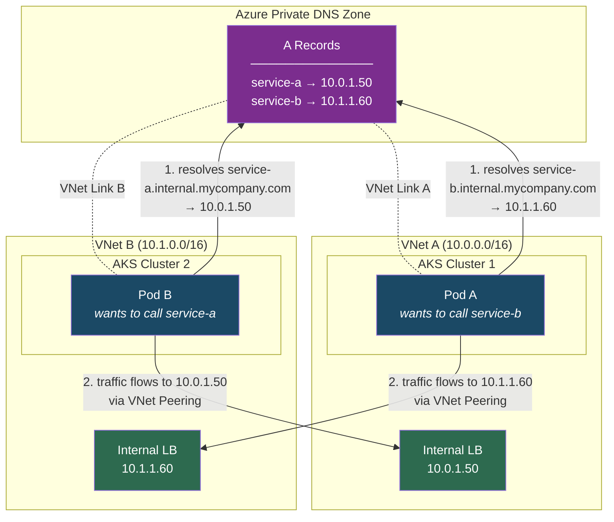

##### Setup flow (step by step)

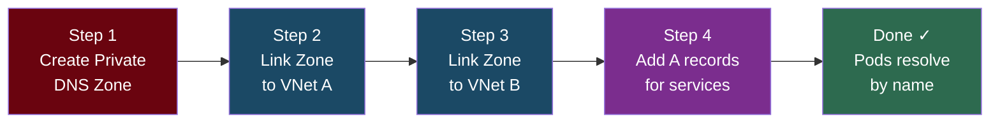

##### CLI commands

**Step 1 — Create a Private DNS Zone**
```bash
az network private-dns zone create \
  --resource-group myRG \
  --name internal.mycompany.com
```

**Step 2 & 3 — Link to both VNets**
```bash
# Link to VNet A
az network private-dns link vnet create \
  --resource-group myRG \
  --zone-name internal.mycompany.com \
  --name link-vnetA \
  --virtual-network vnetA \
  --registration-enabled false

# Link to VNet B
az network private-dns link vnet create \
  --resource-group myRG \
  --zone-name internal.mycompany.com \
  --name link-vnetB \
  --virtual-network vnetB \
  --registration-enabled false
```

**Step 4 — Add A records for both services**
```bash
# Record for service-a (Cluster 1's Internal LB IP — so Cluster 2 can reach it)
az network private-dns record-set a add-record \
  --resource-group myRG \
  --zone-name internal.mycompany.com \
  --record-set-name service-a \
  --ipv4-address <cluster1-internal-lb-ip>

# Record for service-b (Cluster 2's Internal LB IP — so Cluster 1 can reach it)
az network private-dns record-set a add-record \
  --resource-group myRG \
  --zone-name internal.mycompany.com \
  --record-set-name service-b \
  --ipv4-address <cluster2-internal-lb-ip>
```

> **Note:** You need an A record for **every service** that needs to be reachable cross-cluster. If only Cluster 1 calls Cluster 2 (one-way), you only need the `service-b` record. If both call each other (bidirectional), add records for both.

> **Tip:** Set `--registration-enabled true` on the VNet link if you want VMs/pods in that VNet to auto-register their DNS records. For AKS services behind an Internal LB, manual A records (step 4) are typically more predictable.

---

## Scenario 2: Different Subscriptions

**Recommended Approach: Cross-Subscription VNet Peering**

VNet Peering works across subscriptions as long as both are within the **same Azure AD / Entra ID tenant**.

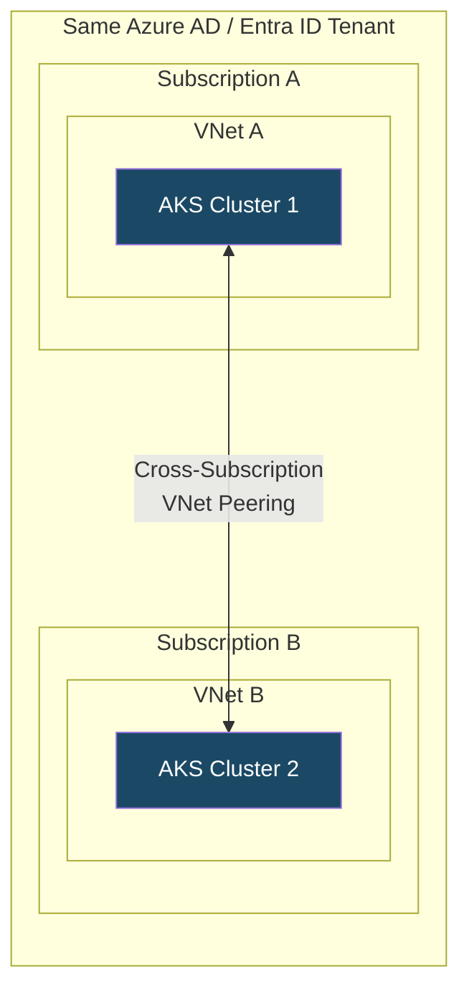

### Steps

#### 1. Create / Peer VNets Across Subscriptions

Peering must be initiated from one subscription and approved from the other. The identity performing the peering needs the **Network Contributor** role on both VNets.

```bash
# From Subscription A
az network vnet peering create \
  --name AtoB \
  --resource-group rgA \
  --vnet-name vnetA \
  --remote-vnet /subscriptions/<subB>/resourceGroups/<rgB>/providers/Microsoft.Network/virtualNetworks/vnetB \
  --allow-vnet-access

# From Subscription B (switch context or use --subscription)
az network vnet peering create \
  --name BtoA \
  --resource-group rgB \
  --vnet-name vnetB \
  --remote-vnet /subscriptions/<subA>/resourceGroups/<rgA>/providers/Microsoft.Network/virtualNetworks/vnetA \
  --allow-vnet-access
```

#### 2. Follow Steps 3–5 from Scenario 1

- Expose services via Internal LoadBalancer
- Lock down with NSGs
- Set up Private DNS Zones (link to VNets across subscriptions)

#### Security Notes

- Ensure only required ports are open between subnets.
- Use **Azure RBAC** to control who can create or manage peering.
- Ensure non-overlapping CIDR ranges between the two VNets.

---

## Scenario 3: Different Tenants

**Recommended Approach: VPN Gateway or Azure Private Link**

> VNet Peering **does not work across tenants**. You need either a VPN tunnel or Private Link.

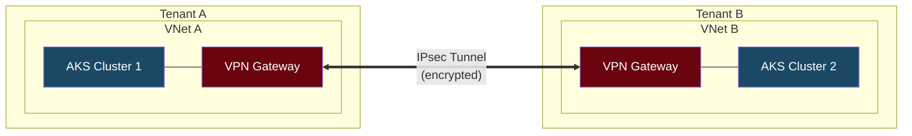

### Option A: Site-to-Site VPN

Set up a VPN Gateway in each VNet and establish a secure, encrypted tunnel.

```bash
# 1. Create VPN Gateway in Tenant A
az network vnet-gateway create \
  --resource-group rgA \
  --name vpnGwA \
  --vnet vnetA \
  --gateway-type Vpn \
  --vpn-type RouteBased \
  --sku VpnGw1

# 2. Create VPN Gateway in Tenant B (same command, different context)

# 3. Create Local Network Gateway (represents the remote side)
az network local-gateway create \
  --resource-group rgA \
  --name localGwB \
  --gateway-ip-address <public-ip-of-vpnGwB> \
  --local-address-prefixes 10.2.0.0/16

# 4. Create the connection
az network vpn-connection create \
  --resource-group rgA \
  --name AtoB \
  --vnet-gateway1 vpnGwA \
  --local-gateway2 localGwB \
  --shared-key <pre-shared-key>
```

### Option B: Azure Private Link

Expose the target service via a **Private Link Service** and consume it through a **Private Endpoint** in the other tenant. This avoids setting up VPN infrastructure entirely.

#### How Private Link Works (Conceptual)

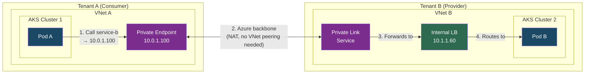

> **Key insight:** The consumer (Tenant A) gets a **private IP in its own VNet** (`10.0.1.100`) that maps to the provider's service. No VNet peering, no VPN, no overlapping CIDR issues — Azure handles the NAT over its backbone.

#### End-to-End Setup Flow

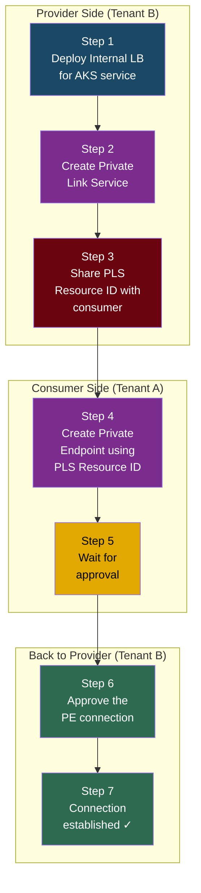

---

#### Step 1: Deploy Internal LoadBalancer for the AKS Service (Provider — Tenant B)

This is the same Internal LB pattern from Scenario 1. The service must have an Internal LB before you can front it with Private Link.

```yaml
# Apply in AKS Cluster 2 (Tenant B)
apiVersion: v1
kind: Service
metadata:
  name: service-b
  annotations:
    service.beta.kubernetes.io/azure-load-balancer-internal: "true"
spec:
  type: LoadBalancer
  ports:
    - port: 80
      targetPort: 8080
  selector:
    app: service-b
```

```bash
kubectl apply -f service-b.yaml

# Get the Internal LB IP (wait until EXTERNAL-IP shows a private IP)
kubectl get svc service-b
# NAME        TYPE           CLUSTER-IP    EXTERNAL-IP   PORT(S)
# service-b   LoadBalancer   10.0.45.12    10.1.1.60     80:31234/TCP
```

> Note the **Internal LB frontend IP** — you'll need the LB resource ID in the next step.

---

#### Step 2: Create a Private Link Service (Provider — Tenant B)

The Private Link Service sits in front of the Internal LB and makes it available for Private Endpoint connections from other tenants/subscriptions.

```bash
# Get the Internal LB's frontend IP config resource ID
LB_FRONTEND_ID=$(az network lb show \
  --resource-group rgB \
  --name kubernetes-internal \
  --query "frontendIpConfigurations[0].id" -o tsv)

# Create the Private Link Service
az network private-link-service create \
  --resource-group rgB \
  --name pls-service-b \
  --vnet-name vnetB \
  --subnet subnetB \
  --lb-frontend-ip-configs "$LB_FRONTEND_ID" \
  --location eastus
```

```bash
# Get the PLS resource ID (you'll share this with the consumer)
PLS_ID=$(az network private-link-service show \
  --resource-group rgB \
  --name pls-service-b \
  --query "id" -o tsv)

echo "$PLS_ID"
# /subscriptions/<subB>/resourceGroups/rgB/providers/Microsoft.Network/privateLinkServices/pls-service-b
```

##### Visibility & Auto-Approval Settings

By default, anyone with the PLS resource ID can request a connection. You can control this:

```bash
# Option A: Auto-approve connections from specific subscriptions
az network private-link-service update \
  --resource-group rgB \
  --name pls-service-b \
  --auto-approval "{subscriptions:['/subscriptions/<trusted-sub-id>']}" \
  --visibility "{subscriptions:['/subscriptions/<trusted-sub-id>']}"

# Option B: Keep manual approval (default) — more secure for cross-tenant
# No extra config needed. Every PE connection will need explicit approval.
```

| Setting | Purpose |
|---------|---------|
| `--visibility` | Controls who can **see** and create PEs against this PLS |
| `--auto-approval` | Controls which subscriptions get **auto-approved** (skip Step 6) |
| Neither set | Anyone with the resource ID can request; all need manual approval |

---

#### Step 3: Share the PLS Resource ID (Provider → Consumer)

The provider shares the PLS resource ID with the consumer team through a **secure channel** (not public). The consumer needs this ID to create a Private Endpoint.

```
/subscriptions/<subB>/resourceGroups/rgB/providers/Microsoft.Network/privateLinkServices/pls-service-b
```

> **Security:** Treat this resource ID carefully. While it's not a secret by itself (you still need Azure RBAC to use it), sharing it widely increases the risk of unwanted connection requests.

---

#### Step 4: Create a Private Endpoint (Consumer — Tenant A)

The consumer creates a Private Endpoint in their own VNet. This allocates a **private IP in the consumer's VNet** that maps to the provider's service.

```bash
# Create the Private Endpoint
az network private-endpoint create \
  --resource-group rgA \
  --name pe-to-service-b \
  --vnet-name vnetA \
  --subnet subnetA \
  --private-connection-resource-id "/subscriptions/<subB>/resourceGroups/rgB/providers/Microsoft.Network/privateLinkServices/pls-service-b" \
  --connection-name "conn-to-tenant-b-service-b" \
  --location eastus
```

```bash
# Check the connection status (will show "Pending" until approved)
az network private-endpoint show \
  --resource-group rgA \
  --name pe-to-service-b \
  --query "privateLinkServiceConnections[0].privateLinkServiceConnectionState.status" -o tsv
# Output: Pending
```

```bash
# Get the private IP assigned to the endpoint (in consumer's VNet)
az network private-endpoint show \
  --resource-group rgA \
  --name pe-to-service-b \
  --query "customDnsConfigs[0].ipAddresses[0]" -o tsv
# Output: 10.0.1.100  (this is in YOUR VNet, not the provider's)
```

---

#### Step 5: Connection Pending — Waiting for Approval

At this point, the Private Endpoint exists but traffic **cannot flow yet**. The connection is in `Pending` state.

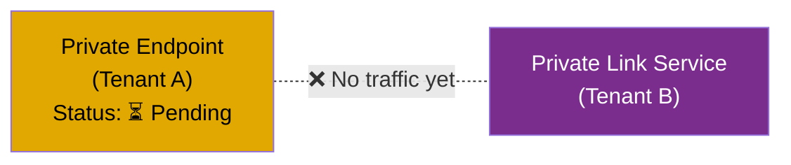

---

#### Step 6: Approve the Private Endpoint Connection (Provider — Tenant B)

The provider must approve the incoming connection request. This is the manual approval step (skipped if auto-approval was configured in Step 2).

```bash
# List pending connections on the PLS
az network private-link-service show \
  --resource-group rgB \
  --name pls-service-b \
  --query "privateEndpointConnections[].{Name:name, Status:privateLinkServiceConnectionState.status}" -o table

# Output:
# Name                                    Status
# ──────────────────────────────────────   ────────
# pe-to-service-b.abc123-def456-...       Pending
```

```bash
# Get the connection name
PE_CONN_NAME=$(az network private-link-service show \
  --resource-group rgB \
  --name pls-service-b \
  --query "privateEndpointConnections[0].name" -o tsv)

# Approve it
az network private-endpoint-connection approve \
  --resource-group rgB \
  --resource-name pls-service-b \
  --name "$PE_CONN_NAME" \
  --type Microsoft.Network/privateLinkServices \
  --description "Approved for Tenant A AKS cluster"
```

##### What if you want to reject or remove a connection?

```bash
# Reject a pending connection
az network private-endpoint-connection reject \
  --resource-group rgB \
  --resource-name pls-service-b \
  --name "$PE_CONN_NAME" \
  --type Microsoft.Network/privateLinkServices \
  --description "Not authorized"

# Delete an existing connection
az network private-endpoint-connection delete \
  --resource-group rgB \
  --resource-name pls-service-b \
  --name "$PE_CONN_NAME" \
  --type Microsoft.Network/privateLinkServices
```

---

#### Step 7: Connection Established — Verify

After approval, the status changes to `Approved` and traffic flows.

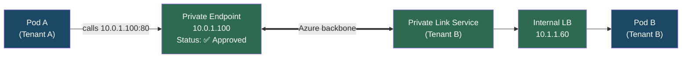

```bash
# Verify from consumer side
az network private-endpoint show \
  --resource-group rgA \
  --name pe-to-service-b \
  --query "privateLinkServiceConnections[0].privateLinkServiceConnectionState" -o json

# Output:
# {
#   "actionsRequired": "None",
#   "description": "Approved for Tenant A AKS cluster",
#   "status": "Approved"
# }
```

##### Optional: Set up DNS for the Private Endpoint

So pods in Cluster 1 can call `service-b.internal.mycompany.com` instead of the raw IP:

```bash
# Create Private DNS Zone (if not already created)
az network private-dns zone create \
  --resource-group rgA \
  --name internal.mycompany.com

# Link to consumer VNet
az network private-dns link vnet create \
  --resource-group rgA \
  --zone-name internal.mycompany.com \
  --name link-vnetA \
  --virtual-network vnetA \
  --registration-enabled false

# Add A record pointing to the Private Endpoint IP
az network private-dns record-set a add-record \
  --resource-group rgA \
  --zone-name internal.mycompany.com \
  --record-set-name service-b \
  --ipv4-address 10.0.1.100
```

---

#### Private Link vs VPN — When to Use Which?

| | Private Link | Site-to-Site VPN |
|---|---|---|
| **Setup complexity** | Low (no gateway infra) | High (VPN gateways both sides) |
| **Cost** | Per PE + data processed | VPN Gateway SKU + data transfer |
| **CIDR overlap** | ✅ Works (NAT handles it) | ❌ Fails if CIDRs overlap |
| **Directionality** | One-way (consumer → provider) | Bidirectional |
| **Scope** | Per-service | Entire VNet-to-VNet |
| **Best for** | Exposing specific services | Full network connectivity |

> **Important:** Private Link is **unidirectional** — the consumer calls the provider. If both clusters need to call each other, you need a Private Link Service + Private Endpoint setup **in both directions** (each cluster acts as both provider and consumer).

**Provider side (Tenant B):**
1. Deploy an Internal LoadBalancer for the service.
2. Create a Private Link Service pointing to that LB.

**Consumer side (Tenant A):**
1. Create a Private Endpoint targeting the Private Link Service resource ID.
2. Service is now reachable via a private IP inside the consumer's VNet.

### Additional Steps for Both Options

- **Expose Services Internally** — same Internal LoadBalancer pattern as Scenario 1.
- **Restrict Traffic** — use NSGs and Azure Firewall for fine-grained access control.
- **Authentication & Encryption** — use **mTLS** (mutual TLS) between services for end-to-end encryption and identity verification.

---

## Best Security Practices

| Practice | Why |
|----------|-----|
| Never expose services publicly unless absolutely necessary | Reduces attack surface |
| Restrict access using NSGs, firewalls, and Kubernetes RBAC | Principle of least privilege |
| Use **mTLS** for service-to-service authentication | End-to-end encryption + identity verification |
| Audit and monitor network traffic with **Azure Monitor** and **Network Watcher** | Detect anomalies and misconfigurations |
| Rotate credentials and certificates regularly | Limits blast radius of compromised secrets |
| Use non-overlapping CIDR ranges across VNets | Prevents routing conflicts with peering/VPN |
| Prefer **Azure CNI** over Kubenet for cross-cluster scenarios | Pods get VNet-routable IPs directly |

---

## Additional Considerations

### Service Mesh for Cross-Cluster Communication

For more advanced use cases, consider a **service mesh** that supports multi-cluster topologies:

| Service Mesh | Multi-Cluster Support | Notes |
|-------------|----------------------|-------|
| **Istio** | Yes (multi-primary, primary-remote) | Most mature; can span clusters across networks |
| **Linkerd** | Yes (multi-cluster) | Lightweight; uses gateway-based approach |
| **Consul Connect** | Yes | HashiCorp; supports cross-cloud |

A service mesh provides automatic **mTLS**, **traffic routing**, **observability**, and **retries** across clusters without changing application code.

### Azure API Management (APIM) as a Gateway

If cross-cluster calls are primarily API-based, placing an **Azure API Management** instance in front of internal services gives you:
- Rate limiting and throttling
- Authentication / API key management
- Request/response transformation
- Centralized logging

### Network Address Overlap

If VNet CIDR ranges overlap, VNet Peering and VPN will **not work**. In that case:
- Re-address one of the VNets (disruptive), or
- Use **Azure Private Link** (works regardless of address overlap since it uses NATed private endpoints).

---

## Summary Table

| Scenario | Communication Method | Security Considerations |
|----------|---------------------|------------------------|
| Same subscription, same RG | VNet Peering or same VNet | NSGs, Internal LB, Private DNS, mTLS |
| Different subscriptions (same tenant) | Cross-subscription VNet Peering | NSGs, Internal LB, RBAC, Private DNS, mTLS |
| Different tenants | VPN Gateway or Private Link | NSGs, VPN encryption, Private Endpoint, mTLS |
