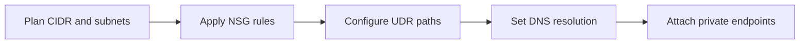
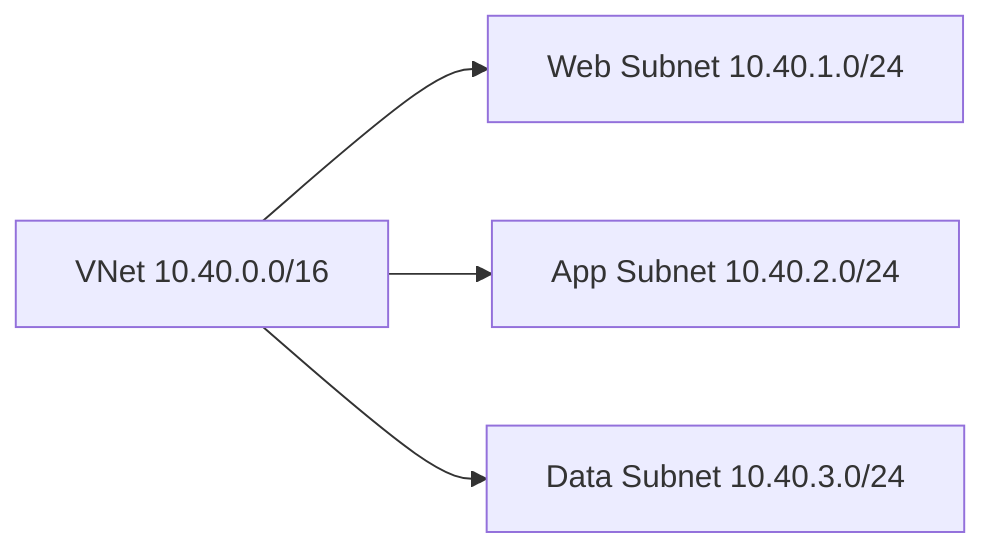
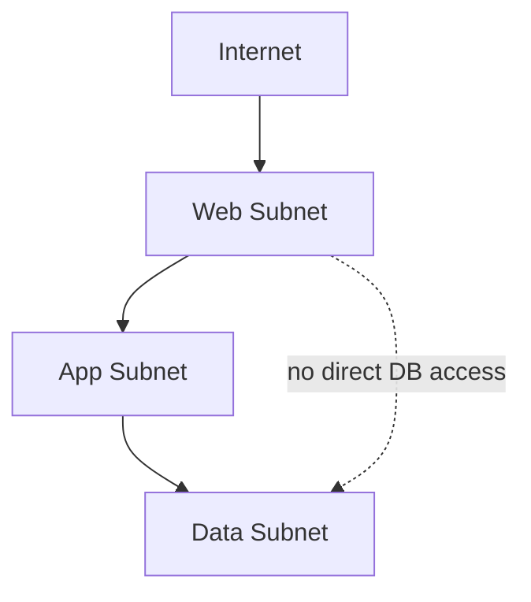
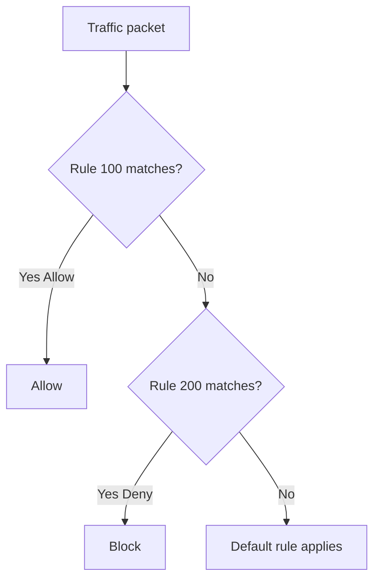
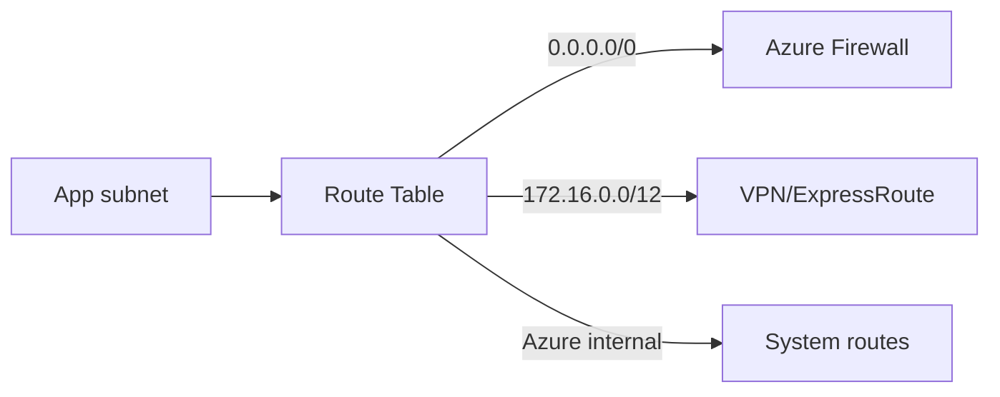
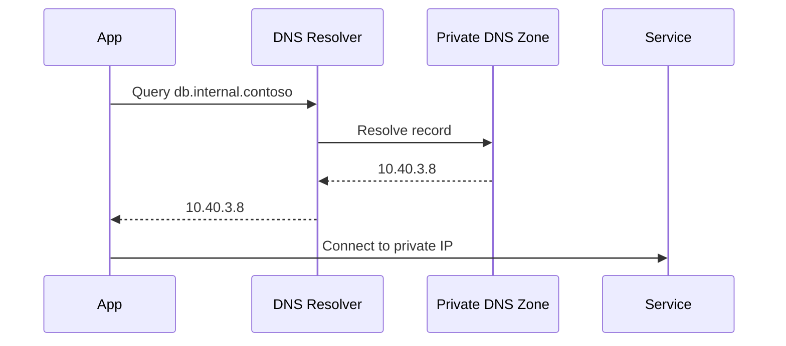
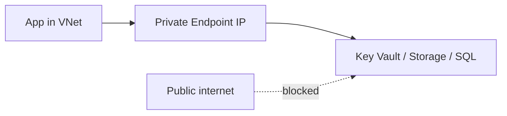
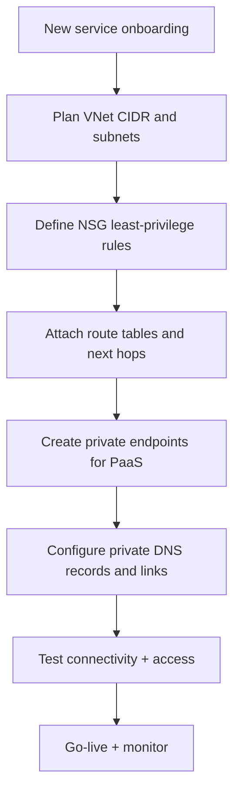

# VNet, Subnetting, NSG, UDR, DNS, and Private Endpoint

## What is it?
This topic covers the core Azure networking primitives that define private address space, traffic filtering, routing, name resolution, and private PaaS access.

## What is it used for?
It is used to design secure east-west and north-south connectivity for application tiers and managed services.

## Why is it important?
Most Azure connectivity outages are caused by misalignment across these six building blocks rather than application code.

## Workflow

## Overview

These six concepts define how private connectivity works in Azure:
- **VNet** gives private network boundaries
- **Subnets** segment trust zones
- **NSG** controls allowed/blocked flows
- **UDR** controls traffic path/next hop
- **DNS** translates names to reachable private IPs
- **Private Endpoint** gives PaaS services private IP access

If any one is wrong, applications fail even if code is fine.

---

## 1) VNet (Virtual Network)

A VNet is your private network space in Azure.

### Key points
- You define CIDR (example: `10.40.0.0/16`)
- Resources are deployed into its subnets
- VNet is region-scoped

### Design tips
- Reserve enough IP space for scaling
- Avoid overlapping CIDRs with on-prem/other VNets
- Plan peering/hub-spoke before production

---

## 2) Subnetting

Subnets are security and operational boundaries inside the VNet.

### Typical segmentation
- **Web**: ingress-facing workloads
- **App**: internal APIs and workers
- **Data**: DB, cache, private endpoints

### Best practices
- Segment by trust level, not only by application
- Keep dedicated subnet for private endpoints in larger environments
- Keep subnet sizing realistic (do not over-fragment)

---

## 3) NSG (Network Security Group)

NSGs are layer 3/4 ACLs for inbound and outbound traffic.

### Rule evaluation
- Lower priority number = evaluated first
- First matching rule wins
- Use explicit allow rules for required flows only

### Example policy set
- Allow HTTPS from internet to web subnet
- Allow app subnet to data subnet on DB port only
- Deny broad outbound internet from data subnet

---

## 4) UDR (User Defined Route)

UDR overrides system routes to force traffic through required path.

### Common use cases
- Force outbound traffic via Azure Firewall
- Route on-prem ranges via VPN/ExpressRoute gateway
- Central inspection and egress governance

### Common mistakes
- Asymmetric routing
- Missing return route to source subnet
- Forcing all traffic to unavailable next hop

---

## 5) DNS in Azure

DNS is required for service discovery. If DNS fails, connectivity fails.

### Private DNS essentials
- Link private DNS zone to correct VNet(s)
- Validate A-records for private endpoints
- Avoid hardcoded IPs in apps

---

## 6) Private Endpoint

Private Endpoint maps an Azure PaaS resource to private IP in your subnet.

### Why it is important
- Avoid public exposure of PaaS services
- Reduce exfiltration risk
- Keep traffic in private network path

### Implementation workflow
1. Create private endpoint for target PaaS resource
2. Integrate with private DNS zone
3. Disable public network access (where appropriate)
4. Test from source subnet and validate NSG/UDR path

---

## End-to-End mini workflow for these six concepts

## Quick validation commands/checks
- Confirm subnet and NSG association
- Confirm effective routes on NIC/subnet
- Confirm DNS resolution from workload runtime
- Confirm private endpoint connection state

---

## Summary

| Component | Primary role |
|---|---|
| VNet | Private network boundary |
| Subnet | Security segmentation |
| NSG | Allow/deny traffic control |
| UDR | Traffic path control |
| DNS | Name resolution |
| Private Endpoint | Private PaaS connectivity |
