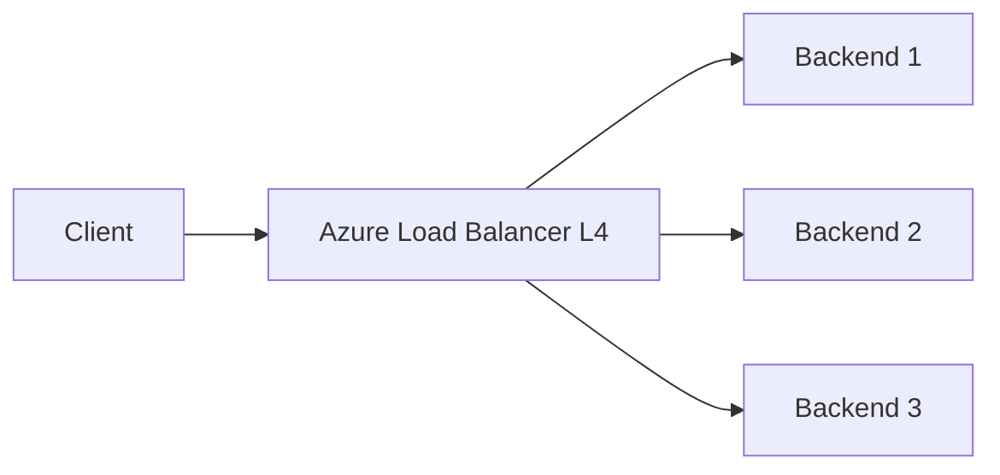
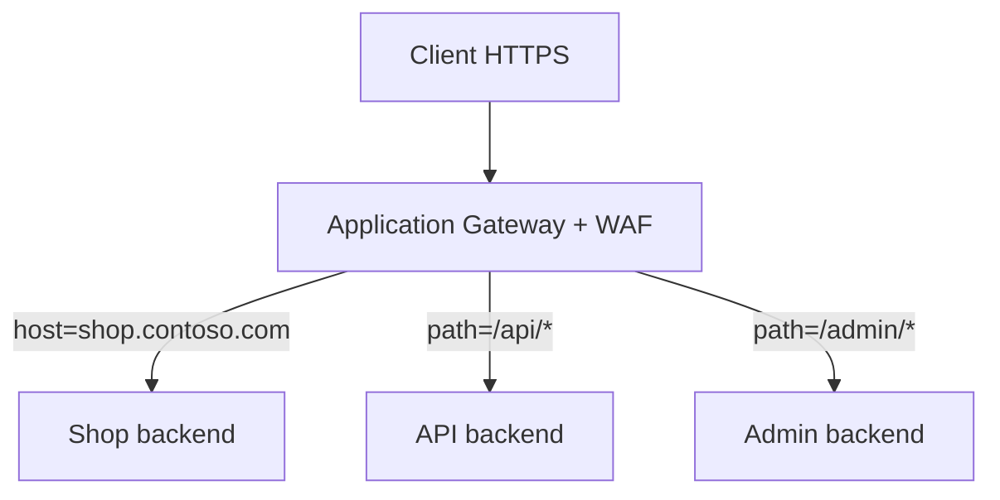
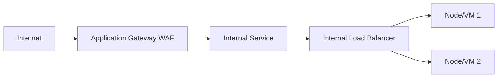
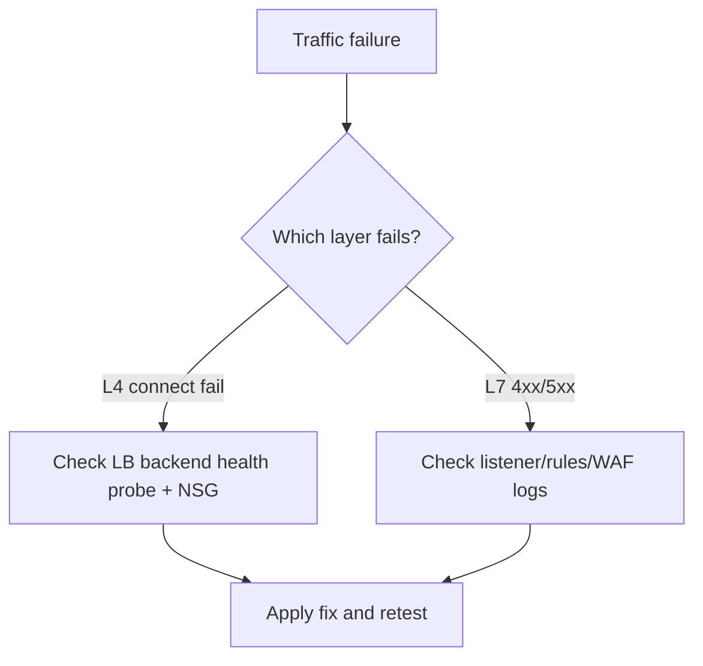

# Load Balancer vs Application Gateway

## Overview

Both distribute traffic, but they solve different problems:
- **Azure Load Balancer**: layer 4 (`TCP/UDP`) load distribution
- **Application Gateway**: layer 7 (`HTTP/HTTPS`) intelligent web traffic routing

---

## 1) Decision summary

| Requirement | Choose |
|---|---|
| Raw TCP/UDP balancing, low latency | Azure Load Balancer |
| HTTP routing by path/host, TLS offload, WAF | Application Gateway |
| Internal-only service distribution | Internal Load Balancer or Internal App Gateway |
| Web security with managed WAF | Application Gateway |

---

## 2) Azure Load Balancer (L4)

### What it does
- Balances by IP + port (not URL path)
- Works for HTTP and non-HTTP protocols
- Supports inbound and outbound scenarios



### Best fit use cases
- Game servers/custom TCP protocols
- API gateways already handled elsewhere
- AKS internal services with L4 exposure

---

## 3) Application Gateway (L7)

### What it does
- Understands HTTP/HTTPS
- Host-based and path-based routing
- TLS termination and optional re-encryption
- Built-in WAF for OWASP protections



### Best fit use cases
- Multiple web apps behind single public endpoint
- Need WAF and advanced HTTP routing
- SSL policy/certificate centralization

---

## 4) End-to-End selection workflow

```mermaid
flowchart TD
    START[Need traffic distribution] --> Q1{Protocol HTTP/HTTPS?}
    Q1 -->|No (TCP/UDP)| LB[Use Azure Load Balancer]
    Q1 -->|Yes| Q2{Need WAF/path/host routing?}
    Q2 -->|Yes| AGW[Use Application Gateway]
    Q2 -->|No| Q3{Need simple L4 only?}
    Q3 -->|Yes| LB
    Q3 -->|No| AGW
```

---

## 5) Architecture pattern with both together

In some enterprise architectures, both are used:
- App Gateway handles web/WAF at edge
- Load Balancer handles internal service distribution



---

## 6) Common troubleshooting workflow



### Quick checks
- LB: backend health, probe status, NSG/route path
- App Gateway: listener, backend pool, HTTP settings, WAF logs

---

## Summary

| Service | Layer | Strength |
|---|---|---|
| Load Balancer | L4 | Fast, protocol-agnostic distribution |
| Application Gateway | L7 | Web-aware routing + WAF + TLS control |
