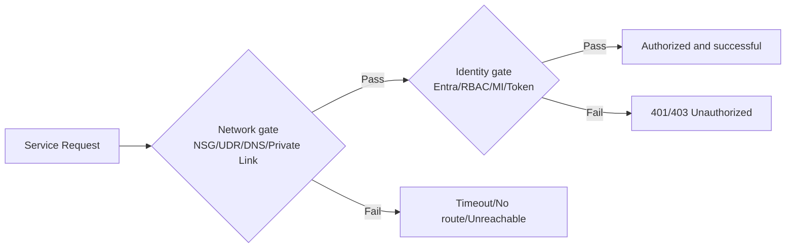
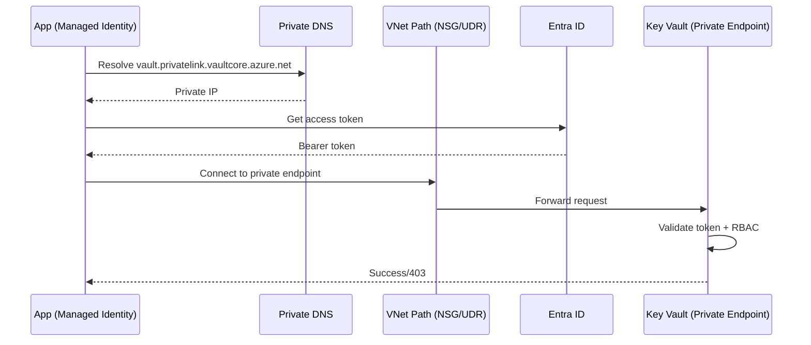
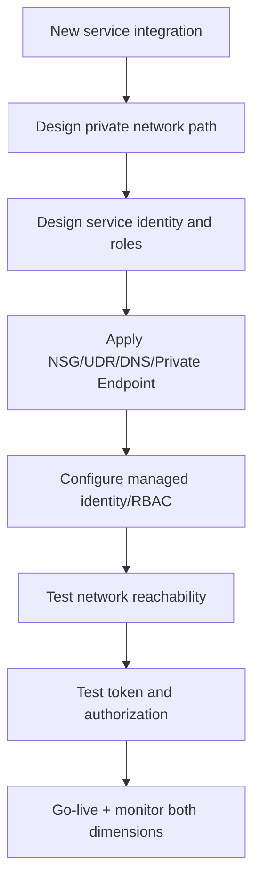
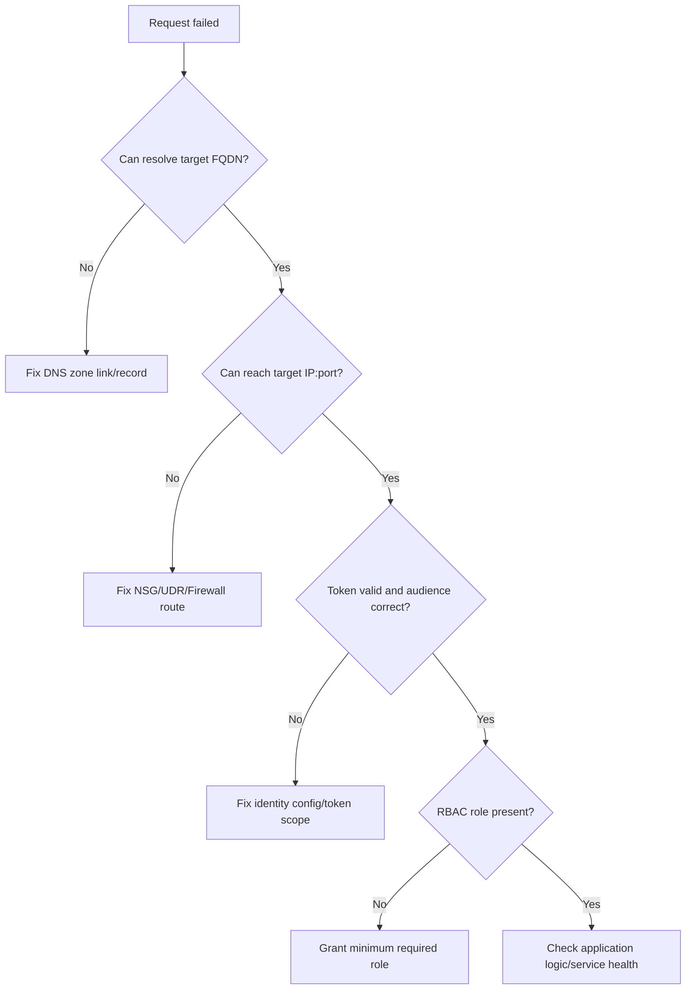

# Why Network and Identity Must Be Designed Together

## Core idea

A secure request succeeds only when **both** are true:
1. Network path exists
2. Caller is authorized

Mathematically:

$$
Access = Network\_Allowed \land Identity\_Allowed
$$

If either side fails, request fails.

---

## 1) Two-gate model

### Interpretation
- Network gate answers: **Can packet reach target?**
- Identity gate answers: **Can caller perform action?**

---

## 2) Real production failure patterns

| Symptom | Network status | Identity status | Typical root cause |
|---|---|---|---|
| Timeout | Fail | Unknown | NSG/UDR/DNS/private endpoint issue |
| 401/403 | Pass | Fail | missing RBAC role / wrong token audience |
| Intermittent failures | Partial | Partial | DNS split-horizon, route asymmetry, token expiry skew |
| Works from one subnet only | Mixed | Pass | subnet policy mismatch |

---

## 3) End-to-end request example

---

## 4) Design workflow (network + identity together)

### Practical checklist
- Connectivity test from runtime subnet
- DNS resolution test of private FQDN
- Token acquisition test (`managed identity`/service principal)
- Authorization test against exact target action

---

## 5) Troubleshooting decision flow

---

## Summary

- Network-only design is incomplete.
- Identity-only design is incomplete.
- Production-ready design always validates both gates in one workflow.
