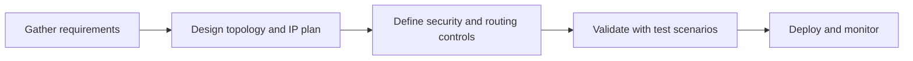
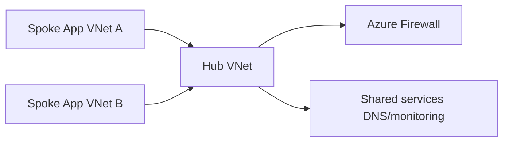
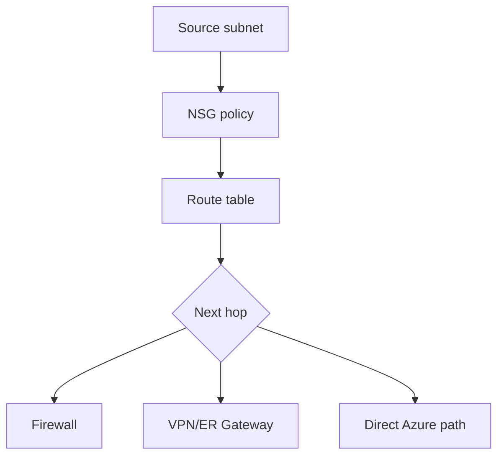
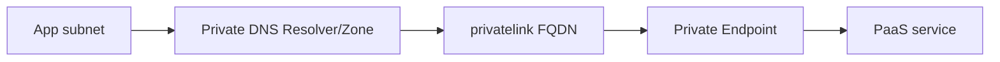
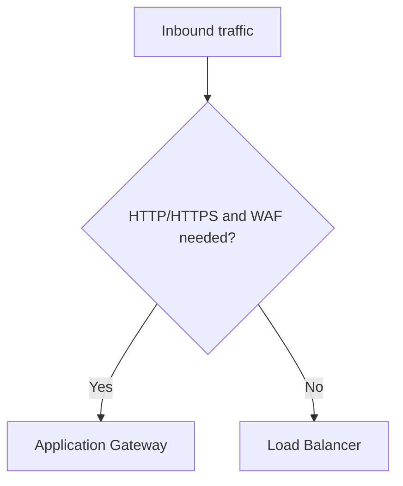
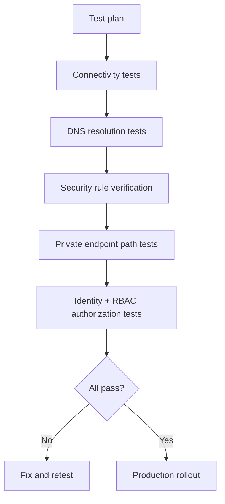
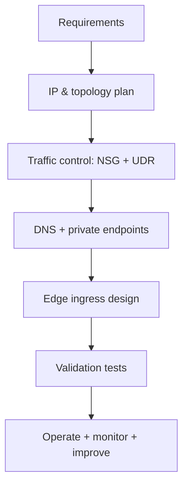

# End-to-End Azure Network Design Workflow

## What is it?
This is a structured method for designing Azure network topology, segmentation, ingress/egress, and operational controls.

## What is it used for?
It is used to move from requirements to an implementation-ready network architecture for production workloads.

## Why is it important?
A repeatable workflow improves consistency, security posture, and delivery speed across environments.

## Workflow

## Goal

Provide a repeatable workflow for designing secure, scalable Azure networking for production workloads.

---

## Phase 1: Requirements and constraints

### Capture inputs
- Workload type (web/API/data/event)
- Internet-facing vs internal-only
- Compliance constraints (PII, egress inspection, region restrictions)
- RTO/RPO and availability target

### Output
- Target architecture principles
- Region strategy
- Security baseline requirements

---

## Phase 2: IP and topology planning

### Tasks
1. Pick VNet CIDR ranges (non-overlapping)
2. Define subnet model (web/app/data/private-endpoints)
3. Decide topology (single VNet, peered VNets, hub-spoke)

### Output
- Address plan document
- Subnet sizing matrix
- Peering and connectivity map

---

## Phase 3: Traffic control design

### Tasks
- Define NSG ingress/egress least-privilege rules
- Define UDR for egress and on-prem routing
- Add firewall/NVA path if required

### Output
- NSG rule catalog
- Route table map and next-hop decisions

---

## Phase 4: Name resolution and private access

### Tasks
- Design DNS hierarchy (public + private)
- Configure private DNS zones for private endpoints
- Create private endpoints for PaaS dependencies
- Decide public network access policy per service

### Output
- DNS zone/link plan
- Private endpoint inventory

---

## Phase 5: Edge and ingress architecture

### Tasks
- Choose Load Balancer vs Application Gateway
- Define TLS termination and certificate ownership
- Define WAF policies where needed

### Output
- Ingress architecture decision record

---

## Phase 6: Validation and go-live checklist

### Validation workflow

### Minimum test matrix
- subnet-to-subnet allowed and denied paths
- DNS resolution from each workload subnet
- controlled fail test of firewall or route dependency
- end-to-end app + identity success path

---

## Phase 7: Operate and improve

### Operational controls
- Network Watcher flow logs
- NSG flow analytics
- Alerts on denied critical flows
- Drift checks for route tables and NSGs

### Review cadence
- Weekly: incident review and rule cleanup
- Monthly: route/NSG hygiene and unused endpoint cleanup
- Quarterly: DR/failover game day

---

## Full workflow map

## Summary

This workflow avoids ad-hoc networking changes and ensures design is:
- secure by default
- auditable
- scalable
- incident-ready
