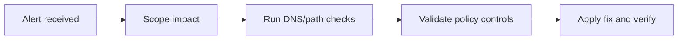
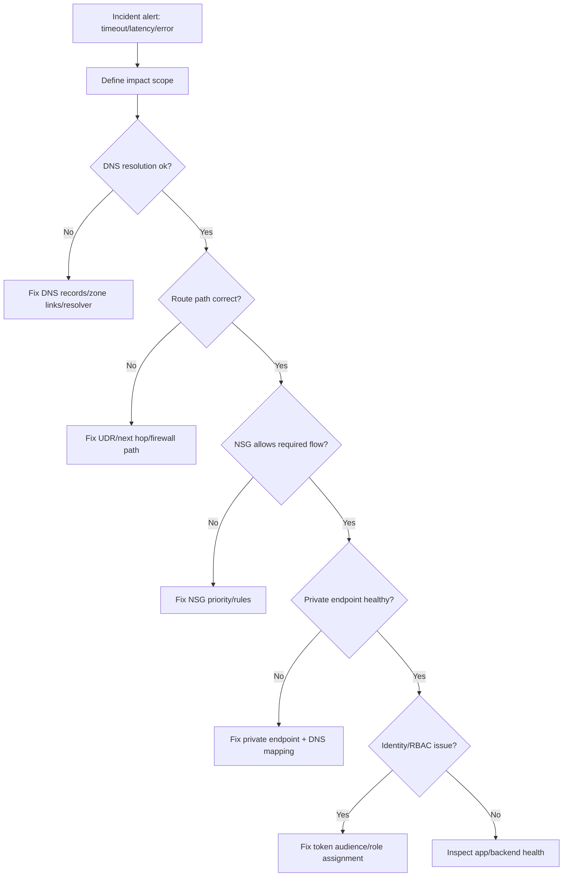
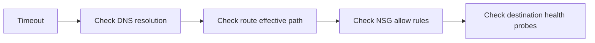
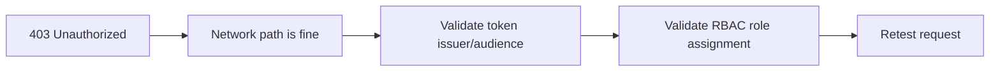
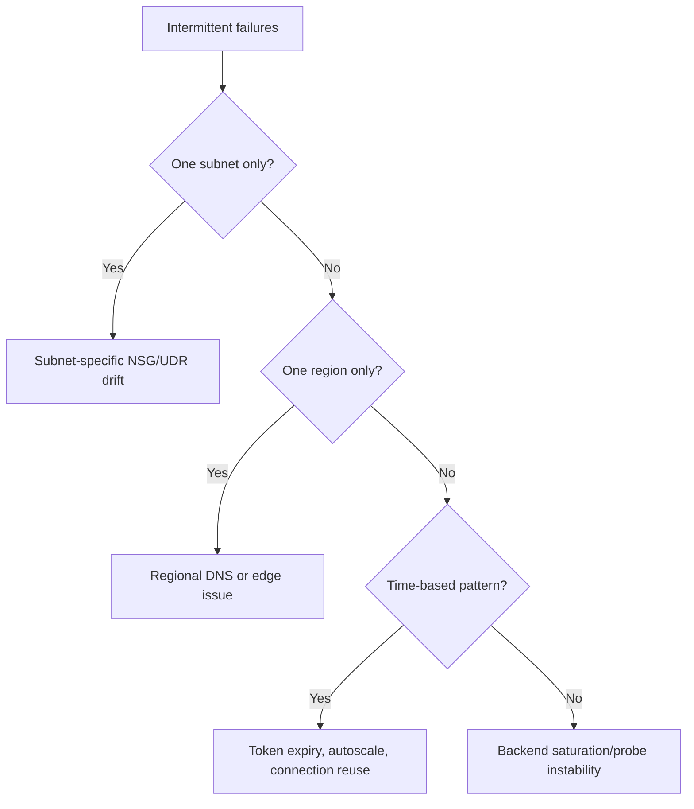
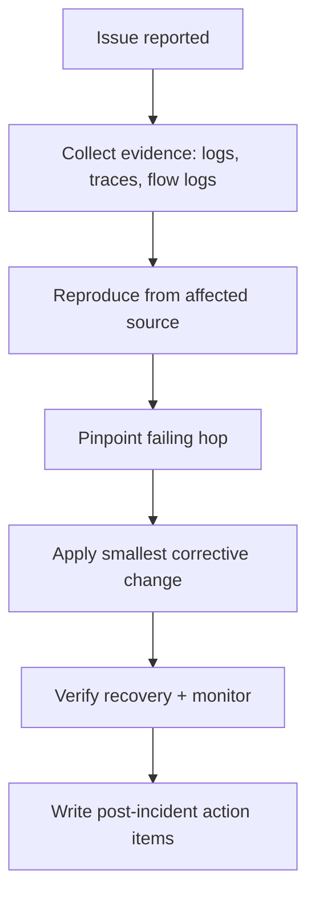
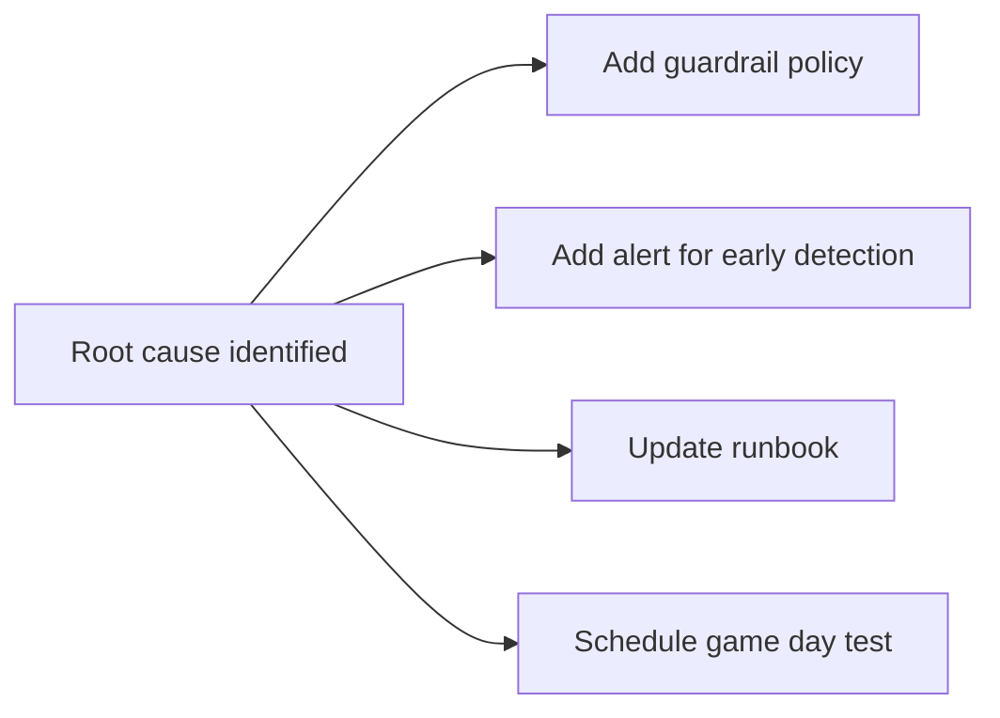

# Azure Networking Incident Troubleshooting Workflow Diagrams

## What is it?
This topic is an incident response playbook for diagnosing Azure network faults using ordered decision steps.

## What is it used for?
It is used by operators to reduce MTTR for DNS, routing, NSG, private endpoint, and identity-adjacent issues.

## Why is it important?
A standard troubleshooting sequence avoids random trial-and-error and speeds safe recovery.

## Workflow

## Goal

Use a structured, repeatable workflow to debug Azure networking incidents quickly.

---

## 1) Master incident workflow

---

## 2) Workflow by symptom

## A) Timeout / connection failure

Typical causes:
- unresolved private DNS name
- blocked port by NSG/firewall
- wrong next hop in route table

---

## B) 403 / unauthorized after network appears healthy

Typical causes:
- missing role assignment on target resource
- wrong managed identity used at runtime
- wrong token audience/scope

---

## C) Intermittent failures

---

## 3) Incident command checklist

### Minute 0-5
- Confirm impacted services and regions
- Capture exact error type (timeout/reset/403/5xx)
- Validate DNS response from affected runtime

### Minute 5-15
- Validate route/NSG/firewall path
- Validate private endpoint and DNS mapping
- Validate backend health probe states

### Minute 15-30
- Validate identity and role assignments
- Compare healthy vs unhealthy subnet/region config
- Apply minimal safe rollback/fix

---

## 4) Evidence-first troubleshooting flow

---

## 5) Post-incident improvement workflow

### Typical preventive actions
- DNS monitoring for private zones
- NSG/UDR drift detection
- private endpoint health alerting
- identity role change audit alerts

---

## Summary

Use this order consistently:
1. DNS
2. Route path
3. NSG/firewall
4. Private endpoint
5. Identity/RBAC
6. App/backend health

This keeps incident response fast and avoids random trial-and-error.
