# Azure Networking Fundamentals

## What is it?
Azure Networking Fundamentals introduces foundational Azure connectivity concepts and how they interact with identity controls.

## What is it used for?
It is used as a baseline learning and implementation guide for designing reliable Azure network paths.

## Why is it important?
Strong fundamentals prevent recurring production outages and improve architecture decisions early.

## Workflow
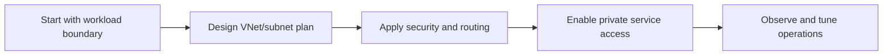

## Overview

Azure networking is the backbone of every cloud application. Most real production incidents are a combination of:
- network path issue (routing, DNS, firewall)
- identity/access issue (who is allowed to connect)

This guide gives a practical beginner flow for:
- VNet
- Subnetting
- NSG
- UDR
- DNS
- Private Endpoint
- Load Balancer vs Application Gateway

---

## 1) Why Networking + Identity Must Be Learned Together

A service can fail even when app code is correct.

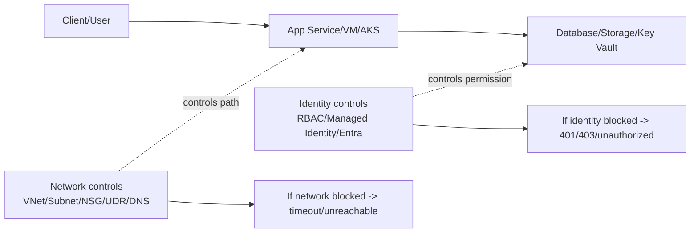

### Quick mental model
- **Networking** answers: “Can traffic reach destination?”
- **Identity** answers: “Is caller allowed after it reaches?”

Both must pass for successful requests.

---

## 2) VNet (Virtual Network)

A **VNet** is your private network in Azure.
- You choose address space (for example `10.10.0.0/16`)
- You place resources into subnets
- You control traffic with NSG/route rules

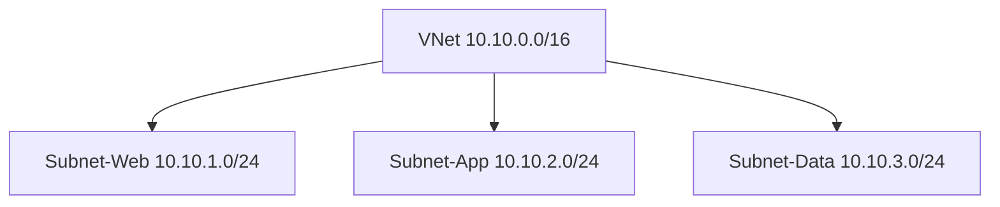

### Why it matters
- isolates workloads from public internet by default
- enables secure app tiers (web/app/data segmentation)

---

## 3) Subnetting

A **subnet** is a smaller network segment inside VNet.

### Common tier pattern
- Web subnet: ingress-facing components
- App subnet: business services
- Data subnet: databases/cache/private endpoints

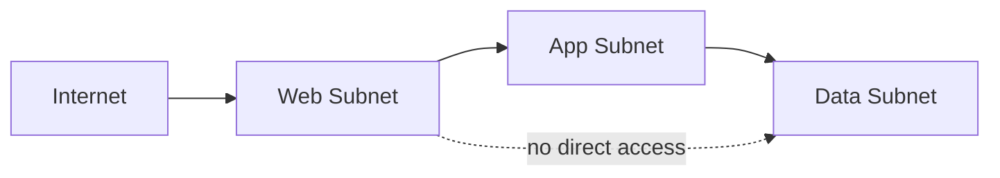

### Best practices
- separate by trust boundary, not only by app name
- keep room for growth in CIDR planning
- dedicate subnets for platform services where required

---

## 4) NSG (Network Security Group)

NSG = layer-3/4 allow/deny rules for inbound/outbound traffic.

### Rule logic (simplified)
1. Rules are evaluated by priority (small number first)
2. First matching rule wins
3. If no explicit allow, traffic is denied by default rule set

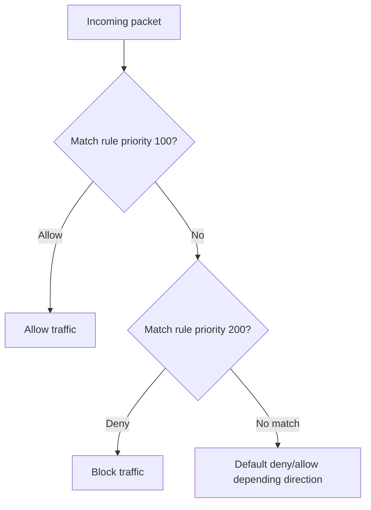

### Typical examples
- Allow `443` from internet to web subnet
- Allow app subnet to data subnet on required DB port only
- Deny broad internet egress from data subnet

---

## 5) UDR (User Defined Routes)

UDR controls **where traffic goes next**.

Without UDR, Azure system routes apply automatically.
With UDR, you can force traffic through:
- NVA / Azure Firewall
- on-prem via VPN/ExpressRoute
- custom inspection path

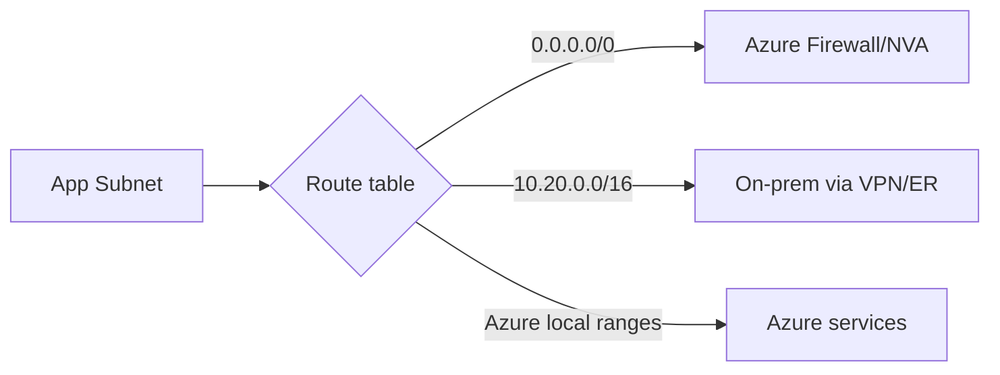

### Why UDR is important
- central egress control
- compliance traffic inspection
- deterministic network flow

---

## 6) DNS in Azure

DNS converts service names into IP addresses.
If DNS fails, app connectivity fails even if network rules are correct.

### Common DNS path

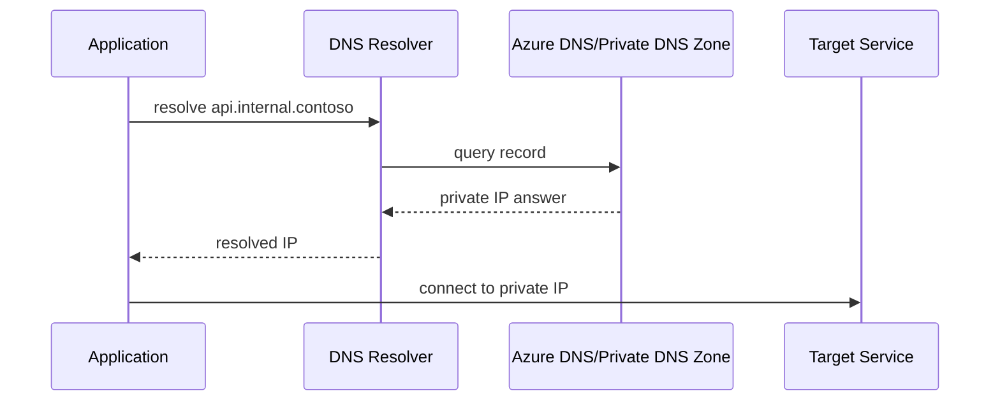

### Private DNS zone use
- required with private endpoints for friendly name resolution
- avoids hardcoding IP addresses

---

## 7) Private Endpoint

Private Endpoint gives a PaaS service (like Storage/SQL/Key Vault) a **private IP inside your VNet**.

So your app reaches service privately, not over public internet.

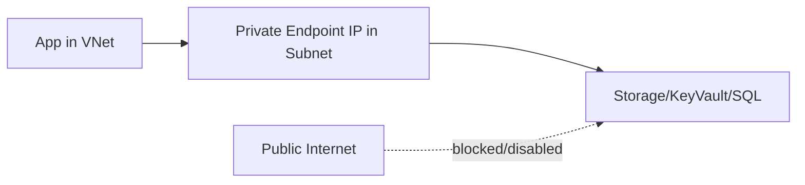

### Why teams use it
- remove public exposure of critical services
- reduce data exfiltration risk
- pair with Private DNS for seamless app access

---

## 8) Load Balancer vs Application Gateway

Both distribute traffic, but at different layers.

| Service | Layer | Best use |
|---|---|---|
| Azure Load Balancer | L4 (TCP/UDP) | high-performance network load balancing |
| Application Gateway | L7 (HTTP/HTTPS) | web routing, TLS termination, WAF, path-based routing |

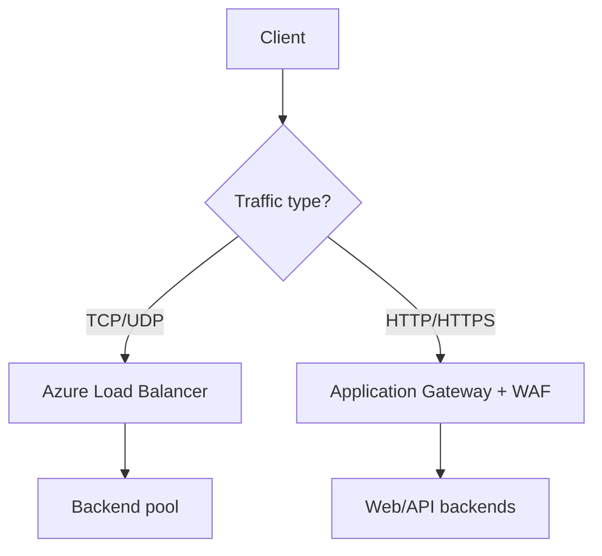

### Selection shortcut
- Need WAF/path routing/host-based routing? -> Application Gateway
- Need raw TCP/UDP distribution at scale? -> Load Balancer

---

## 9) End-to-End Production Workflow

Use this when designing secure Azure connectivity.

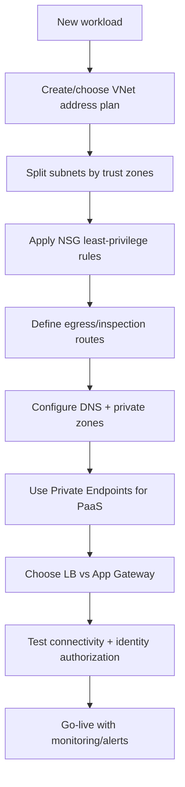

---

## 10) Common Troubleshooting Playbook

### Symptom -> First checks

| Symptom | First check |
|---|---|
| Timeout to service | NSG + UDR + destination health |
| Name not resolving | DNS zone link + resolver path |
| Works publicly, fails privately | Private endpoint + private DNS mapping |
| Random cross-tier denial | subnet NSG association + rule priority |
| 403 after connectivity fixed | identity/RBAC/token scope (not network) |

### Fast incident workflow

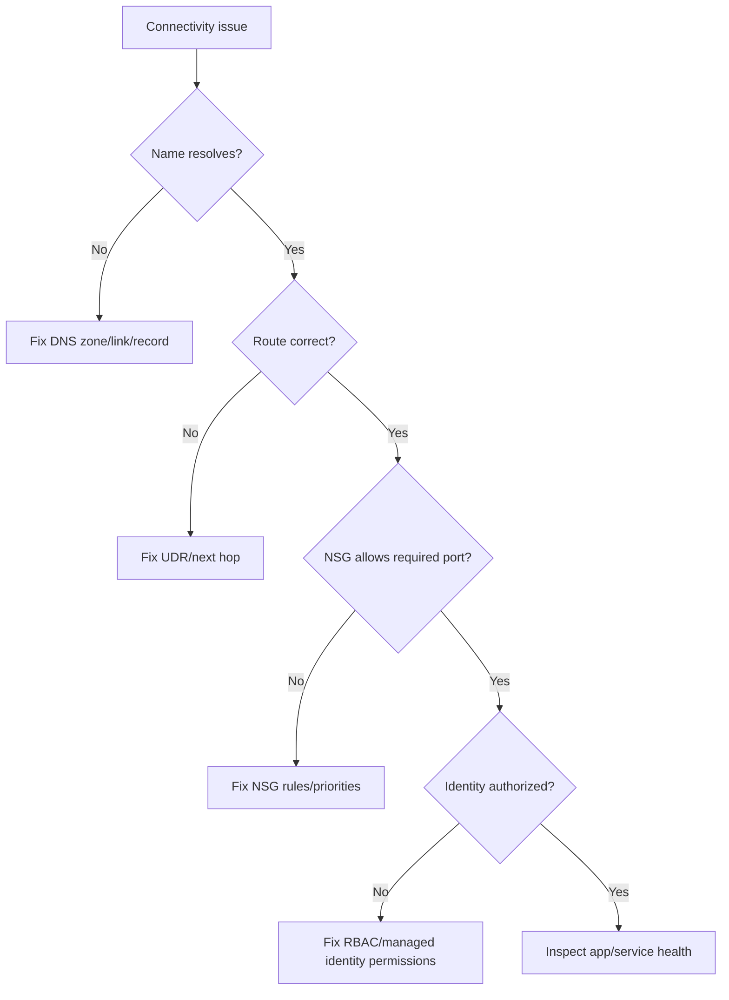

---

## Summary

| Topic | Key takeaway |
|---|---|
| VNet + Subnets | build secure boundaries for app tiers |
| NSG + UDR | control allowed traffic and traffic path |
| DNS + Private Endpoint | make private PaaS access reliable and secure |
| LB vs App Gateway | choose by traffic layer and web features |
| Network + Identity | both must pass for successful production traffic |
